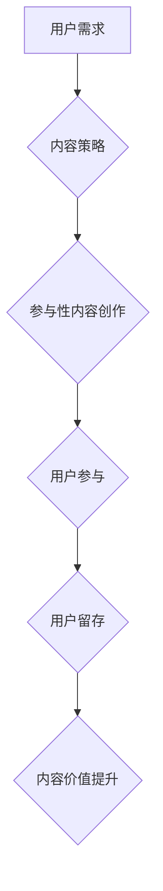

                 

## 注意力经济与内容策略：创建吸引并留住受众的参与性内容

> 关键词：注意力经济、内容策略、参与性内容、用户体验、算法原理、数学模型、项目实践、实际应用场景

### 1. 背景介绍

在当今信息爆炸的时代，人们每天面临着海量的信息涌入。从新闻推送到社交媒体，从电子邮件到广告，无处不在的资讯竞争着人们有限的注意力。这种“注意力经济”的现象深刻地改变了人们获取信息和消费内容的方式，也对内容创作者提出了新的挑战。

传统的营销策略往往依赖于信息轰炸，试图通过大量的广告和宣传来吸引用户。然而，在注意力经济时代，这种方式已经不再有效。用户对信息的选择性越来越强，他们更倾向于主动选择自己感兴趣的内容，并快速过滤掉无关的信息。因此，内容创作者需要更加精细地把握用户需求，创作出能够吸引和留住用户注意力的参与性内容。

### 2. 核心概念与联系

**2.1 注意力经济**

注意力经济是指在信息过剩的时代，人们对信息的获取和消费不再是被动接受，而是主动选择和筛选，而注意力本身成为一种稀缺资源。

**2.2 内容策略**

内容策略是指围绕目标受众，明确内容目标，规划内容类型、内容主题、内容发布节奏等，以吸引和留住用户注意力的系统性规划和执行。

**2.3 参与性内容**

参与性内容是指能够激发用户参与、互动和分享的内容，例如：

* **互动式内容:** 问答、调查、投票、评论等
* **用户生成内容:** 博客、视频、图片、音频等
* **游戏化内容:** 积分、排行榜、任务等

**2.4 流程图**



### 3. 核心算法原理 & 具体操作步骤

**3.1 算法原理概述**

参与性内容的创作需要结合用户行为分析、内容推荐算法等技术手段，以精准地把握用户需求，并提供个性化的内容体验。

**3.2 算法步骤详解**

1. **用户行为分析:** 收集用户浏览、点击、评论、分享等行为数据，分析用户兴趣偏好、阅读习惯、互动模式等。
2. **内容主题挖掘:** 利用自然语言处理技术，从海量文本数据中挖掘出热门话题、用户关注领域等。
3. **内容推荐算法:** 基于用户行为数据和内容主题信息，采用协同过滤、内容基准、深度学习等算法，推荐个性化的参与性内容。
4. **内容互动设计:** 设计互动式元素，例如问答、投票、评论区等，鼓励用户参与和分享。
5. **内容反馈机制:** 收集用户反馈，不断优化内容策略和算法模型，提升用户体验。

**3.3 算法优缺点**

* **优点:** 能够精准地推荐用户感兴趣的内容，提高用户参与度和留存率。
* **缺点:** 需要大量的用户数据进行训练，算法模型的准确性依赖于数据质量。

**3.4 算法应用领域**

* **新闻资讯:** 推荐个性化新闻内容，提高用户阅读兴趣。
* **社交媒体:** 推送用户感兴趣的内容，促进用户互动和分享。
* **电商平台:** 推荐个性化商品，提高用户购买转化率。
* **教育平台:** 推荐个性化学习资源，提升用户学习效率。

### 4. 数学模型和公式 & 详细讲解 & 举例说明

**4.1 数学模型构建**

用户参与度可以被定义为用户与内容交互的频率和深度。

**用户参与度 = (交互次数 * 交互深度) / 总用户数**

其中：

* 交互次数：用户与内容的交互行为次数，例如点赞、评论、转发等。
* 交互深度：用户与内容的交互行为的深度，例如评论内容的长度、阅读时长等。
* 总用户数：内容的总用户数。

**4.2 公式推导过程**

用户参与度公式的推导过程基于以下假设：

* 用户的参与行为是随机的。
* 用户的参与行为的频率和深度是独立的。

**4.3 案例分析与讲解**

假设一个视频内容，总用户数为1000人，交互次数为500次，平均评论长度为100字，平均阅读时长为5分钟。

则用户参与度 = (500 * 100) / 1000 = 50

**5. 项目实践：代码实例和详细解释说明**

**5.1 开发环境搭建**

* Python 3.x
* Jupyter Notebook
* Pandas
* Scikit-learn

**5.2 源代码详细实现**

```python
import pandas as pd
from sklearn.feature_extraction.text import TfidfVectorizer
from sklearn.metrics.pairwise import cosine_similarity

# 加载用户行为数据
data = pd.read_csv('user_behavior.csv')

# 文本特征提取
vectorizer = TfidfVectorizer()
content_matrix = vectorizer.fit_transform(data['content'])

# 计算用户与内容的余弦相似度
user_similarity = cosine_similarity(content_matrix, content_matrix)

# 推荐用户感兴趣的内容
def recommend_content(user_id, top_n=5):
    user_vector = content_matrix[user_id]
    similarities = user_similarity[user_id]
    top_indices = similarities.argsort()[-top_n:][::-1]
    return top_indices

# 获取用户ID
user_id = 1

# 推荐内容
recommended_content = recommend_content(user_id)

# 打印推荐内容
print(f'推荐给用户 {user_id} 的内容：')
for i in recommended_content:
    print(f'- {i}')
```

**5.3 代码解读与分析**

该代码示例展示了如何利用TF-IDF算法和余弦相似度计算用户与内容的相似度，并推荐用户感兴趣的内容。

**5.4 运行结果展示**

运行代码后，将输出用户ID为1的用户感兴趣的内容索引。

### 6. 实际应用场景

**6.1 新闻资讯平台**

新闻平台可以利用用户阅读历史、点赞、评论等行为数据，推荐个性化的新闻内容，提高用户阅读兴趣和留存率。

**6.2 社交媒体平台**

社交媒体平台可以根据用户关注的人、话题、兴趣等信息，推荐个性化的内容，促进用户互动和分享。

**6.3 电商平台**

电商平台可以根据用户浏览历史、购买记录、评价等数据，推荐个性化的商品，提高用户购买转化率。

**6.4 未来应用展望**

随着人工智能技术的不断发展，参与性内容的创作和推荐将更加智能化、个性化。未来，我们可以期待看到：

* 更精准的个性化推荐
* 更丰富的互动形式
* 更智能的内容创作工具
* 更沉浸式的用户体验

### 7. 工具和资源推荐

**7.1 学习资源推荐**

* **书籍:**

    * 《内容营销》
    * 《吸引力营销》
    * 《注意力经济》

* **在线课程:**

    * Coursera: 内容营销
    * Udemy: 内容策略

**7.2 开发工具推荐**

* **内容管理系统 (CMS):** WordPress, Drupal, Joomla
* **数据分析工具:** Google Analytics, Mixpanel
* **人工智能平台:** TensorFlow, PyTorch

**7.3 相关论文推荐**

* **The Attention Economy: A Framework for Understanding the Impact of Information Overload**
* **Content Recommendation Systems: A Survey**
* **Deep Learning for Content Recommendation**

### 8. 总结：未来发展趋势与挑战

**8.1 研究成果总结**

注意力经济与内容策略的研究成果表明，在信息过剩的时代，创造吸引和留住用户注意力的参与性内容至关重要。

**8.2 未来发展趋势**

未来，参与性内容的创作和推荐将更加智能化、个性化，并与其他技术，例如虚拟现实、增强现实等相结合，创造更加沉浸式的用户体验。

**8.3 面临的挑战**

* **数据隐私:** 如何收集和使用用户数据，保障用户隐私安全。
* **算法偏见:** 如何避免算法模型产生偏见，确保内容推荐的公平性和公正性。
* **用户信任:** 如何建立用户对内容和平台的信任，避免信息茧房和极化现象。

**8.4 研究展望**

未来研究方向包括：

* 开发更加精准、个性化的内容推荐算法。
* 研究参与性内容的最佳设计原则。
* 探索人工智能与内容创作的协同模式。
* 探讨注意力经济对社会的影响，并提出相应的解决方案。

### 9. 附录：常见问题与解答

**9.1 如何提高用户参与度？**

* 设计互动式元素，例如问答、投票、评论区等。
* 鼓励用户生成内容，例如博客、视频、图片等。
* 利用游戏化机制，例如积分、排行榜、任务等。

**9.2 如何避免算法偏见？**

* 使用多样化的训练数据，避免数据偏差。
* 定期评估算法模型，识别和修正潜在的偏见。
* 采用透明的算法设计，方便用户理解和监督。

**9.3 如何保障用户隐私安全？**

* 明确收集和使用用户数据的目的和范围。
* 获得用户明确的同意，才能收集和使用用户数据。
* 加强数据安全防护，防止数据泄露和滥用。


作者：禅与计算机程序设计艺术 / Zen and the Art of Computer Programming 
<end_of_turn>

