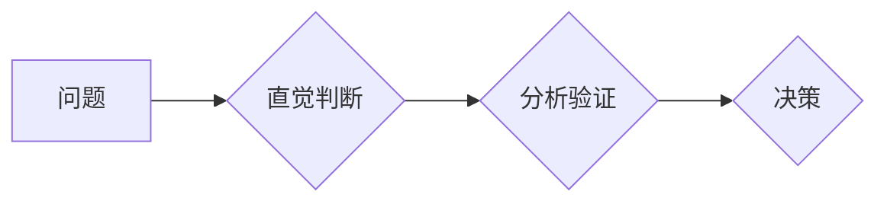

                 

## 洞察力vs分析能力：直觉与逻辑的较量

> 关键词：洞察力、分析能力、直觉、逻辑、人工智能、机器学习、数据科学、决策、创新

## 1. 背景介绍

在当今数据爆炸的时代，我们被海量信息所包围。如何从纷繁复杂的数字海洋中提取有价值的洞察力，并做出明智的决策，成为摆在我们面前的重大挑战。在这个过程中，直觉和逻辑扮演着至关重要的角色。直觉，是一种基于经验和潜意识的快速判断，它能够帮助我们快速识别模式和趋势，做出快速反应。而逻辑，则是基于理性思考和推理，它能够帮助我们分析问题、验证假设、并得出可靠的结论。

直觉和逻辑看似是两种截然不同的思维方式，但实际上它们并非完全独立，而是相互补充、相互促进的。优秀的决策者往往能够在直觉和逻辑之间找到平衡点，充分发挥两者各自的优势。

## 2. 核心概念与联系

### 2.1 直觉

直觉是一种基于经验和潜意识的快速判断，它往往不受意识控制，能够帮助我们快速识别模式和趋势，做出快速反应。直觉的形成依赖于我们积累的知识、经验和情感，它是一种“感觉”或“预感”，而非基于理性推理的结论。

### 2.2 分析能力

分析能力是指能够系统地分解复杂问题，识别关键要素，并运用逻辑推理和数据分析方法，得出有价值的结论的能力。分析能力需要我们具备批判性思维、问题解决能力和数据处理能力。

### 2.3 联系

直觉和分析能力并非相互排斥，而是相互补充、相互促进的。直觉能够提供快速、直观的洞察，而分析能力能够帮助我们验证直觉，并得出更可靠的结论。

**Mermaid 流程图**



## 3. 核心算法原理 & 具体操作步骤

### 3.1 算法原理概述

直觉和分析能力的结合可以看作是一种“直觉引导，逻辑验证”的决策模式。

1. **直觉引导:** 当面对一个问题时，首先依靠直觉进行初步判断，快速识别潜在的解决方案或方向。
2. **逻辑验证:**  对直觉的判断进行逻辑分析和数据验证，确保其合理性和可靠性。

### 3.2 算法步骤详解

1. **问题识别:** 明确问题本身，并将其分解成更小的子问题。
2. **直觉捕捉:**  基于自身经验和知识，对问题进行初步思考，捕捉潜在的解决方案或方向。
3. **数据收集:** 收集与问题相关的相关数据，并进行整理和分析。
4. **逻辑推理:**  运用逻辑推理方法，分析数据和直觉判断，验证其合理性和可靠性。
5. **决策制定:**  根据分析结果，做出最终的决策。

### 3.3 算法优缺点

**优点:**

* **快速决策:** 直觉能够帮助我们快速做出初步判断，节省时间和精力。
* **创新思维:** 直觉能够帮助我们跳出固有的思维模式，产生新的想法和解决方案。
* **提高效率:**  逻辑分析能够帮助我们验证直觉，并确保决策的合理性和可靠性。

**缺点:**

* **主观性强:** 直觉判断容易受到个人经验和情感的影响，可能导致偏差。
* **缺乏可解释性:** 直觉的形成过程往往难以解释，难以被他人理解和接受。
* **数据依赖:** 逻辑分析需要依赖于数据，如果数据不完整或准确，会导致分析结果的偏差。

### 3.4 算法应用领域

* **人工智能:**  直觉和逻辑的结合是人工智能领域的重要研究方向，例如在机器学习、自然语言处理等领域。
* **数据科学:**  数据科学家需要运用直觉和逻辑分析海量数据，发现隐藏的模式和趋势。
* **商业决策:**  企业决策者需要依靠直觉和逻辑分析市场趋势、竞争对手和客户需求，做出明智的决策。

## 4. 数学模型和公式 & 详细讲解 & 举例说明

### 4.1 数学模型构建

直觉和逻辑的结合可以抽象为一个数学模型，其中直觉可以表示为一个概率分布，逻辑分析可以看作是一个优化问题。

**直觉概率分布:**

假设直觉判断的结果可以表示为一个概率分布，其中每个结果的概率值代表我们对该结果的信心程度。

**逻辑优化问题:**

逻辑分析可以看作是一个优化问题，目标是找到一个最优的决策，使得决策的预期效用最大化。

### 4.2 公式推导过程

由于直觉和逻辑的结合是一个复杂的过程，其数学模型和公式推导过程较为复杂，需要结合具体的应用场景进行分析和建模。

### 4.3 案例分析与讲解

例如，在医疗诊断领域，医生需要根据患者的症状、病史和检查结果进行诊断。医生可以首先依靠直觉判断患者可能患有的疾病，然后通过逻辑分析和数据验证，确定最可能的诊断结果。

## 5. 项目实践：代码实例和详细解释说明

### 5.1 开发环境搭建

为了演示直觉和逻辑结合的应用，我们可以使用Python语言开发一个简单的项目，例如一个基于直觉和逻辑的股票预测系统。

**开发环境:**

* Python 3.x
* Jupyter Notebook

**依赖库:**

* pandas
* numpy
* scikit-learn

### 5.2 源代码详细实现

```python
import pandas as pd
from sklearn.linear_model import LogisticRegression

# 加载股票数据
data = pd.read_csv('stock_data.csv')

# 特征工程
# ...

# 训练逻辑回归模型
model = LogisticRegression()
model.fit(X_train, y_train)

# 预测股票价格
# ...

# 直觉判断
# ...
```

### 5.3 代码解读与分析

* **数据加载:**  首先加载股票数据，并进行预处理。
* **特征工程:**  提取股票数据的特征，例如价格、成交量、技术指标等。
* **模型训练:**  使用逻辑回归模型训练股票预测模型。
* **预测股票价格:**  使用训练好的模型预测股票价格。
* **直觉判断:**  根据市场趋势、新闻事件等信息，进行直觉判断。

### 5.4 运行结果展示

运行代码后，可以得到股票价格的预测结果，以及直觉判断的结果。

## 6. 实际应用场景

### 6.1 医疗诊断

医生可以根据患者的症状、病史和检查结果进行诊断，直觉判断可以帮助医生快速识别潜在的疾病，逻辑分析可以帮助医生验证诊断结果。

### 6.2 金融投资

金融分析师可以根据市场趋势、公司财务状况等信息进行投资决策，直觉判断可以帮助分析师识别潜在的投资机会，逻辑分析可以帮助分析师评估投资风险。

### 6.3 产品设计

产品设计师可以根据用户需求、市场趋势等信息进行产品设计，直觉判断可以帮助设计师产生新的设计理念，逻辑分析可以帮助设计师验证设计方案的可行性。

### 6.4 未来应用展望

随着人工智能技术的不断发展，直觉和逻辑的结合将应用于更多领域，例如自动驾驶、机器人、个性化推荐等。

## 7. 工具和资源推荐

### 7.1 学习资源推荐

* **书籍:**

    * 《Thinking, Fast and Slow》 by Daniel Kahneman
    * 《The Art of Thinking Clearly》 by Rolf Dobelli

* **在线课程:**

    * Coursera: “Machine Learning” by Andrew Ng
    * edX: “Data Science Fundamentals”

### 7.2 开发工具推荐

* **Python:**  Python是一种流行的编程语言，广泛应用于人工智能、数据科学等领域。
* **Jupyter Notebook:**  Jupyter Notebook是一种交互式编程环境，适合进行数据分析和机器学习开发。

### 7.3 相关论文推荐

* **“The Intuition Pump: How to Think Like a Scientist” by Daniel Dennett**
* **“The Logic of Scientific Discovery” by Karl Popper**

## 8. 总结：未来发展趋势与挑战

### 8.1 研究成果总结

直觉和逻辑的结合是人工智能领域的重要研究方向，它能够帮助我们更好地理解人类思维方式，并开发出更智能的机器学习算法。

### 8.2 未来发展趋势

未来，直觉和逻辑的结合将应用于更多领域，例如自动驾驶、机器人、个性化推荐等。

### 8.3 面临的挑战

* **直觉难以量化:**  直觉的形成过程难以量化，这使得其难以被计算机模型模拟。
* **数据偏差:**  逻辑分析依赖于数据，如果数据存在偏差，会导致分析结果的偏差。
* **伦理问题:**  直觉和逻辑的结合可能会带来伦理问题，例如算法偏见、隐私泄露等。

### 8.4 研究展望

未来研究需要重点关注以下几个方面:

* **开发能够模拟直觉的机器学习算法。**
* **解决数据偏差问题，提高逻辑分析的准确性。**
* **研究直觉和逻辑的结合带来的伦理问题，并制定相应的解决方案。**

## 9. 附录：常见问题与解答

**问题 1:** 如何提高直觉判断的准确性？

**解答:**  可以通过积累经验、学习专业知识、多接触不同领域的人和事来提高直觉判断的准确性。

**问题 2:** 如何避免逻辑分析的偏差？

**解答:**  可以通过使用高质量的数据、采用多种分析方法、进行交叉验证等方法来避免逻辑分析的偏差。


作者：禅与计算机程序设计艺术 / Zen and the Art of Computer Programming 
<end_of_turn>

