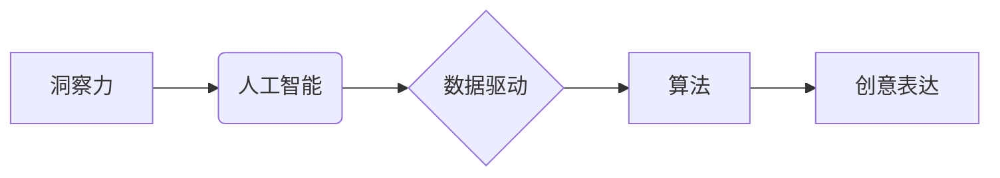

                 

## 洞察力与创意表达：艺术创作的源泉

> 关键词：人工智能、创意、洞察力、算法、艺术创作、数据驱动、机器学习、深度学习

## 1. 背景介绍

艺术创作，自古以来就被视为人类精神的最高体现，是人类对世界和自身进行深刻思考和表达的载体。然而，随着人工智能技术的飞速发展，艺术创作的边界正在被不断拓展。人工智能算法能够分析海量数据，识别模式，并生成新的内容，这引发了人们对人工智能是否能够真正具备创造力的思考。

传统上，艺术创作被认为是人类独有的能力，需要丰富的经验、情感和灵感。但随着人工智能技术的进步，我们开始看到一些令人惊叹的成果。人工智能算法能够创作出逼真的绘画、音乐、诗歌和小说，甚至能够设计出全新的建筑和产品。这些成果表明，人工智能在艺术创作领域展现出巨大的潜力。

## 2. 核心概念与联系

**2.1  洞察力**

洞察力是指从纷繁复杂的现象中发现隐藏的规律和本质，并从中获得新的理解和启发的能力。在艺术创作中，洞察力是艺术家捕捉灵感、构思主题、表达情感的关键。

**2.2  创意**

创意是指产生新颖、独特、有价值的思想、概念或方案的能力。在艺术创作中，创意是艺术家突破常规、打破框架、创造出独一无二作品的源泉。

**2.3  人工智能**

人工智能是指模拟人类智能行为的计算机系统。人工智能算法能够学习、推理、解决问题和做出决策，并不断改进自身的能力。

**2.4  数据驱动**

数据驱动是指利用数据来指导决策和行动。在人工智能领域，数据是算法训练和学习的基础。

**2.5  算法**

算法是指解决特定问题的一系列步骤或规则。人工智能算法能够分析数据、识别模式、生成内容和做出预测。

**核心概念联系：**



## 3. 核心算法原理 & 具体操作步骤

**3.1  算法原理概述**

人工智能算法能够通过学习大量数据，识别模式和规律，从而生成新的内容。常见的用于艺术创作的人工智能算法包括：

* **生成对抗网络 (GAN):** GAN由两个网络组成：生成器和鉴别器。生成器试图生成新的内容，而鉴别器试图区分真实内容和生成内容。通过相互竞争，生成器能够逐渐生成越来越逼真的内容。
* **变分自编码器 (VAE):** VAE通过学习数据的潜在表示来生成新的内容。它将输入数据编码成一个低维的潜在空间，然后解码成新的内容。
* **Transformer:** Transformer是一种基于注意力机制的深度学习模型，能够处理序列数据，例如文本和音乐。它能够学习语言的语法和语义，并生成新的文本或音乐。

**3.2  算法步骤详解**

以生成对抗网络 (GAN)为例，其具体操作步骤如下：

1. **初始化生成器和鉴别器网络:** 生成器和鉴别器都是神经网络，需要进行初始化。
2. **训练鉴别器:** 使用真实数据训练鉴别器，使其能够区分真实数据和生成数据。
3. **训练生成器:** 使用鉴别器对生成的数据进行评估，并根据评估结果调整生成器的参数，使其能够生成更逼真的数据。
4. **重复步骤2和3:** 持续训练鉴别器和生成器，直到生成器能够生成与真实数据几乎 indistinguishable 的数据。

**3.3  算法优缺点**

**优点:**

* 能够生成逼真的艺术作品。
* 可以探索新的艺术风格和形式。
* 可以帮助艺术家克服创作瓶颈。

**缺点:**

* 算法需要大量的训练数据。
* 算法的生成结果可能缺乏情感和深度。
* 算法的生成结果可能缺乏原创性。

**3.4  算法应用领域**

* **绘画和图像生成:** 生成逼真的图像、艺术作品和插图。
* **音乐创作:** 生成新的音乐旋律、节奏和和声。
* **诗歌和小说创作:** 生成新的诗歌、小说和剧本。
* **建筑设计:** 设计新的建筑结构和布局。
* **产品设计:** 设计新的产品外观和功能。

## 4. 数学模型和公式 & 详细讲解 & 举例说明

**4.1  数学模型构建**

在人工智能算法中，数学模型是算法的核心。这些模型通常是基于概率论和统计学的，用来描述数据之间的关系和模式。

例如，在生成对抗网络 (GAN) 中，生成器和鉴别器都是神经网络，其参数可以通过梯度下降算法进行优化。梯度下降算法是一种迭代算法，通过不断调整参数，使模型的损失函数最小化。

**4.2  公式推导过程**

在 GAN 中，损失函数通常由两个部分组成：

* **生成器损失函数:** 衡量生成器生成的图像与真实图像的差异。
* **鉴别器损失函数:** 衡量鉴别器区分真实图像和生成图像的准确率。

**4.3  案例分析与讲解**

例如，在图像生成任务中，生成器损失函数可以定义为真实图像与生成图像之间的均方误差 (MSE)。鉴别器损失函数可以定义为鉴别器对真实图像和生成图像的分类准确率。

通过最小化这两个损失函数，生成器能够逐渐生成与真实图像越来越相似的图像。

## 5. 项目实践：代码实例和详细解释说明

**5.1  开发环境搭建**

为了实现人工智能艺术创作，需要搭建一个合适的开发环境。常用的开发环境包括：

* **Python:** Python 是人工智能领域最流行的编程语言，拥有丰富的库和框架，例如 TensorFlow、PyTorch 和 Keras。
* **GPU:** GPU (图形处理单元) 能够加速深度学习算法的训练和推理，因此在人工智能艺术创作中非常重要。
* **云计算平台:** 云计算平台，例如 AWS、Google Cloud 和 Azure，提供强大的计算资源和存储空间，可以帮助开发者快速搭建和部署人工智能模型。

**5.2  源代码详细实现**

以下是一个使用 TensorFlow 实现 GAN 图像生成的简单代码示例：

```python
import tensorflow as tf

# 定义生成器网络
def generator(z):
  # ...

# 定义鉴别器网络
def discriminator(x):
  # ...

# 定义损失函数
def loss_function(real_output, fake_output):
  # ...

# 训练循环
for epoch in range(num_epochs):
  # ...
```

**5.3  代码解读与分析**

这段代码定义了生成器和鉴别器网络，以及损失函数。训练循环中，会使用真实图像和生成器生成的图像来训练鉴别器和生成器。

**5.4  运行结果展示**

训练完成后，生成器能够生成逼真的图像。这些图像可以保存为文件，或者在线展示。

## 6. 实际应用场景

人工智能艺术创作已经开始在一些领域得到应用，例如：

* **游戏开发:** 使用人工智能生成游戏场景、角色和道具。
* **电影制作:** 使用人工智能生成电影特效和场景。
* **广告设计:** 使用人工智能生成广告创意和视觉效果。
* **艺术品创作:** 使用人工智能创作新的艺术作品，并进行展览和销售。

**6.4  未来应用展望**

随着人工智能技术的不断发展，人工智能艺术创作的应用场景将会更加广泛。未来，人工智能可能能够帮助艺术家：

* 突破创作瓶颈，激发新的灵感。
* 探索新的艺术形式和风格。
* 将艺术创作与其他领域融合，创造出更具创新性的作品。

## 7. 工具和资源推荐

**7.1  学习资源推荐**

* **Coursera:** 提供人工智能和深度学习相关的课程。
* **Udacity:** 提供人工智能和机器学习相关的课程和项目。
* **Fast.ai:** 提供免费的深度学习课程和教程。

**7.2  开发工具推荐**

* **TensorFlow:** 开源深度学习框架。
* **PyTorch:** 开源深度学习框架。
* **Keras:** 高级深度学习 API，可以运行在 TensorFlow、Theano 和 CNTK 后端。

**7.3  相关论文推荐**

* **Generative Adversarial Networks** (Goodfellow et al., 2014)
* **Deep Convolutional Generative Adversarial Networks** (Radford et al., 2015)
* **Attention Is All You Need** (Vaswani et al., 2017)

## 8. 总结：未来发展趋势与挑战

**8.1  研究成果总结**

人工智能艺术创作领域取得了显著的进展，能够生成逼真的图像、音乐、诗歌和小说。这些成果表明，人工智能在艺术创作领域展现出巨大的潜力。

**8.2  未来发展趋势**

未来，人工智能艺术创作将朝着以下方向发展：

* **更逼真的生成结果:** 算法将更加 sophisticated，能够生成更加逼真、富有情感和深度的艺术作品。
* **更广泛的应用场景:** 人工智能艺术创作将应用于更多领域，例如教育、医疗和娱乐。
* **更强的交互性:** 人工智能艺术创作将更加交互式，用户能够参与到创作过程中，共同创造出新的艺术作品。

**8.3  面临的挑战**

人工智能艺术创作也面临一些挑战：

* **伦理问题:** 人工智能生成的艺术作品是否具有原创性？谁拥有这些作品的版权？
* **社会影响:** 人工智能艺术创作是否会取代人类艺术家？

**8.4  研究展望**

未来，需要进一步研究人工智能艺术创作的伦理问题和社会影响，并探索人工智能与人类艺术创作之间的协同关系。


## 9. 附录：常见问题与解答

**9.1  Q: 人工智能生成的艺术作品是否具有原创性？**

**A:** 这个问题目前还没有一个明确的答案。一些人认为，由于人工智能算法是基于大量数据训练的，其生成的艺术作品缺乏原创性。而另一些人则认为，人工智能能够通过学习和组合数据，创造出全新的艺术形式，因此其生成的艺术作品也具有原创性。

**9.2  Q: 人工智能艺术创作会取代人类艺术家吗？**

**A:** 这个问题也是一个备受争议的话题。人工智能艺术创作能够帮助艺术家提高效率，探索新的艺术形式，但它并不会完全取代人类艺术家。人类艺术家拥有情感、灵感和创造力，这些是人工智能无法替代的。


作者：禅与计算机程序设计艺术 / Zen and the Art of Computer Programming 
<end_of_turn>

