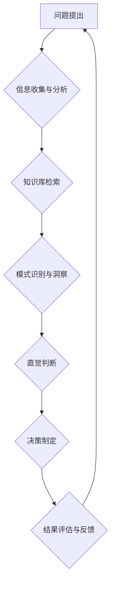

                 

## 洞察力与直觉：专家思维的特征

> 关键词：专家思维、洞察力、直觉、模式识别、经验积累、知识结构、认知模型、决策支持、人工智能

## 1. 背景介绍

在瞬息万变的科技时代，信息爆炸和复杂系统日益增长，对人类认知能力提出了更高的要求。如何快速准确地分析信息、识别模式、做出明智的决策，成为至关重要的议题。 专家思维，即拥有丰富经验和深厚知识的专业人士所特有的思维方式，在解决复杂问题、洞察本质、做出预判方面展现出独特的优势。 

本篇文章将深入探讨专家思维的核心特征，特别是洞察力和直觉在专家决策中的作用，并分析其背后的认知机制和算法原理。 

## 2. 核心概念与联系

**2.1 专家思维的构成**

专家思维并非一蹴而就，而是通过长期学习、实践和积累形成的复杂认知体系。其核心要素包括：

* **深厚知识储备**: 专家在特定领域拥有广泛而深入的知识，能够快速检索和整合相关信息。
* **丰富经验积累**: 专家通过不断解决实际问题，积累了大量的经验，形成了对问题的深刻理解和解决策略。
* **高度的模式识别能力**: 专家能够从海量数据中识别出隐藏的模式和规律，并将其应用于新的问题解决。
* **灵活的思维方式**: 专家能够跳出固有的思维框架，从多角度思考问题，并提出创新的解决方案。

**2.2 洞察力和直觉的关联**

洞察力和直觉是专家思维的重要组成部分，它们共同作用于专家决策过程中。

* **洞察力**: 指的是通过分析和理解信息，发现隐藏的联系和本质，从而获得新的见解和理解。
* **直觉**: 指的是基于经验和知识积累，快速做出判断和决策，无需经过长时间的逻辑推理。

洞察力是直觉的基石，它为直觉提供了知识和经验基础。而直觉则是一种基于洞察力的快速反应机制，能够帮助专家在复杂环境中做出高效的决策。

**2.3 专家思维的流程图**



## 3. 核心算法原理 & 具体操作步骤

**3.1 算法原理概述**

专家思维的形成和应用并非完全依赖于人工的刻意学习和积累，也蕴含着一定的算法原理。 

* **知识图谱构建**: 专家知识可以被抽象为知识图谱，其中节点代表概念，边代表关系。通过构建知识图谱，可以实现知识的组织、存储和检索。
* **案例库构建**: 专家经验可以被记录为案例库，每个案例包含问题描述、解决方案和结果分析。通过学习案例库，可以获得解决类似问题的经验和策略。
* **模式识别算法**: 专家思维的核心之一是模式识别，可以利用机器学习算法，例如决策树、支持向量机等，从海量数据中识别出隐藏的模式和规律。

**3.2 算法步骤详解**

1. **知识获取**: 从专家访谈、文献研究、案例分析等方式获取专家知识和经验。
2. **知识表示**: 将获取的知识转化为计算机可理解的形式，例如知识图谱、规则库、案例库等。
3. **知识推理**: 利用知识图谱、规则库等进行知识推理，从已知知识中推导出新的结论。
4. **模式识别**: 利用机器学习算法从数据中识别出模式和规律，并将其与专家知识结合。
5. **决策支持**: 基于知识推理和模式识别结果，为专家提供决策支持，帮助专家做出更明智的判断。

**3.3 算法优缺点**

* **优点**: 能够模拟专家思维，提高决策效率和准确性，并可用于知识传承和推广。
* **缺点**: 需要大量的专家知识和经验作为输入，算法本身也存在局限性，难以完全模拟人类的复杂思维过程。

**3.4 算法应用领域**

* **医疗诊断**: 基于专家知识和病历数据，辅助医生进行诊断。
* **金融风险评估**: 基于专家经验和市场数据，评估金融风险。
* **法律决策**: 基于法律法规和案例分析，辅助律师进行法律决策。
* **教育教学**: 基于专家知识和学生数据，个性化推荐学习内容。

## 4. 数学模型和公式 & 详细讲解 & 举例说明

**4.1 数学模型构建**

专家思维的决策过程可以抽象为一个数学模型，其中输入是问题信息和专家知识，输出是决策结果。 

* **决策树**: 可以用决策树模型来表示专家决策过程，其中每个节点代表一个决策点，每个分支代表一个可能的决策结果。
* **贝叶斯网络**: 可以用贝叶斯网络模型来表示专家知识和推理过程，其中每个节点代表一个随机变量，边代表变量之间的依赖关系。

**4.2 公式推导过程**

决策树和贝叶斯网络的构建和应用都涉及到概率论和统计学等数学工具。例如，决策树的构建需要利用信息增益或基尼不纯度等指标来选择最优的决策节点，而贝叶斯网络的推理过程则需要利用贝叶斯定理来计算条件概率。

**4.3 案例分析与讲解**

假设一个专家系统用于诊断心脏病，其输入包括患者的症状、病史、体检结果等信息，输出是心脏病的诊断结果。 

* **决策树**: 可以根据患者的症状和病史构建一个决策树，例如，如果患者有胸痛和呼吸困难的症状，则判断为心脏病风险较高，需要进一步检查。
* **贝叶斯网络**: 可以根据患者的症状、病史、体检结果等信息构建一个贝叶斯网络，并利用贝叶斯定理计算心脏病的概率。

## 5. 项目实践：代码实例和详细解释说明

**5.1 开发环境搭建**

* **编程语言**: Python
* **机器学习库**: scikit-learn
* **知识图谱库**: rdflib

**5.2 源代码详细实现**

```python
# 决策树模型
from sklearn.tree import DecisionTreeClassifier

# 数据集
X = [[1, 0, 1], [0, 1, 0], [1, 1, 1]]
y = [0, 1, 1]

# 训练模型
model = DecisionTreeClassifier()
model.fit(X, y)

# 预测结果
new_data = [[1, 0, 0]]
prediction = model.predict(new_data)
print(prediction)

# 贝叶斯网络模型
from pgmpy.models import BayesianModel
from pgmpy.factors.discrete import TabularCPD

# 定义变量和依赖关系
model = BayesianModel([('A', 'B'), ('B', 'C')])

# 定义条件概率分布
cpd_a = TabularCPD('A', 2, [0.6, 0.4])
cpd_b = TabularCPD('B', 2, [0.8, 0.2], evidence=['A'], evidence_card=[2])
cpd_c = TabularCPD('C', 2, [0.9, 0.1], evidence=['B'], evidence_card=[2])

# 添加条件概率分布到模型
model.add_cpds([cpd_a, cpd_b, cpd_c])

# 预测结果
print(model.query(variables=['C'], evidence={'A': 1}))
```

**5.3 代码解读与分析**

* 决策树模型使用 scikit-learn 库中的 DecisionTreeClassifier 类，通过训练数据构建决策树模型，并预测新的数据。
* 贝叶斯网络模型使用 pgmpy 库构建，定义变量和依赖关系，并使用 TabularCPD 类定义条件概率分布。

**5.4 运行结果展示**

运行代码后，可以得到决策树模型的预测结果和贝叶斯网络模型的概率分布。

## 6. 实际应用场景

**6.1 医疗诊断**

专家系统可以辅助医生进行诊断，例如根据患者的症状和病史，预测患有特定疾病的概率。

**6.2 金融风险评估**

专家系统可以根据客户的信用记录和财务状况，评估其贷款风险。

**6.3 法律决策**

专家系统可以根据法律法规和案例分析，辅助律师进行法律决策。

**6.4 未来应用展望**

随着人工智能技术的不断发展，专家系统将应用于更多领域，例如教育、科研、制造等。

## 7. 工具和资源推荐

**7.1 学习资源推荐**

* **书籍**:
    * 《人工智能：现代方法》
    * 《机器学习》
    * 《深度学习》
* **在线课程**:
    * Coursera
    * edX
    * Udacity

**7.2 开发工具推荐**

* **Python**: 
* **scikit-learn**: 机器学习库
* **TensorFlow**: 深度学习框架
* **PyTorch**: 深度学习框架

**7.3 相关论文推荐**

* **专家系统**:
    * "A General Problem Solver"
    * "The Logic Theorist"
* **机器学习**:
    * "The Elements of Statistical Learning"
    * "Pattern Recognition and Machine Learning"

## 8. 总结：未来发展趋势与挑战

**8.1 研究成果总结**

专家思维的研究取得了显著进展，特别是人工智能技术的应用为模拟和增强专家思维提供了新的途径。

**8.2 未来发展趋势**

* **更强大的机器学习算法**: 能够更好地模拟专家思维的复杂性和灵活性。
* **更丰富的知识表示形式**: 能够更好地表达专家知识的结构性和语义性。
* **更有效的知识获取方法**: 能够更快速、更准确地获取专家知识。

**8.3 面临的挑战**

* **知识的表达和推理**: 如何将专家知识准确地表达出来，并进行有效的推理仍然是一个挑战。
* **数据获取和质量**: 专家系统需要大量的专家知识和数据作为输入，数据获取和质量控制是一个关键问题。
* **解释性和可信度**: 专家系统的决策过程需要透明、可解释，才能获得用户的信任。

**8.4 研究展望**

未来，专家思维研究将继续朝着更智能、更灵活、更可解释的方向发展，为解决复杂问题、提高决策效率提供更强大的工具和支持。

## 9. 附录：常见问题与解答

* **什么是专家系统？**

专家系统是一种利用人工智能技术模拟专家思维的软件系统，能够根据已有的知识和经验，解决特定领域的复杂问题。

* **专家系统有哪些应用场景？**

专家系统广泛应用于医疗诊断、金融风险评估、法律决策、教育教学等领域。

* **如何构建一个专家系统？**

构建一个专家系统需要以下步骤：

1. 确定专家系统的目标和应用领域。
2. 收集和整理专家知识和经验。
3. 选择合适的知识表示形式和推理算法。
4. 开发和测试专家系统。
5. 部署和维护专家系统。


作者：禅与计算机程序设计艺术 / Zen and the Art of Computer Programming 
<end_of_turn>

