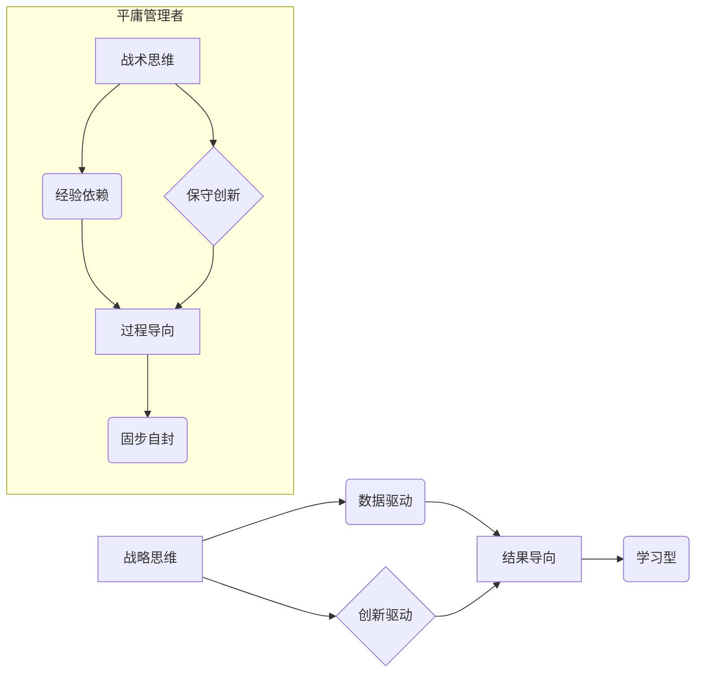

                 

## 深邃思考:区分平庸与卓越管理者

> 关键词：管理者、领导力、技术决策、团队建设、创新驱动、战略思维、执行力

### 1. 背景介绍

在当今瞬息万变的科技时代，管理者扮演着至关重要的角色。他们需要具备敏锐的洞察力，洞悉技术趋势，并带领团队在激烈的竞争中取得成功。然而，并非所有管理者都能做到这一点。一些管理者停留在平庸的层次，而另一些则展现出卓越的领导力，带领团队走向辉煌。那么，是什么因素将这些管理者区分开来？

本篇文章将深入探讨卓越管理者与平庸管理者的区别，分析其背后的核心概念、算法原理、实践案例以及未来发展趋势。通过对技术决策、团队建设、创新驱动等方面的深入分析，帮助读者理解卓越管理者的思维模式和行为模式，并为自身的管理实践提供借鉴。

### 2. 核心概念与联系

卓越管理者与平庸管理者的区别，本质上是思维模式和行为模式的差异。

**2.1  卓越管理者思维模式**

* **战略思维:** 能够洞察全局，制定长远战略，并将其分解为可执行的行动计划。
* **数据驱动:** 依赖数据分析和洞察，而非主观臆断，做出明智的决策。
* **创新驱动:** 鼓励团队不断创新，探索新的技术和解决方案。
* **结果导向:** 注重结果和成效，而非过程和形式。
* **学习型:** 持续学习新知识，提升自身能力，并鼓励团队成员学习成长。

**2.2  平庸管理者思维模式**

* **战术思维:** 关注眼前事务，缺乏长远规划。
* **经验依赖:** 依赖过去的经验，难以适应变化的市场环境。
* **保守创新:** 缺乏创新意识，难以应对新技术带来的挑战。
* **过程导向:** 强调流程和制度，忽视结果和效率。
* **固步自封:** 缺乏学习意愿，难以提升自身能力。

**2.3  核心概念关系图**



### 3. 核心算法原理 & 具体操作步骤

卓越管理者在实践中运用一系列的“算法”来提升团队效率和达成目标。

**3.1  算法原理概述**

* **目标分解:** 将宏大的目标分解为一个个小的、可实现的目标，并分配给不同的团队成员。
* **资源优化:** 充分利用团队资源，包括人力、物力、时间等，最大化资源利用率。
* **风险管理:** 识别潜在风险，制定相应的应对措施，降低风险发生概率。
* **反馈机制:** 建立有效的反馈机制，及时了解团队成员的工作进展和遇到的问题，并进行调整和改进。

**3.2  算法步骤详解**

1. **目标设定:** 明确团队的目标，并将其分解为具体的、可衡量的、可实现的、相关的和有时间限制的目标 (SMART)。
2. **资源分配:** 根据目标和任务，合理分配团队资源，确保每个成员都有明确的任务和职责。
3. **进度监控:** 定期跟踪团队成员的工作进度，及时发现问题并进行调整。
4. **风险评估:** 识别潜在风险，并制定相应的应对措施。
5. **反馈收集:** 建立有效的反馈机制，收集团队成员的工作反馈，并进行分析和改进。

**3.3  算法优缺点**

* **优点:** 提高团队效率，增强目标达成概率，降低风险。
* **缺点:** 需要投入时间和精力进行规划和执行，需要团队成员具备良好的沟通和协作能力。

**3.4  算法应用领域**

* 项目管理
* 产品开发
* 团队建设
* 战略规划

### 4. 数学模型和公式 & 详细讲解 & 举例说明

卓越管理者在决策过程中，常常运用数学模型和公式来分析数据，做出更科学的判断。

**4.1  数学模型构建**

例如，在评估项目风险时，可以构建一个风险评估模型，将风险因素和其影响程度进行量化，并计算出项目的整体风险等级。

**4.2  公式推导过程**

风险等级 = Σ (风险因素权重 * 风险因素影响程度)

其中：

* 风险因素权重：代表每个风险因素的重要性。
* 风险因素影响程度：代表每个风险因素可能造成的损失程度。

**4.3  案例分析与讲解**

假设一个项目有三个风险因素：技术风险、市场风险和财务风险。

* 技术风险权重为 0.4，影响程度为 3。
* 市场风险权重为 0.3，影响程度为 2。
* 财务风险权重为 0.3，影响程度为 1。

则项目的风险等级为：

风险等级 = (0.4 * 3) + (0.3 * 2) + (0.3 * 1) = 1.2 + 0.6 + 0.3 = 2.1

根据风险等级的标准，项目风险等级为中度风险。

### 5. 项目实践：代码实例和详细解释说明

卓越管理者不仅具备理论知识，更重要的是能够将理论应用于实践。以下是一个代码实例，演示如何使用 Python 语言实现目标分解算法。

**5.1  开发环境搭建**

* Python 3.x 环境
* VS Code 或其他代码编辑器

**5.2  源代码详细实现**

```python
def decompose_goal(goal):
  """
  分解目标函数

  Args:
    goal: 需要分解的目标

  Returns:
    分解后的子目标列表
  """
  sub_goals = []
  # 根据目标内容进行分解，例如：
  if "开发新产品" in goal:
    sub_goals.append("市场调研")
    sub_goals.append("产品设计")
    sub_goals.append("技术开发")
    sub_goals.append("测试和发布")
  return sub_goals

# 示例使用
main_goal = "开发新产品并进入市场"
sub_goals = decompose_goal(main_goal)
print(f"分解后的子目标：{sub_goals}")
```

**5.3  代码解读与分析**

* `decompose_goal` 函数接收一个目标字符串作为输入，并根据目标内容进行分解。
* 在示例中，我们定义了一个简单的规则，如果目标包含 "开发新产品"，则将其分解为四个子目标。
* 实际应用中，可以根据不同的目标类型和业务场景，定义更复杂的分解规则。

**5.4  运行结果展示**

```
分解后的子目标：['市场调研', '产品设计', '技术开发', '测试和发布']
```

### 6. 实际应用场景

卓越管理者将上述算法和模型应用于各种实际场景，例如：

* **产品开发:** 将产品开发目标分解为多个阶段，并分配给不同的团队成员，确保项目按计划进行。
* **团队建设:** 识别团队成员的优势和劣势，并根据需要进行角色分配和培训，提升团队整体效能。
* **创新驱动:** 建立鼓励创新的文化氛围，并提供必要的资源和支持，激发团队成员的创新潜能。

**6.4  未来应用展望**

随着人工智能技术的不断发展，卓越管理者将更加依赖数据分析和智能工具来辅助决策，提升管理效率。例如：

* **人工智能辅助决策:** 利用机器学习算法分析数据，预测未来趋势，为决策提供更精准的建议。
* **智能团队协作:** 利用人工智能技术，实现团队成员之间的更有效沟通和协作，提升团队效率。
* **个性化学习:** 利用人工智能技术，为每个团队成员提供个性化的学习方案，帮助他们提升自身能力。

### 7. 工具和资源推荐

**7.1  学习资源推荐**

* 《高效能人士的七个习惯》
* 《领导力》
* 《管理学原理》

**7.2  开发工具推荐**

* Jira
* Trello
* Asana

**7.3  相关论文推荐**

* "The Impact of Artificial Intelligence on Management"
* "The Future of Work: How AI Will Transform the Workplace"

### 8. 总结：未来发展趋势与挑战

**8.1  研究成果总结**

本篇文章探讨了卓越管理者与平庸管理者的区别，分析了其背后的核心概念、算法原理、实践案例以及未来发展趋势。卓越管理者具备战略思维、数据驱动、创新驱动、结果导向和学习型等特点，并运用一系列的算法和模型来提升团队效率和达成目标。

**8.2  未来发展趋势**

未来，人工智能技术将更加深入地融入到管理实践中，帮助管理者做出更科学的决策，提升管理效率。

**8.3  面临的挑战**

* 如何培养具备卓越管理能力的人才。
* 如何有效地利用人工智能技术，避免技术带来的负面影响。
* 如何应对不断变化的市场环境，保持管理的灵活性。

**8.4  研究展望**

未来研究将继续关注人工智能在管理领域的应用，探索更有效的管理方法和工具，帮助管理者更好地应对挑战，实现组织的持续发展。

### 9. 附录：常见问题与解答

**9.1  如何培养卓越管理能力？**

* 阅读相关书籍和文章，学习卓越管理者的思维模式和行为模式。
* 参加管理培训课程，提升管理技能和知识。
* 积极实践，不断总结经验教训，不断提升自身能力。

**9.2  人工智能技术如何帮助管理者？**

* 提供数据分析和预测，辅助决策。
* 自动化重复性任务，提升管理效率。
* 个性化学习和培训，帮助管理者提升能力。

**9.3  如何应对人工智能带来的挑战？**

* 关注人工智能伦理问题，避免技术带来的负面影响。
* 培养具备人工智能应用能力的人才。
* 保持学习和适应，不断提升自身竞争力。


作者：禅与计算机程序设计艺术 / Zen and the Art of Computer Programming 
<end_of_turn>

