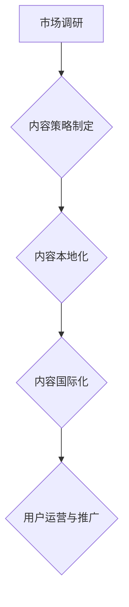

                 

## 知识付费创业中的内容本地化与国际化

> 关键词：知识付费、内容本地化、国际化、跨文化传播、市场拓展、用户体验、技术解决方案

### 1. 背景介绍

知识付费行业近年来蓬勃发展，成为数字经济的重要组成部分。随着互联网技术的普及和用户需求的不断变化，知识付费平台面临着新的挑战和机遇。其中，内容本地化与国际化成为关键议题，直接影响着平台的市场拓展和用户增长。

**1.1 知识付费行业现状**

知识付费是指通过付费的方式获取知识、技能和服务的商业模式。它涵盖了广泛的领域，包括教育培训、专业技能、兴趣爱好、文化娱乐等。近年来，随着移动互联网的普及和用户对个性化学习的需求不断增长，知识付费行业呈现出快速发展态势。

**1.2 内容本地化与国际化的重要性**

内容本地化是指将内容根据目标用户的文化背景、语言习惯、地域差异等进行调整和适配，以提高用户体验和理解度。国际化是指将内容推广到全球市场，并根据不同国家和地区的文化差异进行调整。

对于知识付费平台而言，内容本地化与国际化至关重要，因为它能够：

* **提升用户体验:** 本地化的内容能够更好地满足用户需求，提高用户粘性和转化率。
* **拓展市场规模:** 国际化能够帮助平台进入新的市场，扩大用户群体。
* **增强品牌竞争力:**  本地化和国际化的内容策略能够帮助平台建立更强的品牌形象和市场竞争力。

### 2. 核心概念与联系

**2.1 内容本地化与国际化的核心概念**

* **内容本地化:** 将内容根据目标用户的文化背景、语言习惯、地域差异等进行调整和适配，以提高用户体验和理解度。
* **内容国际化:** 将内容推广到全球市场，并根据不同国家和地区的文化差异进行调整。

**2.2 内容本地化与国际化的联系**

内容本地化与国际化是相辅相成的，它们共同构成了知识付费平台的全球化战略。

* **内容本地化是国际化的基础:** 在进行国际化推广之前，需要对目标市场的文化背景、语言习惯等进行深入了解，并对内容进行相应的本地化调整。
* **内容国际化是本地化的延伸:** 本地化内容的推广可以扩展到全球市场，从而实现更大的用户覆盖范围和商业价值。

**2.3 内容本地化与国际化的流程图**



### 3. 核心算法原理 & 具体操作步骤

**3.1 算法原理概述**

内容本地化与国际化涉及到多种算法和技术，例如机器翻译、跨文化传播模型、用户画像分析等。这些算法能够帮助平台自动识别和处理不同语言和文化的差异，从而实现内容的精准本地化和国际化。

**3.2 算法步骤详解**

1. **市场调研:** 对目标市场进行深入调研，了解用户的文化背景、语言习惯、地域差异等。
2. **内容策略制定:** 根据市场调研结果，制定相应的本地化和国际化策略。
3. **内容翻译:** 使用机器翻译技术将内容翻译成目标语言。
4. **内容适配:** 对翻译后的内容进行适配，例如调整语言风格、文化内涵、格式排版等。
5. **内容测试:** 对本地化和国际化后的内容进行测试，确保其准确性和用户体验。
6. **内容发布:** 将本地化和国际化后的内容发布到目标市场。

**3.3 算法优缺点**

* **优点:** 能够提高效率、降低成本，实现大规模的内容本地化和国际化。
* **缺点:** 算法本身存在一定的局限性，例如机器翻译的准确率、跨文化传播的复杂性等。

**3.4 算法应用领域**

* **教育培训:** 将课程内容翻译成不同语言，满足全球用户的学习需求。
* **专业技能:** 将专业技能培训内容本地化，帮助用户更好地理解和掌握技能。
* **兴趣爱好:** 将兴趣爱好课程内容翻译成不同语言，满足全球用户的文化需求。

### 4. 数学模型和公式 & 详细讲解 & 举例说明

**4.1 数学模型构建**

内容本地化与国际化的数学模型可以基于信息论、语言学、心理学等学科的理论，构建一个多维度的模型，来衡量内容的本地化程度和国际化潜力。

**4.2 公式推导过程**

例如，可以构建一个内容本地化程度的指标，通过以下公式计算：

```latex
本地化程度 = \frac{本地化内容量}{总内容量}
```

其中，本地化内容量是指经过本地化处理的内容量，总内容量是指所有内容的总量。

**4.3 案例分析与讲解**

假设一个知识付费平台想要将其英语课程本地化到中文市场。

* **本地化内容量:** 平台将课程内容翻译成中文，并根据中文用户的文化背景进行调整，例如使用更符合中文用户习惯的表达方式。
* **总内容量:** 平台的英语课程总量为100个小时。
* **本地化程度:** 假设平台将50个小时的课程内容本地化，则本地化程度为 50/100 = 0.5。

### 5. 项目实践：代码实例和详细解释说明

**5.1 开发环境搭建**

* **操作系统:** Linux/macOS/Windows
* **编程语言:** Python
* **开发工具:** VS Code/PyCharm
* **依赖库:** NLTK/spaCy/Transformers

**5.2 源代码详细实现**

```python
import nltk
from nltk.translate.bleu_score import sentence_bleu

# 下载 NLTK 数据集
nltk.download('punkt')
nltk.download('averaged_perceptron_tagger')

# 定义一个简单的机器翻译函数
def translate_sentence(sentence, target_language):
    # 使用机器翻译模型进行翻译
    # ...
    return translated_sentence

# 定义一个评估翻译质量的函数
def evaluate_translation(reference_sentence, translated_sentence):
    # 使用 BLEU 算法评估翻译质量
    score = sentence_bleu([reference_sentence], translated_sentence)
    return score

# 示例代码
reference_sentence = "Hello, world!"
translated_sentence = translate_sentence(reference_sentence, "中文")
score = evaluate_translation(reference_sentence, translated_sentence)
print(f"翻译质量: {score}")
```

**5.3 代码解读与分析**

* 该代码示例展示了如何使用 NLTK 库进行简单的机器翻译和翻译质量评估。
* 实际应用中，可以使用更强大的机器翻译模型，例如 Google Translate API 或 HuggingFace Transformers 库中的预训练模型。

**5.4 运行结果展示**

运行该代码后，会输出翻译质量的得分。得分越高，翻译质量越好。

### 6. 实际应用场景

**6.1 跨文化沟通平台**

知识付费平台可以将其内容本地化到不同语言，帮助用户进行跨文化沟通和交流。

**6.2 国际化教育培训**

知识付费平台可以将其课程内容翻译成不同语言，满足全球用户的学习需求。

**6.3 海外市场拓展**

知识付费平台可以将其内容本地化到目标市场的语言和文化，帮助其拓展海外市场。

**6.4 未来应用展望**

随着人工智能技术的不断发展，内容本地化与国际化将更加智能化和自动化。未来，知识付费平台可以利用更先进的算法和技术，实现更精准、更有效的本地化和国际化。

### 7. 工具和资源推荐

**7.1 学习资源推荐**

* **书籍:**
    * 《跨文化传播》
    * 《机器翻译》
* **在线课程:**
    * Coursera: 跨文化沟通
    * edX: 机器翻译

**7.2 开发工具推荐**

* **机器翻译工具:** Google Translate API, Microsoft Translator API, HuggingFace Transformers
* **内容管理系统:** WordPress, Drupal, Joomla

**7.3 相关论文推荐**

* **机器翻译:**
    * "Neural Machine Translation by Jointly Learning to Align and Translate"
    * "Attention Is All You Need"
* **跨文化传播:**
    * "Theories of Intercultural Communication"
    * "Cross-Cultural Management"

### 8. 总结：未来发展趋势与挑战

**8.1 研究成果总结**

内容本地化与国际化是知识付费平台发展的重要方向，它能够帮助平台提升用户体验、拓展市场规模、增强品牌竞争力。

**8.2 未来发展趋势**

* **人工智能驱动:** 利用人工智能技术实现更智能、更自动化的本地化和国际化。
* **个性化定制:** 根据用户的个性化需求，提供更精准的本地化和国际化服务。
* **多模态内容:** 将文本、图像、音频、视频等多模态内容进行本地化和国际化。

**8.3 面临的挑战**

* **文化差异:** 跨文化传播存在着复杂的文化差异，需要进行深入的理解和处理。
* **语言复杂性:** 不同语言的语法、词汇、文化内涵等存在着差异，需要进行精准的翻译和适配。
* **技术瓶颈:** 目前人工智能技术在内容本地化与国际化方面仍存在一定的瓶颈，需要不断进行研究和突破。

**8.4 研究展望**

未来，我们需要继续深入研究内容本地化与国际化的相关技术，开发更先进的算法和工具，以更好地服务于知识付费平台的发展。


### 9. 附录：常见问题与解答

**9.1 如何评估内容本地化的效果？**

可以根据用户反馈、内容访问量、转化率等指标来评估内容本地化的效果。

**9.2 如何选择合适的机器翻译模型？**

需要根据目标语言、内容类型、预算等因素来选择合适的机器翻译模型。

**9.3 如何处理文化差异带来的翻译问题？**

需要进行深入的文化研究，并结合专业翻译人员的经验，进行精准的文化适配。


作者：禅与计算机程序设计艺术 / Zen and the Art of Computer Programming 
<end_of_turn>

