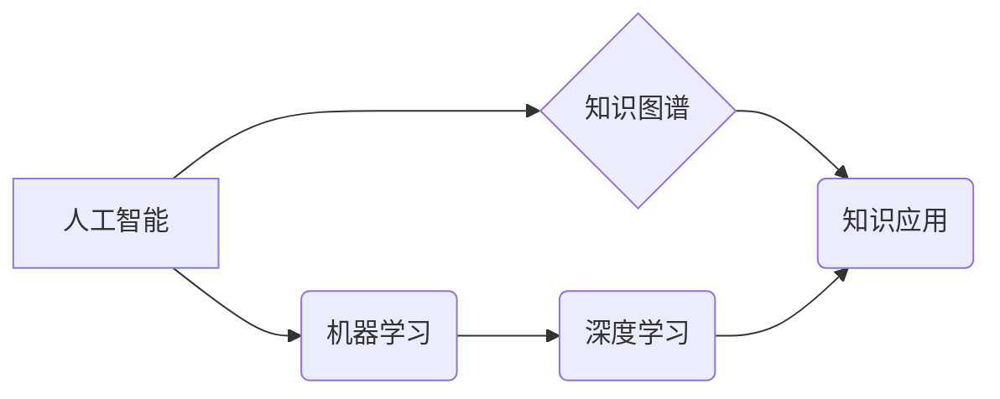

                 

## 知识的应用：从理论到实践的桥梁

> 关键词：人工智能、机器学习、深度学习、算法、模型、应用、实践、理论

### 1. 背景介绍

在当今数据爆炸的时代，知识已成为最宝贵的资源。然而，知识的获取仅仅是第一步，将其有效应用于实际问题才是关键。人工智能（AI）作为一项跨学科领域，致力于模拟人类智能，为知识的应用提供了强大的工具和方法。从理论研究到实际应用，AI的发展经历了飞速的进步，为我们带来了前所未有的机遇和挑战。

### 2. 核心概念与联系

**2.1  人工智能（AI）**

人工智能是指机器能够像人类一样学习、推理和解决问题的能力。它涵盖了广泛的领域，包括机器学习、深度学习、自然语言处理、计算机视觉等。

**2.2  机器学习（ML）**

机器学习是人工智能的一个子领域，它通过算法使机器能够从数据中学习，并根据学习到的知识进行预测或决策。机器学习算法可以分为监督学习、无监督学习和强化学习三大类。

**2.3  深度学习（DL）**

深度学习是机器学习的一个子领域，它利用多层神经网络来模拟人类大脑的学习过程。深度学习算法能够从海量数据中提取复杂的特征，并实现更精准的预测和决策。

**2.4  知识图谱（KG）**

知识图谱是一种结构化的知识表示形式，它将实体和关系以图的形式表示。知识图谱能够存储和推理大量的知识，为人工智能应用提供丰富的语义信息。

**2.5  知识应用**

知识应用是指将知识转化为实际价值的过程。它涉及到知识的获取、存储、推理、应用和评估等多个环节。

**核心概念联系流程图**



### 3. 核心算法原理 & 具体操作步骤

**3.1  算法原理概述**

深度学习算法的核心是多层神经网络。神经网络由多个层组成，每层包含多个神经元。神经元之间通过连接进行信息传递，每个连接都有一个权重。通过训练，神经网络可以调整权重，从而学习到数据的特征和规律。

**3.2  算法步骤详解**

1. **数据预处理:** 将原始数据转换为深度学习算法可以理解的形式，例如归一化、编码等。
2. **网络结构设计:** 根据任务需求设计神经网络的结构，包括层数、神经元数量、激活函数等。
3. **参数初始化:** 为神经网络的参数（权重和偏置）进行随机初始化。
4. **前向传播:** 将输入数据通过神经网络进行传递，计算输出结果。
5. **损失函数计算:** 计算输出结果与真实值的差异，即损失值。
6. **反向传播:** 根据损失值，调整神经网络的参数，使损失值最小化。
7. **训练迭代:** 重复前向传播、损失函数计算和反向传播的过程，直到损失值达到预设阈值。
8. **模型评估:** 使用测试数据评估模型的性能，例如准确率、召回率等。

**3.3  算法优缺点**

**优点:**

* 能够学习到复杂的数据特征。
* 性能优于传统机器学习算法。
* 适用范围广泛，包括图像识别、自然语言处理等。

**缺点:**

* 训练数据量大，计算资源消耗高。
* 模型解释性差，难以理解模型的决策过程。
* 容易过拟合，需要进行正则化等技术处理。

**3.4  算法应用领域**

* **图像识别:** 人脸识别、物体检测、图像分类等。
* **自然语言处理:** 文本分类、机器翻译、情感分析等。
* **语音识别:** 语音转文本、语音助手等。
* **推荐系统:** 商品推荐、内容推荐等。
* **医疗诊断:** 病情预测、疾病诊断等。

### 4. 数学模型和公式 & 详细讲解 & 举例说明

**4.1  数学模型构建**

深度学习算法的核心是神经网络，其数学模型可以表示为多层感知机（MLP）。MLP由输入层、隐藏层和输出层组成。每个层的神经元之间通过连接进行信息传递，每个连接都有一个权重。

**4.2  公式推导过程**

* **激活函数:** 激活函数用于引入非线性，使神经网络能够学习到复杂的特征。常见的激活函数包括 sigmoid 函数、ReLU 函数等。

* **损失函数:** 损失函数用于衡量模型的预测结果与真实值的差异。常见的损失函数包括均方误差（MSE）、交叉熵损失等。

* **梯度下降:** 梯度下降算法用于优化模型参数，使其能够最小化损失函数。

**4.3  案例分析与讲解**

假设我们有一个简单的图像分类任务，目标是将猫和狗的图像进行分类。我们可以使用一个包含两层隐藏层的 MLP 模型进行训练。

* **输入层:** 接收图像的像素值。
* **隐藏层1:** 对图像特征进行提取。
* **隐藏层2:** 对提取的特征进行进一步的处理。
* **输出层:** 输出猫和狗的概率。

通过训练数据，模型会学习到猫和狗的特征，并调整权重，使得模型能够准确地分类图像。

### 5. 项目实践：代码实例和详细解释说明

**5.1  开发环境搭建**

* **操作系统:** Linux、macOS 或 Windows
* **编程语言:** Python
* **深度学习框架:** TensorFlow、PyTorch 或 Keras

**5.2  源代码详细实现**

```python
import tensorflow as tf

# 定义模型结构
model = tf.keras.models.Sequential([
    tf.keras.layers.Flatten(input_shape=(28, 28)),
    tf.keras.layers.Dense(128, activation='relu'),
    tf.keras.layers.Dense(10, activation='softmax')
])

# 编译模型
model.compile(optimizer='adam',
              loss='sparse_categorical_crossentropy',
              metrics=['accuracy'])

# 训练模型
model.fit(x_train, y_train, epochs=5)

# 评估模型
loss, accuracy = model.evaluate(x_test, y_test)
print('Test loss:', loss)
print('Test accuracy:', accuracy)
```

**5.3  代码解读与分析**

* **模型结构:** 代码定义了一个简单的 MLP 模型，包含一个扁平化层、一个隐藏层和一个输出层。
* **激活函数:** 隐藏层使用 ReLU 激活函数，输出层使用 softmax 激活函数。
* **损失函数:** 使用 sparse_categorical_crossentropy 损失函数，用于多分类任务。
* **优化器:** 使用 adam 优化器，用于更新模型参数。
* **训练过程:** 使用训练数据训练模型，并设置训练轮数为 5。
* **评估过程:** 使用测试数据评估模型的性能，并打印测试损失和准确率。

**5.4  运行结果展示**

运行代码后，会输出测试损失和准确率。

### 6. 实际应用场景

**6.1  医疗诊断**

深度学习算法可以用于分析医学图像，辅助医生进行疾病诊断。例如，可以用于检测肺癌、乳腺癌等。

**6.2  金融风险控制**

深度学习算法可以用于分析金融数据，识别潜在的风险。例如，可以用于检测欺诈交易、评估信用风险等。

**6.3  智能客服**

深度学习算法可以用于构建智能客服系统，自动回答用户的问题。例如，可以用于处理客户服务电话、在线聊天等。

**6.4  未来应用展望**

随着人工智能技术的不断发展，深度学习算法将在更多领域得到应用，例如自动驾驶、个性化教育、科学研究等。

### 7. 工具和资源推荐

**7.1  学习资源推荐**

* **书籍:**
    * 深度学习
    * 人工智能：一种现代方法
* **在线课程:**
    * Coursera 深度学习课程
    * Udacity 深度学习工程师 Nanodegree

**7.2  开发工具推荐**

* **深度学习框架:** TensorFlow、PyTorch、Keras
* **编程语言:** Python
* **云计算平台:** Google Cloud Platform、Amazon Web Services、Microsoft Azure

**7.3  相关论文推荐**

* **ImageNet Classification with Deep Convolutional Neural Networks**
* **Attention Is All You Need**
* **BERT: Pre-training of Deep Bidirectional Transformers for Language Understanding**

### 8. 总结：未来发展趋势与挑战

**8.1  研究成果总结**

深度学习算法取得了显著的成果，在图像识别、自然语言处理等领域取得了突破性进展。

**8.2  未来发展趋势**

* **模型效率提升:** 研究更轻量级、更高效的深度学习模型。
* **可解释性增强:** 研究更易于理解的深度学习模型。
* **跨模态学习:** 研究能够处理多种模态数据的深度学习模型。
* **联邦学习:** 研究隐私保护的深度学习方法。

**8.3  面临的挑战**

* **数据获取和标注:** 深度学习算法需要大量的训练数据，数据获取和标注成本高。
* **模型解释性:** 深度学习模型的决策过程难以理解，缺乏可解释性。
* **公平性和偏见:** 深度学习模型可能存在公平性和偏见问题。

**8.4  研究展望**

未来，深度学习研究将继续朝着更智能、更安全、更可解释的方向发展。


### 9. 附录：常见问题与解答

**9.1  深度学习算法需要多少数据才能训练？**

深度学习算法对数据量的需求很大，一般来说，需要至少几千到几百万个样本才能训练出一个有效的模型。

**9.2  如何选择合适的深度学习框架？**

选择深度学习框架需要根据具体任务和需求进行考虑。 TensorFlow 和 PyTorch 是目前最流行的深度学习框架，Keras 是一个基于 TensorFlow 或 Theano 的高层 API，易于上手。

**9.3  如何解决深度学习模型的过拟合问题？**

过拟合是指模型在训练数据上表现很好，但在测试数据上表现较差。解决过拟合问题的方法包括：

* **增加训练数据量**
* **使用正则化技术**
* **使用 dropout 技术**
* **使用 early stopping 技术**


作者：禅与计算机程序设计艺术 / Zen and the Art of Computer Programming 
<end_of_turn>

