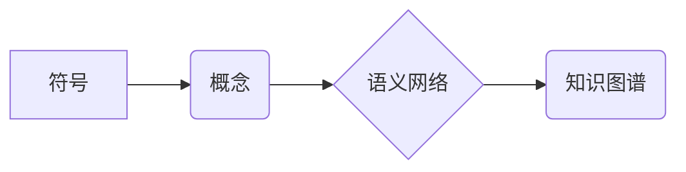

                 

## 知识的符号学：意义构建的过程

> 关键词：符号学、知识表示、语义网络、人工智能、机器学习、知识图谱、语义理解

## 1. 背景介绍

在信息爆炸的时代，人类面临着海量数据的处理和理解挑战。如何有效地提取、组织和利用知识，是人工智能领域的核心问题之一。知识的符号学，即利用符号系统来表示和处理知识，为解决这一问题提供了重要思路。

符号学作为一种认知科学和语言学分支，研究符号及其在人类认知和交流中的作用。在人工智能领域，符号学被应用于知识表示、语义理解、推理和决策等多个方面。通过将知识转化为符号形式，我们可以更有效地进行知识存储、检索和推理，从而实现更智能的机器认知。

## 2. 核心概念与联系

### 2.1 符号

符号是指能够代表某种概念、事物或关系的标记。符号可以是文字、图像、声音、动作等形式。在知识表示中，符号被用来表示知识的各个方面，例如概念、属性、关系等。

### 2.2 语义网络

语义网络是一种用于表示知识的图结构模型。在语义网络中，节点代表概念，边代表概念之间的关系。例如，在语义网络中，“猫”和“哺乳动物”之间存在一个“是”的关系，表示猫是一种哺乳动物。

### 2.3 知识图谱

知识图谱是一种大型、结构化的知识表示形式。它包含大量实体和关系，并通过明确的语义规则进行连接。知识图谱可以用于存储和推理各种类型的知识，例如事实、概念、事件等。

**Mermaid 流程图**



## 3. 核心算法原理 & 具体操作步骤

### 3.1 算法原理概述

知识的符号化过程涉及到以下几个关键步骤：

1. **概念提取:** 从文本或其他数据源中提取出重要的概念。
2. **关系识别:** 识别概念之间的关系，例如“是”、“包含”、“位于”等。
3. **符号化:** 将概念和关系转化为符号形式，例如使用节点和边表示语义网络。
4. **语义推理:** 基于符号化的知识表示，进行语义推理，例如推断新的知识或回答问题。

### 3.2 算法步骤详解

1. **概念提取:** 可以使用自然语言处理（NLP）技术，例如词性标注、依存句法分析等，从文本中提取出概念。
2. **关系识别:** 可以使用机器学习算法，例如支持向量机（SVM）、深度神经网络（DNN）等，从文本中识别出概念之间的关系。
3. **符号化:** 可以使用语义网络或知识图谱等模型，将概念和关系转化为符号形式。
4. **语义推理:** 可以使用规则推理、逻辑推理或基于知识的机器学习算法，进行语义推理。

### 3.3 算法优缺点

**优点:**

* 可以有效地表示和处理复杂知识。
* 可以进行语义推理，推断新的知识。
* 可以支持知识的共享和重用。

**缺点:**

* 符号化过程需要人工干预，效率较低。
* 知识表示的准确性和完整性依赖于符号化规则的质量。
* 对于开放世界知识，符号化过程面临挑战。

### 3.4 算法应用领域

* **人工智能:** 语义理解、知识问答、机器翻译等。
* **信息检索:** 理解用户查询意图，提供更精准的搜索结果。
* **推荐系统:** 基于用户兴趣和商品属性进行个性化推荐。
* **医疗诊断:** 辅助医生进行诊断，提高诊断准确率。

## 4. 数学模型和公式 & 详细讲解 & 举例说明

### 4.1 数学模型构建

知识的符号化可以建模为图论问题。其中，节点代表概念，边代表概念之间的关系。

**定义:**

* **概念集:** C = {c1, c2, ..., cn}
* **关系集:** R = {r1, r2, ..., rm}
* **知识图谱:** G = (C, R, E)

其中，E 是概念和关系之间的连接，表示知识的表达。

### 4.2 公式推导过程

**举例说明:**

假设我们有一个简单的知识图谱，包含以下概念和关系:

* 概念: 猫, 狗, 哺乳动物
* 关系: 是

我们可以用以下公式表示猫是哺乳动物的关系:

```latex
猫 \in 哺乳动物
```

### 4.3 案例分析与讲解

**案例:**

假设我们有一个关于动物的知识图谱，包含以下信息:

* 猫是哺乳动物
* 狗是哺乳动物
* 哺乳动物是动物

我们可以利用知识图谱进行语义推理，推断出以下结论:

* 猫是动物
* 狗是动物

**解释:**

通过分析知识图谱中的关系，我们可以推断出猫和狗都属于动物类别。

## 5. 项目实践：代码实例和详细解释说明

### 5.1 开发环境搭建

* Python 3.x
* 安装必要的库，例如：

```bash
pip install rdflib networkx
```

### 5.2 源代码详细实现

```python
from rdflib import Graph, Literal, URIRef
from networkx import DiGraph

# 创建知识图谱
g = Graph()

# 添加概念和关系
g.add((URIRef("http://example.org/Cat"), URIRef("http://example.org/isA"), URIRef("http://example.org/Mammal")))
g.add((URIRef("http://example.org/Dog"), URIRef("http://example.org/isA"), URIRef("http://example.org/Mammal")))
g.add((URIRef("http://example.org/Mammal"), URIRef("http://example.org/isA"), URIRef("http://example.org/Animal")))

# 创建语义网络
dg = DiGraph()
for s, p, o in g.triples((None, None, None)):
    dg.add_edge(s, o, relation=p)

# 打印知识图谱
print(g.serialize(format="turtle"))

# 打印语义网络
print(dg.nodes())
print(dg.edges(data=True))
```

### 5.3 代码解读与分析

* 代码首先使用 rdflib 库创建了一个知识图谱对象。
* 然后，代码添加了关于猫、狗和哺乳动物的概念和关系。
* 接着，代码使用 networkx 库创建了一个语义网络，并根据知识图谱中的关系添加了节点和边。
* 最后，代码打印了知识图谱和语义网络的结构。

### 5.4 运行结果展示

运行代码后，会输出知识图谱和语义网络的结构信息。

## 6. 实际应用场景

### 6.1 语义搜索

知识的符号化可以用于构建语义搜索引擎，理解用户查询的意图，并提供更精准的搜索结果。

### 6.2 个性化推荐

知识图谱可以用于构建个性化推荐系统，根据用户的兴趣和商品属性进行推荐。

### 6.3 知识问答

知识的符号化可以用于构建知识问答系统，回答用户关于特定领域的知识问题。

### 6.4 未来应用展望

* **人工智能增强:** 知识的符号化可以为人工智能系统提供更丰富的知识表示，从而增强其认知能力和推理能力。
* **跨领域知识融合:** 知识图谱可以用于融合不同领域的知识，构建更完整的知识体系。
* **可解释人工智能:** 知识的符号化可以提高人工智能系统的可解释性，帮助人类理解人工智能系统的决策过程。

## 7. 工具和资源推荐

### 7.1 学习资源推荐

* **书籍:**

    * 《知识表示与推理》
    * 《人工智能：现代方法》

* **在线课程:**

    * Coursera: Knowledge Representation and Reasoning
    * edX: Artificial Intelligence

### 7.2 开发工具推荐

* **Protégé:** 用于构建和编辑知识图谱的开源工具。
* **OWL API:** 用于处理 OWL 语义网络的 Java 库。
* **RDFlib:** 用于处理 RDF 数据的 Python 库。

### 7.3 相关论文推荐

* **《A Survey of Knowledge Representation and Reasoning》**
* **《Knowledge Graphs: A Survey》**

## 8. 总结：未来发展趋势与挑战

### 8.1 研究成果总结

知识的符号化在人工智能领域取得了显著进展，为知识表示、语义理解和推理提供了有效的方法。

### 8.2 未来发展趋势

* **知识图谱规模和复杂度提升:** 未来知识图谱将包含更多实体和关系，并涵盖更广泛的领域。
* **跨语言和跨模态知识表示:** 将支持不同语言和模态的知识表示，例如文本、图像、音频等。
* **动态和可演化的知识表示:** 将能够适应知识变化，并自动更新知识图谱。

### 8.3 面临的挑战

* **知识获取和维护:** 如何高效地获取和维护高质量的知识仍然是一个挑战。
* **知识表示的开放性和可扩展性:** 如何构建开放、可扩展的知识表示模型，以支持不同领域的知识融合。
* **知识推理的准确性和可靠性:** 如何提高知识推理的准确性和可靠性，使其能够应对复杂和不确定性环境。

### 8.4 研究展望

未来研究将继续探索更有效的知识表示方法，并将其应用于更广泛的领域，例如医疗、教育、金融等。


## 9. 附录：常见问题与解答

**Q1: 知识的符号化与机器学习有什么关系？**

**A1:** 知识的符号化和机器学习是互补的。符号化可以为机器学习提供结构化的知识表示，而机器学习可以帮助自动提取和学习新的知识。

**Q2: 知识图谱的构建需要哪些技术？**

**A2:** 构建知识图谱需要多种技术，例如自然语言处理、关系抽取、知识推理等。

**Q3: 知识的符号化有哪些应用场景？**

**A3:** 知识的符号化在人工智能、信息检索、推荐系统等多个领域都有广泛的应用场景。


作者：禅与计算机程序设计艺术 / Zen and the Art of Computer Programming 
<end_of_turn>

