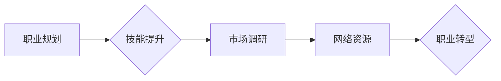

                 

## 程序员如何应对职业转型

> 关键词：职业转型、程序员、技能提升、新兴技术、学习路径、职业规划、未来趋势、心理准备

### 1. 背景介绍

在当今科技飞速发展的时代，程序员职业面临着前所未有的挑战和机遇。随着新兴技术的不断涌现，传统的编程技能逐渐过时，程序员需要不断学习和提升自身能力，才能保持竞争力。职业转型已成为程序员生涯中不可避免的一部分。

**1.1. 技术迭代加速**

人工智能、云计算、大数据等新兴技术的快速发展，对程序员的技能需求提出了更高的要求。传统的编程语言和框架正在被新的技术所取代，程序员需要及时掌握新的技术，才能适应市场需求。

**1.2. 行业变革**

互联网、移动互联网、物联网等行业的快速发展，也对程序员的职业发展带来了新的机遇。新的行业和领域需要大量的程序员人才，为程序员提供了更多的职业选择。

**1.3. 个人成长**

程序员职业发展是一个不断学习和成长的过程。职业转型可以帮助程序员拓展视野，学习新的知识和技能，提升自身价值。

### 2. 核心概念与联系

职业转型是一个复杂的过程，涉及到个人能力、市场需求、行业趋势等多方面因素。

**2.1. 职业规划**

职业规划是职业转型的第一步，需要程序员明确自己的职业目标、兴趣爱好、技能优势等，制定合理的职业发展路径。

**2.2. 技能提升**

职业转型需要程序员不断学习和提升自身技能。可以学习新的编程语言、框架、技术，也可以学习与编程相关的软技能，如沟通、团队合作、项目管理等。

**2.3. 市场调研**

程序员需要了解当前市场对哪些技能的需求量大，哪些行业发展前景好，才能选择适合自己的职业方向。

**2.4. 网络资源**

程序员可以利用网络资源，如在线学习平台、技术社区、招聘网站等，获取职业转型相关的资讯和帮助。

**Mermaid 流程图**

### 3. 核心算法原理 & 具体操作步骤

**3.1. 算法原理概述**

职业转型的核心算法可以看作是一个迭代优化过程，需要不断根据市场需求和个人能力进行调整。

**3.2. 算法步骤详解**

1. **自我评估:** 评估自身技能、经验、兴趣爱好等，确定职业转型方向。
2. **市场调研:** 研究目标行业和岗位需求，了解市场趋势和竞争情况。
3. **技能学习:** 学习目标行业所需的技能，可以通过在线课程、书籍、实践项目等方式。
4. **简历优化:** 根据目标行业和岗位需求，优化简历内容，突出自身优势。
5. **面试准备:** 针对目标行业和岗位，准备面试答题和自我介绍，提升面试技巧。
6. **职业发展:** 进入目标行业后，不断学习和提升自身能力，积累经验，实现职业发展目标。

**3.3. 算法优缺点**

**优点:**

* 灵活性和适应性强，可以根据个人情况和市场需求进行调整。
* 持续学习和提升，可以帮助程序员保持竞争力。

**缺点:**

* 需要投入时间和精力进行学习和实践。
* 转型过程可能存在不确定性，需要做好心理准备。

**3.4. 算法应用领域**

该算法适用于所有需要进行职业转型的程序员，无论目标行业是软件开发、数据分析、人工智能等。

### 4. 数学模型和公式 & 详细讲解 & 举例说明

**4.1. 数学模型构建**

职业转型的成功概率可以看作是一个函数，其输入变量包括个人能力、市场需求、学习投入等因素，输出变量为成功转型后的职业满意度和收入水平。

**4.2. 公式推导过程**

由于职业转型的成功概率是一个复杂的多因素函数，难以用简单的公式进行精确描述。

**4.3. 案例分析与讲解**

假设程序员A拥有良好的编程基础，但缺乏数据分析经验，想要转型为数据分析师。

* **个人能力:** 程序员A的编程能力可以作为其数据分析能力的基础。
* **市场需求:** 目前数据分析师市场需求量大，薪资水平较高。
* **学习投入:** 程序员A需要学习数据分析相关的工具和技术，并积累实践经验。

根据以上因素，我们可以推断出程序员A转型为数据分析师的成功概率较高。

### 5. 项目实践：代码实例和详细解释说明

**5.1. 开发环境搭建**

程序员可以根据目标行业和岗位需求，搭建相应的开发环境。例如，想要转型为人工智能工程师，需要搭建深度学习开发环境，包括安装深度学习框架、配置GPU等。

**5.2. 源代码详细实现**

程序员可以根据目标行业和岗位需求，编写相应的源代码。例如，想要转型为前端开发工程师，可以编写一个简单的网页，展示自己的前端开发能力。

**5.3. 代码解读与分析**

程序员需要能够清晰地解释自己的代码，并分析代码的优缺点。

**5.4. 运行结果展示**

程序员需要能够展示自己的代码运行结果，并解释结果的含义。

### 6. 实际应用场景

**6.1. 程序员转型为数据分析师**

数据分析师是目前市场需求量很大的职业，程序员可以利用自身的编程能力，学习数据分析相关的工具和技术，转型为数据分析师。

**6.2. 程序员转型为产品经理**

产品经理需要了解用户需求、市场趋势和技术发展，程序员可以利用自身的编程经验，了解产品开发流程，转型为产品经理。

**6.3. 程序员转型为创业者**

程序员可以利用自身的编程能力和技术经验，创业开发新的软件产品或服务。

**6.4. 未来应用展望**

随着人工智能、云计算等新兴技术的不断发展，程序员的职业转型将更加多样化，新的职业方向将不断涌现。

### 7. 工具和资源推荐

**7.1. 学习资源推荐**

* 在线学习平台：Coursera、edX、Udemy等
* 技术社区：Stack Overflow、GitHub等
* 书籍： 《Python编程：从入门到实践》、《数据分析实战》等

**7.2. 开发工具推荐**

* 编程语言：Python、Java、C++等
* 开发环境：IDE、虚拟机等
* 工具软件：Git、Docker等

**7.3. 相关论文推荐**

* 《人工智能的未来》
* 《云计算的应用场景》
* 《大数据的分析与挖掘》

### 8. 总结：未来发展趋势与挑战

**8.1. 研究成果总结**

职业转型是一个复杂的过程，需要程序员不断学习和提升自身能力，才能适应市场需求。

**8.2. 未来发展趋势**

随着科技发展，程序员的职业转型将更加多样化，新的职业方向将不断涌现。

**8.3. 面临的挑战**

程序员需要不断学习新技术，才能保持竞争力。

**8.4. 研究展望**

未来研究可以更加深入地探讨程序员职业转型的具体方法和策略，帮助程序员更好地应对职业转型挑战。

### 9. 附录：常见问题与解答

**9.1. 如何选择合适的职业转型方向？**

程序员可以根据自身技能、兴趣爱好和市场需求，选择合适的职业转型方向。

**9.2. 如何学习新的技能？**

程序员可以利用在线学习平台、技术社区、书籍等资源，学习新的技能。

**9.3. 如何提升面试技巧？**

程序员可以参加面试模拟练习，了解目标行业和岗位需求，准备面试答题和自我介绍。

作者：禅与计算机程序设计艺术 / Zen and the Art of Computer Programming 
<end_of_turn>

