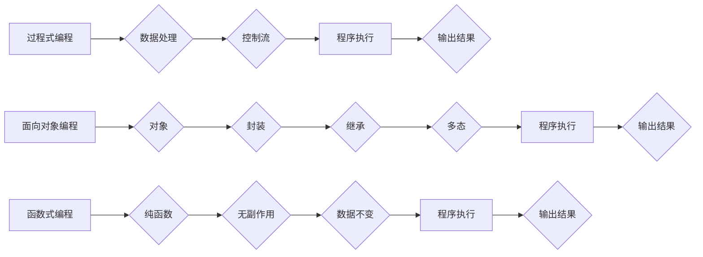

                 

## 编程范式的演进与比较分析

> 关键词：编程范式、面向对象、函数式编程、过程式编程、并发编程、数据流编程、元编程、软件架构

### 1. 背景介绍

编程范式是软件开发中指导程序设计和代码组织的一种基本方法论。它定义了程序结构、数据处理方式以及程序员与计算机交互的方式。随着计算机技术的发展和软件需求的不断变化，编程范式也经历了不断的演进和发展。从最初的简单过程式编程到如今的复杂函数式编程和并发编程，每个范式都试图解决特定问题，提高软件开发效率和代码可读性。

### 2. 核心概念与联系

编程范式之间存在着相互联系和演进的关系。不同的范式强调不同的编程理念，并采用不同的技术手段来实现。

**Mermaid 流程图:**

**核心概念原理和架构:**

* **过程式编程:** 以程序流程为中心，将程序分解成一系列步骤，通过控制流语句（如if、for、while）实现逻辑控制。
* **面向对象编程:** 以对象为中心，将数据和操作封装在一起，通过继承、封装和多态等机制实现代码复用和维护。
* **函数式编程:** 以函数为中心，强调函数的纯函数性和无副作用，通过函数组合和高阶函数实现代码简洁和可读性。

### 3. 核心算法原理 & 具体操作步骤

#### 3.1  算法原理概述

算法是解决特定问题的步骤序列，是编程范式实现的关键。不同的编程范式采用不同的算法设计思路。

#### 3.2  算法步骤详解

* **过程式编程:** 通常采用迭代或递归算法，通过循环和条件语句实现数据处理和逻辑控制。
* **面向对象编程:** 采用面向对象算法，例如设计模式，通过对象之间的交互和组合实现复杂问题的解决。
* **函数式编程:** 采用函数式算法，例如映射、过滤、折合等，通过函数组合和高阶函数实现数据处理和逻辑控制。

#### 3.3  算法优缺点

* **过程式编程:** 优点：易于理解和实现，适合处理线性问题。缺点：代码结构复杂，难以维护，难以实现代码复用。
* **面向对象编程:** 优点：代码结构清晰，易于维护，支持代码复用。缺点：学习曲线陡峭，对于简单问题可能过于复杂。
* **函数式编程:** 优点：代码简洁、可读性高，易于测试和调试。缺点：学习曲线陡峭，对于某些问题可能难以实现。

#### 3.4  算法应用领域

* **过程式编程:** 适合控制流程明确、数据处理相对简单的应用场景，例如文本处理、数值计算等。
* **面向对象编程:** 适合大型复杂软件开发，例如操作系统、数据库管理系统等。
* **函数式编程:** 适合数据处理密集型应用场景，例如数据分析、机器学习等。

### 4. 数学模型和公式 & 详细讲解 & 举例说明

#### 4.1  数学模型构建

编程范式可以抽象为数学模型，例如状态机模型、数据流模型等。这些模型可以帮助我们理解编程范式的本质和工作原理。

#### 4.2  公式推导过程

例如，面向对象编程中的继承机制可以用数学公式来描述，例如子类属性和方法的继承关系可以用集合论的子集关系来表示。

#### 4.3  案例分析与讲解

通过数学模型和公式，我们可以分析不同编程范式的优缺点，并进行比较。例如，我们可以用时间复杂度和空间复杂度来比较不同算法的效率。

### 5. 项目实践：代码实例和详细解释说明

#### 5.1  开发环境搭建

选择合适的编程语言和开发工具，例如Python、Java、C++等。

#### 5.2  源代码详细实现

根据选择的编程范式，编写示例代码，例如实现一个简单的计算器、一个简单的图形界面等。

#### 5.3  代码解读与分析

对代码进行详细解读，分析代码结构、数据处理方式、控制流逻辑等。

#### 5.4  运行结果展示

运行代码，观察运行结果，并进行测试和调试。

### 6. 实际应用场景

#### 6.1  Web开发

* **过程式编程:** 适合简单的Web页面开发。
* **面向对象编程:** 适合大型复杂的Web应用程序开发。
* **函数式编程:** 适合数据处理密集型Web应用程序开发，例如数据分析、机器学习等。

#### 6.2  移动开发

* **过程式编程:** 适合简单的移动应用开发。
* **面向对象编程:** 适合大型复杂的移动应用程序开发。
* **函数式编程:** 适合数据处理密集型移动应用开发，例如图像处理、语音识别等。

#### 6.3  游戏开发

* **过程式编程:** 适合简单的游戏开发。
* **面向对象编程:** 适合大型复杂的3D游戏开发。
* **函数式编程:** 适合数据处理密集型游戏开发，例如物理引擎、人工智能等。

#### 6.4  未来应用展望

随着人工智能、云计算等技术的快速发展，编程范式将继续演进和发展。例如，量子编程、分布式编程等新兴范式将逐渐成为主流。

### 7. 工具和资源推荐

#### 7.1  学习资源推荐

* **书籍:** 《编程语言导论》、《模式语言》、《函数式编程》等。
* **在线课程:** Coursera、edX、Udemy等平台提供丰富的编程范式课程。
* **博客和论坛:** Stack Overflow、GitHub等平台提供编程范式相关的讨论和资源。

#### 7.2  开发工具推荐

* **IDE:** Eclipse、IntelliJ IDEA、Visual Studio Code等。
* **版本控制系统:** Git、SVN等。
* **测试工具:** JUnit、pytest等。

#### 7.3  相关论文推荐

* **面向对象编程:** 《面向对象软件工程》
* **函数式编程:** 《函数式编程范式》
* **并发编程:** 《并发编程：原理和实践》

### 8. 总结：未来发展趋势与挑战

#### 8.1  研究成果总结

编程范式研究取得了丰硕的成果，为软件开发提供了多种方法论和工具。

#### 8.2  未来发展趋势

* **更简洁、更安全的编程范式:** 追求代码简洁、易读、易维护，并提高代码安全性。
* **更强大的并发编程范式:** 应对多核处理器和云计算环境下的并发编程挑战。
* **更智能的编程范式:** 利用人工智能技术，自动生成代码、优化代码、检测代码错误等。

#### 8.3  面临的挑战

* **编程范式之间的融合:** 如何将不同的编程范式融合在一起，形成更强大的编程体系。
* **编程范式与新技术之间的适配:** 如何将编程范式与新兴技术（如量子计算、区块链等）相结合。
* **编程范式教育的普及:** 如何将最新的编程范式知识普及到更广泛的开发者群体。

#### 8.4  研究展望

未来编程范式研究将更加注重代码的可读性、安全性、可维护性和智能化。

### 9. 附录：常见问题与解答

* **Q1: 哪个编程范式最好？**
    * **A1:** 没有最好的编程范式，不同的编程范式适用于不同的场景。选择合适的编程范式取决于项目的具体需求和开发团队的经验。
* **Q2: 如何学习新的编程范式？**
    * **A2:** 可以通过阅读书籍、参加在线课程、观看视频教程、参与开源项目等方式学习新的编程范式。
* **Q3: 如何将不同的编程范式结合使用？**
    * **A3:** 可以通过组合不同的编程范式，例如将面向对象编程与函数式编程结合使用，以实现更强大的代码功能。

作者：禅与计算机程序设计艺术 / Zen and the Art of Computer Programming 
<end_of_turn>

