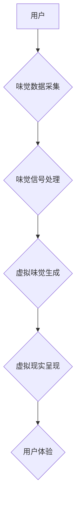

                 

## 虚拟味觉艺术：AI创作的味蕾交响曲

> 关键词：人工智能、味觉感知、虚拟现实、多模态学习、神经网络、食品设计、味觉模拟

## 1. 背景介绍

人类味觉体验是丰富多彩的，它不仅是味觉细胞的直接刺激，更是一种复杂的感知和情感体验。美食的魅力不仅在于其味道本身，更在于它所带来的联想、回忆和情感共鸣。然而，传统的味觉感知方式局限于现实世界，无法突破物理边界，创造出全新的味觉体验。

近年来，人工智能技术飞速发展，为虚拟味觉艺术的实现提供了强大的技术支撑。通过模拟味觉感知机制，结合虚拟现实技术，我们可以构建一个虚拟味觉空间，让用户在虚拟世界中体验到各种奇幻的味觉组合。

## 2. 核心概念与联系

虚拟味觉艺术的核心概念是将味觉感知转化为可模拟的数字信号，并通过虚拟现实技术呈现给用户。

**2.1 核心概念**

* **味觉感知:**  味觉感知是一个复杂的生理过程，涉及到舌头上的味蕾、神经元和大脑的信号处理。
* **虚拟现实 (VR):**  虚拟现实技术通过头戴式显示器和传感器，创造出一个沉浸式的虚拟环境，让用户身临其境地体验虚拟世界。
* **多模态学习:** 多模态学习是指让机器学习模型从多种数据类型（如视觉、听觉、触觉、味觉等）中学习，从而获得更全面的理解和感知能力。

**2.2 架构图**



## 3. 核心算法原理 & 具体操作步骤

**3.1 算法原理概述**

虚拟味觉艺术的核心算法是基于多模态学习和神经网络的味觉模拟算法。该算法通过训练神经网络，学习将味觉数据与对应的味觉体验进行映射。

**3.2 算法步骤详解**

1. **数据采集:** 收集各种食物的味觉数据，包括化学成分、口感、温度等信息。
2. **数据预处理:** 对收集到的味觉数据进行清洗、标准化和转换，使其适合神经网络训练。
3. **模型构建:** 使用深度学习框架（如TensorFlow或PyTorch）构建多层神经网络模型，其中包含卷积层、循环层和全连接层等。
4. **模型训练:** 使用收集到的味觉数据训练神经网络模型，让模型学习将味觉数据映射到对应的味觉体验。
5. **模型评估:** 使用测试数据评估模型的性能，并根据评估结果进行模型调优。
6. **虚拟味觉生成:** 将用户输入的虚拟味觉数据输入到训练好的神经网络模型中，模型会输出对应的虚拟味觉信号。
7. **虚拟现实呈现:** 将虚拟味觉信号转换为虚拟现实环境中的触觉、嗅觉和视觉刺激，让用户体验到虚拟味觉。

**3.3 算法优缺点**

* **优点:**

    * 可以创造出全新的味觉体验，突破现实世界的限制。
    * 可以个性化定制味觉体验，满足不同用户的需求。
    * 可以用于食品设计和研发，帮助开发出更美味的食物。

* **缺点:**

    * 目前虚拟味觉技术还处于发展初期，模拟味觉体验的真实度有限。
    * 需要大量的味觉数据进行训练，数据采集和标注成本较高。
    * 虚拟味觉技术涉及多学科交叉，需要多领域专家共同合作。

**3.4 算法应用领域**

* **食品设计和研发:** 帮助开发出更美味、更健康的食品。
* **餐饮业:** 提供个性化味觉体验，提升顾客满意度。
* **游戏和娱乐:** 为游戏和虚拟世界增添更丰富的体验。
* **医疗保健:** 用于治疗味觉障碍，帮助患者恢复味觉功能。

## 4. 数学模型和公式 & 详细讲解 & 举例说明

**4.1 数学模型构建**

虚拟味觉模拟算法通常使用多层感知机 (MLP) 或卷积神经网络 (CNN) 作为模型架构。

* **MLP:** 多层感知机是一种简单的深度学习模型，由多个全连接层组成。每个神经元接收来自上一层的输出，并通过激活函数进行处理，输出到下一层。

* **CNN:** 卷积神经网络是一种专门用于处理图像数据的深度学习模型。它使用卷积层和池化层来提取图像特征，并使用全连接层进行分类或回归。

**4.2 公式推导过程**

* **激活函数:** 激活函数用于引入非线性，使神经网络能够学习复杂的映射关系。常用的激活函数包括 sigmoid 函数、ReLU 函数和 tanh 函数。

* **损失函数:** 损失函数用于衡量模型预测结果与真实值的差异。常用的损失函数包括均方误差 (MSE) 和交叉熵损失 (Cross-Entropy Loss)。

* **优化算法:** 优化算法用于更新模型参数，使模型的损失函数最小化。常用的优化算法包括梯度下降 (Gradient Descent) 和 Adam 算法。

**4.3 案例分析与讲解**

假设我们使用 MLP 模型模拟一种水果的味道。我们可以将水果的化学成分、颜色、形状等信息作为输入，并训练模型将这些信息映射到对应的味觉体验。

例如，我们可以将苹果的化学成分、颜色和形状作为输入，训练模型预测苹果的味道是酸甜的。

## 5. 项目实践：代码实例和详细解释说明

**5.1 开发环境搭建**

* Python 3.x
* TensorFlow 或 PyTorch 深度学习框架
* Jupyter Notebook 或 VS Code 开发环境

**5.2 源代码详细实现**

```python
import tensorflow as tf

# 定义模型架构
model = tf.keras.models.Sequential([
    tf.keras.layers.Dense(64, activation='relu', input_shape=(10,)),
    tf.keras.layers.Dense(32, activation='relu'),
    tf.keras.layers.Dense(5, activation='softmax')
])

# 编译模型
model.compile(optimizer='adam',
              loss='categorical_crossentropy',
              metrics=['accuracy'])

# 训练模型
model.fit(x_train, y_train, epochs=10)

# 预测味觉体验
predictions = model.predict(x_test)
```

**5.3 代码解读与分析**

* 该代码示例使用 TensorFlow 框架构建了一个简单的 MLP 模型。
* 模型输入层包含 10 个神经元，用于接收味觉数据。
* 模型隐藏层包含两个全连接层，每个层包含 64 和 32 个神经元，并使用 ReLU 激活函数。
* 模型输出层包含 5 个神经元，用于预测 5 种不同的味觉体验。
* 模型使用 Adam 优化算法、交叉熵损失函数和准确率作为评估指标进行训练。

**5.4 运行结果展示**

训练完成后，我们可以使用测试数据预测味觉体验，并评估模型的性能。

## 6. 实际应用场景

**6.1 食品设计和研发**

虚拟味觉技术可以帮助食品设计师和研发人员探索新的味觉组合，开发出更美味、更健康的食品。例如，可以模拟不同种类的水果、蔬菜和香料的味道，并根据用户的反馈进行调整，最终开发出符合市场需求的新产品。

**6.2 餐饮业**

虚拟味觉技术可以为餐饮业提供个性化味觉体验，提升顾客满意度。例如，餐厅可以根据用户的口味偏好，定制不同的味觉体验，让顾客享受到更独特的用餐体验。

**6.3 游戏和娱乐**

虚拟味觉技术可以为游戏和虚拟世界增添更丰富的体验。例如，在虚拟烹饪游戏中，玩家可以体验到虚拟食物的味道，并根据自己的喜好进行烹饪。

**6.4 未来应用展望**

随着虚拟味觉技术的不断发展，其应用场景将会更加广泛。例如，可以用于医疗保健领域，帮助治疗味觉障碍，恢复患者的味觉功能。

## 7. 工具和资源推荐

**7.1 学习资源推荐**

* **书籍:**

    * 深度学习 (Deep Learning) - Ian Goodfellow, Yoshua Bengio, Aaron Courville
    * 人工智能：一种现代方法 (Artificial Intelligence: A Modern Approach) - Stuart Russell, Peter Norvig

* **在线课程:**

    * TensorFlow 官方教程: https://www.tensorflow.org/tutorials
    * PyTorch 官方教程: https://pytorch.org/tutorials/

**7.2 开发工具推荐**

* **TensorFlow:** https://www.tensorflow.org/
* **PyTorch:** https://pytorch.org/
* **Jupyter Notebook:** https://jupyter.org/
* **VS Code:** https://code.visualstudio.com/

**7.3 相关论文推荐**

* **Taste-Based Food Recommendation Using Deep Learning**
* **Virtual Taste Perception: A Review**
* **Multimodal Learning for Virtual Taste Generation**

## 8. 总结：未来发展趋势与挑战

**8.1 研究成果总结**

虚拟味觉艺术是一个充满潜力的研究领域，近年来取得了显著的进展。通过多模态学习和神经网络技术，我们可以模拟味觉感知机制，并创造出全新的味觉体验。

**8.2 未来发展趋势**

* **更逼真的味觉模拟:** 未来研究将更加注重模拟味觉的复杂性和多层次性，例如模拟味觉的强度、持久性和变化等。
* **个性化味觉体验:** 未来虚拟味觉技术将更加注重个性化定制，根据用户的口味偏好和健康需求提供个性化的味觉体验。
* **多感官融合:** 未来虚拟味觉技术将与其他感官技术融合，例如触觉、嗅觉和视觉，创造出更加沉浸式的虚拟体验。

**8.3 面临的挑战**

* **数据获取和标注:** 虚拟味觉模拟算法需要大量的味觉数据进行训练，数据获取和标注成本较高。
* **模型复杂度:** 模拟味觉的复杂性要求模型具有更高的复杂度，这会导致模型训练难度增加。
* **伦理问题:** 虚拟味觉技术可能会引发一些伦理问题，例如食物欺诈和味觉依赖等。

**8.4 研究展望**

虚拟味觉艺术是一个充满挑战和机遇的领域，未来研究将继续探索新的技术和应用场景，为人类带来更加丰富多彩的味觉体验。

## 9. 附录：常见问题与解答

**9.1 如何获取味觉数据？**

味觉数据可以从多种渠道获取，例如：

* **化学成分分析:** 使用仪器分析食物的化学成分，例如糖、酸、脂肪等。
* **味觉测试:** 组织志愿者进行味觉测试，记录他们的味觉体验。
* **传感器数据:** 使用味觉传感器收集食物的味道信息。

**9.2 如何训练虚拟味觉模型？**

训练虚拟味觉模型需要使用深度学习框架，例如 TensorFlow 或 PyTorch。

* **数据预处理:** 对收集到的味觉数据进行清洗、标准化和转换，使其适合模型训练。
* **模型构建:** 使用深度学习框架构建虚拟味觉模型，例如 MLP 或 CNN。
* **模型训练:** 使用训练数据训练模型，并根据评估结果进行模型调优。

**9.3 虚拟味觉技术有哪些应用场景？**

虚拟味觉技术可以应用于多种领域，例如：

* **食品设计和研发**
* **餐饮业**
* **游戏和娱乐**
* **医疗保健**


作者：禅与计算机程序设计艺术 / Zen and the Art of Computer Programming 
<end_of_turn>

