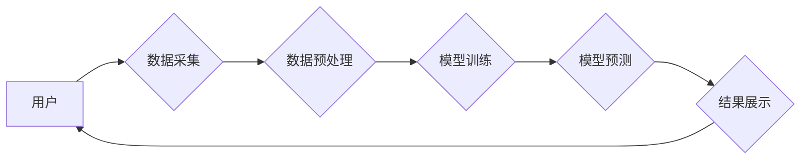

                 

## 认知增强与职场竞争：知识工作者的进化

> 关键词：人工智能、认知增强、职场竞争、知识工作者、深度学习、神经网络、自然语言处理、机器学习

### 1. 背景介绍

当今世界，科技发展日新月异，人工智能（AI）技术突飞猛进，正在深刻地改变着人类社会各领域。其中，认知增强技术作为AI的重要分支，旨在通过技术手段提升人类的认知能力，例如记忆、学习、决策等。对于知识工作者而言，认知增强技术带来的机遇与挑战并存。

一方面，认知增强技术可以帮助知识工作者更高效地处理信息、更快地学习新知识、更准确地做出决策，从而提高工作效率和创造力。例如，利用自然语言处理（NLP）技术，知识工作者可以快速阅读和理解大量文本，提取关键信息，并生成报告或总结；利用机器学习（ML）技术，知识工作者可以根据历史数据预测未来趋势，制定更有效的策略。

另一方面，认知增强技术也可能导致一些负面影响，例如加剧社会不平等、降低人类创造力和批判性思维能力等。因此，我们需要理性看待认知增强技术的应用，并制定相应的政策和伦理规范，确保其能够真正造福人类社会。

### 2. 核心概念与联系

**2.1 认知增强技术概述**

认知增强技术旨在通过技术手段提升人类的认知能力，包括记忆、学习、决策、创造力等。它融合了人工智能、神经科学、心理学等多学科的知识，利用算法、模型和硬件等技术手段，模拟和增强人类的认知过程。

**2.2 认知增强技术与职场竞争的关系**

随着认知增强技术的不断发展，它将对职场竞争产生深远的影响。

* **提升工作效率和生产力:** 认知增强技术可以帮助知识工作者更高效地处理信息、更快地学习新知识、更准确地做出决策，从而提高工作效率和生产力。
* **改变工作模式:** 认知增强技术可能会改变传统的办公模式，例如远程办公、协同办公等，更加灵活和高效。
* **提升人才竞争力:** 掌握认知增强技术的人才将拥有更强的竞争力，能够胜任更复杂和高难度的任务。

**2.3 认知增强技术应用场景**

认知增强技术在各个领域都有广泛的应用场景，例如：

* **教育:** 个性化学习、智能辅导、知识图谱构建等。
* **医疗:** 疾病诊断、药物研发、精准医疗等。
* **金融:** 风险管理、欺诈检测、投资决策等。
* **商业:** 市场营销、客户服务、产品设计等。

**2.4 认知增强技术架构**



### 3. 核心算法原理 & 具体操作步骤

**3.1 算法原理概述**

认知增强技术的核心算法主要包括深度学习、神经网络、自然语言处理等。

* **深度学习:** 深度学习是一种机器学习的子领域，它利用多层神经网络来模拟人类大脑的学习过程，能够从海量数据中自动提取特征，并进行复杂的模式识别和预测。
* **神经网络:** 神经网络是一种模仿人脑神经元结构的算法模型，它由多个相互连接的神经元组成，通过学习数据之间的关系，不断调整神经元之间的权重，最终实现对数据的理解和预测。
* **自然语言处理:** 自然语言处理是指让计算机能够理解和处理人类语言的技术，它包括文本分析、机器翻译、语音识别等多个子领域。

**3.2 算法步骤详解**

1. **数据采集:** 收集与认知增强相关的各种数据，例如文本、图像、音频、视频等。
2. **数据预处理:** 对收集到的数据进行清洗、转换、格式化等处理，使其能够被算法模型所理解。
3. **模型训练:** 利用深度学习算法，训练神经网络模型，使其能够从数据中学习并识别出其中的模式和规律。
4. **模型评估:** 对训练好的模型进行评估，测试其在实际应用场景中的性能，并根据评估结果进行模型优化。
5. **模型部署:** 将训练好的模型部署到实际应用场景中，例如智能助手、学习平台、医疗诊断系统等。

**3.3 算法优缺点**

**优点:**

* 能够从海量数据中自动提取特征，提高学习效率和准确性。
* 能够处理复杂的数据模式，解决传统算法难以解决的问题。
* 能够不断学习和进化，随着数据量的增加，模型性能会不断提升。

**缺点:**

* 需要大量的训练数据，数据质量对模型性能有很大影响。
* 训练过程耗时和耗能，需要强大的计算资源支持。
* 模型的内部机制较为复杂，难以解释和理解。

**3.4 算法应用领域**

* **个性化学习:** 根据学生的学习情况和特点，提供个性化的学习内容和学习路径。
* **智能辅导:** 利用AI技术，为学生提供智能化的学习辅导和答疑服务。
* **知识图谱构建:** 利用NLP技术，构建知识图谱，帮助用户更深入地理解和掌握知识。
* **疾病诊断:** 利用深度学习算法，分析患者的医疗数据，辅助医生进行疾病诊断。
* **药物研发:** 利用机器学习算法，预测药物的疗效和安全性，加速药物研发过程。

### 4. 数学模型和公式 & 详细讲解 & 举例说明

**4.1 数学模型构建**

认知增强技术中常用的数学模型包括神经网络模型、强化学习模型等。

* **神经网络模型:** 神经网络模型由多个层级的神经元组成，每个神经元接收来自前一层神经元的输入，并通过激活函数进行处理，输出到下一层神经元。神经网络模型的学习过程就是通过调整神经元之间的权重，使得模型能够准确地预测输出。

* **强化学习模型:** 强化学习模型通过与环境交互，学习如何采取最优的行动以获得最大的奖励。强化学习模型通常使用价值函数来评估不同行动的价值，并通过策略梯度算法来更新策略，使得模型能够在环境中取得更好的结果。

**4.2 公式推导过程**

* **激活函数:** 激活函数是神经网络模型中一个重要的组成部分，它决定了神经元对输入信号的响应方式。常用的激活函数包括 sigmoid 函数、ReLU 函数、tanh 函数等。

* **损失函数:** 损失函数用于衡量模型预测结果与真实结果之间的差异。常用的损失函数包括均方误差（MSE）、交叉熵损失（Cross-Entropy Loss）等。

* **梯度下降算法:** 梯度下降算法是训练神经网络模型常用的优化算法，它通过不断调整神经元之间的权重，使得模型的损失函数值不断减小。

**4.3 案例分析与讲解**

* **图像识别:** 利用深度学习算法，训练一个图像识别模型，能够识别不同类型的物体，例如猫、狗、车等。

* **机器翻译:** 利用神经网络模型，训练一个机器翻译模型，能够将一种语言翻译成另一种语言。

### 5. 项目实践：代码实例和详细解释说明

**5.1 开发环境搭建**

* **操作系统:** Linux 或 macOS
* **编程语言:** Python
* **深度学习框架:** TensorFlow 或 PyTorch
* **其他工具:** Git、Jupyter Notebook

**5.2 源代码详细实现**

```python
import tensorflow as tf

# 定义模型结构
model = tf.keras.models.Sequential([
    tf.keras.layers.Conv2D(32, (3, 3), activation='relu', input_shape=(28, 28, 1)),
    tf.keras.layers.MaxPooling2D((2, 2)),
    tf.keras.layers.Conv2D(64, (3, 3), activation='relu'),
    tf.keras.layers.MaxPooling2D((2, 2)),
    tf.keras.layers.Flatten(),
    tf.keras.layers.Dense(10, activation='softmax')
])

# 编译模型
model.compile(optimizer='adam',
              loss='sparse_categorical_crossentropy',
              metrics=['accuracy'])

# 加载数据集
(x_train, y_train), (x_test, y_test) = tf.keras.datasets.mnist.load_data()

# 训练模型
model.fit(x_train, y_train, epochs=5)

# 评估模型
loss, accuracy = model.evaluate(x_test, y_test)
print('Test loss:', loss)
print('Test accuracy:', accuracy)
```

**5.3 代码解读与分析**

这段代码实现了使用 TensorFlow 框架训练一个简单的图像识别模型。

* **模型结构:** 模型结构由卷积层、池化层和全连接层组成，用于提取图像特征和进行分类。
* **模型编译:** 使用 Adam 优化器、交叉熵损失函数和准确率作为评估指标。
* **数据集加载:** 使用 MNIST 手写数字数据集进行训练和测试。
* **模型训练:** 使用训练数据训练模型，训练 epochs 次。
* **模型评估:** 使用测试数据评估模型的性能。

**5.4 运行结果展示**

训练完成后，模型能够识别 MNIST 手写数字数据集中的数字，并输出测试集上的准确率。

### 6. 实际应用场景

**6.1 个性化学习平台**

认知增强技术可以用于构建个性化学习平台，根据学生的学习情况和特点，提供个性化的学习内容和学习路径。例如，可以利用 AI 技术分析学生的学习行为，识别学生的学习难点，并推荐相应的学习资源。

**6.2 智能客服系统**

认知增强技术可以用于构建智能客服系统，能够理解用户的自然语言输入，并提供准确的回复。例如，可以利用 NLP 技术训练一个聊天机器人，能够回答用户的常见问题，并提供相应的帮助。

**6.3 医疗诊断辅助系统**

认知增强技术可以用于构建医疗诊断辅助系统，帮助医生更快、更准确地诊断疾病。例如，可以利用深度学习算法分析患者的医疗影像数据，识别潜在的疾病风险。

**6.4 未来应用展望**

认知增强技术在未来将有更广泛的应用场景，例如：

* **增强现实 (AR) 和虚拟现实 (VR) 应用:** 认知增强技术可以增强 AR 和 VR 应用的沉浸感和交互性，例如，可以利用 AI 技术生成虚拟环境中的虚拟人物，并与用户进行自然对话。
* **自动驾驶:** 认知增强技术可以帮助自动驾驶系统更好地理解周围环境，并做出更安全的决策。
* **个性化医疗:** 认知增强技术可以帮助医生制定更个性化的治疗方案，并提高治疗效果。

### 7. 工具和资源推荐

**7.1 学习资源推荐**

* **书籍:**
    * 《深度学习》 by Ian Goodfellow, Yoshua Bengio, and Aaron Courville
    * 《机器学习》 by Tom Mitchell
* **在线课程:**
    * Coursera: Deep Learning Specialization
    * Udacity: Machine Learning Engineer Nanodegree
* **开源项目:**
    * TensorFlow: https://www.tensorflow.org/
    * PyTorch: https://pytorch.org/

**7.2 开发工具推荐**

* **编程语言:** Python
* **深度学习框架:** TensorFlow, PyTorch
* **数据可视化工具:** Matplotlib, Seaborn
* **版本控制工具:** Git

**7.3 相关论文推荐**

* **AlphaGo:** Mastering the game of Go with deep neural networks and tree search
* **BERT:** Pre-training of deep bidirectional transformers for language understanding
* **GPT-3:** Language Models are Few-Shot Learners

### 8. 总结：未来发展趋势与挑战

**8.1 研究成果总结**

认知增强技术近年来取得了显著的进展，在图像识别、自然语言处理、医疗诊断等领域取得了突破性的成果。

**8.2 未来发展趋势**

* **模型规模和能力的提升:** 未来，认知增强模型的规模和能力将会进一步提升，能够处理更复杂的任务，并提供更精准的预测结果。
* **跨模态学习:** 未来，认知增强技术将更加注重跨模态学习，例如将文本、图像、音频等多种数据类型融合在一起，实现更全面的知识理解和应用。
* **可解释性增强:** 未来，研究人员将更加关注认知增强模型的可解释性，使其能够更好地解释自己的决策过程，提高用户对模型的信任度。

**8.3 面临的挑战**

* **数据获取和隐私保护:** 认知增强技术需要大量的训练数据，如何获取高质量的数据，并保护用户隐私是一个重要的挑战。
* **算法公平性和伦理问题:** 认知增强算法可能会存在偏见和歧视，如何确保算法的公平性和伦理性是一个需要认真考虑的问题。
* **技术可访问性和应用推广:** 如何让认知增强技术更加易于使用和推广，使其能够惠及更多的人，也是一个重要的挑战。

**8.4 研究展望**

未来，认知增强技术将继续朝着更智能、更安全、更可解释的方向发展，并将在各个领域发挥越来越重要的作用。


### 9. 附录：常见问题与解答

**9.1 如何选择合适的认知增强技术？**

选择合适的认知增强技术需要根据具体的应用场景和需求进行考虑。例如，对于图像识别任务，可以使用深度学习算法；对于自然语言处理任务，可以使用神经网络模型。

**9.2 如何解决认知增强技术中的数据偏见问题？**

数据偏见是认知增强技术面临的一个重要挑战。可以采取以下措施来解决这个问题：

* 使用更加多样化的训练数据。
* 使用公平性评估指标来评估模型的公平性。
* 开发算法来识别和减轻数据偏见。

**9.3 认知增强技术对人类工作的影响是什么？**

认知增强技术可能会改变人类的工作方式，提高工作效率和创造力，但也可能导致一些工作岗位被自动化取代。我们需要积极应对这些变化，并制定相应的政策和措施，确保认知增强技术能够造福人类社会。


作者：禅与计算机程序设计艺术 / Zen and the Art of Computer Programming 
<end_of_turn>

