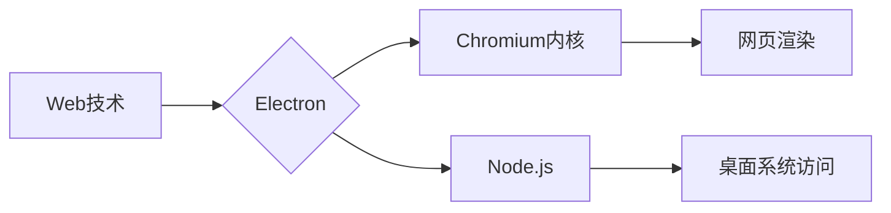

                 

## 跨平台桌面应用开发：Electron框架

> 关键词：Electron,跨平台,桌面应用,Web技术,Node.js,Chromium

## 1. 背景介绍

随着互联网技术的飞速发展，Web技术已经成为构建应用程序的主流方式。然而，传统的Web应用主要局限于浏览器环境，无法充分利用桌面系统的资源和功能。为了突破这一限制，跨平台桌面应用开发应运而生。

Electron框架正是为解决这一问题而诞生的。它是一个开源的、基于Chromium内核和Node.js的框架，允许开发者使用熟悉的Web技术（HTML, CSS, JavaScript）构建跨平台的桌面应用程序。Electron的出现，为开发者提供了便捷高效的桌面应用开发工具，也为用户带来了更加丰富的应用体验。

## 2. 核心概念与联系

Electron框架的核心概念是将Web技术与桌面应用环境相结合。它利用Chromium内核渲染网页内容，并通过Node.js提供对桌面系统的访问权限。

**架构图：**



**核心概念解释：**

* **Web技术:** Electron框架的核心是基于HTML, CSS, JavaScript构建应用。开发者可以使用熟悉的Web开发工具和技术，快速构建桌面应用。
* **Chromium内核:** Chromium是Google Chrome浏览器的开源内核，负责渲染网页内容。Electron框架使用Chromium内核，保证了应用的跨平台兼容性和高性能渲染。
* **Node.js:** Node.js是一个基于JavaScript的运行环境，允许开发者访问桌面系统的文件系统、网络、数据库等资源。Electron框架通过Node.js，将Web应用与桌面系统连接起来。

## 3. 核心算法原理 & 具体操作步骤

Electron框架的核心算法原理是基于Web技术和Node.js的组合，它并没有特定的算法。

**3.1 算法原理概述:**

Electron框架的核心原理是将Web应用与桌面系统环境相结合。它利用Chromium内核渲染网页内容，并通过Node.js提供对桌面系统的访问权限。开发者可以使用熟悉的Web开发技术构建应用，Electron框架负责将应用打包成跨平台的桌面应用程序。

**3.2 算法步骤详解:**

1. **开发应用:** 使用HTML, CSS, JavaScript等Web技术开发桌面应用。
2. **集成Node.js模块:** 使用Node.js模块访问桌面系统的资源和功能。
3. **打包应用:** 使用Electron提供的打包工具将应用打包成跨平台的桌面应用程序。
4. **发布应用:** 将打包好的应用程序发布到应用商店或其他平台。

**3.3 算法优缺点:**

* **优点:**
    * 使用熟悉的Web技术开发，降低学习成本。
    * 跨平台兼容性强，可以发布到Windows, macOS, Linux等多个平台。
    * 开发效率高，可以使用现有的Web开发工具和框架。
* **缺点:**
    * 应用体积较大，因为需要包含Chromium内核和Node.js运行环境。
    * 部分桌面系统功能的访问需要借助Node.js模块，可能会增加开发复杂度。

**3.4 算法应用领域:**

Electron框架广泛应用于各种桌面应用开发，例如：

* **代码编辑器:** Visual Studio Code, Atom
* **音乐播放器:** Spotify, VLC
* **聊天工具:** Slack, Discord
* **开发工具:** Postman, WebStorm
* **游戏:** Steam, Minecraft

## 4. 数学模型和公式 & 详细讲解 & 举例说明

Electron框架本身并不依赖复杂的数学模型和公式。其核心原理是基于Web技术和Node.js的组合，主要依靠软件工程和算法设计。

## 5. 项目实践：代码实例和详细解释说明

**5.1 开发环境搭建:**

1. 安装Node.js：https://nodejs.org/
2. 安装Electron：npm install -g electron-forge
3. 创建新项目：electron-forge init my-app

**5.2 源代码详细实现:**

```javascript
// main.js
const { app, BrowserWindow } = require('electron');

function createWindow() {
  const win = new BrowserWindow({
    width: 800,
    height: 600,
    webPreferences: {
      nodeIntegration: true // 允许使用Node.js API
    }
  });

  win.loadFile('index.html'); // 加载应用的主页面
}

app.whenReady().then(createWindow);

app.on('window-all-closed', () => {
  if (process.platform !== 'darwin') {
    app.quit();
  }
});

app.on('activate', () => {
  if (BrowserWindow.getAllWindows().length === 0) {
    createWindow();
  }
});
```

```html
<!DOCTYPE html>
<html>
<head>
  <title>Electron应用</title>
</head>
<body>
  <h1>Hello, Electron!</h1>
  <p>This is a simple Electron application.</p>
</body>
</html>
```

**5.3 代码解读与分析:**

* `main.js` 文件是Electron应用的主程序入口文件。
* `createWindow()` 函数创建了一个新的浏览器窗口，并加载了 `index.html` 页面。
* `webPreferences` 对象允许在渲染进程中使用Node.js API。
* `app.whenReady()` 方法等待Electron应用启动完成，然后调用 `createWindow()` 函数创建窗口。

**5.4 运行结果展示:**

运行上述代码，将会创建一个简单的Electron桌面应用窗口，显示“Hello, Electron!”的标题和一段文字。

## 6. 实际应用场景

Electron框架的跨平台特性和Web技术基础，使其在各种实际应用场景中发挥着重要作用。

* **跨平台开发:** 开发者可以使用Electron框架构建一次代码，即可在Windows, macOS, Linux等多个平台上发布应用，节省了开发时间和成本。
* **桌面应用的Web化:** Electron框架允许开发者将Web应用打包成桌面应用程序，为用户提供更加丰富的应用体验。
* **快速原型开发:** Electron框架的开发效率高，可以快速构建桌面应用原型，方便进行测试和迭代。

**6.4 未来应用展望:**

随着Web技术的不断发展，Electron框架的应用场景将会更加广泛。例如：

* **移动应用开发:** Electron框架可以用于开发跨平台的移动应用，利用Web技术构建移动应用，降低开发成本和时间。
* **物联网应用开发:** Electron框架可以用于开发物联网应用，将Web技术应用于物联网设备，实现更加智能化的物联网应用。
* **游戏开发:** Electron框架可以用于开发跨平台的游戏，利用Web技术构建游戏，降低开发成本和时间。

## 7. 工具和资源推荐

**7.1 学习资源推荐:**

* Electron官方文档：https://www.electronjs.org/docs
* Electron中文社区：https://electronjs.org/zh-cn/docs
* Electron教程：https://www.electronjs.org/docs/tutorial

**7.2 开发工具推荐:**

* Visual Studio Code：https://code.visualstudio.com/
* Atom：https://atom.io/
* WebStorm：https://www.jetbrains.com/webstorm/

**7.3 相关论文推荐:**

* Electron: A Framework for Building Cross-Platform Desktop Applications with Web Technologies
* The Rise of Cross-Platform Desktop Applications: A Case Study of Electron

## 8. 总结：未来发展趋势与挑战

Electron框架作为一种跨平台桌面应用开发工具，已经取得了巨大的成功。它为开发者提供了便捷高效的开发方式，也为用户带来了更加丰富的应用体验。

**8.1 研究成果总结:**

Electron框架的出现，推动了Web技术在桌面应用领域的应用，降低了跨平台桌面应用开发的成本和时间。它为开发者提供了更加灵活和高效的开发工具，也为用户带来了更加丰富的应用体验。

**8.2 未来发展趋势:**

* **更轻量化:** Electron框架的体积较大，未来可能会更加轻量化，降低应用的启动时间和资源消耗。
* **更强大的功能:** Electron框架可能会添加更多强大的功能，例如更好的多窗口管理、更完善的桌面通知等。
* **更完善的生态:** Electron框架的生态系统将会更加完善，提供更多丰富的插件和工具，方便开发者开发和维护应用。

**8.3 面临的挑战:**

* **安全性:** Electron框架基于Web技术，可能会面临一些安全方面的挑战，需要加强安全防护措施。
* **性能:** Electron框架的性能可能会受到Chromium内核和Node.js运行环境的影响，需要不断优化性能。
* **兼容性:** Electron框架需要支持多个操作系统和硬件平台，需要不断进行兼容性测试和维护。

**8.4 研究展望:**

未来，Electron框架将会继续发展壮大，成为跨平台桌面应用开发的主流工具。研究者可以关注以下几个方面：

* **提高Electron框架的安全性:** 研究更有效的安全防护措施，保障用户数据安全。
* **优化Electron框架的性能:** 研究更有效的性能优化技术，提高应用的启动速度和运行效率。
* **扩展Electron框架的功能:** 开发新的插件和工具，扩展Electron框架的功能，满足开发者和用户的需求。


## 9. 附录：常见问题与解答

**常见问题:**

* **Electron框架的应用体积较大，如何减小应用体积？**

**解答:**

可以使用Electron Builder工具进行打包优化，例如使用压缩算法压缩资源文件，删除不必要的依赖包等。

* **Electron框架的开发效率如何？**

**解答:**

Electron框架的开发效率较高，可以使用熟悉的Web技术开发应用，并且可以使用现有的Web开发工具和框架。

* **Electron框架的安全性如何？**

**解答:**

Electron框架基于Web技术，可能会面临一些安全方面的挑战，需要加强安全防护措施，例如使用沙盒技术隔离应用进程，限制应用访问系统资源等。


作者：禅与计算机程序设计艺术 / Zen and the Art of Computer Programming<end_of_turn>

