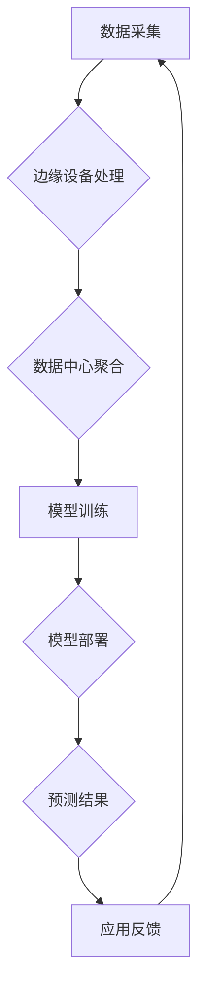

                 

## AI基础设施的痛点解决者：Lepton AI的市场价值

> 关键词：AI基础设施、Lepton AI、模型训练、数据处理、算力优化、成本降低、效率提升、可扩展性、边缘计算

### 1. 背景介绍

人工智能（AI）正以惊人的速度发展，其应用领域不断拓展，从自动驾驶到医疗诊断，再到个性化推荐，AI正在深刻地改变着我们的生活。然而，推动AI发展的关键基础设施——AI基础设施，却面临着诸多挑战。

传统的AI基础设施主要依赖于集中式数据中心，其架构存在以下痛点：

* **高昂的成本:** 数据中心建设和维护成本高昂，包括硬件、能源、冷却等方面的支出。
* **数据传输瓶颈:** 数据从边缘设备传输到数据中心，需要跨越长距离网络，导致数据传输延迟和带宽瓶颈。
* **算力不足:** 大型AI模型训练需要海量算力，而传统数据中心算力往往难以满足需求，导致训练时间过长。
* **可扩展性差:** 随着AI应用的规模化发展，传统数据中心难以快速扩展，无法满足不断增长的算力需求。

这些痛点限制了AI技术的广泛应用，阻碍了其在各个领域的全面发展。

### 2. 核心概念与联系

Lepton AI 应运而生，旨在解决上述AI基础设施痛点。Lepton AI 是一种分布式、边缘计算驱动的AI平台，其核心概念包括：

* **分布式架构:** Lepton AI 将算力分散到边缘设备和数据中心，形成一个分布式计算网络，有效缓解数据中心算力压力。
* **边缘计算:** Lepton AI 将部分AI模型部署到边缘设备，例如智能手机、传感器等，实现数据本地处理，减少数据传输量和延迟。
* **微服务化:** Lepton AI 将平台功能拆分成多个独立的服务，实现模块化设计，提高平台的灵活性和可扩展性。

Lepton AI 的架构可以概括为以下流程：



### 3. 核心算法原理 & 具体操作步骤

Lepton AI 基于深度学习算法，并结合了分布式训练、模型压缩等技术，实现高效的AI模型训练和部署。

#### 3.1  算法原理概述

Lepton AI 主要采用以下深度学习算法：

* **卷积神经网络 (CNN):** 用于图像识别、物体检测等视觉任务。
* **循环神经网络 (RNN):** 用于自然语言处理、语音识别等序列数据任务。
* **Transformer:** 用于机器翻译、文本摘要等自然语言理解任务。

Lepton AI 通过将模型参数分布到多个节点上进行训练，并利用并行计算技术，大幅提高训练速度。

#### 3.2  算法步骤详解

Lepton AI 的模型训练步骤如下：

1. **数据预处理:** 将原始数据清洗、格式化、转换等预处理操作。
2. **模型构建:** 根据任务需求选择合适的深度学习模型架构。
3. **模型参数初始化:** 为模型参数赋予初始值。
4. **数据分片:** 将训练数据分成多个部分，分别分配给不同的节点进行训练。
5. **模型训练:** 利用梯度下降算法，根据训练数据更新模型参数，直到达到预设的精度。
6. **模型评估:** 使用测试数据评估模型的性能，并进行调参优化。
7. **模型部署:** 将训练好的模型部署到边缘设备或数据中心，用于实际应用。

#### 3.3  算法优缺点

Lepton AI 的算法优势在于：

* **高效率:** 分布式训练和并行计算技术，大幅提高训练速度。
* **高精度:** 利用深度学习算法，能够实现高精度的模型训练。
* **高可扩展性:** 可以根据需求灵活扩展算力，满足不同规模的应用需求。

Lepton AI 的算法缺点在于：

* **复杂性:** 分布式训练和模型压缩等技术较为复杂，需要专业的技术人员进行开发和维护。
* **数据安全:** 数据在分布式网络中传输和处理，需要加强数据安全保障措施。

#### 3.4  算法应用领域

Lepton AI 的算法应用领域广泛，包括：

* **图像识别:** 人脸识别、物体检测、图像分类等。
* **自然语言处理:** 语音识别、机器翻译、文本摘要等。
* **推荐系统:** 基于用户行为和偏好进行商品推荐。
* **医疗诊断:** 基于图像数据辅助医生进行诊断。
* **智能制造:** 基于传感器数据进行设备故障预测和生产过程优化。

### 4. 数学模型和公式 & 详细讲解 & 举例说明

Lepton AI 的核心算法基于深度学习，其数学模型和公式主要包括：

#### 4.1  数学模型构建

深度学习模型通常由多个神经网络层组成，每一层包含多个神经元。每个神经元接收来自上一层的输入信号，并通过激活函数进行处理，输出到下一层。

#### 4.2  公式推导过程

深度学习模型的训练过程基于梯度下降算法，其目标是找到最优的模型参数，使得模型的预测结果与真实值之间的误差最小化。

损失函数用于衡量模型预测结果与真实值的误差。常用的损失函数包括均方误差 (MSE) 和交叉熵损失 (Cross-Entropy Loss)。

梯度下降算法通过计算损失函数对模型参数的梯度，并根据梯度方向更新模型参数，逐步逼近最优解。

#### 4.3  案例分析与讲解

例如，在图像分类任务中，可以使用卷积神经网络 (CNN) 作为模型，并使用交叉熵损失函数来衡量模型的预测结果与真实标签之间的误差。

训练过程中，CNN 的权重参数会根据梯度下降算法不断更新，最终使得模型能够准确地识别图像中的物体类别。

### 5. 项目实践：代码实例和详细解释说明

Lepton AI 提供了丰富的API和工具，方便开发者进行项目实践。

#### 5.1  开发环境搭建

Lepton AI 支持多种开发环境，包括Linux、Windows和云平台。

开发者需要根据自己的需求选择合适的开发环境，并安装Lepton AI SDK。

#### 5.2  源代码详细实现

Lepton AI 的源代码开源，开发者可以根据自己的需求进行修改和扩展。

以下是一个简单的Lepton AI代码示例，用于实现图像分类任务：

```python
import lepton_ai as la

# 加载预训练模型
model = la.load_model("imagenet_resnet50")

# 预处理图像
image = la.preprocess_image("image.jpg")

# 进行图像分类
prediction = model.predict(image)

# 打印预测结果
print(prediction)
```

#### 5.3  代码解读与分析

这段代码首先使用Lepton AI的`load_model()`函数加载预训练的ResNet50模型。

然后使用`preprocess_image()`函数对输入图像进行预处理，例如调整图像大小和归一化。

最后使用`predict()`函数对预处理后的图像进行分类，并打印预测结果。

#### 5.4  运行结果展示

运行这段代码后，会输出图像分类的结果，例如“猫”、“狗”、“汽车”等。

### 6. 实际应用场景

Lepton AI 的分布式架构和边缘计算能力，使其在以下实际应用场景中展现出强大的优势：

#### 6.1  智能制造

Lepton AI 可以部署在工厂设备上，实时监控设备运行状态，进行故障预测和预防性维护，提高生产效率和降低生产成本。

#### 6.2  智慧城市

Lepton AI 可以用于城市监控、交通管理、环境监测等领域，实现智能化城市管理，提高城市运营效率和居民生活质量。

#### 6.3  医疗健康

Lepton AI 可以辅助医生进行疾病诊断、影像分析、药物研发等工作，提高医疗诊断的准确性和效率。

#### 6.4  未来应用展望

Lepton AI 的未来应用前景广阔，随着人工智能技术的不断发展，Lepton AI 将在更多领域发挥重要作用，例如：

* **自动驾驶:** Lepton AI 可以用于自动驾驶汽车的感知、决策和控制，实现更加安全可靠的自动驾驶体验。
* **个性化教育:** Lepton AI 可以根据学生的学习情况和需求，提供个性化的学习内容和辅导，提高学生的学习效率和兴趣。
* **虚拟现实和增强现实:** Lepton AI 可以为虚拟现实和增强现实应用提供更逼真的交互体验，例如虚拟购物、虚拟旅游等。

### 7. 工具和资源推荐

#### 7.1  学习资源推荐

* Lepton AI 官方文档: https://docs.lepton.ai/
* Lepton AI GitHub仓库: https://github.com/LeptonAI

#### 7.2  开发工具推荐

* Python: https://www.python.org/
* TensorFlow: https://www.tensorflow.org/
* PyTorch: https://pytorch.org/

#### 7.3  相关论文推荐

* **Distributed Deep Learning: Challenges and Future Directions**
* **Model Compression and Optimization Techniques for Deep Learning**
* **Edge Computing for Artificial Intelligence**

### 8. 总结：未来发展趋势与挑战

Lepton AI 作为一种分布式、边缘计算驱动的AI平台，为解决AI基础设施痛点提供了新的解决方案。

#### 8.1  研究成果总结

Lepton AI 的研究成果主要体现在以下几个方面：

* **高效的分布式训练算法:** Lepton AI 利用并行计算技术和分布式训练策略，大幅提高了模型训练速度。
* **模型压缩和优化技术:** Lepton AI 通过模型剪枝、量化等技术，降低了模型大小和计算复杂度，提高了模型的部署效率。
* **边缘计算能力:** Lepton AI 将部分AI模型部署到边缘设备，实现数据本地处理，减少数据传输量和延迟。

#### 8.2  未来发展趋势

Lepton AI 的未来发展趋势包括：

* **更强大的算力支持:** Lepton AI 将继续探索新的算力架构和技术，以满足越来越复杂的AI模型训练需求。
* **更智能的模型推理:** Lepton AI 将研究更智能的模型推理算法，提高模型的推理效率和准确性。
* **更广泛的应用场景:** Lepton AI 将应用于更多领域，例如自动驾驶、医疗健康、教育等，推动人工智能技术的广泛应用。

#### 8.3  面临的挑战

Lepton AI 还面临着一些挑战：

* **数据安全和隐私保护:** 数据在分布式网络中传输和处理，需要加强数据安全和隐私保护措施。
* **模型可解释性和信任度:** 深度学习模型的决策过程往往难以解释，需要提高模型的可解释性和信任度。
* **人才培养和生态建设:** Lepton AI 的发展需要更多的人才投入和生态建设。

#### 8.4  研究展望

Lepton AI 的未来研究方向包括：

* **联邦学习:** 研究联邦学习技术，实现数据在不共享的情况下进行联合训练，提高数据安全性和隐私保护。
* **自监督学习:** 研究自监督学习技术，利用无标签数据进行模型训练，降低模型训练成本。
* **AI芯片设计:** 研究专门用于AI计算的芯片，提高模型推理效率和降低功耗。

### 9. 附录：常见问题与解答

#### 9.1  Lepton AI 是否支持开源社区？

是的，Lepton AI 的源代码开源，开发者可以自由使用、修改和扩展。Lepton AI 也有一个活跃的开源社区，开发者可以在这里分享经验、寻求帮助和参与项目开发。

#### 9.2  Lepton AI 的部署方式有哪些？

Lepton AI 支持多种部署方式，包括：

* **本地部署:** 在自己的服务器或云平台上部署Lepton AI。
* **云平台部署:** 在主流云平台，例如AWS、Azure、GCP等上部署Lepton AI。
* **边缘部署:** 将Lepton AI 部署到边缘设备，例如智能手机、传感器等。

#### 9.3  Lepton AI 的收费模式是什么？

Lepton AI 提供了免费的开源版本和付费的商业版本。免费版本的功能有限，而付费版本则提供更强大的功能和更完善的售后服务。


作者：禅与计算机程序设计艺术 / Zen and the Art of Computer Programming 
<end_of_turn>

