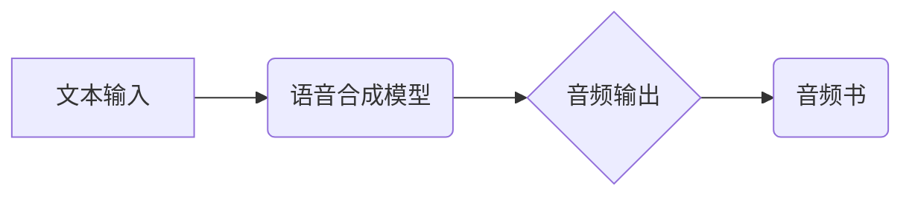

                 

## AI音频书：将文本转化为引人入胜的听觉体验

> 关键词：文本到语音、AI语音合成、音频书、自然语言处理、机器学习、声学建模、情感表达

### 1. 背景介绍

在数字时代，信息爆炸和碎片化阅读日益普遍。人们对获取知识和娱乐的方式也发生了改变，音频内容逐渐成为一种主流的消费方式。音频书作为一种沉浸式的阅读体验，凭借其便捷性和趣味性，在近年来获得了快速发展。然而，传统的音频书制作流程耗时费力，需要专业配音演员和后期制作团队，成本高昂，难以满足大众的需求。

人工智能技术的快速发展为音频书的制作带来了新的机遇。文本到语音（TTS，Text-to-Speech）技术能够将文本内容自动转化为语音，极大地降低了音频书制作的门槛。AI语音合成技术不断进步，生成的语音更加逼真自然，能够更好地还原文本的语调和情感，为听众带来更沉浸式的听觉体验。

### 2. 核心概念与联系

**2.1 核心概念**

* **文本到语音 (TTS)**：将文本信息转换为语音信号的技术。
* **AI语音合成**：利用人工智能算法，特别是深度学习技术，生成逼真自然的语音信号。
* **音频书**：以音频形式呈现的书籍，通常由专业配音演员朗读。

**2.2 架构关系**



**2.3 核心技术**

* **自然语言处理 (NLP)**：用于分析和理解文本结构、语义和情感。
* **机器学习 (ML)**：用于训练语音合成模型，使其能够将文本映射到语音信号。
* **声学建模**：用于模拟声波的产生和传播，生成逼真的语音信号。

### 3. 核心算法原理 & 具体操作步骤

**3.1 算法原理概述**

AI语音合成算法通常基于深度学习模型，例如循环神经网络 (RNN) 和变分自编码器 (VAE)。这些模型通过学习大量的文本和语音数据，建立文本到语音的映射关系。

**3.2 算法步骤详解**

1. **文本预处理**: 将文本输入转换为模型可理解的格式，例如将句子分割成单词，并进行词嵌入。
2. **语音特征提取**: 将文本序列编码为语音特征序列，例如梅尔频率倒谱系数 (MFCC)。
3. **语音合成**: 利用深度学习模型将文本特征序列映射到语音信号。
4. **语音后处理**: 对合成语音进行滤波、增强等处理，提高语音质量。

**3.3 算法优缺点**

* **优点**: 
    * 语音质量高，逼真自然。
    * 可定制化，可以根据需要调整语音风格和语调。
    * 自动化程度高，可以大幅降低音频书制作成本。
* **缺点**: 
    * 训练数据量大，需要大量的文本和语音数据进行训练。
    * 模型复杂度高，计算资源需求大。
    * 对于一些复杂的语境和情感表达，仍然存在一定的挑战。

**3.4 算法应用领域**

* **音频书制作**: 自动生成高质量的音频书。
* **语音助手**: 为智能语音助手提供自然流畅的语音输出。
* **教育培训**: 提供个性化的语音学习体验。
* **游戏开发**: 为游戏角色提供逼真的语音配音。

### 4. 数学模型和公式 & 详细讲解 & 举例说明

**4.1 数学模型构建**

AI语音合成模型通常采用循环神经网络 (RNN) 或变分自编码器 (VAE) 等深度学习模型。

* **RNN**: 循环神经网络能够处理序列数据，例如文本和语音。其核心结构是循环单元，能够记忆之前的信息，从而更好地理解文本语义。
* **VAE**: 变分自编码器是一种生成模型，能够学习数据的潜在表示。在语音合成中，VAE可以学习文本和语音之间的映射关系，并生成新的语音信号。

**4.2 公式推导过程**

由于篇幅限制，此处不再详细推导RNN和VAE的数学公式。

**4.3 案例分析与讲解**

例如，Tacotron 2 是一个基于RNN的AI语音合成模型，它能够生成高质量的语音。Tacotron 2模型由三个主要部分组成：

* **编码器**: 将文本序列编码为语音特征序列。
* **解码器**: 将语音特征序列解码为语音信号。
* **声码器**: 将语音信号转换为音频文件。

Tacotron 2模型通过训练大量的文本和语音数据，学习了文本和语音之间的映射关系。

### 5. 项目实践：代码实例和详细解释说明

**5.1 开发环境搭建**

* **操作系统**: Linux, macOS, Windows
* **编程语言**: Python
* **深度学习框架**: TensorFlow, PyTorch
* **语音合成库**: espeak, gTTS, pyttsx3

**5.2 源代码详细实现**

```python
import tensorflow as tf
from tensorflow.keras.models import Sequential
from tensorflow.keras.layers import Embedding, LSTM, Dense

# 建立模型
model = Sequential()
model.add(Embedding(input_dim=vocab_size, output_dim=embedding_dim))
model.add(LSTM(units=hidden_units))
model.add(Dense(units=output_dim, activation='softmax'))

# 编译模型
model.compile(optimizer='adam', loss='categorical_crossentropy', metrics=['accuracy'])

# 训练模型
model.fit(x_train, y_train, epochs=epochs, batch_size=batch_size)

# 生成语音
text = "Hello, world!"
predicted_sequence = model.predict(text)
# 使用声码器将预测序列转换为语音
voice_output = vocoder.synthesize(predicted_sequence)
```

**5.3 代码解读与分析**

* **Embedding层**: 将文本单词转换为稠密的向量表示。
* **LSTM层**: 处理文本序列，学习文本语义。
* **Dense层**: 将LSTM输出映射到语音特征。
* **声码器**: 将语音特征转换为音频文件。

**5.4 运行结果展示**

运行代码后，将生成一个名为“hello_world.wav”的音频文件，包含“Hello, world!”的语音内容。

### 6. 实际应用场景

**6.1 教育培训**

* **个性化学习**: AI语音合成可以根据学生的学习进度和需求，生成个性化的语音学习内容。
* **语言学习**: 可以利用AI语音合成技术，生成不同语言的语音朗读，帮助学生学习外语。

**6.2 娱乐休闲**

* **音频书**: AI语音合成可以自动生成高质量的音频书，满足大众对音频内容的需求。
* **游戏**: 可以为游戏角色提供逼真的语音配音，提升游戏体验。

**6.3 商业应用**

* **语音助手**: AI语音合成是语音助手的重要组成部分，可以提供自然流畅的语音交互体验。
* **客服机器人**: 可以利用AI语音合成技术，为客户提供语音客服服务。

**6.4 未来应用展望**

* **更逼真的语音合成**: 未来AI语音合成技术将更加逼真自然，能够更好地还原人类语音的各种细节。
* **更个性化的语音风格**: 用户将能够定制自己的语音风格，例如语速、语调、声线等。
* **多模态交互**: AI语音合成将与其他技术，例如图像识别和自然语言理解，结合起来，实现更丰富的多模态交互体验。

### 7. 工具和资源推荐

**7.1 学习资源推荐**

* **书籍**:
    * 《Speech and Language Processing》 by Jurafsky and Martin
    * 《Deep Learning》 by Goodfellow, Bengio, and Courville
* **在线课程**:
    * Coursera: Natural Language Processing Specialization
    * Udacity: Deep Learning Nanodegree

**7.2 开发工具推荐**

* **深度学习框架**: TensorFlow, PyTorch
* **语音合成库**: espeak, gTTS, pyttsx3
* **声码器**: Tacotron 2, WaveNet

**7.3 相关论文推荐**

* Tacotron 2: Generating Speech with Transformer Networks
* WaveNet: A Generative Model for Raw Audio

### 8. 总结：未来发展趋势与挑战

**8.1 研究成果总结**

AI语音合成技术近年来取得了显著进展，能够生成逼真自然的语音，并应用于多个领域。

**8.2 未来发展趋势**

* **更逼真的语音合成**: 通过更先进的深度学习模型和声学建模技术，生成更加逼真自然的语音。
* **更个性化的语音风格**: 用户能够定制自己的语音风格，例如语速、语调、声线等。
* **多模态交互**: AI语音合成将与其他技术，例如图像识别和自然语言理解，结合起来，实现更丰富的多模态交互体验。

**8.3 面临的挑战**

* **数据获取**: 训练高质量的AI语音合成模型需要大量的文本和语音数据，数据获取仍然是一个挑战。
* **模型复杂度**: AI语音合成模型通常非常复杂，计算资源需求大，需要更高效的训练算法和硬件支持。
* **情感表达**: 对于一些复杂的语境和情感表达，AI语音合成仍然存在一定的挑战。

**8.4 研究展望**

未来，AI语音合成技术将继续发展，并应用于更多领域。例如，可以用于辅助听障人士，提供更便捷的沟通方式；可以用于虚拟现实和增强现实技术，创造更沉浸式的体验；可以用于医疗保健领域，提供个性化的语音治疗等。


### 9. 附录：常见问题与解答

**9.1 如何选择合适的AI语音合成模型？**

选择合适的AI语音合成模型需要考虑以下因素：

* **语音质量**: 不同的模型具有不同的语音质量，需要根据实际应用场景选择。
* **个性化程度**: 一些模型支持个性化语音风格定制，需要根据需求选择。
* **计算资源**: 不同的模型计算资源需求不同，需要根据硬件条件选择。

**9.2 如何训练自己的AI语音合成模型？**

训练自己的AI语音合成模型需要以下步骤：

* **数据准备**: 收集大量的文本和语音数据。
* **模型选择**: 选择合适的深度学习模型。
* **模型训练**: 使用训练数据训练模型。
* **模型评估**: 使用测试数据评估模型性能。
* **模型部署**: 将训练好的模型部署到实际应用场景。


作者：禅与计算机程序设计艺术 / Zen and the Art of Computer Programming 
<end_of_turn>

