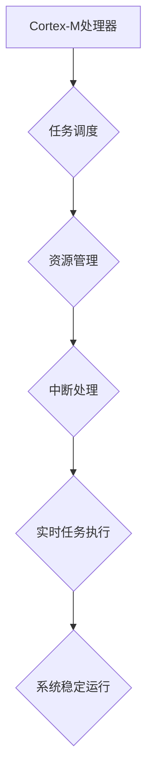

                 

## ARM Cortex-M系列：嵌入式实时系统开发

> 关键词：ARM Cortex-M, 嵌入式系统, 实时操作系统,  MCU,  C/C++,  RTOS,  中断处理,  定时器

## 1. 背景介绍

嵌入式系统是现代社会不可或缺的一部分，它广泛应用于消费电子、工业控制、医疗设备、汽车电子等领域。随着技术的不断发展，对嵌入式系统的性能、功耗和可靠性要求越来越高。ARM Cortex-M系列处理器凭借其低功耗、高性能、丰富的 peripherals 和成熟的生态系统，成为嵌入式系统开发的首选之一。

ARM Cortex-M系列处理器由ARM公司设计，专为嵌入式应用而优化。它采用RISC指令集架构，具有32位宽的指令集和寄存器，支持多种内存访问模式，并提供丰富的 peripherals，例如定时器、ADC、DAC、UART、SPI、I2C等。

Cortex-M系列处理器分为多个型号，例如Cortex-M0、Cortex-M3、Cortex-M4、Cortex-M7等，每个型号的性能、功耗和功能有所不同。开发者可以根据项目的具体需求选择合适的型号。

## 2. 核心概念与联系

### 2.1  ARM Cortex-M架构

ARM Cortex-M架构的核心是CPU内核，它负责执行程序指令。Cortex-M内核采用流水线结构，可以同时执行多个指令，提高执行效率。

Cortex-M内核还包含一些重要的部件，例如：

* **程序计数器(PC)**：存储当前正在执行的指令地址。
* **指令寄存器(IR)**：存储当前正在执行的指令。
* **数据寄存器(R0-R15)**：用于存储程序运行过程中需要访问的数据。
* **状态寄存器(CPSR)**：存储CPU的运行状态信息，例如中断状态、异常状态等。

### 2.2  嵌入式实时系统

嵌入式实时系统是指在特定时间内完成特定任务的系统。实时系统对时间响应的要求非常高，任何延迟都可能导致系统崩溃或功能失效。

嵌入式实时系统通常由以下几个部分组成：

* **处理器**: 负责执行程序指令。
* **内存**: 存储程序代码和数据。
* ** peripherals**: 提供与外部设备的接口。
* **实时操作系统(RTOS)**: 管理系统资源，调度任务，处理中断。

### 2.3  Cortex-M与RTOS

Cortex-M处理器与RTOS的结合是构建嵌入式实时系统的关键。RTOS可以帮助开发者管理系统资源，调度任务，处理中断，提高系统的可靠性和实时性。

**Mermaid 流程图**



## 3. 核心算法原理 & 具体操作步骤

### 3.1  算法原理概述

在嵌入式实时系统中，许多算法都是为了提高系统性能、降低功耗或实现特定功能而设计的。例如，任务调度算法用于分配处理器时间片，确保所有任务都能得到执行；中断处理算法用于快速响应外部事件，保证系统及时处理中断请求；定时器算法用于精确控制时间，实现定时任务的执行。

### 3.2  算法步骤详解

具体算法的步骤详解取决于具体的算法类型。例如，优先级调度算法的步骤如下：

1.  **任务入队**: 当一个任务需要执行时，它会被加入到任务队列中。
2.  **任务排序**: 任务队列按照任务优先级进行排序，优先级高的任务排在前面。
3.  **任务调度**: 处理器从任务队列中取出优先级最高的任务，并执行该任务。
4.  **任务完成**: 当任务执行完成时，它会被从任务队列中移除。

### 3.3  算法优缺点

不同的算法有不同的优缺点。例如，优先级调度算法简单易实现，但可能导致高优先级任务占用过多处理器时间，低优先级任务无法及时执行。

### 3.4  算法应用领域

嵌入式实时系统中的算法广泛应用于各个领域，例如：

* **工业控制**: 控制电机、传感器、执行器等设备，实现自动化生产。
* **医疗设备**: 监测患者生命体征、控制医疗设备，辅助医生诊断和治疗。
* **汽车电子**: 控制汽车发动机、安全系统、娱乐系统等，提高汽车的安全性、舒适性和智能化程度。

## 4. 数学模型和公式 & 详细讲解 & 举例说明

### 4.1  数学模型构建

在嵌入式实时系统中，许多算法可以用数学模型来描述。例如，任务调度算法可以用队列理论来建模，中断处理算法可以用概率论来建模。

### 4.2  公式推导过程

具体的公式推导过程取决于具体的算法和模型。例如，任务调度算法的吞吐量可以根据任务执行时间和调度算法的特性来推导。

### 4.3  案例分析与讲解

通过分析实际案例，可以更好地理解算法的原理和应用。例如，可以分析一个工业控制系统的任务调度算法，了解如何根据任务优先级和执行时间分配处理器时间片，保证系统稳定运行。

## 5. 项目实践：代码实例和详细解释说明

### 5.1  开发环境搭建

开发嵌入式实时系统需要搭建相应的开发环境。常用的开发环境包括：

* **集成开发环境(IDE)**：例如Keil MDK、IAR Embedded Workbench、STM32CubeIDE等。
* **交叉编译器**: 用于将C/C++代码编译成目标平台可执行文件。
* **调试器**: 用于调试程序，查看程序运行状态和变量值。

### 5.2  源代码详细实现

具体的源代码实现取决于项目的具体需求。例如，一个简单的定时器中断程序的源代码如下：

```c
#include "stm32f10x.h"

void SysTick_Handler(void) {
  // 定时器中断处理函数
}

int main(void) {
  // 初始化SysTick定时器
  SysTick_Config(SystemCoreClock / 1000);

  // 进入无限循环
  while (1) {
  }
}
```

### 5.3  代码解读与分析

这段代码实现了简单的定时器中断程序。SysTick定时器是一个系统级定时器，可以精确控制时间。

`SysTick_Config()`函数用于配置SysTick定时器的频率和中断优先级。

`SysTick_Handler()`函数是定时器中断处理函数，每隔1毫秒会被执行一次。

`main()`函数初始化SysTick定时器，然后进入无限循环，等待定时器中断发生。

### 5.4  运行结果展示

运行这段程序后，定时器中断会每隔1毫秒触发一次，可以用来实现各种定时任务，例如：

* **LED闪烁**: 控制LED灯的闪烁频率。
* **数据采集**: 定时采集传感器数据。
* **电机控制**: 控制电机转速。

## 6. 实际应用场景

### 6.1  工业自动化

在工业自动化领域，Cortex-M系列处理器广泛应用于PLC、机器人控制器、驱动器等设备。

### 6.2  消费电子

在消费电子领域，Cortex-M系列处理器应用于智能手机、平板电脑、智能手表、智能家居设备等。

### 6.3  医疗设备

在医疗设备领域，Cortex-M系列处理器应用于心率监测仪、血糖仪、呼吸机等设备。

### 6.4  未来应用展望

随着技术的不断发展，Cortex-M系列处理器将在更多领域得到应用，例如：

* **物联网**: Cortex-M系列处理器可以作为物联网设备的核心处理器，实现数据采集、处理和传输。
* **人工智能**: Cortex-M系列处理器可以用于部署小型人工智能模型，实现边缘计算。
* **汽车电子**: Cortex-M系列处理器可以用于控制汽车的各种功能，例如自动驾驶、车联网等。

## 7. 工具和资源推荐

### 7.1  学习资源推荐

* **ARM官方网站**: https://www.arm.com/
* **Keil官方网站**: https://www.keil.com/
* **IAR官方网站**: https://www.iar.com/
* **STM32官方网站**: https://www.st.com/en/microcontrollers/stm32.html

### 7.2  开发工具推荐

* **Keil MDK**: 专业的嵌入式开发环境，支持多种ARM处理器。
* **IAR Embedded Workbench**: 另一个专业的嵌入式开发环境，支持多种ARM处理器。
* **STM32CubeIDE**: ST公司提供的免费嵌入式开发环境，专门针对STM32系列处理器。

### 7.3  相关论文推荐

* **ARM Cortex-M Architecture Reference Manual**: https://developer.arm.com/documentation/ddi0487/latest
* **Real-Time Operating Systems**: https://www.amazon.com/Real-Time-Operating-Systems-Principles-Implementation/dp/0132407534

## 8. 总结：未来发展趋势与挑战

### 8.1  研究成果总结

ARM Cortex-M系列处理器在嵌入式实时系统领域取得了巨大的成功，它为开发者提供了强大的硬件平台和丰富的软件生态系统。

### 8.2  未来发展趋势

未来，Cortex-M系列处理器将继续朝着以下方向发展：

* **更高性能**: 处理器性能将继续提升，支持更复杂的算法和应用。
* **更低功耗**: 处理器功耗将进一步降低，延长设备续航时间。
* **更丰富的功能**: 处理器将集成更多 peripherals，支持更广泛的应用场景。
* **更强大的安全特性**: 处理器将集成更强大的安全机制，保护系统和数据安全。

### 8.3  面临的挑战

Cortex-M系列处理器也面临一些挑战，例如：

* **功耗优化**: 随着处理器的性能提升，功耗控制也越来越重要。
* **安全保障**: 随着嵌入式系统的应用范围扩大，安全保障也越来越重要。
* **软件生态系统**: 随着应用场景的不断扩展，软件生态系统需要不断完善。

### 8.4  研究展望

未来，研究者将继续探索Cortex-M系列处理器的应用潜力，开发更先进的算法和技术，推动嵌入式实时系统的创新发展。

## 9. 附录：常见问题与解答

### 9.1  常见问题

* **如何选择合适的Cortex-M处理器型号？**

选择合适的Cortex-M处理器型号需要根据项目的具体需求，例如性能、功耗、功能等。

* **如何搭建嵌入式实时系统开发环境？**

搭建嵌入式实时系统开发环境需要安装IDE、交叉编译器和调试器等工具。

* **如何编写嵌入式实时系统程序？**

编写嵌入式实时系统程序需要熟悉C/C++语言、嵌入式系统开发流程和RTOS知识。

### 9.2  解答

* **如何选择合适的Cortex-M处理器型号？**

选择合适的Cortex-M处理器型号需要根据项目的具体需求，例如性能、功耗、功能等。

* **如何搭建嵌入式实时系统开发环境？**

搭建嵌入式实时系统开发环境需要安装IDE、交叉编译器和调试器等工具。

* **如何编写嵌入式实时系统程序？**

编写嵌入式实时系统程序需要熟悉C/C++语言、嵌入式系统开发流程和RTOS知识。


作者：禅与计算机程序设计艺术 / Zen and the Art of Computer Programming 
<end_of_turn>

