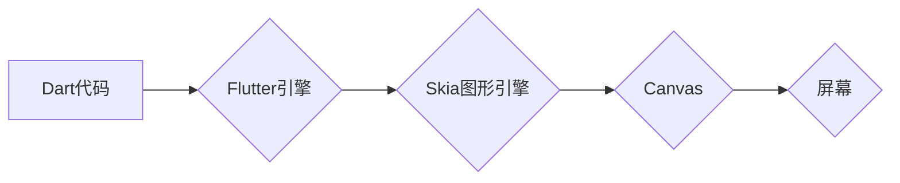

                 

## Flutter：Google的UI工具包for移动开发

> 关键词：Flutter, Dart, UI, 移动开发, 跨平台, hot reload, widget, Google

## 1. 背景介绍

移动互联网的蓬勃发展催生了对高效、便捷的跨平台移动应用开发的需求。传统的原生开发模式，需要分别使用Java/Kotlin（Android）和Swift/Objective-C（iOS）进行开发，不仅开发周期长，成本也高昂。为了解决这一痛点，Google于2015年推出了Flutter，一个基于Dart语言的跨平台UI工具包，旨在提供一种快速、高效、高质量的移动应用开发解决方案。

Flutter凭借其独特的渲染机制、丰富的组件库和强大的开发工具，迅速在移动开发领域崭露头角，并逐渐成为业界主流的跨平台开发框架之一。

## 2. 核心概念与联系

Flutter的核心概念是“Widget”，它是一个构建用户界面（UI）的基本单元。每个Widget都是一个可渲染的元素，可以是文本、图片、按钮、布局容器等。Flutter的UI渲染机制基于“Canvas”和“Skia”图形引擎，它将Widget树转换为可绘制的图形，并直接绘制到屏幕上，从而实现高性能、流畅的用户体验。

Flutter的架构可以概括为以下几个层次：



**Flutter引擎**负责将Dart代码转换为可执行的指令，并管理Widget树的构建和渲染。**Skia图形引擎**负责将Widget树转换为可绘制的图形，并负责图形的绘制和渲染。**Canvas**是图形绘制的抽象层，它提供了一系列绘图API，用于绘制各种图形元素。最终，绘制好的图形会被渲染到**屏幕**上，呈现给用户。

## 3. 核心算法原理 & 具体操作步骤

### 3.1  算法原理概述

Flutter的核心算法原理是基于“Widget树”的渲染机制。它将UI界面抽象成一棵树状结构，每个节点代表一个Widget。Flutter引擎会遍历这棵树，将每个Widget转换为可绘制的图形，并将其绘制到屏幕上。

Flutter的渲染机制采用“Diffing算法”，它通过比较上一帧和当前帧的Widget树，找出差异并只渲染变化的部分，从而提高渲染效率。

### 3.2  算法步骤详解

1. **构建Widget树:** 开发者使用Dart语言编写代码，构建UI界面所需的Widget树。
2. **Widget树解析:** Flutter引擎解析Widget树，并将其转换为可执行的指令。
3. **布局计算:** Flutter引擎计算每个Widget的布局信息，确定其在屏幕上的位置和大小。
4. **绘制图形:** Flutter引擎将Widget树转换为可绘制的图形，并将其绘制到Canvas上。
5. **渲染到屏幕:** Canvas将绘制好的图形渲染到屏幕上，呈现给用户。

### 3.3  算法优缺点

**优点:**

* 高性能：Flutter的渲染机制直接绘制图形到屏幕，避免了中间层级的转换，从而提高了渲染效率。
* 跨平台：Flutter可以用于开发Android、iOS、Web、桌面等平台的应用，节省了开发成本和时间。
* 热重载：Flutter支持热重载功能，开发者可以实时看到代码修改的效果，提高开发效率。
* 丰富的组件库：Flutter提供了丰富的组件库，开发者可以快速构建高质量的UI界面。

**缺点:**

* Dart语言学习曲线：Dart语言相对较新，对于一些开发者来说，学习曲线可能比较陡峭。
* 应用体积较大：Flutter应用的体积相对较大，这可能会影响到用户的下载和安装体验。

### 3.4  算法应用领域

Flutter的跨平台特性和高性能特性使其在以下领域得到了广泛应用：

* 移动应用开发：Flutter可以用于开发各种类型的移动应用，例如社交应用、电商应用、游戏应用等。
* Web应用开发：Flutter可以用于开发Web应用，并提供与移动应用类似的用户体验。
* 桌面应用开发：Flutter可以用于开发桌面应用，例如Windows、macOS、Linux等平台的应用。

## 4. 数学模型和公式 & 详细讲解 & 举例说明

Flutter的渲染机制涉及到一些数学模型和公式，例如坐标变换、布局算法、图形绘制等。

### 4.1  数学模型构建

Flutter的坐标系与屏幕坐标系一致，原点位于屏幕左上角。每个Widget都有一个位置和大小属性，这些属性用坐标和尺寸来表示。

### 4.2  公式推导过程

Flutter的布局算法基于“Box布局”模型，它将Widget排列成一排或一列，并根据其大小和位置属性进行布局。

**公式:**

* **宽度:** `width = widget.width`
* **高度:** `height = widget.height`
* **左上角坐标:** `x = widget.x` , `y = widget.y`

**举例说明:**

假设有一个Widget，其宽度为100像素，高度为50像素，左上角坐标为(10, 10)。那么，该Widget的布局信息可以表示为：

* 宽度: 100像素
* 高度: 50像素
* 左上角坐标: (10, 10)

### 4.3  案例分析与讲解

Flutter的布局算法支持多种布局模式，例如水平布局、垂直布局、网格布局等。开发者可以根据实际需求选择合适的布局模式，并通过调整Widget的属性来控制其布局效果。

## 5. 项目实践：代码实例和详细解释说明

### 5.1  开发环境搭建

为了使用Flutter开发应用，需要先搭建开发环境。

1. 下载并安装Flutter SDK：https://docs.flutter.dev/get-started/install
2. 安装Android Studio或VS Code等支持Flutter开发的IDE。
3. 配置Flutter环境变量。

### 5.2  源代码详细实现

以下是一个简单的Flutter应用代码示例，展示了如何使用Widget构建一个简单的界面：

```dart
import 'package:flutter/material.dart';

void main() {
  runApp(MyApp());
}

class MyApp extends StatelessWidget {
  @override
  Widget build(BuildContext context) {
    return MaterialApp(
      home: Scaffold(
        appBar: AppBar(
          title: Text('Flutter Demo'),
        ),
        body: Center(
          child: Text('Hello World!'),
        ),
      ),
    );
  }
}
```

**代码解读:**

* `runApp()`函数是Flutter应用的入口点，它启动了Flutter应用的渲染循环。
* `MyApp`是一个StatelessWidget，它定义了应用的根Widget。
* `MaterialApp`是一个Material Design风格的应用框架。
* `Scaffold`是一个基本的应用布局结构，它包含了应用的AppBar、body等部分。
* `AppBar`是一个应用的标题栏。
* `Center`是一个布局容器，它将其子Widget居中显示。
* `Text`是一个文本Widget，它显示了“Hello World!”的文本。

### 5.3  代码解读与分析

这段代码展示了Flutter的基本语法和Widget的使用方式。

* Flutter应用的构建基于Widget树，每个Widget都是一个可渲染的元素。
* Flutter提供了丰富的Widget类型，可以用于构建各种类型的UI界面。
* Flutter的布局机制基于“Box布局”模型，开发者可以根据实际需求选择合适的布局模式。

### 5.4  运行结果展示

运行这段代码后，会弹出一个简单的Flutter应用窗口，显示“Hello World!”的文本。

## 6. 实际应用场景

Flutter在移动应用开发领域得到了广泛的应用，例如：

* **社交应用:** 

例如，阿里巴巴旗下的社交应用“支付宝”就采用了Flutter技术进行开发，实现了跨平台的应用体验。

* **电商应用:** 

例如，京东商城也采用了Flutter技术进行开发，提高了应用的性能和用户体验。

* **游戏应用:** 

Flutter的渲染性能和跨平台特性使其也成为游戏开发的热门选择。例如，一些独立游戏开发商使用Flutter开发了高质量的游戏应用。

### 6.4  未来应用展望

随着Flutter技术的不断发展，其应用场景将会更加广泛。例如，Flutter可以用于开发物联网设备的UI界面、虚拟现实和增强现实应用等。

## 7. 工具和资源推荐

### 7.1  学习资源推荐

* **Flutter官方文档:** https://docs.flutter.dev/
* **Flutter中文社区:** https://flutterchina.club/
* **Flutter YouTube频道:** https://www.youtube.com/c/FlutterDev

### 7.2  开发工具推荐

* **Android Studio:** https://developer.android.com/studio
* **VS Code:** https://code.visualstudio.com/

### 7.3  相关论文推荐

* **Flutter: A Framework for Building Native-Like Mobile Apps with a Single Codebase:** https://arxiv.org/abs/1803.08143

## 8. 总结：未来发展趋势与挑战

### 8.1  研究成果总结

Flutter作为Google推出的跨平台UI工具包，在移动应用开发领域取得了显著的成果。其高性能、跨平台特性、热重载功能和丰富的组件库使其成为业界主流的开发框架之一。

### 8.2  未来发展趋势

Flutter的未来发展趋势包括：

* **性能优化:** Flutter团队将继续致力于提升Flutter的性能，使其能够支持更加复杂的应用场景。
* **生态系统完善:** Flutter的生态系统将会不断完善，提供更多丰富的组件库、插件和工具，方便开发者快速开发高质量的应用。
* **新平台支持:** Flutter将支持更多新平台，例如Web、桌面等，使其成为一个真正的跨平台开发框架。

### 8.3  面临的挑战

Flutter也面临一些挑战，例如：

* **Dart语言学习曲线:** Dart语言相对较新，对于一些开发者来说，学习曲线可能比较陡峭。
* **应用体积较大:** Flutter应用的体积相对较大，这可能会影响到用户的下载和安装体验。

### 8.4  研究展望

未来，Flutter将会继续发展壮大，成为移动应用开发领域的主流框架之一。开发者可以关注Flutter的最新技术动态，并积极参与到Flutter社区中，共同推动Flutter的发展。

## 9. 附录：常见问题与解答

**常见问题:**

* **Flutter的学习难度如何？**

Flutter的学习难度适中，对于熟悉Java/Kotlin或Swift/Objective-C的开发者来说，学习Flutter相对容易。Flutter官方提供了丰富的学习资源，例如官方文档、教程、社区论坛等，可以帮助开发者快速入门。

* **Flutter的应用体积较大吗？**

Flutter应用的体积相对较大，这是因为Flutter需要包含Dart运行时环境和其他必要的库文件。但是，Flutter团队一直在致力于优化Flutter的体积，并提供一些工具和技巧，可以帮助开发者减小应用体积。

* **Flutter的性能如何？**

Flutter的性能非常出色，因为它采用直接绘制图形到屏幕的渲染机制，避免了中间层级的转换，从而提高了渲染效率。

**作者：禅与计算机程序设计艺术 / Zen and the Art of Computer Programming**<end_of_turn>

