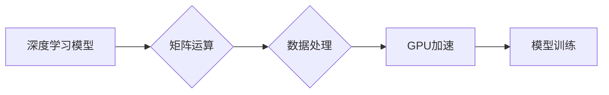

                 

## GPU 加速计算：加速深度学习

> 关键词：GPU、深度学习、并行计算、CUDA、TensorFlow、PyTorch

## 1. 背景介绍

深度学习近年来在计算机视觉、自然语言处理、语音识别等领域取得了突破性进展，其强大的学习能力和泛化能力使其成为人工智能领域的核心技术之一。然而，深度学习模型的训练过程通常需要处理海量数据，并进行大量的计算，这给传统的CPU计算带来了巨大的挑战。

为了解决这一问题，GPU（图形处理单元）凭借其强大的并行计算能力，逐渐成为深度学习训练的理想平台。GPU最初设计用于处理图形渲染，拥有大量的并行计算核心，能够高效地处理大量数据并行计算任务。

## 2. 核心概念与联系

### 2.1  CPU 与 GPU 的区别

* **CPU（中央处理器）**： 
    * 核心数少，但每个核心处理能力强，擅长处理顺序性任务。
    * 缓存容量大，数据访问速度快。
    * 功耗较高。
* **GPU（图形处理单元）**：
    * 核心数多，但每个核心处理能力相对较弱，擅长处理并行性任务。
    * 缓存容量小，数据访问速度相对较慢。
    * 功耗相对较低。

### 2.2  深度学习与 GPU 的结合

深度学习模型的训练过程本质上是一个大量的矩阵运算和数据处理的过程，这与GPU的并行计算能力非常契合。

**Mermaid 流程图**



## 3. 核心算法原理 & 具体操作步骤

### 3.1  算法原理概述

深度学习算法的核心是神经网络，它由多个层级的神经元组成，每个神经元接收输入信号，并通过激活函数进行处理，最终输出信号。

深度学习算法通过训练神经网络，学习数据之间的映射关系，从而实现对数据的预测、分类、识别等任务。

### 3.2  算法步骤详解

1. **数据预处理**: 将原始数据转换为深度学习模型可以理解的格式，例如归一化、编码等。
2. **模型构建**: 根据任务需求，选择合适的深度学习模型架构，并定义模型参数。
3. **模型训练**: 使用训练数据，通过反向传播算法，调整模型参数，使模型的预测结果与真实值尽可能接近。
4. **模型评估**: 使用测试数据，评估模型的性能，例如准确率、召回率等。
5. **模型部署**: 将训练好的模型部署到实际应用场景中，用于预测、分类、识别等任务。

### 3.3  算法优缺点

**优点**:

* 强大的学习能力，能够学习复杂的数据关系。
* 泛化能力强，能够对未知数据进行预测。
* 应用领域广泛，涵盖图像识别、自然语言处理、语音识别等多个领域。

**缺点**:

* 训练过程耗时和耗能，需要大量的计算资源。
* 对数据质量要求高，训练数据必须足够大且高质量。
* 模型解释性差，难以理解模型的决策过程。

### 3.4  算法应用领域

* **计算机视觉**: 图像识别、物体检测、图像分割、人脸识别等。
* **自然语言处理**: 文本分类、情感分析、机器翻译、文本生成等。
* **语音识别**: 语音转文本、语音助手等。
* **医疗诊断**: 病理图像分析、疾病预测等。
* **金融分析**: 风险评估、欺诈检测等。

## 4. 数学模型和公式 & 详细讲解 & 举例说明

### 4.1  数学模型构建

深度学习模型的核心是神经网络，它可以看作是一个多层感知机。每个神经元接收多个输入信号，并通过加权求和和激活函数进行处理，最终输出一个信号。

**神经网络模型**

```
y = f(W * x + b)
```

其中：

*  y：输出信号
*  x：输入信号
*  W：权重矩阵
*  b：偏置向量
*  f：激活函数

### 4.2  公式推导过程

深度学习模型的训练过程是通过反向传播算法来调整模型参数（权重和偏置）的。

反向传播算法的核心思想是：

1. 计算模型输出与真实值的误差。
2. 根据误差反向传播，计算每个参数的梯度。
3. 使用梯度下降算法，更新每个参数的值。

**梯度下降算法**

```
W = W - lr * ∇W
b = b - lr * ∇b
```

其中：

* lr：学习率
* ∇W：权重参数的梯度
* ∇b：偏置参数的梯度

### 4.3  案例分析与讲解

例如，在图像分类任务中，深度学习模型会将图像输入到神经网络中，经过多个层级的处理，最终输出每个类别的概率。

训练过程中，模型会根据图像标签和输出概率的误差，调整权重和偏置，使模型能够更好地预测图像类别。

## 5. 项目实践：代码实例和详细解释说明

### 5.1  开发环境搭建

* **操作系统**: Linux 或 Windows
* **CUDA Toolkit**: 用于开发GPU加速应用程序
* **Deep Learning Framework**: TensorFlow 或 PyTorch

### 5.2  源代码详细实现

```python
import tensorflow as tf

# 定义模型
model = tf.keras.models.Sequential([
  tf.keras.layers.Conv2D(32, (3, 3), activation='relu', input_shape=(28, 28, 1)),
  tf.keras.layers.MaxPooling2D((2, 2)),
  tf.keras.layers.Conv2D(64, (3, 3), activation='relu'),
  tf.keras.layers.MaxPooling2D((2, 2)),
  tf.keras.layers.Flatten(),
  tf.keras.layers.Dense(10, activation='softmax')
])

# 编译模型
model.compile(optimizer='adam',
              loss='sparse_categorical_crossentropy',
              metrics=['accuracy'])

# 训练模型
model.fit(x_train, y_train, epochs=5)
```

### 5.3  代码解读与分析

* **模型定义**: 使用 TensorFlow 的 Keras API 定义了一个简单的卷积神经网络模型，用于 MNIST 手写数字识别任务。
* **模型编译**: 使用 Adam 优化器、交叉熵损失函数和准确率指标编译模型。
* **模型训练**: 使用训练数据训练模型，训练 epochs=5 次。

### 5.4  运行结果展示

训练完成后，可以使用测试数据评估模型的性能。

## 6. 实际应用场景

* **图像识别**: 自动驾驶、人脸识别、物体检测等。
* **自然语言处理**: 机器翻译、文本摘要、聊天机器人等。
* **语音识别**: 语音助手、语音搜索等。
* **医疗诊断**: 病理图像分析、疾病预测等。
* **金融分析**: 风险评估、欺诈检测等。

### 6.4  未来应用展望

* **更强大的模型**: 研究更深、更复杂的深度学习模型，提高模型的性能和泛化能力。
* **更广泛的应用**: 将深度学习应用到更多领域，例如科学研究、教育、娱乐等。
* **更智能的系统**: 开发能够自主学习和决策的智能系统，例如自动驾驶汽车、医疗诊断系统等。

## 7. 工具和资源推荐

### 7.1  学习资源推荐

* **书籍**:
    * 深度学习
    * 深度学习实战
    * 
* **在线课程**:
    * Coursera 深度学习课程
    * Udacity 深度学习课程
    * fast.ai 深度学习课程

### 7.2  开发工具推荐

* **TensorFlow**: Google 开发的开源深度学习框架。
* **PyTorch**: Facebook 开发的开源深度学习框架。
* **Keras**: TensorFlow 的高层API，简化深度学习模型的构建。

### 7.3  相关论文推荐

* **ImageNet Classification with Deep Convolutional Neural Networks**
* **Deep Residual Learning for Image Recognition**
* **Attention Is All You Need**

## 8. 总结：未来发展趋势与挑战

### 8.1  研究成果总结

深度学习在过去几年取得了显著进展，在多个领域取得了突破性成果。

### 8.2  未来发展趋势

* **模型规模和复杂度**: 研究更深、更复杂的深度学习模型，提高模型的性能和泛化能力。
* **数据效率**: 研究更有效的训练方法，降低模型对训练数据的依赖。
* **可解释性**: 研究更可解释的深度学习模型，提高模型的透明度和可信度。

### 8.3  面临的挑战

* **计算资源**: 训练大型深度学习模型需要大量的计算资源，这对于资源有限的机构和个人来说是一个挑战。
* **数据隐私**: 深度学习模型的训练需要大量数据，如何保护数据隐私是一个重要的挑战。
* **伦理问题**: 深度学习模型的应用可能会带来一些伦理问题，例如算法偏见、就业影响等，需要引起重视。

### 8.4  研究展望

未来，深度学习研究将继续朝着更强大、更智能、更安全的方向发展。

## 9. 附录：常见问题与解答

* **什么是GPU加速？**

GPU加速是指利用GPU的并行计算能力，加速深度学习模型的训练和推理过程。

* **为什么深度学习需要GPU加速？**

深度学习模型的训练过程需要大量的矩阵运算和数据处理，这与GPU的并行计算能力非常契合。

* **如何使用GPU加速深度学习？**

可以使用CUDA Toolkit 和深度学习框架（例如 TensorFlow 或 PyTorch）来开发GPU加速的深度学习应用程序。


作者：禅与计算机程序设计艺术 / Zen and the Art of Computer Programming 
<end_of_turn>

