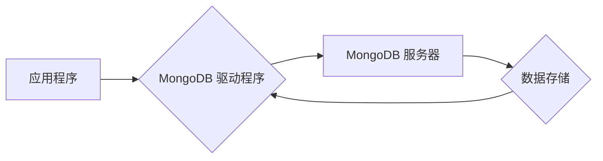

                 

## MongoDB 和数据库管理：存储和检索数据

> 关键词：MongoDB, NoSQL, 数据库管理, 文档数据库, 数据存储, 数据检索, JSON, 应用程序开发

## 1. 背景介绍

在当今数据爆炸的时代，高效地存储和检索数据至关重要。传统的关系型数据库 (RDBMS) 虽然功能强大，但对于处理海量非结构化数据和快速变化的应用程序需求来说，存在一定的局限性。为了应对这些挑战，NoSQL 数据库应运而生，其中 MongoDB 作为一种流行的文档型数据库，凭借其灵活性和高性能，在各种应用场景中得到了广泛应用。

MongoDB 的出现，为应用程序开发提供了新的选择，它打破了传统关系型数据库的模式，采用灵活的文档结构，能够轻松处理各种类型的数据，例如 JSON 格式的数据。这使得 MongoDB 成为许多现代应用程序的首选数据库，尤其是在需要快速迭代、处理海量数据和支持多种数据模型的场景下。

## 2. 核心概念与联系

### 2.1  MongoDB 简介

MongoDB 是一个开源的、分布式、文档型数据库。它使用 JSON-like 的文档作为数据单位，而不是关系型数据库中的表和行。MongoDB 的核心概念包括：

* **文档:** MongoDB 的基本数据单位，类似于 JSON 对象，包含键值对。
* **集合:**  类似于关系型数据库中的表，包含多个文档。
* **数据库:**  包含多个集合，类似于关系型数据库中的数据库。

### 2.2  MongoDB 架构

MongoDB 的架构基于分布式设计，可以水平扩展以处理海量数据。其主要组件包括：

* **MongoDB 服务器:**  负责存储和管理数据。
* **MongoDB 驱动程序:**  用于应用程序与 MongoDB 服务器进行通信。
* **MongoDB Shell:**  MongoDB 的命令行工具，用于管理数据库和执行查询。

**MongoDB 架构流程图:**



### 2.3  MongoDB 的优势

* **灵活的数据模型:**  MongoDB 支持 JSON-like 的文档，可以轻松处理各种类型的数据，包括结构化数据、半结构化数据和非结构化数据。
* **高性能:**  MongoDB 使用内存映射技术和索引优化，能够提供高吞吐量和低延迟的读写性能。
* **可扩展性:**  MongoDB 可以水平扩展，通过添加更多服务器来增加存储容量和处理能力。
* **易于使用:**  MongoDB 的 API 简单易用，并且提供了丰富的文档和社区支持。

## 3. 核心算法原理 & 具体操作步骤

### 3.1  算法原理概述

MongoDB 使用 B-树索引来加速数据检索。B-树是一种自平衡的树形数据结构，可以高效地查找、插入和删除数据。

### 3.2  算法步骤详解

1. **数据插入:** 当插入新的文档时，MongoDB 会将文档存储在相应的集合中，并根据文档中的键值创建索引。
2. **数据查询:** 当执行查询时，MongoDB 会首先使用索引查找匹配的文档。如果索引存在，MongoDB 会直接访问匹配的文档，无需扫描整个集合。
3. **数据更新:** 当更新文档时，MongoDB 会首先使用索引查找匹配的文档，然后更新文档内容。
4. **数据删除:** 当删除文档时，MongoDB 会首先使用索引查找匹配的文档，然后删除文档。

### 3.3  算法优缺点

**优点:**

* **高效的查找:** B-树索引可以快速查找匹配的文档。
* **自平衡:** B-树是一种自平衡的数据结构，可以避免数据倾斜问题。
* **可扩展性:** B-树可以扩展到处理海量数据。

**缺点:**

* **索引维护成本:** 创建和维护索引需要消耗一定的资源。
* **更新成本:** 更新索引需要一定的成本，尤其是在更新大量数据时。

### 3.4  算法应用领域

B-树索引广泛应用于数据库系统、文件系统和搜索引擎等领域，用于加速数据检索和查询。

## 4. 数学模型和公式 & 详细讲解 & 举例说明

### 4.1  数学模型构建

B-树的数学模型可以描述其结构和操作方式。

* **节点:** B-树的节点可以看作是树形结构中的一个元素，每个节点包含多个键值对和指向子节点的指针。
* **键值对:** 每个节点中的键值对用于存储数据，键值对的键用于查找数据，值用于存储数据本身。
* **子节点:** 每个节点可以指向多个子节点，子节点包含更细粒度的键值对。

### 4.2  公式推导过程

B-树的插入、删除和查找操作都涉及到对节点和键值对的调整。这些操作的具体实现需要使用一些数学公式和算法，例如：

* **节点分裂:** 当节点中的键值对数量超过最大限制时，需要将节点分裂成两个节点。
* **节点合并:** 当节点中的键值对数量少于最小限制时，需要将节点合并成一个节点。

### 4.3  案例分析与讲解

假设我们有一个 B-树，其每个节点最多可以包含 5 个键值对。当插入一个新的键值对时，如果插入的节点中的键值对数量超过 5 个，则需要进行节点分裂操作。

节点分裂操作的步骤如下：

1. 将节点中的键值对按照键值大小排序。
2. 将中间键值对移到父节点中。
3. 将节点分成两个子节点，每个子节点包含 2-3 个键值对。

## 5. 项目实践：代码实例和详细解释说明

### 5.1  开发环境搭建

为了使用 MongoDB，需要先搭建开发环境。

* **安装 MongoDB:**  从 MongoDB 官方网站下载并安装 MongoDB 服务器。
* **安装 MongoDB 驱动程序:**  根据应用程序的语言选择相应的 MongoDB 驱动程序。

### 5.2  源代码详细实现

以下是一个使用 Python 和 PyMongo 库连接 MongoDB 并插入文档的代码示例：

```python
from pymongo import MongoClient

# 连接到 MongoDB 服务器
client = MongoClient("mongodb://localhost:27017/")

# 选择数据库
db = client["mydatabase"]

# 选择集合
collection = db["mycollection"]

# 插入文档
document = {"name": "John Doe", "age": 30, "city": "New York"}
collection.insert_one(document)

# 关闭连接
client.close()
```

### 5.3  代码解读与分析

* **`MongoClient("mongodb://localhost:27017/")`:**  连接到本地 MongoDB 服务器，端口号为 27017。
* **`db = client["mydatabase"]`:**  选择名为 "mydatabase" 的数据库。
* **`collection = db["mycollection"]`:**  选择名为 "mycollection" 的集合。
* **`document = {"name": "John Doe", "age": 30, "city": "New York"}`:**  创建一个包含姓名、年龄和城市信息的文档。
* **`collection.insert_one(document)`:**  将文档插入到 "mycollection" 集合中。
* **`client.close()`:**  关闭 MongoDB 连接。

### 5.4  运行结果展示

运行上述代码后，将创建一个名为 "mydatabase" 的数据库，并创建一个名为 "mycollection" 的集合。在集合中插入一个名为 "John Doe" 的文档，包含姓名、年龄和城市信息。

## 6. 实际应用场景

MongoDB 的灵活性和高性能使其在各种实际应用场景中得到广泛应用，例如：

* **电商平台:**  存储商品信息、用户数据、订单数据等。
* **社交媒体:**  存储用户资料、帖子内容、评论数据等。
* **内容管理系统:**  存储文章、图片、视频等内容。
* **物联网:**  存储传感器数据、设备信息等。

### 6.4  未来应用展望

随着数据量的不断增长和应用程序需求的不断变化，MongoDB 将在未来继续发挥重要作用。

* **云原生应用:**  MongoDB 将与云原生平台和容器技术更好地集成，支持云计算和微服务架构。
* **人工智能:**  MongoDB 将与人工智能技术结合，用于存储和处理海量数据，支持机器学习和深度学习应用。
* **边缘计算:**  MongoDB 将扩展到边缘计算场景，支持在边缘设备上存储和处理数据。

## 7. 工具和资源推荐

### 7.1  学习资源推荐

* **MongoDB 官方文档:** https://docs.mongodb.com/
* **MongoDB University:** https://university.mongodb.com/
* **MongoDB Blog:** https://www.mongodb.com/blog

### 7.2  开发工具推荐

* **MongoDB Compass:** https://www.mongodb.com/products/compass
* **MongoDB Shell:** https://docs.mongodb.com/manual/reference/program/mongo/

### 7.3  相关论文推荐

* **MongoDB: A NoSQL Database for Modern Applications:** https://www.mongodb.com/whitepapers/mongodb-nosql-database-modern-applications
* **The Design and Implementation of MongoDB:** https://www.usenix.org/system/files/conference/osdi10/osdi10-paper-mckinney.pdf

## 8. 总结：未来发展趋势与挑战

### 8.1  研究成果总结

MongoDB 作为一种流行的 NoSQL 数据库，在存储和检索海量数据方面取得了显著的成果。其灵活的数据模型、高性能和可扩展性使其成为许多现代应用程序的首选数据库。

### 8.2  未来发展趋势

MongoDB 将继续朝着以下方向发展:

* **云原生化:**  更好地支持云计算和容器技术。
* **人工智能集成:**  与人工智能技术结合，支持机器学习和深度学习应用。
* **边缘计算:**  扩展到边缘计算场景，支持在边缘设备上存储和处理数据。

### 8.3  面临的挑战

MongoDB 也面临着一些挑战:

* **数据一致性:**  NoSQL 数据库通常牺牲部分数据一致性以换取高性能，这对于一些应用场景来说可能是一个问题。
* **数据安全性:**  NoSQL 数据库需要加强数据安全性，防止数据泄露和攻击。
* **生态系统发展:**  MongoDB 的生态系统还需要进一步发展，提供更多工具和资源支持。

### 8.4  研究展望

未来，MongoDB 的研究方向将包括:

* **提高数据一致性:**  探索新的数据一致性机制，提高 NoSQL 数据库的数据可靠性。
* **增强数据安全性:**  开发新的安全机制，保护 NoSQL 数据库的数据安全。
* **拓展应用场景:**  将 MongoDB 应用到更多新的领域，例如物联网、边缘计算和人工智能。

## 9. 附录：常见问题与解答

### 9.1  常见问题

* **MongoDB 和 MySQL 的区别是什么？**
* **如何连接到 MongoDB 服务器？**
* **如何插入、查询、更新和删除数据？**
* **MongoDB 的索引有什么作用？**

### 9.2  解答

* **MongoDB 和 MySQL 的区别:**  MongoDB 是一个 NoSQL 数据库，使用文档型数据模型，而 MySQL 是一个关系型数据库，使用表和行数据模型。MongoDB 更灵活，可以处理各种类型的数据，而 MySQL 更适合处理结构化数据。
* **如何连接到 MongoDB 服务器:**  可以使用 MongoDB 驱动程序连接到 MongoDB 服务器。
* **如何插入、查询、更新和删除数据:**  可以使用 MongoDB 的 API 方法插入、查询、更新和删除数据。
* **MongoDB 的索引有什么作用:**  MongoDB 的索引可以加速数据检索，提高查询性能。


作者：禅与计算机程序设计艺术 / Zen and the Art of Computer Programming 
<end_of_turn>

