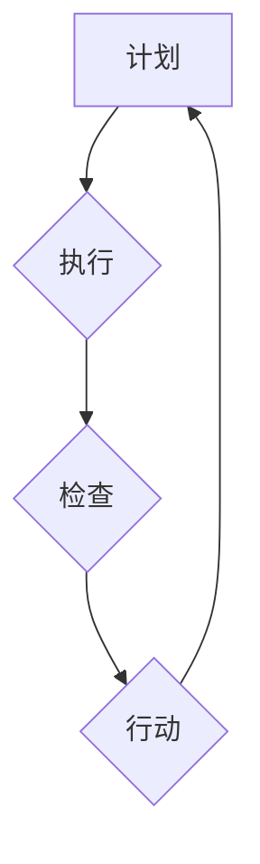

                 

## PDCA循环:管理者落地执行的方法论

> 关键词：PDCA循环, 管理方法论, 流程优化, 项目管理, 执行力提升, 持续改进, 循环迭代

## 1. 背景介绍

在瞬息万变的科技时代，高效的管理和执行力已成为企业持续发展的关键。如何将战略目标转化为实际成果，是管理者面临的重大挑战。PDCA循环，全称为Plan-Do-Check-Act（计划-执行-检查-行动），是一种以循环迭代为核心的管理方法论，被广泛应用于各个领域，帮助组织不断改进和优化工作流程，提升执行力。

PDCA循环的提出源于美国质量管理大师沃伦·费舍尔（W. Edwards Deming）的管理学思想，它强调以数据为基础，通过不断循环改进，实现持续进步。PDCA循环的简洁易懂、易于实施的特点使其成为管理者落地执行的有效工具。

## 2. 核心概念与联系

PDCA循环的核心在于四个步骤的相互关联和循环迭代：

* **Plan（计划）:** 明确目标，制定计划，并明确执行步骤和资源分配。
* **Do（执行）:** 根据计划进行实际操作，并记录执行过程中的数据和观察结果。
* **Check（检查）:** 对执行结果进行分析，评估是否达到预期目标，并找出改进空间。
* **Act（行动）:** 根据检查结果，对计划进行调整和优化，并将其纳入下次循环。

**Mermaid 流程图:**



PDCA循环是一个闭环的过程，每个步骤都相互影响，共同推动组织的持续改进。

## 3. 核心算法原理 & 具体操作步骤

### 3.1  算法原理概述

PDCA循环本身并非一个算法，而是一种管理方法论。它通过循环迭代的方式，不断优化流程，提升执行力。其核心原理在于：

* **数据驱动:**  PDCA循环强调以数据为基础，通过收集和分析数据，了解现状，发现问题，并制定改进方案。
* **持续改进:**  PDCA循环是一个不断循环的过程，通过不断检查和调整，不断提升工作效率和质量。
* **团队协作:**  PDCA循环需要团队成员共同参与，从计划到执行，再到检查和行动，都需要团队成员的协作和沟通。

### 3.2  算法步骤详解

**1. 计划阶段:**

* 明确目标：首先要明确需要达成的目标，并将其分解成具体的行动步骤。
* 制定计划：根据目标，制定详细的计划，包括执行步骤、资源分配、时间安排等。
* 确定指标：设定可量化的指标，用于衡量计划的执行情况和效果。

**2. 执行阶段:**

* 按照计划执行：严格按照计划执行各项任务，并记录执行过程中的数据和观察结果。
* 沟通协调：保持团队成员之间的沟通和协调，及时解决执行过程中遇到的问题。
* 控制风险：识别和评估潜在风险，并制定相应的应对措施。

**3. 检查阶段:**

* 收集数据：收集执行阶段的数据和观察结果，并进行整理和分析。
* 评估结果：根据收集的数据，评估计划的执行情况，是否达到预期目标。
* 找出问题：分析执行结果，找出导致偏差的原因，并记录问题清单。

**4. 行动阶段:**

* 制定改进方案：根据检查结果，制定改进方案，并将其纳入下次循环。
* 调整计划：根据改进方案，调整计划，使其更加完善和有效。
* 持续改进：将改进方案实施，并持续监控执行情况，不断优化流程。

### 3.3  算法优缺点

**优点:**

* 简单易懂：PDCA循环的流程简单易懂，易于理解和实施。
* 灵活实用：PDCA循环可以应用于各个领域，并根据具体情况进行调整。
* 持续改进：PDCA循环强调持续改进，帮助组织不断提升效率和质量。

**缺点:**

* 需要时间和资源：PDCA循环需要投入时间和资源进行实施和维护。
* 依赖于数据质量：PDCA循环的有效性依赖于数据质量，数据收集和分析需要准确可靠。
* 难以应对复杂问题：对于复杂问题，PDCA循环可能需要进行多次循环才能找到解决方案。

### 3.4  算法应用领域

PDCA循环广泛应用于各个领域，例如：

* **项目管理:**  帮助项目团队制定计划、执行任务、检查结果、并进行持续改进。
* **质量管理:**  帮助企业识别和解决质量问题，提升产品和服务质量。
* **流程优化:**  帮助企业优化工作流程，提高效率和降低成本。
* **个人成长:**  帮助个人设定目标、制定计划、执行行动、并进行自我反思和改进。

## 4. 数学模型和公式 & 详细讲解 & 举例说明

PDCA循环本身并非一个数学模型，但它可以与数学模型相结合，进行更深入的分析和优化。例如，可以使用统计学模型来分析数据，评估计划的执行情况，并确定改进方向。

### 4.1  数学模型构建

在PDCA循环中，可以使用以下数学模型来构建分析框架：

* **控制图:**  控制图是一种统计图，用于监控过程的稳定性和控制能力。
* **回归分析:**  回归分析是一种统计方法，用于分析两个或多个变量之间的关系。
* **假设检验:**  假设检验是一种统计方法，用于检验假设的正确性。

### 4.2  公式推导过程

这些数学模型的公式推导过程较为复杂，需要一定的数学基础。例如，控制图的计算公式涉及到平均值、标准差、控制限等概念。

### 4.3  案例分析与讲解

假设一家公司想要提高生产效率，可以使用PDCA循环和控制图来进行分析和改进。

* **计划阶段:**  设定目标，例如提高生产效率10%。制定计划，包括改进生产流程、培训员工等。
* **执行阶段:**  按照计划执行，并记录生产数据，例如产量、生产时间等。
* **检查阶段:**  使用控制图分析生产数据，观察生产过程的稳定性和控制能力。
* **行动阶段:**  根据控制图分析结果，找出导致效率下降的原因，并制定改进方案。例如，发现某个环节的生产时间过长，可以优化流程，提高效率。

## 5. 项目实践：代码实例和详细解释说明

由于PDCA循环本身不是一个编程算法，因此无法提供直接的代码实例。但我们可以通过代码示例来展示如何将PDCA循环的思想应用于软件开发项目。

### 5.1  开发环境搭建

* 编程语言：Python
* 开发工具：VS Code

### 5.2  源代码详细实现

```python
# PDCA循环示例代码

def plan(goal):
  """
  计划阶段：设定目标，制定计划
  """
  print(f"目标：{goal}")
  # 根据目标制定详细计划，例如：
  # - 分解目标为子任务
  # - 确定资源分配
  # - 制定时间安排

def do(plan):
  """
  执行阶段：按照计划执行任务
  """
  print("执行计划...")
  # 按照计划执行任务，并记录执行过程中的数据和观察结果

def check(results):
  """
  检查阶段：评估执行结果，找出问题
  """
  print("检查结果...")
  # 分析执行结果，评估是否达到预期目标
  # 找出导致偏差的原因，并记录问题清单

def act(problems):
  """
  行动阶段：制定改进方案，调整计划
  """
  print("制定改进方案...")
  # 根据问题清单，制定改进方案
  # 调整计划，使其更加完善和有效

# 示例使用
goal = "提高软件开发效率"
plan(goal)
do(plan)
results = check()
act(results)
```

### 5.3  代码解读与分析

这段代码展示了PDCA循环的四个步骤，并使用函数来分别表示每个步骤。

* `plan()` 函数模拟计划阶段，设定目标并制定计划。
* `do()` 函数模拟执行阶段，按照计划执行任务。
* `check()` 函数模拟检查阶段，评估执行结果并找出问题。
* `act()` 函数模拟行动阶段，制定改进方案并调整计划。

### 5.4  运行结果展示

运行这段代码，会输出以下信息：

```
目标：提高软件开发效率
执行计划...
检查结果...
制定改进方案...
```

## 6. 实际应用场景

PDCA循环在各个领域都有广泛的应用场景，例如：

### 6.1  项目管理

在项目管理中，PDCA循环可以帮助项目团队制定计划、执行任务、检查结果、并进行持续改进。例如，在软件开发项目中，可以使用PDCA循环来优化开发流程，提高开发效率。

### 6.2  质量管理

在质量管理中，PDCA循环可以帮助企业识别和解决质量问题，提升产品和服务质量。例如，可以使用PDCA循环来分析产品缺陷的原因，并制定改进方案。

### 6.3  流程优化

在流程优化中，PDCA循环可以帮助企业优化工作流程，提高效率和降低成本。例如，可以使用PDCA循环来分析销售流程，找出瓶颈，并制定改进方案。

### 6.4  未来应用展望

随着科技的不断发展，PDCA循环的应用场景将会更加广泛。例如，可以将PDCA循环与人工智能技术结合，实现更智能化的流程优化和质量管理。

## 7. 工具和资源推荐

### 7.1  学习资源推荐

* **《管理的本质》** - 彼得·德鲁克
* **《输出管理》** - 迈克尔·波特
* **《精益制造》** - 詹姆斯·沃马克

### 7.2  开发工具推荐

* **Jira:** 项目管理工具
* **Trello:** 项目管理工具
* **Asana:** 项目管理工具

### 7.3  相关论文推荐

* **Deming's 14 Points for Management**
* **The PDCA Cycle: A Framework for Continuous Improvement**
* **Applying the PDCA Cycle to Software Development**

## 8. 总结：未来发展趋势与挑战

### 8.1  研究成果总结

PDCA循环是一种简单易懂、易于实施的管理方法论，它强调以数据为基础，通过循环迭代的方式，不断优化流程，提升执行力。

### 8.2  未来发展趋势

未来，PDCA循环将会与人工智能、大数据等新技术更加紧密结合，实现更智能化的流程优化和质量管理。

### 8.3  面临的挑战

PDCA循环的实施需要克服一些挑战，例如：

* 组织文化：需要建立以数据为导向、注重持续改进的组织文化。
* 人员素质：需要培养员工的分析能力、问题解决能力和执行力。
* 数据质量：需要确保数据准确可靠，为PDCA循环提供可靠的依据。

### 8.4  研究展望

未来研究方向包括：

* 将PDCA循环与人工智能技术结合，实现更智能化的流程优化和质量管理。
* 研究PDCA循环在不同行业和领域的应用，并制定相应的实施指南。
* 开发更完善的PDCA循环工具和平台，方便企业和个人进行实施和管理。

## 9. 附录：常见问题与解答

**1. PDCA循环的实施需要多长时间？**

PDCA循环的实施时间取决于项目的复杂程度和组织的实际情况。一般来说，需要几个周期才能看到明显的改进效果。

**2. PDCA循环的实施需要投入多少资源？**

PDCA循环的实施需要投入时间、人力和资源。具体投入量取决于项目的规模和复杂程度。

**3. PDCA循环的实施效果如何？**

PDCA循环的实施效果取决于项目的具体情况和组织的执行力。一般来说，PDCA循环可以帮助组织提高效率、降低成本、提升质量。


作者：禅与计算机程序设计艺术 / Zen and the Art of Computer Programming 
<end_of_turn>

