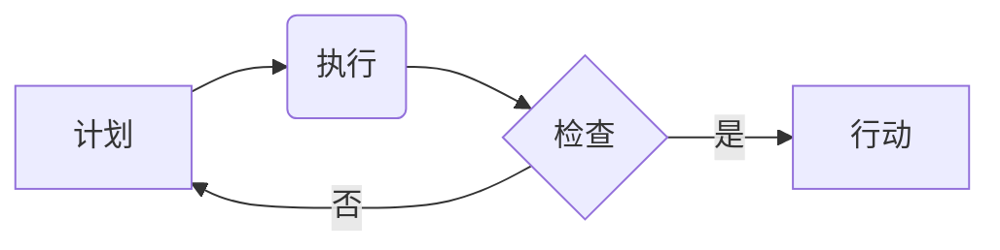

                 

## PDCA循环在项目管理中的应用

> 关键词：PDCA循环、项目管理、持续改进、流程优化、质量控制

## 1. 背景介绍

在当今快速变化的科技环境中，项目管理扮演着至关重要的角色。无论是软件开发、硬件设计还是科研项目，高效的项目管理能够确保项目按时、按预算、按质量完成。而PDCA循环作为一种经典的管理方法，为项目管理提供了强大的工具和框架。

PDCA循环，全称为Plan-Do-Check-Act，意为计划-执行-检查-行动。它是一种循环式的改进方法，通过不断重复计划、执行、检查和行动的步骤，逐步优化流程，提升项目效率和质量。

## 2. 核心概念与联系

PDCA循环的核心概念是持续改进，它强调通过不断地学习和调整，不断提升项目的执行效率和最终成果。

**Mermaid 流程图：**



**核心概念原理和架构：**

* **计划 (Plan):** 在项目开始之前，需要对项目目标、范围、任务、资源、时间和预算进行详细的规划。制定清晰的计划是项目成功的基石。
* **执行 (Do):** 根据计划，执行项目任务，并记录执行过程中的数据和信息。
* **检查 (Check):**  在执行过程中，需要定期检查项目进展情况，评估是否符合计划目标，并识别潜在的问题和风险。
* **行动 (Act):** 根据检查结果，采取相应的行动，例如调整计划、优化流程、改进工作方法等，以确保项目顺利完成。

PDCA循环是一个迭代的过程，每个循环都会带来新的学习和改进。通过不断重复这个循环，项目团队能够逐步积累经验，优化流程，提升项目管理水平。

## 3. 核心算法原理 & 具体操作步骤

PDCA循环本身不是一个算法，而是一种管理方法。它没有固定的算法步骤，而是提供了一个框架和思路，帮助项目团队进行持续改进。

**3.1 算法原理概述**

PDCA循环的核心原理是基于数据驱动的决策和持续改进。通过收集和分析项目执行过程中的数据，项目团队能够识别问题、分析原因、制定解决方案，并评估解决方案的有效性。

**3.2 算法步骤详解**

1. **计划阶段:**
    * 明确项目目标和范围。
    * 确定项目任务、资源、时间和预算。
    * 制定详细的项目计划文档。
2. **执行阶段:**
    * 根据计划执行项目任务。
    * 记录执行过程中的数据和信息。
    * 定期进行进度跟踪和风险评估。
3. **检查阶段:**
    * 收集项目执行过程中的数据和反馈。
    * 分析数据，评估项目进展情况。
    * 识别问题和潜在风险。
4. **行动阶段:**
    * 根据检查结果，制定改进措施。
    * 调整项目计划和执行方法。
    * 持续改进项目流程和工作方法。

**3.3 算法优缺点**

* **优点:**
    * 简单易懂，易于实施。
    * 强调持续改进，能够不断提升项目效率和质量。
    * 基于数据驱动的决策，能够有效识别和解决问题。
* **缺点:**
    * 需要投入时间和精力进行计划和检查。
    * 如果项目复杂度高，PDCA循环可能难以完全覆盖所有环节。

**3.4 算法应用领域**

PDCA循环广泛应用于各个领域，例如：

* 软件开发
* 产品设计
* 制造业
* 服务业
* 科研项目

## 4. 数学模型和公式 & 详细讲解 & 举例说明

PDCA循环本身没有固定的数学模型和公式，但它可以与其他数学模型和统计方法结合，进行更深入的分析和优化。例如，可以使用统计学方法分析项目执行过程中的数据，识别问题和趋势，并评估改进措施的有效性。

**4.1 数学模型构建**

可以构建一个简单的数学模型来描述PDCA循环的迭代过程：

*  **P(t)**：t时刻的计划目标
*  **D(t)**：t时刻的执行结果
*  **C(t)**：t时刻的检查结果
*  **A(t)**：t时刻的行动措施

**模型描述:**

```
P(t+1) = P(t) + A(t) * f(C(t))
```

其中，f(C(t))是一个函数，代表行动措施对检查结果的调整影响。

**4.2 公式推导过程**

这个模型的推导过程基于以下假设：

*  计划目标是可量化的。
*  执行结果与计划目标存在偏差。
*  检查结果能够识别偏差的原因。
*  行动措施能够有效调整偏差。

**4.3 案例分析与讲解**

例如，在软件开发项目中，我们可以使用这个模型来描述PDCA循环的迭代过程：

*  **P(t)**：t时刻的软件功能需求
*  **D(t)**：t时刻开发完成的功能模块
*  **C(t)**：t时刻的功能测试结果
*  **A(t)**：t时刻根据测试结果进行的代码修改和优化

通过不断迭代PDCA循环，软件开发团队能够逐步完善软件功能，提高软件质量。

## 5. 项目实践：代码实例和详细解释说明

由于PDCA循环是一种管理方法，而不是具体的代码实现，因此无法提供直接的代码实例。但是，我们可以通过代码示例来展示如何将PDCA循环的思想应用于实际项目中。

**5.1 开发环境搭建**

PDCA循环的应用环境可以是任何项目管理工具，例如Jira、Trello、Asana等。

**5.2 源代码详细实现**

由于PDCA循环本身不是代码，因此无法提供源代码实现。

**5.3 代码解读与分析**

PDCA循环的应用需要通过项目管理工具和团队协作来实现。

**5.4 运行结果展示**

PDCA循环的运行结果是项目效率和质量的提升，可以通过项目进度、缺陷率、客户满意度等指标来衡量。

## 6. 实际应用场景

PDCA循环在软件开发、产品设计、制造业、服务业等各个领域都有广泛的应用场景。

**6.1 软件开发**

在软件开发项目中，PDCA循环可以用于迭代开发、缺陷修复、测试流程优化等方面。例如，可以使用PDCA循环来改进软件测试流程，提高测试效率和覆盖率。

**6.2 产品设计**

在产品设计项目中，PDCA循环可以用于产品原型设计、用户测试、产品迭代等方面。例如，可以使用PDCA循环来改进产品设计流程，提高产品用户体验。

**6.3 制造业**

在制造业中，PDCA循环可以用于生产流程优化、质量控制、设备维护等方面。例如，可以使用PDCA循环来改进生产流程，提高生产效率和产品质量。

**6.4 服务业**

在服务业中，PDCA循环可以用于服务流程优化、客户满意度提升、员工培训等方面。例如，可以使用PDCA循环来改进服务流程，提高客户满意度。

**6.5 未来应用展望**

随着人工智能、大数据等技术的不断发展，PDCA循环的应用场景将会更加广泛。例如，可以使用人工智能技术自动分析项目数据，识别问题和趋势，并提供改进建议。

## 7. 工具和资源推荐

**7.1 学习资源推荐**

*  《质量管理的PDCA循环》
*  《持续改进的PDCA循环》
*  《PDCA循环在项目管理中的应用》

**7.2 开发工具推荐**

*  Jira
*  Trello
*  Asana

**7.3 相关论文推荐**

*  “PDCA循环在软件开发中的应用研究”
*  “PDCA循环在制造业中的应用案例分析”
*  “PDCA循环在服务业中的改进实践”

## 8. 总结：未来发展趋势与挑战

PDCA循环是一种经典的管理方法，它为项目管理提供了强大的工具和框架。通过不断重复计划、执行、检查和行动的步骤，项目团队能够逐步优化流程，提升项目效率和质量。

**8.1 研究成果总结**

PDCA循环的应用研究表明，它能够有效提高项目管理水平，提升项目成功率。

**8.2 未来发展趋势**

未来，PDCA循环将会与人工智能、大数据等新技术更加紧密地结合，实现更智能化、自动化和数据化的项目管理。

**8.3 面临的挑战**

PDCA循环的应用需要团队成员的积极参与和配合，以及对数据分析和改进措施的重视。

**8.4 研究展望**

未来研究可以进一步探索PDCA循环在不同行业和项目类型的应用，以及如何将PDCA循环与其他管理方法相结合，实现更有效的项目管理。

## 9. 附录：常见问题与解答

**9.1 如何实施PDCA循环？**

实施PDCA循环需要明确项目目标、分解任务、制定计划、执行任务、收集数据、分析结果、制定改进措施，并不断重复这个循环。

**9.2 PDCA循环的应用范围？**

PDCA循环可以应用于各个领域，例如软件开发、产品设计、制造业、服务业等。

**9.3 PDCA循环的优势和劣势？**

PDCA循环的优势在于简单易懂、强调持续改进、基于数据驱动的决策。劣势在于需要投入时间和精力进行计划和检查，如果项目复杂度高，可能难以完全覆盖所有环节。


作者：禅与计算机程序设计艺术 / Zen and the Art of Computer Programming 
<end_of_turn>

