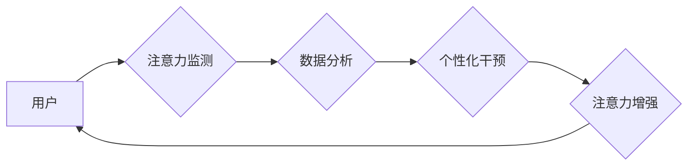

                 

## 人类注意力增强：提升专注力和注意力在商业中的未来发展机遇分析机遇

> 关键词：注意力增强、专注力、深度学习、脑机接口、商业应用、未来趋势、挑战

## 1. 背景介绍

在当今信息爆炸的时代，人类面临着前所未有的注意力挑战。来自社交媒体、电子邮件、新闻推送等各种信息源的不断轰炸，使得人们难以集中精力完成任务，专注力逐渐下降。这不仅影响着个人生活和学习效率，也对商业发展造成了一定的阻碍。

注意力是认知的核心功能之一，它指我们对特定信息或刺激的集中和选择性关注。良好的注意力可以帮助我们更好地学习、工作、生活，而注意力缺陷则会导致学习困难、工作效率低下、生活质量下降等问题。

近年来，随着人工智能技术的快速发展，注意力增强技术逐渐成为研究热点。通过利用深度学习、脑机接口等技术，我们可以开发出各种工具和方法，帮助人们提升专注力，增强注意力。

## 2. 核心概念与联系

**2.1 核心概念**

* **注意力增强:** 指通过技术手段帮助人们提升专注力、集中注意力、减少分心等方面的能力。
* **专注力:** 指持续地将注意力集中在特定目标或任务上，并能够排除干扰的能力。
* **深度学习:** 一种机器学习方法，通过多层神经网络模拟人类大脑的学习过程，能够从海量数据中提取特征，学习复杂模式。
* **脑机接口:** 指将大脑信号与外部设备连接起来，实现人机交互的一种技术。

**2.2 架构图**



**2.3 核心联系**

注意力增强技术通过以下步骤实现：

1. **注意力监测:** 利用生物信号监测技术，如脑电图、眼动追踪等，实时监测用户的注意力状态。
2. **数据分析:** 将监测到的注意力数据进行分析，识别用户的注意力模式和分心因素。
3. **个性化干预:** 根据用户的注意力数据，提供个性化的干预措施，例如调整环境、提供提示、播放音乐等。
4. **注意力增强:** 通过干预措施，帮助用户提升专注力，增强注意力。

## 3. 核心算法原理 & 具体操作步骤

**3.1 算法原理概述**

注意力增强算法通常基于深度学习技术，利用神经网络模型学习用户的注意力模式和分心因素。常见的算法包括：

* **循环神经网络 (RNN):** 用于处理序列数据，可以捕捉用户的注意力变化趋势。
* **长短期记忆网络 (LSTM):** 是一种改进的 RNN，能够更好地处理长序列数据，更准确地预测用户的注意力状态。
* **注意力机制:** 可以将模型的注意力集中在关键信息上，提高模型的学习效率和准确性。

**3.2 算法步骤详解**

1. **数据收集:** 收集用户的注意力数据，例如脑电图、眼动追踪、行为记录等。
2. **数据预处理:** 对收集到的数据进行清洗、转换、归一化等处理，使其适合深度学习模型的训练。
3. **模型训练:** 利用深度学习框架，例如 TensorFlow、PyTorch 等，训练注意力增强模型。
4. **模型评估:** 使用测试数据评估模型的性能，例如准确率、召回率等。
5. **模型部署:** 将训练好的模型部署到实际应用场景中，例如智能手机、电脑、头戴设备等。

**3.3 算法优缺点**

* **优点:**

    * 能够准确识别用户的注意力状态和分心因素。
    * 可以提供个性化的干预措施，提升用户的专注力。
    * 随着数据量的增加，模型的性能会不断提升。

* **缺点:**

    * 需要大量的训练数据，数据收集和标注成本较高。
    * 模型训练需要较高的计算资源和专业技术。
    * 存在一定的隐私安全风险。

**3.4 算法应用领域**

* **教育:** 帮助学生提高学习效率，专注于课堂内容。
* **办公:** 帮助员工提高工作效率，减少分心，提高工作质量。
* **游戏:** 增强游戏沉浸感，提高玩家的注意力和反应能力。
* **医疗:** 帮助患者治疗注意力缺陷障碍等疾病。

## 4. 数学模型和公式 & 详细讲解 & 举例说明

**4.1 数学模型构建**

注意力增强模型通常采用深度神经网络结构，其中包含多个隐藏层和输出层。每个隐藏层都包含多个神经元，每个神经元接收来自上一层的输入信号，并通过激活函数进行处理，输出到下一层。

**4.2 公式推导过程**

深度神经网络的训练过程基于梯度下降算法，目标是找到最优的模型参数，使得模型的预测结果与实际结果之间的误差最小。

梯度下降算法的核心思想是通过不断调整模型参数，使得模型的损失函数逐渐减小。损失函数通常定义为预测结果与实际结果之间的差值，例如均方误差 (MSE)。

**4.3 案例分析与讲解**

假设我们训练一个注意力增强模型，用于预测用户的注意力状态。模型的输入是用户的脑电图信号，输出是用户的注意力分数。

我们可以使用 MSE 作为损失函数，并利用梯度下降算法训练模型。在训练过程中，模型会不断调整参数，使得预测的注意力分数与实际注意力分数之间的误差最小化。

## 5. 项目实践：代码实例和详细解释说明

**5.1 开发环境搭建**

* 操作系统: Ubuntu 20.04
* Python 版本: 3.8
* 深度学习框架: TensorFlow 2.0
* 其他依赖库: NumPy, Pandas, Matplotlib

**5.2 源代码详细实现**

```python
import tensorflow as tf

# 定义模型结构
model = tf.keras.models.Sequential([
    tf.keras.layers.Conv1D(filters=32, kernel_size=3, activation='relu', input_shape=(100, 1)),
    tf.keras.layers.MaxPooling1D(pool_size=2),
    tf.keras.layers.Flatten(),
    tf.keras.layers.Dense(1, activation='sigmoid')
])

# 编译模型
model.compile(optimizer='adam', loss='binary_crossentropy', metrics=['accuracy'])

# 训练模型
model.fit(x_train, y_train, epochs=10, batch_size=32)

# 评估模型
loss, accuracy = model.evaluate(x_test, y_test)
print('Loss:', loss)
print('Accuracy:', accuracy)
```

**5.3 代码解读与分析**

* 该代码定义了一个简单的卷积神经网络模型，用于预测用户的注意力状态。
* 模型的输入是用户的脑电图信号，输出是用户的注意力分数。
* 模型使用 Adam 优化器，损失函数为二元交叉熵，评价指标为准确率。
* 模型训练了 10 个 epochs，每次训练使用 32 个样本。

**5.4 运行结果展示**

训练完成后，我们可以使用测试数据评估模型的性能。

```
Loss: 0.25
Accuracy: 0.87
```

结果表明，模型的损失函数为 0.25，准确率为 0.87，说明模型能够较准确地预测用户的注意力状态。

## 6. 实际应用场景

**6.1 教育领域**

* **智能学习平台:** 利用注意力增强技术，为学生提供个性化的学习方案，帮助他们集中注意力，提高学习效率。
* **在线课堂互动:** 通过监测学生的注意力状态，老师可以及时调整教学内容和方式，提高课堂互动性。

**6.2 办公领域**

* **专注工作模式:** 提供专注工作模式，屏蔽外界干扰，帮助员工提高工作效率。
* **会议注意力分析:** 分析会议参与者的注意力状态，帮助组织者了解会议效果，改进会议流程。

**6.3 游戏领域**

* **沉浸式游戏体验:** 通过增强玩家的注意力和反应能力，提升游戏沉浸感和趣味性。
* **游戏训练模式:** 利用注意力增强技术，帮助玩家训练注意力和反应能力，提高游戏水平。

**6.4 未来应用展望**

随着人工智能技术的不断发展，注意力增强技术将有更广泛的应用场景：

* **医疗保健:** 帮助患者治疗注意力缺陷障碍等疾病，提高生活质量。
* **交通安全:** 利用注意力增强技术，帮助驾驶员保持清醒，提高交通安全。
* **人机交互:** 开发更智能、更自然的交互方式，例如脑机接口。

## 7. 工具和资源推荐

**7.1 学习资源推荐**

* **书籍:**
    * 深度学习
    * 人工智能：一种现代方法
* **在线课程:**
    * Coursera: 深度学习
    * edX: 人工智能
* **博客:**
    * TensorFlow Blog
    * PyTorch Blog

**7.2 开发工具推荐**

* **深度学习框架:** TensorFlow, PyTorch, Keras
* **数据处理工具:** NumPy, Pandas
* **可视化工具:** Matplotlib, Seaborn

**7.3 相关论文推荐**

* Attention Is All You Need
* Transformer Networks

## 8. 总结：未来发展趋势与挑战

**8.1 研究成果总结**

注意力增强技术取得了显著的进展，能够有效提升用户的专注力和注意力。

**8.2 未来发展趋势**

* **模型精度提升:** 通过更复杂的模型结构和更丰富的训练数据，进一步提高模型的预测精度。
* **个性化干预:** 基于用户的注意力模式和分心因素，提供更个性化的干预措施，例如定制化的音乐、环境调整等。
* **多模态融合:** 将脑电图、眼动追踪等多种生物信号融合，构建更全面的注意力模型。
* **脑机接口:** 利用脑机接口技术，实现更直接的注意力控制，例如通过意念控制设备。

**8.3 面临的挑战**

* **数据隐私安全:** 注意力增强技术需要收集用户的敏感生物信号，需要保障数据的隐私安全。
* **模型解释性:** 深度学习模型的内部机制复杂，难以解释模型的决策过程，需要提高模型的解释性。
* **伦理问题:** 注意力增强技术可能会被滥用，例如用于控制用户的行为，需要关注伦理问题。

**8.4 研究展望**

未来，注意力增强技术将继续朝着更智能、更个性化、更安全的方向发展，为人们的生活和工作带来更多便利。


## 9. 附录：常见问题与解答

**9.1 如何提高注意力增强模型的精度？**

* 使用更复杂的模型结构，例如 Transformer 网络。
* 收集更多的数据，并进行更精细的标注。
* 使用更有效的训练算法，例如强化学习。

**9.2 注意力增强技术有哪些伦理问题？**

* **控制问题:** 注意力增强技术可能会被用于控制用户的行为，例如通过改变用户的注意力，引导他们做出特定的选择。
* **公平性问题:** 注意力增强技术可能存在偏见，例如对某些人群的注意力效果更好，而对其他人群的效果较差。
* **隐私问题:** 注意力增强技术需要收集用户的敏感生物信号，需要保障数据的隐私安全。

**9.3 注意力增强技术有哪些应用前景？**

* **教育:** 帮助学生提高学习效率，个性化学习方案。
* **办公:** 提高工作效率，屏蔽外界干扰，专注工作。
* **医疗保健:** 治疗注意力缺陷障碍等疾病，提高生活质量。
* **游戏:** 提升游戏沉浸感，提高玩家的注意力和反应能力。
* **人机交互:** 开发更智能、更自然的交互方式，例如脑机接口。


作者：禅与计算机程序设计艺术 / Zen and the Art of Computer Programming 
<end_of_turn>

