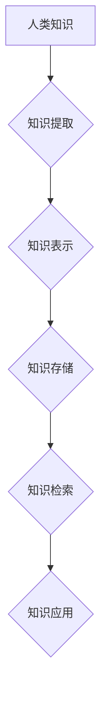

                 

## 人类知识的保存技术：为未来保存文明

> 关键词：人工智能、知识图谱、数据存储、文明传承、数字遗产、机器学习、深度学习

### 1. 背景介绍

人类文明的进步离不开知识的积累和传承。从古老的文字记载到现代的电子文档，人类一直在探索如何有效地保存和传播知识。然而，随着科技的飞速发展，传统知识保存方式面临着新的挑战。信息爆炸时代，海量数据涌现，知识的散乱和碎片化问题日益突出。同时，自然灾害、战争等不可控因素也可能导致知识的丢失。因此，探索新的、更可靠的知识保存技术，对于人类文明的延续和发展至关重要。

人工智能技术的兴起为知识保存带来了新的机遇。人工智能能够自动学习和理解知识，并将其组织和结构化。通过人工智能技术，我们可以构建更智能、更高效的知识保存系统，有效解决传统知识保存方式面临的挑战。

### 2. 核心概念与联系

**2.1 知识图谱**

知识图谱是一种基于知识表示的数据库，它以实体和关系为基本单元，将知识以结构化的形式表示出来。知识图谱能够有效地捕捉知识之间的关联性，并支持复杂的知识推理和查询。

**2.2 人工智能**

人工智能是指模拟人类智能行为的计算机系统。人工智能技术包括机器学习、深度学习、自然语言处理等多个分支。

**2.3 数据存储**

数据存储是指将数据以持久化的形式保存到存储设备中。数据存储技术包括硬盘、固态硬盘、云存储等多种方式。

**2.4 流程图**



**2.5  核心概念联系**

人工智能技术可以用于知识提取、知识表示和知识检索等环节，构建智能的知识保存系统。知识图谱作为一种知识表示形式，能够有效地组织和结构化知识，并支持人工智能技术进行知识推理和查询。数据存储技术为知识保存提供持久化的基础。

### 3. 核心算法原理 & 具体操作步骤

**3.1 算法原理概述**

知识保存技术的核心算法主要包括知识提取、知识表示和知识检索等算法。

* **知识提取算法**：用于从文本、图像、音频等多种数据源中提取知识。常见的知识提取算法包括规则匹配、机器学习和深度学习等。
* **知识表示算法**：用于将提取的知识以结构化的形式表示出来。常见的知识表示算法包括知识图谱构建、本体构建和语义网络构建等。
* **知识检索算法**：用于根据用户查询，从知识库中检索相关知识。常见的知识检索算法包括关键词检索、向量检索和基于规则的检索等。

**3.2 算法步骤详解**

**3.2.1 知识提取**

1. **数据预处理**: 对原始数据进行清洗、格式化和分词等处理，以便于后续算法的执行。
2. **特征提取**: 从预处理后的数据中提取特征，例如关键词、实体、关系等。
3. **知识抽取**: 利用规则匹配、机器学习或深度学习算法，从特征中抽取知识。

**3.2.2 知识表示**

1. **实体识别**: 从知识中识别出实体，例如人物、地点、事件等。
2. **关系识别**: 从知识中识别出实体之间的关系，例如“出生于”、“居住在”、“参与”等。
3. **知识图谱构建**: 将实体和关系以图的形式表示出来，构建知识图谱。

**3.2.3 知识检索**

1. **用户查询**: 用户输入查询语句，例如“李白出生于哪里？”。
2. **查询解析**: 将用户查询语句解析成查询结构，例如实体和关系。
3. **知识匹配**: 根据查询结构，从知识库中匹配相关知识。
4. **结果展示**: 将匹配到的知识以文本、图形或其他形式展示给用户。

**3.3 算法优缺点**

* **规则匹配**: 优点是精确度高，缺点是难以处理复杂知识和语义歧义。
* **机器学习**: 优点是能够学习复杂知识模式，缺点是需要大量的训练数据。
* **深度学习**: 优点是能够处理更复杂的语义关系，缺点是训练成本高，解释性较差。

**3.4 算法应用领域**

知识保存技术广泛应用于各个领域，例如：

* **教育**: 建立智能学习平台，提供个性化学习内容和辅导。
* **医疗**: 建立医疗知识库，辅助医生诊断和治疗。
* **法律**: 建立法律知识库，辅助律师进行法律研究和咨询。
* **文化遗产保护**: 保存和传承文化遗产，促进文化交流。

### 4. 数学模型和公式 & 详细讲解 & 举例说明

**4.1 数学模型构建**

知识图谱可以表示为一个三元组的集合： (实体1, 关系, 实体2)。 

* 实体可以是任何事物，例如人物、地点、事件等。
* 关系描述实体之间的连接，例如“出生于”、“居住在”、“参与”等。

**4.2 公式推导过程**

假设我们有一个知识图谱，其中包含以下三元组：

* (李白, 出生于, 唐代)
* (李白, 居住于, 蜀地)
* (唐代, 历史时期, 中国)

我们可以利用这些三元组进行知识推理。例如，我们可以推断出李白出生于中国。

**4.3 案例分析与讲解**

**案例**: 

假设我们有一个知识图谱，其中包含以下三元组：

* (苹果, 颜色, 红色)
* (香蕉, 颜色, 黄色)
* (橘子, 颜色, 橙色)

我们可以利用这些三元组进行知识检索。例如，当用户查询“什么水果是红色的？”时，系统可以从知识图谱中检索出“苹果”这个实体。

### 5. 项目实践：代码实例和详细解释说明

**5.1 开发环境搭建**

* 操作系统: Ubuntu 20.04
* Python 版本: 3.8
* 必要的库: rdflib, networkx, matplotlib

**5.2 源代码详细实现**

```python
# 导入必要的库
import rdflib
import networkx as nx
import matplotlib.pyplot as plt

# 创建知识图谱
graph = rdflib.Graph()

# 添加三元组
graph.add((rdflib.URIRef("http://example.org/person/li_bai"), rdflib.RDF.type, rdflib.URIRef("http://example.org/person")))
graph.add((rdflib.URIRef("http://example.org/person/li_bai"), rdflib.URIRef("http://example.org/born_in"), rdflib.URIRef("http://example.org/place/tang_dynasty")))

# 将知识图谱转换为网络图
G = nx.DiGraph()
for s, p, o in graph:
    G.add_edge(s, o, label=p)

# 绘制网络图
nx.draw(G, with_labels=True, node_color='skyblue', node_size=500, font_size=10)
plt.show()
```

**5.3 代码解读与分析**

* 首先，我们导入必要的库，包括 rdflib 用于处理知识图谱，networkx 用于构建网络图，matplotlib 用于绘制图形。
* 然后，我们创建一个 rdflib.Graph 对象，用于存储知识图谱。
* 接着，我们添加一些三元组到知识图谱中，例如 “李白” 出生于 “唐代”。
* 接下来，我们将知识图谱转换为网络图，其中节点代表实体，边代表关系。
* 最后，我们使用 matplotlib 绘制网络图，并显示出来。

**5.4 运行结果展示**

运行代码后，将生成一个网络图，其中节点代表实体，边代表关系。

### 6. 实际应用场景

**6.1 教育领域**

* 智能学习平台：根据学生的学习情况，提供个性化的学习内容和辅导。
* 知识问答系统：帮助学生解答知识问题，提高学习效率。

**6.2 医疗领域**

* 医疗知识库：存储医学知识，辅助医生诊断和治疗。
* 药物相互作用分析：分析药物之间的相互作用，避免药物不良反应。

**6.3 法律领域**

* 法律知识库：存储法律法规，辅助律师进行法律研究和咨询。
* 法律案例分析：分析法律案例，预测案件结果。

**6.4 未来应用展望**

随着人工智能技术的不断发展，知识保存技术将应用于更多领域，例如：

* 科学研究：加速科学发现，推动科技进步。
* 文化遗产保护：保存和传承文化遗产，促进文化交流。
* 个人知识管理：帮助个人整理和管理知识，提高个人效率。

### 7. 工具和资源推荐

**7.1 学习资源推荐**

* **书籍**:
    * 《知识图谱》
    * 《人工智能》
* **在线课程**:
    * Coursera 上的《知识图谱》课程
    * edX 上的《人工智能》课程

**7.2 开发工具推荐**

* **知识图谱构建工具**:
    * Protégé
    * Apache Jena
* **人工智能开发平台**:
    * TensorFlow
    * PyTorch

**7.3 相关论文推荐**

* 《知识图谱的构建与应用》
* 《深度学习在知识图谱构建中的应用》

### 8. 总结：未来发展趋势与挑战

**8.1 研究成果总结**

近年来，人工智能技术在知识保存领域取得了显著进展。知识图谱构建、知识推理和知识检索等技术不断成熟，为知识保存提供了新的技术支撑。

**8.2 未来发展趋势**

* **更智能的知识保存系统**: 利用更先进的人工智能技术，构建更智能的知识保存系统，能够自动学习、理解和组织知识。
* **更丰富的知识类型**: 将更多类型的知识纳入知识保存系统，例如图像、音频、视频等。
* **更个性化的知识服务**: 根据用户的需求，提供个性化的知识服务，例如个性化学习、个性化医疗等。

**8.3 面临的挑战**

* **知识的质量**: 知识保存系统依赖于高质量的知识数据，而获取高质量的知识数据仍然是一个挑战。
* **知识的更新**: 知识是动态的，需要不断更新和维护。如何实现知识的动态更新是一个重要的挑战。
* **知识的安全性**: 知识是重要的资产，需要保证其安全性。如何保护知识免受攻击和泄露是一个重要的挑战。

**8.4 研究展望**

未来，知识保存技术将继续朝着更智能、更丰富、更安全的方向发展。随着人工智能技术的不断进步，知识保存技术将为人类文明的传承和发展做出更大的贡献。

### 9. 附录：常见问题与解答

**9.1 如何构建知识图谱？**

构建知识图谱需要以下步骤：

1. 确定知识领域和知识类型。
2. 收集知识数据。
3. 对知识数据进行清洗、格式化和结构化。
4. 利用知识表示算法构建知识图谱。

**9.2 如何检索知识图谱中的知识？**

可以使用关键词检索、向量检索或基于规则的检索等方法检索知识图谱中的知识。

**9.3 如何保证知识的安全性？**

可以通过加密、访问控制和审计等措施保证知识的安全性。


作者：禅与计算机程序设计艺术 / Zen and the Art of Computer Programming 
<end_of_turn>

