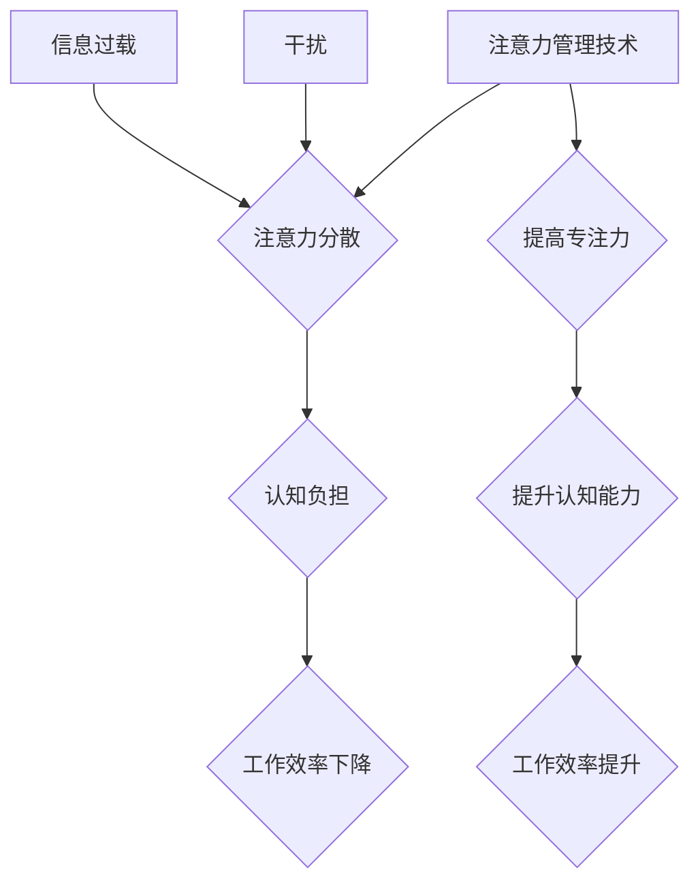

                 

## 信息时代的注意力管理技术：在干扰和信息过载中保持专注

> 关键词：注意力管理、信息过载、干扰、专注力、认知科学、深度学习、算法、技术应用

### 1. 背景介绍

在当今信息爆炸的时代，我们每天都被来自各种渠道的信息轰炸。电子邮件、社交媒体、新闻推送、即时通讯软件，无处不在的通知和提醒，无时无刻不在争夺我们的注意力。这种信息过载和干扰，严重影响着我们的工作效率、学习能力和生活质量。

注意力，是人类认知的核心能力之一，它让我们能够从纷繁复杂的刺激中筛选出重要信息，并集中精力处理。然而，在信息时代，我们的注意力受到了前所未有的挑战。研究表明，人类的注意力持续时间越来越短，容易被分散，难以长时间专注于一件事情。

注意力管理，是指通过各种技术手段和策略，有效地控制和引导我们的注意力，提高专注力，避免信息过载和干扰带来的负面影响。

### 2. 核心概念与联系

**2.1  注意力机制**

注意力机制是近年来深度学习领域兴起的一种重要技术，它能够模拟人类的注意力机制，学习识别和关注输入数据中的重要信息。

**2.2  信息过载与干扰**

信息过载是指在短时间内接收大量信息，导致大脑无法有效处理和理解，从而产生认知负担和心理压力。干扰是指来自外部环境或内部思绪的干扰，阻碍我们集中注意力，完成任务。

**2.3  专注力与认知能力**

专注力是指能够将注意力集中在特定目标上，排除干扰，持续一段时间的能力。专注力是认知能力的重要组成部分，它与学习、记忆、创造力和解决问题的能力密切相关。

**2.4  注意力管理技术**

注意力管理技术是指通过各种方法和工具，帮助人们控制和引导注意力，提高专注力，避免信息过载和干扰带来的负面影响。

**Mermaid 流程图**



### 3. 核心算法原理 & 具体操作步骤

**3.1  算法原理概述**

注意力机制的核心原理是学习一个“注意力权重”，用于衡量输入数据中不同部分的重要性。通过调整注意力权重，模型能够将注意力集中在关键信息上，忽略无关信息。

**3.2  算法步骤详解**

1. **输入数据处理:** 将输入数据转换为模型可处理的格式。
2. **特征提取:** 使用卷积神经网络或循环神经网络等模型提取输入数据的特征。
3. **注意力计算:** 计算每个特征的注意力权重，权重越高，表示该特征越重要。
4. **加权求和:** 将特征与注意力权重相乘，并求和，得到最终的输出。

**3.3  算法优缺点**

**优点:**

* 可以有效地提高模型的准确率和效率。
* 可以帮助模型理解和处理长序列数据。
* 可以解释模型的决策过程，提高模型的可解释性。

**缺点:**

* 计算复杂度较高，训练时间较长。
* 需要大量的训练数据。
* 容易受到噪声和干扰的影响。

**3.4  算法应用领域**

注意力机制在自然语言处理、计算机视觉、语音识别等领域都有广泛的应用。例如，在机器翻译中，注意力机制可以帮助模型关注源语言和目标语言之间的关键词语，提高翻译质量；在图像识别中，注意力机制可以帮助模型关注图像中的重要区域，提高识别准确率。

### 4. 数学模型和公式 & 详细讲解 & 举例说明

**4.1  数学模型构建**

注意力机制的数学模型通常基于一个“注意力分数”的计算。注意力分数表示输入数据中每个元素的重要性。

**4.2  公式推导过程**

假设我们有一个输入序列 X = {x1, x2, ..., xn}，其中每个元素 xi 代表一个特征向量。我们想要计算每个元素 xi 的注意力分数，可以使用以下公式：

```latex
a_{i} = \frac{exp(e_{i})}{\sum_{j=1}^{n} exp(e_{j})}
```

其中，ei 是 xi 与查询向量 q 的相似度，可以采用点积或其他相似度度量方法计算。

**4.3  案例分析与讲解**

例如，在机器翻译中，查询向量 q 可以是目标语言的词向量，输入序列 X 是源语言的词向量。注意力分数 ai 表示源语言中第 i 个词对目标语言的词的贡献度。

### 5. 项目实践：代码实例和详细解释说明

**5.1  开发环境搭建**

* Python 3.x
* TensorFlow 或 PyTorch 深度学习框架
* Jupyter Notebook 或 VS Code 代码编辑器

**5.2  源代码详细实现**

```python
import tensorflow as tf

# 定义注意力机制层
class AttentionLayer(tf.keras.layers.Layer):
    def __init__(self, units):
        super(AttentionLayer, self).__init__()
        self.W1 = tf.keras.layers.Dense(units)
        self.W2 = tf.keras.layers.Dense(units)
        self.v = tf.keras.layers.Dense(1)

    def call(self, inputs):
        # inputs: (batch_size, sequence_length, units)
        query = self.W1(inputs)
        key = self.W2(inputs)
        value = inputs
        # 计算注意力分数
        scores = tf.matmul(query, key, transpose_b=True)
        scores = scores / tf.math.sqrt(tf.cast(units, tf.float32))
        attention_weights = tf.nn.softmax(scores, axis=-1)
        # 加权求和
        context_vector = tf.matmul(attention_weights, value)
        return context_vector

# 使用注意力机制层
model = tf.keras.Sequential([
    tf.keras.layers.Embedding(input_dim=10000, output_dim=128),
    AttentionLayer(units=128),
    tf.keras.layers.Dense(units=10, activation='softmax')
])
```

**5.3  代码解读与分析**

* `AttentionLayer` 类定义了一个注意力机制层，包含三个稠密层：`W1`、`W2` 和 `v`。
* `call` 方法计算注意力分数，并使用 softmax 函数归一化，得到注意力权重。
* 最后，将注意力权重与输入值相乘，进行加权求和，得到上下文向量。

**5.4  运行结果展示**

运行上述代码，可以训练一个使用注意力机制的机器翻译模型。

### 6. 实际应用场景

**6.1  个人注意力管理**

* 使用番茄工作法、Pomodoro Technique 等时间管理方法，将工作时间划分为多个间隔，并设置提醒，避免长时间专注于单一任务。
* 使用专注力训练软件，例如 Freedom、Forest 等，屏蔽干扰，帮助集中注意力。
* 培养良好的睡眠习惯，保证充足的睡眠，提高认知能力和专注力。

**6.2  企业信息管理**

* 使用信息过滤工具，例如 Feedly、Pocket 等，筛选重要信息，避免信息过载。
* 使用协作平台，例如 Slack、Microsoft Teams 等，集中沟通和协作，减少信息分散。
* 建立信息管理制度，规范信息处理流程，提高信息利用效率。

**6.3  教育领域**

* 使用注意力训练游戏，例如 Lumosity、Elevate 等，帮助学生提高专注力。
* 使用个性化学习平台，例如 Khan Academy、Coursera 等，根据学生的学习进度和兴趣，提供个性化的学习内容，提高学习效率。
* 采用混合教学模式，结合线上线下教学，提高学生的学习兴趣和参与度。

**6.4  未来应用展望**

随着人工智能技术的不断发展，注意力管理技术将更加智能化、个性化和自动化。未来，我们可以期待：

* 更精准的注意力预测和引导，帮助人们更好地控制和管理注意力。
* 更智能的干扰屏蔽和信息过滤，减少信息干扰，提高工作效率。
* 更个性化的注意力训练方案，根据个人的需求和特点，提供定制化的注意力训练方案。

### 7. 工具和资源推荐

**7.1  学习资源推荐**

* 书籍：《深度学习》、《注意力机制》
* 在线课程：Coursera、edX、Udacity
* 博客和论文：ArXiv、Google AI Blog

**7.2  开发工具推荐**

* 深度学习框架：TensorFlow、PyTorch
* 代码编辑器：Jupyter Notebook、VS Code
* 数据可视化工具：Matplotlib、Seaborn

**7.3  相关论文推荐**

* “Attention Is All You Need”
* “BERT: Pre-training of Deep Bidirectional Transformers for Language Understanding”
* “Transformer-XL: Attentive Language Models Beyond a Fixed-Length Context”

### 8. 总结：未来发展趋势与挑战

**8.1  研究成果总结**

注意力机制在信息处理领域取得了显著的成果，有效地提高了模型的性能和效率。

**8.2  未来发展趋势**

未来，注意力机制将朝着更智能化、个性化和自动化方向发展，并应用于更多领域。

**8.3  面临的挑战**

* 算法复杂度和训练时间长
* 需要大量的训练数据
* 容易受到噪声和干扰的影响

**8.4  研究展望**

未来研究将重点关注以下几个方面：

* 降低算法复杂度和训练时间
* 开发更鲁棒的注意力机制，提高对噪声和干扰的抵抗能力
* 将注意力机制应用于更多领域，探索其更广泛的应用潜力

### 9. 附录：常见问题与解答

**9.1  Q: 注意力机制是如何工作的？**

**A:** 注意力机制通过学习一个“注意力权重”，来衡量输入数据中不同部分的重要性。权重越高，表示该部分信息越重要。

**9.2  Q: 注意力机制有哪些应用场景？**

**A:** 注意力机制在自然语言处理、计算机视觉、语音识别等领域都有广泛的应用。

**9.3  Q: 如何提高自己的注意力？**

**A:** 可以尝试使用番茄工作法、专注力训练软件、培养良好的睡眠习惯等方法。


作者：禅与计算机程序设计艺术 / Zen and the Art of Computer Programming 
<end_of_turn>

