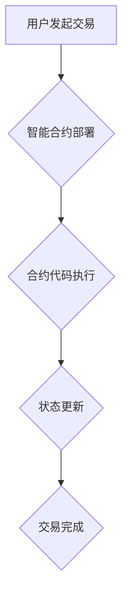

                 

## 利用技术优势进行智能合约开发

> 关键词：智能合约、区块链、去中心化、加密货币、Solidity、Vyper、Rust、Web3.js、Gas费用、安全性、可验证性

## 1. 背景介绍

智能合约作为区块链技术的核心应用之一，正在深刻地改变着传统金融、供应链管理、医疗保健等多个领域的运作模式。它是一种自执行的、不可篡改的、透明的协议，能够自动执行预先定义的条款，无需第三方参与。

随着区块链技术的不断发展，智能合约的应用场景也日益广泛。从去中心化金融 (DeFi) 到非同质化代币 (NFT)，智能合约正在为我们构建一个更加开放、透明、高效的数字世界。然而，智能合约的开发也面临着诸多挑战，例如安全性、可读性、可维护性等。

## 2. 核心概念与联系

**2.1 智能合约的本质**

智能合约本质上是一种计算机程序，存储在区块链网络中，并由预先定义的规则和逻辑来执行。当满足特定条件时，智能合约会自动执行预设的行动，例如转移资产、更新数据等。

**2.2 区块链与智能合约的关系**

区块链作为智能合约运行的基础平台，提供了不可篡改、透明、去中心化的特性。智能合约的代码和执行结果都存储在区块链上，任何人都可以查看和验证，确保其安全性、可靠性和透明性。

**2.3 智能合约的架构**

智能合约的架构通常包括以下几个关键部分：

* **合约代码:** 包含智能合约的逻辑规则和执行流程。
* **状态变量:** 用于存储智能合约的当前状态信息。
* **事件触发器:** 用于检测特定事件的发生，并触发相应的合约执行逻辑。
* **执行引擎:** 用于解释和执行智能合约的代码。

**2.4 Mermaid 流程图**



## 3. 核心算法原理 & 具体操作步骤

**3.1 算法原理概述**

智能合约的执行基于一系列的算法，例如状态机、图灵完备性等。

* **状态机:** 智能合约的状态会随着时间的推移而变化，状态机模型可以用来描述这些状态变化的规则和逻辑。
* **图灵完备性:** 一种理论模型，表明如果一个计算模型能够模拟任何图灵机，那么它就具有图灵完备性。这意味着智能合约能够执行任何可以被计算机程序实现的任务。

**3.2 算法步骤详解**

1. **合约部署:** 用户将智能合约代码部署到区块链网络中，并设置初始状态。
2. **交易发起:** 用户发起一个与智能合约相关的交易，例如调用合约函数、转移资产等。
3. **交易验证:** 区块链网络中的节点会验证交易的合法性和有效性。
4. **合约执行:** 如果交易验证通过，智能合约的执行引擎会执行合约代码，并根据预设的逻辑更新合约状态。
5. **交易确认:** 区块链网络中的节点会将交易结果添加到区块中，并进行确认。

**3.3 算法优缺点**

* **优点:** 安全性高、透明度高、不可篡改性强。
* **缺点:** 可读性差、可维护性低、执行效率低。

**3.4 算法应用领域**

* **去中心化金融 (DeFi):** 构建去中心化的借贷、交易、保险等金融服务。
* **供应链管理:** 追踪商品的来源、运输过程和最终目的地，提高供应链的透明度和效率。
* **医疗保健:** 安全地存储和共享患者的医疗记录，提高医疗服务的效率和安全性。

## 4. 数学模型和公式 & 详细讲解 & 举例说明

**4.1 数学模型构建**

智能合约的逻辑可以抽象为一个状态机模型，其中每个状态代表合约的当前状态，每个状态转换代表合约执行的逻辑操作。

**4.2 公式推导过程**

状态机的状态转换可以表示为一个逻辑公式，例如：

```latex
if (condition1) and (condition2) then state1 -> state2
```

其中：

* `condition1` 和 `condition2` 是需要满足的条件。
* `state1` 是当前状态。
* `state2` 是目标状态。

**4.3 案例分析与讲解**

例如，一个简单的智能合约用于管理一个投票系统。

* **状态:** 投票状态 (未开始、进行中、结束)
* **条件:** 投票截止时间、投票人数
* **状态转换:**

```latex
if (投票状态 == 未开始) and (当前时间 >= 开始时间) then 未开始 -> 进行中
if (投票状态 == 进行中) and (投票人数 >= 投票门槛) then 进行中 -> 结束
```

## 5. 项目实践：代码实例和详细解释说明

**5.1 开发环境搭建**

* 安装 Solidity 编译器和 Truffle 开发框架。
* 设置一个以太坊测试网络，例如 Ganache。

**5.2 源代码详细实现**

```solidity
pragma solidity ^0.8.0;

contract Voting {
    address public owner;
    mapping(address => bool) public voters;
    string public candidateA;
    string public candidateB;
    uint public voteCountA;
    uint public voteCountB;

    constructor(string memory _candidateA, string memory _candidateB) {
        owner = msg.sender;
        candidateA = _candidateA;
        candidateB = _candidateB;
    }

    function vote(string memory _candidate) public {
        require(!voters[msg.sender], "You have already voted.");
        require(keccak256(abi.encodePacked(_candidate)) == keccak256(abi.encodePacked(candidateA)) || keccak256(abi.encodePacked(_candidate)) == keccak256(abi.encodePacked(candidateB)), "Invalid candidate.");
        voters[msg.sender] = true;
        if (keccak256(abi.encodePacked(_candidate)) == keccak256(abi.encodePacked(candidateA))) {
            voteCountA++;
        } else {
            voteCountB++;
        }
    }
}
```

**5.3 代码解读与分析**

* `owner`: 智能合约的创建者地址。
* `voters`: 记录已投票的用户地址。
* `candidateA` 和 `candidateB`: 候选人名称。
* `voteCountA` 和 `voteCountB`: 每个候选人的投票数。
* `constructor`: 初始化合约，设置候选人名称和合约所有者。
* `vote`: 投票函数，验证用户是否已投票，验证候选人名称是否合法，更新投票数。

**5.4 运行结果展示**

通过 Truffle 开发框架，可以部署智能合约到以太坊测试网络，并使用 Web3.js 库进行交互测试。

## 6. 实际应用场景

**6.1 去中心化金融 (DeFi)**

智能合约可以用于构建去中心化的借贷、交易、保险等金融服务。例如，MakerDAO 使用智能合约来发行 Dai 稳定币，Compound 使用智能合约来构建去中心化的借贷平台。

**6.2 供应链管理**

智能合约可以用于追踪商品的来源、运输过程和最终目的地，提高供应链的透明度和效率。例如，IBM 使用 Hyperledger Fabric 平台和智能合约来构建一个食品安全追踪系统。

**6.3 医疗保健**

智能合约可以安全地存储和共享患者的医疗记录，提高医疗服务的效率和安全性。例如，MedRec 项目使用区块链和智能合约来构建一个去中心化的医疗记录系统。

**6.4 未来应用展望**

智能合约的应用场景还在不断扩展，未来可能会应用于更多领域，例如：

* **数字身份验证:** 创建安全的、不可篡改的数字身份。
* **知识产权保护:** 记录和管理知识产权的拥有权和使用权。
* **投票和选举:** 构建安全、透明的投票系统。

## 7. 工具和资源推荐

**7.1 学习资源推荐**

* **Solidity 官方文档:** https://docs.soliditylang.org/
* **Ethereum 官方网站:** https://ethereum.org/
* **ConsenSys Academy:** https://consensys.net/academy/

**7.2 开发工具推荐**

* **Truffle:** https://trufflesuite.com/
* **Remix IDE:** https://remix.ethereum.org/
* **Hardhat:** https://hardhat.org/

**7.3 相关论文推荐**

* **A Survey of Blockchain and Smart Contracts:** https://arxiv.org/abs/1909.06763
* **The Ethereum White Paper:** https://ethereum.org/en/whitepaper/

## 8. 总结：未来发展趋势与挑战

**8.1 研究成果总结**

智能合约技术已经取得了显著的进展，并在多个领域得到了应用。

**8.2 未来发展趋势**

* **更强大的计算能力:** 随着区块链技术的不断发展，智能合约的计算能力将会得到提升，能够执行更复杂的逻辑。
* **更广泛的应用场景:** 智能合约的应用场景将会不断扩展，覆盖更多领域。
* **更完善的生态系统:** 智能合约的生态系统将会更加完善，包括更多的开发工具、资源和社区支持。

**8.3 面临的挑战**

* **安全性:** 智能合约的安全性仍然是一个重要的挑战，需要不断改进和完善。
* **可读性和可维护性:** 智能合约的代码通常比较复杂，难以阅读和维护。
* **可扩展性:** 智能合约的执行效率仍然有限，需要提高其可扩展性。

**8.4 研究展望**

未来研究方向包括：

* **开发更安全的智能合约:** 研究新的安全机制和工具，提高智能合约的安全性。
* **提高智能合约的可读性和可维护性:** 开发新的编程语言和工具，使智能合约的代码更易于阅读和维护。
* **提升智能合约的可扩展性:** 研究新的执行模型和技术，提高智能合约的执行效率。


## 9. 附录：常见问题与解答

**9.1 如何部署智能合约？**

可以使用 Truffle 开发框架或 Remix IDE 等工具部署智能合约到以太坊测试网络或主网。

**9.2 如何编写智能合约代码？**

可以使用 Solidity 编程语言编写智能合约代码。

**9.3 如何测试智能合约？**

可以使用 Truffle 测试框架或 Hardhat 测试框架进行智能合约测试。

**9.4 智能合约的安全性如何保证？**

可以通过代码审计、漏洞扫描等手段提高智能合约的安全性。

**9.5 智能合约的费用如何计算？**

智能合约的费用由 Gas 费用决定，Gas 费用是执行智能合约代码所需的计算量。


作者：禅与计算机程序设计艺术 / Zen and the Art of Computer Programming 
<end_of_turn>

