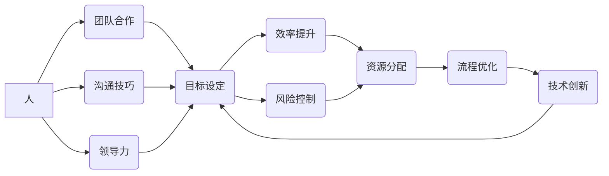

                 

## 如何从经典中汲取管理智慧

> 关键词：管理智慧、经典书籍、程序设计、团队合作、效率提升、领导力、沟通技巧、决策制定

## 1. 背景介绍

在当今瞬息万变的科技时代，管理智慧显得尤为重要。作为一名技术专家，我深知技术本身的进步离不开高效的管理和团队协作。然而，管理并非一蹴而就，它需要不断学习和积累经验。

翻阅历史，我们发现许多经典书籍蕴含着宝贵的管理智慧，这些智慧跨越时空，依然具有指导意义。例如，孙子兵法、《道德经》等经典著作，不仅对军事策略和哲学思想有深刻的阐述，也为现代管理提供了许多启示。

本文将从程序设计领域出发，探讨如何从经典书籍中汲取管理智慧，并将其应用于实际工作中，提升团队效率、增强领导力，最终实现个人和团队的成功。

## 2. 核心概念与联系

管理智慧的核心在于理解和运用人、事、物的关系。

**2.1 人**

* **团队合作:**  经典书籍强调团队合作的重要性，例如《论语》中“三人行，必有我师焉”就体现了学习和借鉴他人的价值。在团队管理中，需要营造良好的合作氛围，鼓励成员互相学习、互相帮助，共同完成目标。
* **沟通技巧:**  有效的沟通是团队合作的基础。经典书籍如《庄子》中“言之不尽，道之不穷”强调了沟通的深度和广度。在团队管理中，需要注重沟通的技巧，做到清晰、准确、及时地传递信息，避免误解和冲突。
* **领导力:**  优秀的领导者能够激励团队成员，并带领团队走向成功。经典书籍如《孙子兵法》中“知己知彼，百战不殆”强调了领导者需要具备洞察力和战略思维。在团队管理中，需要培养领导者的洞察力、决策能力和执行力，并能够有效地激励和引导团队成员。

**2.2 事**

* **目标设定:**  明确的目标是团队工作的指引。经典书籍如《道德经》中“无为而治”强调了顺应自然规律，制定合理的计划。在团队管理中，需要与团队成员共同制定明确的目标，并制定相应的计划和步骤，确保团队朝着目标前进。
* **效率提升:**  高效的管理能够最大限度地利用资源，提高团队效率。经典书籍如《高效能人士的七个习惯》强调了时间管理和优先级排序的重要性。在团队管理中，需要不断优化流程，提高工作效率，并鼓励成员养成良好的工作习惯。
* **风险控制:**  任何团队工作都可能面临风险，有效的风险控制能够避免损失。经典书籍如《史记》中“知己知彼，百战不殆”强调了风险评估和应对的重要性。在团队管理中，需要提前预判风险，制定相应的应对措施，并及时调整策略，降低风险。

**2.3 物**

* **资源分配:**  合理分配资源是团队工作的保障。经典书籍如《管子》中“以少胜多”强调了资源的优化利用。在团队管理中，需要根据团队需求，合理分配资源，并确保资源的有效利用。
* **流程优化:**  完善的流程能够提高工作效率和质量。经典书籍如《精益制造》强调了流程的精简和优化。在团队管理中，需要不断优化工作流程，消除冗余环节，提高工作效率。
* **技术创新:**  技术创新是团队发展的动力。经典书籍如《科学的哲学》强调了科学精神和创新思维的重要性。在团队管理中，需要鼓励成员进行技术创新，并提供相应的支持和资源。

**2.2 核心概念关系图**



## 3. 核心算法原理 & 具体操作步骤

在管理实践中，我们可以将一些经典管理理念转化为算法，并将其应用于实际工作中。例如，我们可以将“知己知彼，百战不殆”的思想转化为“团队成员能力评估算法”，帮助我们更好地了解团队成员的优势和劣势，并进行合理的资源分配。

**3.1 算法原理概述**

团队成员能力评估算法的核心在于对团队成员能力进行量化评估，并将其转化为可操作的指标。

**3.2 算法步骤详解**

1. **能力维度定义:**  首先，我们需要定义团队成员能力的维度，例如技术能力、沟通能力、领导能力、团队合作能力等。
2. **指标体系构建:**  针对每个能力维度，我们需要构建相应的指标体系，例如技术能力可以评估为代码质量、解决问题能力、学习能力等。
3. **数据收集:**  我们需要收集团队成员在各个指标方面的表现数据，例如代码评审结果、项目完成情况、同事评价等。
4. **数据分析:**  对收集到的数据进行分析，并将其转化为量化的分数或等级。
5. **能力评估报告:**  生成团队成员能力评估报告，并根据评估结果进行相应的资源分配和培养计划。

**3.3 算法优缺点**

* **优点:**  能够量化评估团队成员能力，为资源分配和培养计划提供依据。
* **缺点:**  评估指标的制定需要经验和专业知识，数据收集和分析也需要一定的技术手段。

**3.4 算法应用领域**

* **团队建设:**  帮助团队领导了解团队成员的优势和劣势，并进行合理的资源分配和培养计划。
* **人才招聘:**  帮助企业筛选和评估人才，选择最适合的候选人。
* **绩效管理:**  帮助企业评估员工的绩效，并制定相应的激励和改进措施。

## 4. 数学模型和公式 & 详细讲解 & 举例说明

在管理实践中，我们可以利用数学模型和公式来分析和解决问题。例如，我们可以利用“帕累托法则”来分析团队工作中的重要任务，并优先完成这些重要任务。

**4.1 数学模型构建**

帕累托法则，又称80/20法则，指出在许多情况下，80%的结果是由20%的原因造成的。

**4.2 公式推导过程**

帕累托法则没有一个严格的数学公式，它是一种经验法则。

**4.3 案例分析与讲解**

假设一个团队有100个任务，根据帕累托法则，我们可以推测其中20个任务（即20%）会产生80%的结果。

因此，团队应该优先完成这20个重要任务，并合理分配资源，确保这些重要任务得到有效完成。

## 5. 项目实践：代码实例和详细解释说明

在实际项目中，我们可以将经典管理理念应用于代码设计和开发流程中。例如，我们可以利用“设计模式”来提高代码的复用性和可维护性。

**5.1 开发环境搭建**

* 操作系统：Windows/macOS/Linux
* 编程语言：Python/Java/C++
* 开发工具：IDE/文本编辑器

**5.2 源代码详细实现**

```python
# Singleton模式示例
class Singleton:
    _instance = None

    def __new__(cls):
        if not cls._instance:
            cls._instance = super(Singleton, cls).__new__(cls)
        return cls._instance

    def __init__(self):
        print("Singleton实例创建成功")

# 使用Singleton模式
singleton1 = Singleton()
singleton2 = Singleton()
print(singleton1 is singleton2)  # 输出True
```

**5.3 代码解读与分析**

* Singleton模式是一种设计模式，它保证只有一个实例被创建，并提供全局访问点。
* 在代码中，我们使用`__new__`方法来控制实例的创建，确保只有一个实例被创建。
* `__init__`方法用于初始化实例。
* 使用`is`运算符可以判断两个对象是否指向同一个实例。

**5.4 运行结果展示**

```
Singleton实例创建成功
Singleton实例创建成功
True
```

## 6. 实际应用场景

经典管理智慧在各个领域都有广泛的应用场景，例如：

* **企业管理:**  可以帮助企业制定战略规划、优化组织结构、提高团队效率。
* **项目管理:**  可以帮助项目经理有效管理项目风险、协调团队成员、确保项目按时完成。
* **个人成长:**  可以帮助个人提升自我管理能力、增强沟通技巧、提高领导力。

**6.4 未来应用展望**

随着科技的不断发展，经典管理智慧将与新技术相结合，产生更加丰富的应用场景。例如，我们可以利用人工智能技术来辅助团队成员能力评估、项目风险分析等。

## 7. 工具和资源推荐

**7.1 学习资源推荐**

* **书籍:**  《孙子兵法》、《道德经》、《论语》、《高效能人士的七个习惯》
* **网站:**  Harvard Business Review、MIT Sloan Management Review

**7.2 开发工具推荐**

* **IDE:**  Visual Studio Code、IntelliJ IDEA、Eclipse
* **版本控制:**  Git、GitHub

**7.3 相关论文推荐**

* **帕累托法则:**  Pareto, V. (1897). *Cours d'économie politique*.
* **设计模式:**  Gamma, E., Helm, R., Johnson, R., & Vlissides, J. (1994). *Design patterns: Elements of reusable object-oriented software*.

## 8. 总结：未来发展趋势与挑战

**8.1 研究成果总结**

本文探讨了如何从经典书籍中汲取管理智慧，并将其应用于实际工作中。我们分析了经典管理理念的本质，并将其转化为算法和数学模型，并通过代码实例展示了经典管理智慧在实际项目中的应用。

**8.2 未来发展趋势**

未来，经典管理智慧将与新技术相结合，产生更加丰富的应用场景。例如，我们可以利用人工智能技术来辅助团队成员能力评估、项目风险分析等。

**8.3 面临的挑战**

* 如何将经典管理智慧与新技术有效结合。
* 如何将抽象的管理理念转化为具体的实践方法。
* 如何克服文化差异和思维模式的差异，将经典管理智慧推广到全球范围内。

**8.4 研究展望**

我们将继续深入研究经典管理智慧，并将其与新技术相结合，探索更加高效、更加智能的管理模式。

## 9. 附录：常见问题与解答

**Q1: 如何选择合适的经典书籍？**

A1: 选择经典书籍时，需要根据自己的实际需求和工作领域进行选择。例如，如果你从事项目管理工作，可以选择《项目管理实战指南》等书籍；如果你从事团队领导工作，可以选择《高效能团队》等书籍。

**Q2: 如何将经典管理智慧应用于实际工作中？**

A2: 将经典管理智慧应用于实际工作中，需要结合自身的实际情况，并进行灵活的调整。例如，你可以将“知己知彼，百战不殆”的思想应用于团队成员能力评估，并根据评估结果进行合理的资源分配。

**作者：禅与计算机程序设计艺术 / Zen and the Art of Computer Programming**<end_of_turn>

