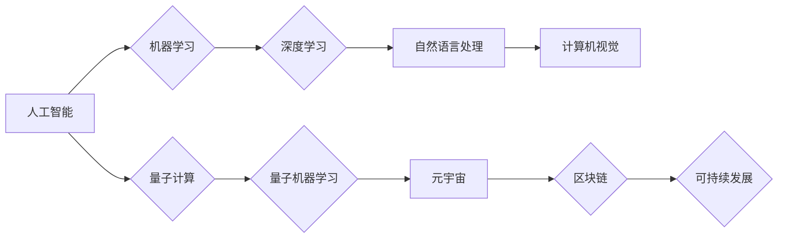

                 

## 2050年的未来学：从预测到创造的前瞻性思维

> 关键词：人工智能、机器学习、量子计算、元宇宙、区块链、可持续发展、未来趋势

### 1. 背景介绍

2050年，距离我们已不足30年。在这个充满变革与机遇的时代，科技的飞速发展正在深刻地改变着人类社会的面貌。从人工智能的爆发式增长到量子计算的突破性进展，从元宇宙的虚拟世界到区块链的去中心化浪潮，科技的进步正在加速构建一个全新的未来。

然而，未来并非仅仅是技术的堆砌，更需要我们对未来进行深入的思考和预测，并积极地参与到未来的创造中。本文将从多个维度探讨2050年的未来学，试图描绘一个更加清晰、更加可预期的未来。

### 2. 核心概念与联系

2050年的未来学的核心概念包括人工智能、机器学习、量子计算、元宇宙、区块链、可持续发展等。这些概念相互关联，共同构成了未来世界的基石。

**Mermaid 流程图：**



**人工智能 (AI)**：人工智能是模拟人类智能的计算机系统，它能够学习、推理、解决问题和做出决策。

**机器学习 (ML)**：机器学习是人工智能的一个子领域，它通过算法使计算机能够从数据中学习，并根据学习到的知识进行预测或分类。

**深度学习 (DL)**：深度学习是机器学习的一个子领域，它使用多层神经网络来模拟人类大脑的学习过程。

**自然语言处理 (NLP)**：自然语言处理是人工智能的一个子领域，它使计算机能够理解和处理人类语言。

**计算机视觉 (CV)**：计算机视觉是人工智能的一个子领域，它使计算机能够“看到”和理解图像和视频。

**量子计算 (QC)**：量子计算利用量子力学原理进行计算，它具有超越经典计算机的计算能力。

**量子机器学习 (QML)**：量子机器学习是将量子计算应用于机器学习领域，它可以加速机器学习算法的训练和推理过程。

**元宇宙 (Metaverse)**：元宇宙是一个虚拟世界，它融合了现实世界和虚拟世界，并提供沉浸式体验。

**区块链 (Blockchain)**：区块链是一种分布式账本技术，它可以记录和验证交易信息，并确保数据的安全性和透明性。

**可持续发展 (Sustainability)**：可持续发展是指满足当前需求，同时不损害未来世代满足其自身需求的能力。

### 3. 核心算法原理 & 具体操作步骤

#### 3.1  算法原理概述

本文将重点探讨深度学习算法，因为它在2050年的未来学中扮演着至关重要的角色。深度学习算法通过多层神经网络来模拟人类大脑的学习过程，能够从海量数据中提取特征，并进行复杂的模式识别和预测。

#### 3.2  算法步骤详解

深度学习算法的训练过程主要包括以下步骤：

1. **数据预处理**: 将原始数据进行清洗、转换和格式化，使其适合深度学习模型的训练。
2. **网络结构设计**: 根据具体任务选择合适的深度学习模型架构，例如卷积神经网络 (CNN)、循环神经网络 (RNN) 或 Transformer。
3. **参数初始化**: 为模型中的神经元赋予初始权重和偏差值。
4. **前向传播**: 将输入数据通过神经网络层层传递，最终得到输出结果。
5. **损失函数计算**: 计算模型输出结果与真实值的差异，即损失值。
6. **反向传播**: 根据损失值，调整模型参数，使模型输出结果更接近真实值。
7. **优化算法**: 使用优化算法，例如梯度下降法，更新模型参数。
8. **模型评估**: 使用测试数据评估模型的性能，例如准确率、召回率和 F1-score。

#### 3.3  算法优缺点

**优点**:

* **高准确率**: 深度学习算法能够从海量数据中提取复杂特征，从而实现高准确率的预测和分类。
* **自动化学习**: 深度学习算法能够自动学习数据中的模式，无需人工特征工程。
* **泛化能力强**: 深度学习模型能够泛化到新的数据，并适应不同的任务。

**缺点**:

* **数据依赖性强**: 深度学习算法需要大量的训练数据才能达到最佳性能。
* **计算资源消耗大**: 深度学习模型训练需要大量的计算资源，例如GPU。
* **可解释性差**: 深度学习模型的决策过程较为复杂，难以解释其背后的逻辑。

#### 3.4  算法应用领域

深度学习算法在各个领域都有广泛的应用，例如：

* **计算机视觉**: 图像识别、物体检测、图像分割、人脸识别等。
* **自然语言处理**: 文本分类、情感分析、机器翻译、对话系统等。
* **语音识别**: 语音转文本、语音助手等。
* **医疗诊断**: 病理图像分析、疾病预测等。
* **金融风险控制**: 欺诈检测、信用评分等。

### 4. 数学模型和公式 & 详细讲解 & 举例说明

#### 4.1  数学模型构建

深度学习算法的核心是神经网络，它由多个层级的神经元组成。每个神经元接收来自上一层的输入信号，并对其进行加权求和和激活函数处理，最终输出信号传递到下一层。

**激活函数**: 激活函数是神经网络中一个重要的组成部分，它引入非线性，使神经网络能够学习复杂的模式。常见的激活函数包括 sigmoid 函数、ReLU 函数和 tanh 函数。

**损失函数**: 损失函数用于衡量模型预测结果与真实值的差异。常见的损失函数包括均方误差 (MSE) 和交叉熵 (Cross-Entropy)。

#### 4.2  公式推导过程

**前向传播**:

假设神经网络有 L 层，第 l 层有 N_l 个神经元，输入数据为 x，输出为 y。前向传播过程可以表示为：

```
z_l = W_l * a_{l-1} + b_l
a_l = f(z_l)
```

其中：

* z_l 是第 l 层神经元的输入值。
* W_l 是第 l 层神经元的权重矩阵。
* a_{l-1} 是上一层的输出值。
* b_l 是第 l 层神经元的偏置向量。
* f() 是激活函数。

**反向传播**:

反向传播算法用于更新模型参数，使其能够更好地拟合数据。反向传播过程可以概括为以下步骤：

1. 计算损失函数对输出层的误差信号。
2. 将误差信号反向传播到上一层，并计算每个神经元的误差梯度。
3. 使用优化算法更新模型参数，例如权重和偏置。

#### 4.3  案例分析与讲解

**图像分类**:

使用深度学习算法进行图像分类，例如识别猫和狗的图片。

* **数据**: 使用大量猫和狗的图片作为训练数据。
* **模型**: 使用卷积神经网络 (CNN) 作为模型架构。
* **训练**: 使用反向传播算法训练模型，使其能够将猫和狗的图片分类到不同的类别。
* **评估**: 使用测试数据评估模型的准确率。

### 5. 项目实践：代码实例和详细解释说明

#### 5.1  开发环境搭建

使用 Python 语言和 TensorFlow 或 PyTorch 深度学习框架进行开发。

#### 5.2  源代码详细实现

```python
# 使用 TensorFlow 框架实现一个简单的图像分类模型

import tensorflow as tf

# 定义模型架构
model = tf.keras.models.Sequential([
  tf.keras.layers.Conv2D(32, (3, 3), activation='relu', input_shape=(28, 28, 1)),
  tf.keras.layers.MaxPooling2D((2, 2)),
  tf.keras.layers.Conv2D(64, (3, 3), activation='relu'),
  tf.keras.layers.MaxPooling2D((2, 2)),
  tf.keras.layers.Flatten(),
  tf.keras.layers.Dense(10, activation='softmax')
])

# 编译模型
model.compile(optimizer='adam',
              loss='sparse_categorical_crossentropy',
              metrics=['accuracy'])

# 训练模型
model.fit(x_train, y_train, epochs=5)

# 评估模型
loss, accuracy = model.evaluate(x_test, y_test)
print('Test loss:', loss)
print('Test accuracy:', accuracy)
```

#### 5.3  代码解读与分析

* **模型架构**: 该代码定义了一个简单的卷积神经网络 (CNN) 模型，用于图像分类。
* **编译模型**: 使用 Adam 优化器、交叉熵损失函数和准确率指标编译模型。
* **训练模型**: 使用训练数据训练模型，训练 epochs=5 次。
* **评估模型**: 使用测试数据评估模型的性能，打印测试损失和准确率。

#### 5.4  运行结果展示

运行代码后，会输出模型的测试损失和准确率。

### 6. 实际应用场景

#### 6.1  医疗诊断

深度学习算法可以用于分析医学图像，例如 X 光片、CT 扫描和 MRI 图像，辅助医生诊断疾病。

#### 6.2  金融风险控制

深度学习算法可以用于检测金融欺诈、评估信用风险和预测市场波动。

#### 6.3  智能交通

深度学习算法可以用于自动驾驶、交通流量预测和智能停车。

#### 6.4  未来应用展望

未来，深度学习算法将应用于更多领域，例如：

* **个性化教育**: 根据学生的学习情况提供个性化的学习方案。
* **精准医疗**: 根据患者的基因信息和病史提供个性化的治疗方案。
* **科学发现**: 加速科学研究，例如药物研发和材料科学。

### 7. 工具和资源推荐

#### 7.1  学习资源推荐

* **在线课程**: Coursera、edX、Udacity 等平台提供深度学习相关的在线课程。
* **书籍**: 《深度学习》 (Ian Goodfellow)、《动手学深度学习》 (Aurelien Geron) 等书籍。
* **博客**: TensorFlow、PyTorch 等深度学习框架的官方博客。

#### 7.2  开发工具推荐

* **TensorFlow**: Google 开发的开源深度学习框架。
* **PyTorch**: Facebook 开发的开源深度学习框架。
* **Keras**: TensorFlow 上的深度学习 API。

#### 7.3  相关论文推荐

* **ImageNet Classification with Deep Convolutional Neural Networks** (Alex Krizhevsky, Ilya Sutskever, Geoffrey E. Hinton)
* **Deep Residual Learning for Image Recognition** (Kaiming He, Xiangyu Zhang, Shaoqing Ren, Jian Sun)
* **Attention Is All You Need** (Ashish Vaswani, Noam Shazeer, Niki Parmar, Jakob Uszkoreit, Llion Jones, Aidan N. Gomez, Łukasz Kaiser, Illia Polosukhin)

### 8. 总结：未来发展趋势与挑战

#### 8.1  研究成果总结

2050年的未来学研究取得了显著成果，深度学习算法在各个领域取得了突破性进展，人工智能已经成为推动社会发展的重要力量。

#### 8.2  未来发展趋势

未来，未来学研究将朝着以下方向发展：

* **更强大的计算能力**: 量子计算将为深度学习算法提供更强大的计算能力，使其能够解决更复杂的问题。
* **更通用的人工智能**: 研究更通用的人工智能算法，使其能够适应不同的任务和环境。
* **更安全的 AI**: 研究更安全的 AI 算法，防止 AI 被恶意利用。

#### 8.3  面临的挑战

未来学研究也面临着一些挑战：

* **数据隐私**: 如何保护数据隐私，同时利用数据进行 AI 训练是一个重要的挑战。
* **算法可解释性**: 如何提高 AI 算法的可解释性，使其决策过程更加透明，也是一个重要的挑战。
* **伦理问题**: AI 的发展引发了一些伦理问题，例如 AI 决策的责任和 AI 对人类就业的影响，需要认真思考和解决。

#### 8.4  研究展望

未来学研究是一个充满机遇和挑战的领域，需要多学科交叉融合，才能推动人工智能技术的发展和应用，构建更加美好的未来。

### 9. 附录：常见问题与解答

**Q1: 深度学习算法需要多少数据才能训练？**

**A1:** 深度学习算法的数据需求量很大，通常需要数百万甚至数十亿个样本才能达到最佳性能。

**Q2: 深度学习算法的训练过程很耗时，如何加速训练？**

**A2:** 可以使用更强大的计算资源，例如 GPU 或 TPU，以及一些加速训练的技巧，例如数据并行和模型并行。

**Q3: 如何评估深度学习模型的性能？**

**A3:** 可以使用准确率、召回率、F1-score 等指标评估模型的性能。

**Q4: 深度学习算法的决策过程难以解释，如何解决这个问题？**

**A4:** 可以使用可解释 AI (XAI) 技术，例如 LIME 和 SHAP，来解释深度学习模型的决策过程。


作者：禅与计算机程序设计艺术 / Zen and the Art of Computer Programming 
<end_of_turn>

