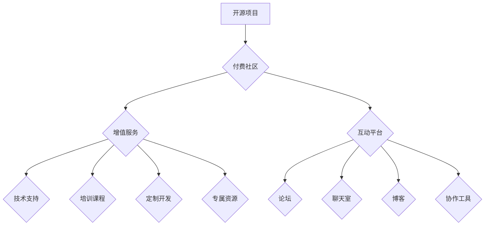

                 

## 建立开源项目的付费社区：增值服务与互动

> 关键词：开源项目、付费社区、增值服务、互动、社区运营、会员制度、技术支持、培训课程、知识共享

## 1. 背景介绍

开源软件已经成为现代软件开发的基石，其灵活、可定制和社区驱动的特性吸引了无数开发者和用户。然而，开源项目往往面临着资金短缺、维护成本高、社区参与度低等挑战。为了解决这些问题，越来越多的开源项目开始探索建立付费社区的模式，通过提供增值服务和互动平台，实现可持续发展。

付费社区的本质是建立一个围绕开源项目构建的生态系统，通过会员制度、订阅服务等方式，为用户提供更优质的服务和体验。这种模式不仅可以为开源项目提供稳定的资金来源，还能增强社区凝聚力，促进项目发展。

## 2. 核心概念与联系

### 2.1  开源项目

开源项目是指源代码公开可供他人修改和使用的软件项目。其核心价值在于：

* **透明度:** 源代码公开，任何人都可以查看和理解项目的内部结构。
* **协作:** 开发者可以共同参与项目开发，分享经验和知识。
* **创新:** 开放的代码库可以激发开发者对项目的改进和扩展，促进技术创新。

### 2.2  付费社区

付费社区是指围绕开源项目构建的会员制社区，通过提供增值服务和互动平台，为用户提供更优质的体验，并收取相应的费用。

### 2.3  增值服务

增值服务是指除了开源软件本身之外，为付费用户提供的额外服务，例如：

* **技术支持:** 提供专业的技术支持和咨询服务。
* **培训课程:** 提供针对开源项目的培训课程和在线教程。
* **定制开发:** 为用户提供定制开发服务，满足其个性化需求。
* **专属资源:** 提供付费用户专属的文档、代码库和工具。

### 2.4  互动平台

互动平台是指为社区成员提供交流和协作的平台，例如：

* **论坛:** 提供讨论、提问和解答的论坛。
* **聊天室:** 提供实时在线交流的聊天室。
* **博客:** 提供个人博客和文章分享平台。
* **协作工具:** 提供代码协作、项目管理和文档编辑等工具。

**核心概念与联系流程图:**

## 3. 核心算法原理 & 具体操作步骤

### 3.1  算法原理概述

建立付费社区的核心算法原理是基于价值交换和社区共建。

* **价值交换:**  开源项目提供免费的软件基础，付费社区提供增值服务和互动平台，两者之间形成价值交换关系。
* **社区共建:**  付费社区鼓励用户参与社区建设，通过贡献代码、分享经验、提供反馈等方式，共同推动项目发展。

### 3.2  算法步骤详解

1. **确定目标用户:**  明确付费社区的目标用户群体，了解他们的需求和痛点。
2. **设计增值服务:**  根据目标用户的需求，设计具有吸引力的增值服务，例如技术支持、培训课程、定制开发等。
3. **构建互动平台:**  搭建一个功能完善的互动平台，方便用户交流和协作。
4. **制定会员制度:**  设计合理的会员制度，提供不同等级的会员服务和权益。
5. **推广社区:**  通过线上线下推广活动，吸引用户加入付费社区。
6. **运营维护:**  持续运营和维护付费社区，提供优质的服务和体验，增强用户粘性。

### 3.3  算法优缺点

**优点:**

* **可持续发展:**  付费社区可以为开源项目提供稳定的资金来源，实现可持续发展。
* **增强社区凝聚力:**  付费社区可以促进用户之间的交流和合作，增强社区凝聚力。
* **提升项目质量:**  付费社区可以吸引更多优秀开发者参与项目开发，提升项目质量。

**缺点:**

* **用户获取成本:**  建立付费社区需要投入一定的成本，例如平台搭建、服务运营等。
* **用户粘性:**  需要持续提供优质的服务和体验，才能保持用户的粘性。
* **公平性:**  需要设计合理的会员制度，避免出现付费用户和免费用户之间的分化。

### 3.4  算法应用领域

付费社区模式可以应用于各种开源项目，例如：

* **软件开发框架:**  提供技术支持、培训课程、定制开发等服务。
* **数据分析工具:**  提供数据分析案例、培训课程、定制模型等服务。
* **机器学习库:**  提供模型训练、部署、优化等服务。
* **云计算平台:**  提供云资源、技术支持、安全保障等服务。

## 4. 数学模型和公式 & 详细讲解 & 举例说明

### 4.1  数学模型构建

我们可以用一个简单的数学模型来描述付费社区的价值交换关系：

* **V:**  用户获得的价值
* **C:**  用户支付的费用
* **S:**  社区提供的增值服务

模型公式：V > C * S

这个公式表明，用户愿意支付费用加入付费社区，前提是他们获得的价值大于等于他们支付的费用乘以社区提供的增值服务水平。

### 4.2  公式推导过程

这个公式的推导过程基于以下假设：

* 用户是理性的，他们会根据自身利益做出决策。
* 用户对价值和费用的感知是主观的，会受到个人需求、预算等因素的影响。
* 社区提供的增值服务水平是可量化的，可以通过服务内容、质量、数量等指标来衡量。

### 4.3  案例分析与讲解

假设一个开源项目开发了一个数据分析工具，其免费版本提供基本的功能，付费版本则提供更高级的功能，例如数据可视化、模型训练等。

* **V:**  付费用户获得的数据分析能力提升、工作效率提高等价值。
* **C:**  付费用户支付的年费。
* **S:**  付费版本提供的增值服务水平，例如功能丰富度、技术支持质量等。

如果付费用户认为数据分析能力提升带来的价值大于等于他们支付的年费乘以付费版本的增值服务水平，那么他们就会选择加入付费社区。

## 5. 项目实践：代码实例和详细解释说明

### 5.1  开发环境搭建

为了建立一个付费社区，需要搭建一个合适的开发环境，包括：

* **服务器:**  提供网站和应用服务的服务器。
* **数据库:**  存储用户数据、社区内容等。
* **开发工具:**  用于开发网站、应用和社区功能的工具。

### 5.2  源代码详细实现

开源社区平台的源代码实现可以参考现有的开源项目，例如 Discourse、Flarum 等。这些项目提供了丰富的功能和模块，可以根据需要进行定制和扩展。

### 5.3  代码解读与分析

开源社区平台的代码主要包含以下几个部分：

* **用户管理:**  处理用户注册、登录、权限管理等功能。
* **社区内容:**  管理论坛、博客、文章等社区内容。
* **增值服务:**  实现技术支持、培训课程、定制开发等增值服务。
* **支付系统:**  处理用户付费和会员管理。

### 5.4  运行结果展示

运行后的付费社区平台可以提供以下功能：

* 用户注册、登录、个人资料管理。
* 论坛、博客、文章发布和评论。
* 技术支持、培训课程、定制开发等增值服务。
* 会员管理、支付处理、账单查询等功能。

## 6. 实际应用场景

付费社区模式已经成功应用于许多开源项目，例如：

* **Red Hat:**  提供企业级开源软件支持和服务。
* **MongoDB:**  提供MongoDB数据库的商业支持和培训课程。
* **Elasticsearch:**  提供Elasticsearch搜索引擎的企业级解决方案。

## 7. 工具和资源推荐

### 7.1  学习资源推荐

* **开源社区运营指南:**  https://opensource.guide/community/
* **社区平台开源项目:**  https://github.com/discourse/discourse, https://github.com/flarum/flarum
* **付费社区案例分析:**  https://www.openhub.net/p/community-driven-open-source-business-models

### 7.2  开发工具推荐

* **Node.js:**  用于开发网站和应用的服务器端语言。
* **React:**  用于开发用户界面的前端框架。
* **MongoDB:**  用于存储用户数据和社区内容的数据库。

### 7.3  相关论文推荐

* **The Economics of Open Source Software:**  https://dl.acm.org/doi/10.1145/1027717.1027729
* **Community-Driven Open Source Business Models:**  https://www.researchgate.net/publication/329735300_Community-Driven_Open_Source_Business_Models

## 8. 总结：未来发展趋势与挑战

### 8.1  研究成果总结

建立开源项目的付费社区是一个有效的商业模式，可以为开源项目提供可持续发展的机会。通过提供增值服务和互动平台，付费社区可以增强用户粘性，提升项目质量，促进社区共建。

### 8.2  未来发展趋势

* **个性化服务:**  付费社区将更加注重用户个性化需求，提供定制化的服务和体验。
* **人工智能应用:**  人工智能技术将被应用于社区运营，例如自动回复、内容推荐、用户画像分析等。
* **元宇宙融合:**  付费社区将与元宇宙技术融合，提供更沉浸式的交互体验。

### 8.3  面临的挑战

* **用户获取成本:**  吸引高质量用户加入付费社区仍然是一个挑战。
* **社区运营成本:**  持续运营和维护付费社区需要投入大量的资源。
* **公平性:**  需要设计合理的会员制度，避免出现付费用户和免费用户之间的分化。

### 8.4  研究展望

未来研究方向包括：

* **更有效的社区运营策略:**  探索更有效的社区运营策略，提高用户参与度和粘性。
* **人工智能驱动的社区服务:**  研究人工智能技术在社区运营中的应用，提高服务效率和个性化程度。
* **元宇宙社区的构建:**  探索元宇宙技术在付费社区中的应用，构建更沉浸式的交互体验。

## 9. 附录：常见问题与解答

**Q1: 如何吸引用户加入付费社区？**

**A1:**  可以通过以下方式吸引用户加入付费社区：

* 提供具有吸引力的增值服务，满足用户的需求。
* 营造良好的社区氛围，鼓励用户参与互动。
* 进行有效的推广宣传，提高社区知名度。

**Q2: 如何设计合理的会员制度？**

**A2:**  会员制度的设计需要考虑以下因素：

* 用户需求和付费意愿。
* 社区运营成本和服务水平。
* 会员权益和等级划分。

**Q3: 如何维护付费社区的公平性？**

**A3:**  可以通过以下方式维护付费社区的公平性：

* 提供免费试用期，让用户体验付费服务。
* 设计合理的会员等级，提供不同级别的服务和权益。
* 鼓励用户贡献，给予贡献者相应的奖励。

作者：禅与计算机程序设计艺术 / Zen and the Art of Computer Programming 
<end_of_turn>

