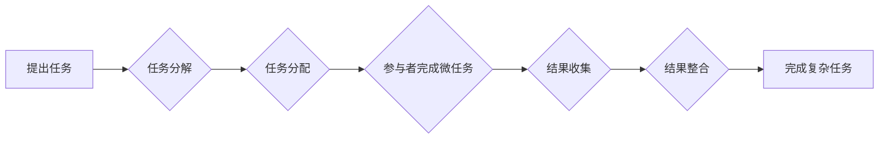

                 

## 微任务，大影响：人类计算的应用

> 关键词：微任务，人类计算，人工智能，数据标注，自动化，效率提升，成本降低，未来趋势

### 1. 背景介绍

在当今数据爆炸的时代，人工智能（AI）正以惊人的速度发展，其核心驱动力之一便是海量数据的训练和标注。然而，传统的数据标注方法往往耗时费力，成本高昂，难以满足AI模型快速迭代的需求。 

人类计算，作为一种利用人类智慧和认知能力进行数据处理的新兴模式，逐渐成为解决这一问题的关键。它将微任务分解成一个个简单易懂的小单元，并通过众包平台或其他方式，将这些微任务分配给全球范围内的参与者，从而实现高效、低成本的数据标注和处理。

### 2. 核心概念与联系

**2.1  微任务的概念**

微任务是指那些可以被独立完成，且相对简单易懂的任务。这些任务通常可以被分解成几个步骤，每个步骤都相对独立，并且可以被单个参与者快速完成。

**2.2  人类计算的原理**

人类计算的核心原理是将复杂的任务分解成一个个微任务，并通过众包平台或其他方式，将这些微任务分配给全球范围内的参与者。参与者完成微任务后，这些结果会被收集并整合，最终完成整个复杂任务。

**2.3  人类计算与AI的联系**

人类计算与AI有着密切的联系。AI模型的训练和标注需要大量的标注数据，而人类计算可以提供高效、低成本的标注数据来源。同时，AI技术也可以用于辅助人类计算，例如自动识别微任务类型、分配任务、评估任务质量等。

**2.4  人类计算的流程图**



### 3. 核心算法原理 & 具体操作步骤

**3.1  算法原理概述**

人类计算的核心算法原理是基于微任务分解和众包的思想。通过将复杂任务分解成一个个简单易懂的微任务，并利用众包平台的优势，可以实现高效、低成本的数据标注和处理。

**3.2  算法步骤详解**

1. **任务分解:** 将复杂任务分解成一个个独立的微任务，每个微任务都具有明确的目标和输出。
2. **任务分配:** 将分解后的微任务分配给合适的参与者，可以根据参与者的技能、经验和地域等因素进行分配。
3. **参与者完成微任务:** 参与者根据任务要求完成微任务，并提交结果。
4. **结果收集:** 收集所有参与者提交的结果，并进行初步的质量检查。
5. **结果整合:** 将收集到的结果进行整合，最终完成整个复杂任务。

**3.3  算法优缺点**

**优点:**

* **高效:** 利用众包平台的优势，可以快速完成大量微任务。
* **低成本:** 相比传统的数据标注方法，人类计算的成本更低。
* **灵活:** 可以根据任务需求灵活调整微任务的规模和难度。

**缺点:**

* **质量控制:** 需要建立有效的质量控制机制，确保微任务的结果质量。
* **数据安全:** 需要妥善处理参与者提交的数据，确保数据安全。
* **激励机制:** 需要设计合理的激励机制，鼓励参与者积极完成微任务。

**3.4  算法应用领域**

人类计算的应用领域非常广泛，包括：

* **人工智能训练数据标注:** 

图像识别、自然语言处理、语音识别等AI模型都需要大量的标注数据，人类计算可以提供高效、低成本的标注数据来源。
* **数据清洗和预处理:** 人类计算可以用于识别和修正数据中的错误、缺失值等问题。
* **内容审核和分类:** 人类计算可以用于审核和分类文本、图像、视频等内容。
* **市场调研和用户反馈收集:** 人类计算可以用于收集用户反馈、进行市场调研等。

### 4. 数学模型和公式 & 详细讲解 & 举例说明

**4.1  数学模型构建**

我们可以用一个简单的数学模型来描述人类计算的效率。假设一个复杂任务可以被分解成n个微任务，每个微任务的完成时间为t，则整个任务的完成时间为：

```latex
T = n * t
```

其中，T表示整个任务的完成时间，n表示微任务的数量，t表示每个微任务的完成时间。

**4.2  公式推导过程**

在人类计算中，我们可以利用众包平台的优势，将微任务分配给多个参与者。假设有m个参与者，每个参与者可以完成k个微任务，则每个参与者的完成时间为：

```latex
t' = t / k
```

整个任务的完成时间可以表示为：

```latex
T' = n / m * t / k
```

其中，T'表示整个任务在人类计算模式下的完成时间。

**4.3  案例分析与讲解**

假设一个图像识别任务需要标注1000张图片，每个图片需要标注5个关键点，每个参与者可以完成10个微任务，每个微任务的完成时间为1分钟。

* **传统数据标注:** 如果采用传统数据标注方法，需要一个标注员完成所有1000张图片的标注，则完成时间为：1000 * 5 * 1 = 5000分钟。
* **人类计算:** 如果采用人类计算模式，可以将1000张图片分配给100个参与者，每个参与者完成10个微任务，则完成时间为：1000 / 100 * 5 / 10 = 50分钟。

从这个例子可以看出，人类计算可以显著提高数据标注的效率。

### 5. 项目实践：代码实例和详细解释说明

**5.1  开发环境搭建**

为了实现人类计算项目，需要搭建一个合适的开发环境。常用的开发环境包括：

* **Python:** Python是一种流行的编程语言，拥有丰富的AI和数据处理库，例如TensorFlow、PyTorch、Pandas等。
* **Django/Flask:** Django和Flask是Python的Web框架，可以用于构建人类计算平台的后台系统。
* **React/Vue.js:** React和Vue.js是前端框架，可以用于构建人类计算平台的用户界面。

**5.2  源代码详细实现**

以下是一个简单的Python代码示例，演示如何使用Python实现一个简单的微任务分配系统：

```python
import random

# 定义微任务列表
tasks = [
    "标注图像中的物体",
    "翻译一段文本",
    "分类一组新闻",
]

# 定义参与者列表
workers = ["Alice", "Bob", "Charlie"]

# 随机分配任务给参与者
for worker in workers:
    task = random.choice(tasks)
    print(f"{worker} 被分配了任务：{task}")
```

**5.3  代码解读与分析**

这段代码首先定义了一个微任务列表和参与者列表。然后，它使用随机选择函数`random.choice()`将任务随机分配给参与者。

**5.4  运行结果展示**

运行这段代码后，会输出类似以下的结果：

```
Alice 被分配了任务：翻译一段文本
Bob 被分配了任务：标注图像中的物体
Charlie 被分配了任务：分类一组新闻
```

### 6. 实际应用场景

**6.1  图像识别数据标注**

在图像识别领域，人类计算可以用于标注图像中的物体、场景、人物等信息。例如，在自动驾驶领域，需要大量的标注数据来训练自动驾驶模型识别道路、行人、车辆等物体。

**6.2  自然语言处理数据标注**

在自然语言处理领域，人类计算可以用于标注文本中的情感、主题、实体等信息。例如，在社交媒体分析领域，需要标注用户评论中的情感倾向，以便更好地理解用户情绪。

**6.3  语音识别数据标注**

在语音识别领域，人类计算可以用于标注语音信号中的文本内容。例如，在语音助手领域，需要标注大量的语音数据来训练语音识别模型，以便更好地理解用户的语音指令。

**6.4  未来应用展望**

随着人工智能技术的不断发展，人类计算的应用场景将会更加广泛。例如，可以利用人类计算来进行科学研究、医疗诊断、法律判决等领域。

### 7. 工具和资源推荐

**7.1  学习资源推荐**

* **Coursera:** 提供了大量的AI和数据科学课程，包括人类计算相关的课程。
* **Udacity:** 提供了针对AI和数据科学的职业培训课程，包括人类计算相关的课程。
* **Kaggle:** 是一家数据科学竞赛平台，提供大量的公开数据集和竞赛任务，可以用于学习和实践人类计算。

**7.2  开发工具推荐**

* **Amazon Mechanical Turk:** 亚马逊的众包平台，可以用于发布和管理微任务。
* **Figure Eight:** 一家专门提供数据标注服务的平台，支持多种数据类型和标注任务。
* **Clickworker:** 一家欧洲的众包平台，提供多种数据标注和微任务服务。

**7.3  相关论文推荐**

* **Human Computation: A Survey**
* **The Power of Human Computation**
* **Crowdsourcing: A New Paradigm for Scientific Discovery**

### 8. 总结：未来发展趋势与挑战

**8.1  研究成果总结**

人类计算作为一种新兴的计算模式，在数据标注、数据清洗、内容审核等领域取得了显著的成果。它利用了人类的智慧和认知能力，有效地解决了传统数据处理方法的瓶颈。

**8.2  未来发展趋势**

未来，人类计算将会朝着以下几个方向发展：

* **自动化程度更高:** 利用AI技术，进一步自动化微任务分配、结果评估等环节，提高效率。
* **应用场景更加广泛:** 扩展到更多领域，例如科学研究、医疗诊断、法律判决等。
* **交互方式更加多样化:** 不仅限于文本和图像，还可以利用语音、视频等多模态交互方式。

**8.3  面临的挑战**

人类计算也面临着一些挑战：

* **数据安全:** 需要建立有效的机制，确保参与者提交的数据安全。
* **质量控制:** 需要建立有效的质量控制机制，确保微任务的结果质量。
* **激励机制:** 需要设计合理的激励机制，鼓励参与者积极完成微任务。

**8.4  研究展望**

未来，我们需要继续研究和探索人类计算的潜力，解决其面临的挑战，并将其应用于更多领域，推动人工智能技术的进步。

### 9. 附录：常见问题与解答

**9.1  什么是微任务？**

微任务是指那些可以被独立完成，且相对简单易懂的任务。

**9.2  人类计算的优势是什么？**

人类计算的优势在于高效、低成本、灵活。

**9.3  人类计算的应用场景有哪些？**

人类计算的应用场景非常广泛，包括数据标注、数据清洗、内容审核、市场调研等。

**9.4  如何参与人类计算？**

可以通过众包平台，例如Amazon Mechanical Turk、Figure Eight、Clickworker等参与人类计算。


作者：禅与计算机程序设计艺术 / Zen and the Art of Computer Programming 
<end_of_turn>

