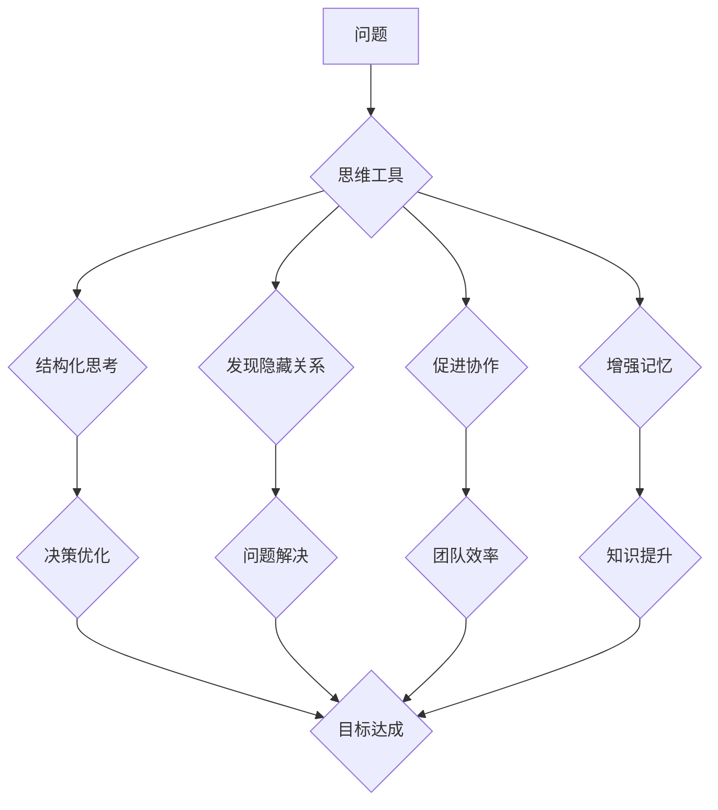

                 

## 思维工具在管理中的实际应用

> 关键词：思维导图、决策树、甘特图、流程图、优先级矩阵、SWOT分析、管理工具、效率提升、问题解决

## 1. 背景介绍

在当今快速变化的商业环境中，高效的管理决策和执行能力至关重要。传统的管理方法往往过于依赖经验和直觉，难以应对复杂性和不确定性。而思维工具作为一种辅助思考和分析的有效手段，能够帮助管理者更清晰地梳理问题、分析情境、制定策略，从而提高决策效率和执行力。

## 2. 核心概念与联系

思维工具涵盖多种形式的图示化思维模型，旨在帮助人们以更直观、更系统的方式思考和解决问题。这些工具可以帮助管理者：

* **结构化思考：** 将复杂的信息分解成更易于理解的片段，并建立逻辑关联。
* **发现隐藏关系：** 通过图示化呈现，揭示问题背后的潜在因果关系和关联性。
* **促进协作：** 提供一个共同的思维平台，方便团队成员进行信息共享和共同决策。
* **增强记忆：** 图像化的思维模型更容易被记忆和理解，从而提高知识的吸收和应用。

**核心概念与联系流程图：**



## 3. 核心算法原理 & 具体操作步骤

### 3.1  算法原理概述

思维工具本身并非基于特定的算法，而是基于图示化思维模型和逻辑推理。其核心原理在于将复杂的信息以图示化的方式呈现，并通过节点、连接线等元素来构建逻辑关系，从而帮助人们更清晰地理解和分析问题。

### 3.2  算法步骤详解

1. **定义问题：** 明确需要解决的问题或目标。
2. **构建思维框架：** 根据问题，选择合适的思维工具，并构建相应的思维框架。
3. **填充节点：** 将相关信息、概念、想法等填充到思维框架的节点中。
4. **建立连接：** 使用连接线或箭头，建立节点之间的逻辑关系。
5. **分析和总结：** 分析思维框架中的结构和关系，并进行总结和归纳。

### 3.3  算法优缺点

**优点：**

* **直观易懂：** 图示化的思维模型更容易被理解和记忆。
* **逻辑清晰：** 可以帮助人们梳理思路，建立逻辑关系。
* **促进协作：** 提供一个共同的思维平台，方便团队成员进行信息共享和共同决策。

**缺点：**

* **主观性强：** 思维工具的构建和分析存在一定的主观性，可能受到个人经验和认知 biases 的影响。
* **复杂问题处理能力有限：** 对于过于复杂的问题，思维工具可能难以提供完整的解决方案。
* **需要一定的学习成本：** 掌握不同的思维工具和使用方法需要一定的学习时间和实践。

### 3.4  算法应用领域

思维工具广泛应用于各个领域，例如：

* **管理决策：** 帮助管理者分析问题、制定策略、评估风险。
* **项目管理：** 规划项目进度、分配任务、跟踪执行情况。
* **创意写作：** 激发灵感、构思故事、组织情节。
* **学习和研究：** 梳理知识结构、理解概念关系、记忆重要信息。

## 4. 数学模型和公式 & 详细讲解 & 举例说明

思维工具本身并非基于严格的数学模型，但一些思维工具的构建和应用可以借鉴数学模型的思想。例如，优先级矩阵可以利用数学公式来计算不同因素的权重，从而帮助决策者做出更合理的判断。

### 4.1  数学模型构建

优先级矩阵是一种常用的决策工具，它利用矩阵形式来评估不同方案的优劣。

**构建步骤：**

1. 列出所有需要考虑的因素。
2. 为每个因素赋予权重，权重越高表示该因素越重要。
3. 对每个方案，根据每个因素的评分，计算出该方案的总分。
4. 选择总分最高的方案作为最佳方案。

### 4.2  公式推导过程

优先级矩阵的计算公式如下：

```latex
总分 = ∑ (权重 * 评分)
```

其中：

* ∑ 表示求和符号
* 权重表示每个因素的权重
* 评分表示每个方案在每个因素上的评分

### 4.3  案例分析与讲解

假设我们要选择一个新的办公地点，需要考虑以下因素：

* 交通便利性 (权重：0.3)
* 办公空间大小 (权重：0.2)
* 租金价格 (权重：0.5)

我们对三个候选地点进行评估，评分如下：

| 地点 | 交通便利性 | 办公空间大小 | 租金价格 |
|---|---|---|---|
| A | 4 | 3 | 2 |
| B | 3 | 5 | 1 |
| C | 2 | 4 | 3 |

根据公式，我们可以计算出每个地点的总分：

* 地点 A: (0.3 * 4) + (0.2 * 3) + (0.5 * 2) = 1.2 + 0.6 + 1 = 2.8
* 地点 B: (0.3 * 3) + (0.2 * 5) + (0.5 * 1) = 0.9 + 1 + 0.5 = 2.4
* 地点 C: (0.3 * 2) + (0.2 * 4) + (0.5 * 3) = 0.6 + 0.8 + 1.5 = 2.9

因此，地点 C 的总分最高，被选为最佳办公地点。

## 5. 项目实践：代码实例和详细解释说明

### 5.1  开发环境搭建

本示例使用 Python 语言和 Graphviz 库来实现一个简单的思维导图工具。

**依赖库：**

* Python 3.x
* Graphviz

**安装步骤：**

```bash
pip install graphviz
```

### 5.2  源代码详细实现

```python
from graphviz import Digraph

def create_mind_map(title, branches):
    """
    创建思维导图

    Args:
        title: 思维导图标题
        branches: 分支列表，每个分支包含标题和子分支列表
    """
    dot = Digraph(comment=title)
    dot.node(title, title)

    for branch in branches:
        dot.node(branch['title'], branch['title'])
        dot.edge(title, branch['title'])
        if 'subbranches' in branch:
            create_mind_map(branch['title'], branch['subbranches'])

    return dot

# 示例数据
branches = [
    {
        'title': '项目管理',
        'subbranches': [
            {'title': '需求分析'},
            {'title': '设计阶段', 'subbranches': [
                {'title': '用户界面设计'},
                {'title': '数据库设计'}
            ]},
            {'title': '开发阶段'}
        ]
    },
    {
        'title': '测试与部署',
        'subbranches': [
            {'title': '单元测试'},
            {'title': '集成测试'},
            {'title': '部署环境'}
        ]
    }
]

# 创建思维导图
mind_map = create_mind_map('项目流程', branches)

# 保存思维导图
mind_map.render('mind_map', view=True)
```

### 5.3  代码解读与分析

该代码首先定义了一个 `create_mind_map` 函数，用于根据标题和分支列表创建思维导图。

函数内部使用 Graphviz 库创建了一个 Digraph 对象，并添加了标题节点。然后，它遍历分支列表，为每个分支创建节点并连接到标题节点。如果分支包含子分支，则递归调用 `create_mind_map` 函数创建子分支的思维导图。

最后，代码使用示例数据创建了一个思维导图，并将其保存为一个图形文件。

### 5.4  运行结果展示

运行该代码后，将生成一个名为 `mind_map.gv` 的图形文件，该文件包含一个简单的思维导图，展示了项目流程的各个阶段。

## 6. 实际应用场景

思维工具在管理实践中有着广泛的应用场景，例如：

### 6.1  决策分析

* **SWOT 分析：** 分析企业内部的优势、劣势、外部的机会和威胁，为决策提供参考。
* **优先级矩阵：** 评估不同方案的优劣，帮助决策者做出选择。
* **决策树：** 构建决策流程，分析不同决策路径的可能性和结果。

### 6.2  项目管理

* **甘特图：** 规划项目进度，分配任务，跟踪执行情况。
* **流程图：** 描述业务流程，识别瓶颈和改进点。
* **思维导图：** 梳理项目目标、任务和关键信息，促进团队协作。

### 6.3  团队协作

* **头脑风暴：** 鼓励团队成员自由表达想法，并通过思维导图记录和整理创意。
* **问题解决：** 使用思维导图分析问题，识别根源，并寻找解决方案。
* **知识管理：** 将知识点以思维导图的形式呈现，方便团队成员学习和共享。

### 6.4  未来应用展望

随着人工智能和数据分析技术的不断发展，思维工具将更加智能化和个性化。未来，我们可以期待：

* **自动生成思维导图：** 基于文本数据或语音输入，自动生成思维导图。
* **智能分析和推荐：** 利用人工智能算法分析思维导图，提供 insights 和决策建议。
* **个性化思维工具：** 根据用户的需求和习惯，定制个性化的思维工具。

## 7. 工具和资源推荐

### 7.1  学习资源推荐

* **书籍：**
    * 《思维导图》 - Tony Buzan
    * 《高效能人士的七个习惯》 - Stephen Covey
* **在线课程：**
    * Coursera: Mind Mapping for Productivity
    * Udemy: Mind Mapping Masterclass

### 7.2  开发工具推荐

* **Graphviz:** 用于生成图形表示的开源工具。
* **Lucidchart:** 在线思维导图工具，提供丰富的模板和功能。
* **Miro:** 在线协作工具，支持思维导图、白板和流程图等多种功能。

### 7.3  相关论文推荐

* **Mind Mapping: A Review of the Literature** - Tony Buzan
* **The Use of Mind Mapping in Problem Solving** - David A. Kolb
* **Mind Mapping for Knowledge Management** - Michael J. Gelb

## 8. 总结：未来发展趋势与挑战

### 8.1  研究成果总结

思维工具在管理实践中取得了显著的成果，帮助人们提高决策效率、增强团队协作、促进知识管理。

### 8.2  未来发展趋势

未来，思维工具将更加智能化、个性化和协作化。人工智能技术将赋予思维工具更强大的分析和推荐能力，而云计算和移动互联网的发展将使思维工具更加普及和便捷。

### 8.3  面临的挑战

思维工具的应用也面临一些挑战，例如：

* **主观性强：** 思维工具的构建和分析存在一定的主观性，需要不断改进算法和模型，降低主观影响。
* **复杂问题处理能力有限：** 对于过于复杂的问题，思维工具可能难以提供完整的解决方案，需要结合其他工具和方法。
* **用户接受度：** 一些人可能对思维工具的使用感到陌生，需要加强推广和培训，提高用户接受度。

### 8.4  研究展望

未来，我们需要继续探索思维工具的应用场景，开发更智能、更易用、更具针对性的思维工具，并将其与其他管理工具和技术相结合，构建更加完善的管理体系。

## 9. 附录：常见问题与解答

**Q1: 如何选择合适的思维工具？**

**A1:** 选择思维工具时，需要根据具体的需求和场景进行选择。例如，对于项目管理，甘特图和流程图更合适；对于决策分析，SWOT 分析和优先级矩阵更实用。

**Q2: 如何使用思维工具提高效率？**

**A2:** 使用思维工具时，需要注意以下几点：

* **明确目标：** 在使用思维工具之前，需要明确自己的目标是什么。
* **结构化思考：** 将信息分解成更易于理解的片段，并建立逻辑关系。
* **简洁明了：** 使用简洁的语言和图形，避免信息过载。
* **定期回顾：** 定期回顾思维导图，更新信息和调整思路。


作者：禅与计算机程序设计艺术 / Zen and the Art of Computer Programming<end_of_turn>

