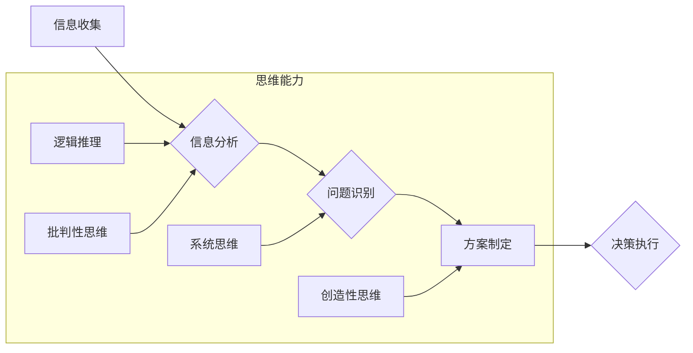

                 

## 思维能力对管理决策的影响

> 关键词：决策、思维能力、认知偏差、逻辑推理、系统思维、创新、人工智能、数据分析

## 1. 背景介绍

在当今瞬息万变的商业环境中，高效的管理决策至关重要。决策者需要能够快速准确地分析信息，识别趋势，并做出有利于组织发展的选择。然而，决策并非总是基于理性分析，往往受到各种认知偏差和情绪影响。因此，提升决策者的思维能力，成为提高管理决策质量的关键。

## 2. 核心概念与联系

### 2.1 思维能力

思维能力是指个体运用认知功能进行信息处理、解决问题、进行创造性思考的能力。它包括逻辑推理、批判性思维、系统思维、创造性思维等多个方面。

### 2.2 管理决策

管理决策是指管理者在特定情境下，根据组织目标和资源状况，选择最佳行动方案的过程。它涉及信息收集、分析、评估、选择和执行等多个环节。

### 2.3 联系

思维能力是管理决策的基础。决策者需要具备良好的思维能力才能有效地收集、分析和评估信息，识别问题和机会，并制定合理的决策方案。

**Mermaid 流程图**



## 3. 核心算法原理 & 具体操作步骤

### 3.1 算法原理概述

决策分析算法是一种用于辅助决策者做出最佳选择的方法。它通过建立数学模型，量化决策因素，并利用算法进行计算，来评估不同方案的优劣，并推荐最佳方案。

### 3.2 算法步骤详解

1. **定义决策目标:** 明确决策的目标是什么，需要达成的结果是什么。
2. **识别决策因素:** 确定影响决策的因素有哪些，并对其进行量化。
3. **构建决策模型:** 建立数学模型，描述决策因素之间的关系，并定义决策目标的评价指标。
4. **收集数据:** 收集决策因素的数据，并进行清洗和处理。
5. **进行算法计算:** 利用决策分析算法，对决策模型进行计算，评估不同方案的优劣。
6. **分析结果:** 分析算法计算的结果，并结合实际情况，做出最终决策。

### 3.3 算法优缺点

**优点:**

* **量化决策:** 将决策因素量化，避免主观判断的影响。
* **系统分析:** 对决策因素进行系统分析，考虑多方面因素的影响。
* **方案比较:** 可以比较不同方案的优劣，帮助决策者做出更明智的选择。

**缺点:**

* **模型复杂:** 建立决策模型需要专业知识和经验。
* **数据依赖:** 算法结果依赖于数据的准确性和完整性。
* **局限性:** 无法完全模拟现实世界的复杂性。

### 3.4 算法应用领域

决策分析算法广泛应用于各个领域，例如：

* **商业决策:** 产品开发、市场营销、投资决策等。
* **金融决策:** 风险管理、资产配置、投资组合优化等。
* **医疗决策:** 诊断、治疗方案选择、药物研发等。
* **公共政策决策:** 政策制定、资源分配、社会规划等。

## 4. 数学模型和公式 & 详细讲解 & 举例说明

### 4.1 数学模型构建

决策分析模型通常采用决策树、贝叶斯网络、模糊逻辑等方法构建。

**决策树:**

决策树是一种树形结构的模型，用于表示决策过程。每个节点代表一个决策点，每个分支代表一个可能的决策结果。

**贝叶斯网络:**

贝叶斯网络是一种概率图模型，用于表示变量之间的依赖关系。

**模糊逻辑:**

模糊逻辑是一种处理不确定性和模糊信息的逻辑系统。

### 4.2 公式推导过程

决策分析算法的具体公式推导过程取决于所使用的模型类型。例如，决策树的构建通常基于信息增益或基尼不纯度等指标。

### 4.3 案例分析与讲解

**案例:**

假设一家公司需要决定是否投资开发新产品。

**决策因素:**

* 市场需求
* 产品成本
* 竞争对手情况

**决策目标:**

* 提高市场份额
* 提升利润率

**模型构建:**

可以使用决策树模型来分析该决策问题。

**公式推导:**

信息增益公式可以用来评估不同特征对决策结果的影响。

**案例分析:**

通过分析市场需求、产品成本和竞争对手情况等因素，决策树模型可以帮助公司评估投资新产品的风险和收益，并做出最佳决策。

## 5. 项目实践：代码实例和详细解释说明

### 5.1 开发环境搭建

* 操作系统: Windows/macOS/Linux
* 编程语言: Python
* 库: scikit-learn, pandas, matplotlib

### 5.2 源代码详细实现

```python
import pandas as pd
from sklearn.tree import DecisionTreeClassifier
from sklearn.model_selection import train_test_split
from sklearn.metrics import accuracy_score

# 加载数据
data = pd.read_csv('data.csv')

# 划分训练集和测试集
X = data.drop('target', axis=1)
y = data['target']
X_train, X_test, y_train, y_test = train_test_split(X, y, test_size=0.2, random_state=42)

# 构建决策树模型
model = DecisionTreeClassifier()

# 训练模型
model.fit(X_train, y_train)

# 预测测试集结果
y_pred = model.predict(X_test)

# 计算模型准确率
accuracy = accuracy_score(y_test, y_pred)
print('模型准确率:', accuracy)
```

### 5.3 代码解读与分析

* 数据加载: 使用 pandas 库加载数据文件。
* 数据划分: 使用 train_test_split 函数将数据划分成训练集和测试集。
* 模型构建: 使用 DecisionTreeClassifier 类构建决策树模型。
* 模型训练: 使用 fit 函数训练模型。
* 模型预测: 使用 predict 函数预测测试集结果。
* 模型评估: 使用 accuracy_score 函数计算模型准确率。

### 5.4 运行结果展示

运行代码后，会输出模型的准确率。

## 6. 实际应用场景

### 6.1 商业决策

* **产品开发:** 决策树模型可以帮助公司分析市场需求、竞争对手情况等因素，评估新产品开发的风险和收益。
* **市场营销:** 贝叶斯网络模型可以帮助公司分析客户行为、市场趋势等因素，制定更有效的营销策略。

### 6.2 金融决策

* **风险管理:** 决策分析算法可以帮助金融机构评估投资风险，制定风险控制策略。
* **资产配置:** 贝叶斯网络模型可以帮助投资者分析市场波动、资产收益等因素，制定合理的资产配置方案。

### 6.3 医疗决策

* **诊断:** 决策树模型可以帮助医生分析患者症状、病史等信息，辅助诊断疾病。
* **治疗方案选择:** 贝叶斯网络模型可以帮助医生分析患者病情、治疗方案等信息，选择最合适的治疗方案。

### 6.4 未来应用展望

随着人工智能技术的不断发展，决策分析算法将在更多领域得到应用，例如：

* **自动驾驶:** 决策树模型可以帮助自动驾驶系统分析路况、交通规则等信息，做出安全可靠的驾驶决策。
* **个性化教育:** 贝叶斯网络模型可以帮助教育系统分析学生的学习情况、兴趣爱好等信息，制定个性化的学习方案。

## 7. 工具和资源推荐

### 7.1 学习资源推荐

* **书籍:**
    * 《决策分析》
    * 《人工智能》
    * 《数据挖掘》
* **在线课程:**
    * Coursera: 决策分析
    * edX: 人工智能
    * Udacity: 数据科学

### 7.2 开发工具推荐

* **Python:** 广泛应用于数据分析和机器学习领域。
* **R:** 专注于统计分析和数据可视化。
* **MATLAB:** 用于数值计算和建模。

### 7.3 相关论文推荐

* **决策树算法:**
    * Quinlan, J. R. (1986). Induction of decision trees. Machine learning, 1(1), 81-106.
* **贝叶斯网络算法:**
    * Pearl, J. (1988). Probabilistic reasoning in intelligent systems: Networks of plausible inference. Morgan Kaufmann.

## 8. 总结：未来发展趋势与挑战

### 8.1 研究成果总结

决策分析算法在各个领域取得了显著的成果，帮助决策者做出更明智的选择。

### 8.2 未来发展趋势

* **人工智能的融合:** 将人工智能技术与决策分析算法相结合，提高决策的智能化和自动化程度。
* **大数据的应用:** 利用大数据分析技术，获取更丰富的信息，提高决策的准确性和有效性。
* **解释性决策:** 开发能够解释决策结果的算法，提高决策的可解释性和可信度。

### 8.3 面临的挑战

* **模型复杂性:** 决策模型的复杂性不断增加，需要开发更有效的建模和分析方法。
* **数据质量:** 决策算法的准确性依赖于数据的质量，需要解决数据清洗、处理和验证等问题。
* **伦理问题:** 决策算法的应用可能带来伦理问题，需要制定相应的规范和制度。

### 8.4 研究展望

未来，决策分析算法将继续朝着更智能化、更自动化、更可解释的方向发展，为决策者提供更强大的工具和支持。


## 9. 附录：常见问题与解答

**常见问题:**

* **决策分析算法的适用范围是什么？**

决策分析算法适用于各种决策问题，例如商业决策、金融决策、医疗决策等。

* **决策分析算法的局限性是什么？**

决策分析算法的局限性包括模型复杂性、数据依赖性和对现实世界复杂性的模拟能力有限。

* **如何选择合适的决策分析算法？**

选择合适的决策分析算法需要根据具体决策问题的特点和数据情况进行选择。

**解答:**

* 决策分析算法的适用范围广泛，但需要根据具体问题进行选择。
* 决策分析算法的局限性需要在应用中加以考虑。
* 选择合适的决策分析算法需要综合考虑多个因素。


作者：禅与计算机程序设计艺术 / Zen and the Art of Computer Programming 
<end_of_turn>

