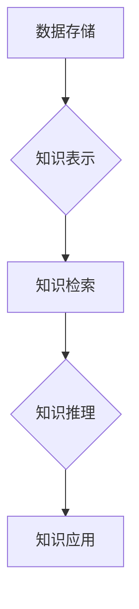

                 

## 打造个人知识库:程序员的效率提升之道

> 关键词：知识库、个人知识管理、程序员效率、学习方法、知识沉淀、信息检索、知识图谱、人工智能

## 1. 背景介绍

在当今信息爆炸的时代，程序员面临着海量技术信息和知识的挑战。如何有效地获取、存储、整理和利用这些知识，成为了提升程序员效率和专业能力的关键问题。个人知识库 (Personal Knowledge Base, PKB) 正是解决这一问题的有效途径。

个人知识库是指程序员根据自身学习和工作需求，构建并维护的知识体系。它可以包含各种形式的知识，例如代码片段、技术文档、学习笔记、思考记录、项目经验等。通过构建个人知识库，程序员可以实现知识的沉淀、复用和共享，从而提高学习效率、解决问题能力和工作效率。

## 2. 核心概念与联系

### 2.1 知识图谱

知识图谱 (Knowledge Graph, KG) 是一个用于表示和组织知识的结构化数据模型。它将知识元素（实体和关系）以节点和边的方式连接起来，形成一个网络结构。知识图谱可以帮助程序员更直观地理解和导航知识，并进行更深入的知识挖掘和推理。

### 2.2 个人知识库架构

个人知识库的架构通常包括以下几个关键部分：

* **数据存储:** 知识库的数据可以存储在各种形式的数据库中，例如关系数据库、文档数据库、图数据库等。
* **知识表示:** 知识库中的知识需要使用一种标准化的格式进行表示，例如 RDF、OWL 等。
* **知识检索:** 程序员需要能够快速高效地检索到所需的知识。
* **知识推理:** 知识库可以支持一些基本的知识推理功能，例如基于规则的推理、基于机器学习的推理等。



## 3. 核心算法原理 & 具体操作步骤

### 3.1 算法原理概述

构建个人知识库的核心算法主要包括：

* **知识抽取:** 从文本数据中提取知识实体和关系。
* **知识表示:** 将提取的知识实体和关系转换为标准化的知识表示格式。
* **知识图谱构建:** 将知识实体和关系连接起来，构建知识图谱。
* **知识检索:** 根据用户查询，从知识图谱中检索出相关知识。

### 3.2 算法步骤详解

1. **数据收集:** 收集各种形式的知识数据，例如代码片段、技术文档、学习笔记、项目经验等。
2. **数据预处理:** 对收集到的数据进行清洗、格式化和结构化处理。
3. **知识抽取:** 使用自然语言处理 (NLP) 技术，从预处理后的数据中提取知识实体和关系。
4. **知识表示:** 将提取的知识实体和关系转换为标准化的知识表示格式，例如 RDF 或 OWL。
5. **知识图谱构建:** 将知识实体和关系连接起来，构建知识图谱。
6. **知识检索:** 使用搜索引擎或知识图谱查询引擎，根据用户查询，从知识图谱中检索出相关知识。

### 3.3 算法优缺点

**优点:**

* 可以有效地沉淀和组织知识。
* 可以提高知识的复用性和共享性。
* 可以帮助程序员更快速地解决问题。

**缺点:**

* 构建知识库需要投入一定的精力和时间。
* 需要掌握一定的知识表示和数据处理技术。
* 知识库的维护需要持续的更新和完善。

### 3.4 算法应用领域

个人知识库的应用领域非常广泛，例如：

* **程序员学习:** 记录学习笔记、整理代码片段、构建技术知识体系。
* **项目开发:** 记录项目经验、管理项目文档、协同开发。
* **技术研究:** 收集和分析技术文献、构建知识图谱、进行技术探索。

## 4. 数学模型和公式 & 详细讲解 & 举例说明

### 4.1 数学模型构建

知识图谱可以表示为一个三元组 (实体, 关系, 实体) 的集合。

* 实体 (Entity) 是知识图谱中的基本单元，可以是人、地点、事物等。
* 关系 (Relation) 描述实体之间的连接，例如“工作于”、“出生于”等。

### 4.2 公式推导过程

知识图谱的推理可以基于规则或机器学习算法。

* **规则推理:** 使用预定义的规则进行知识推理，例如“如果 A 工作于 B，则 A 的工作地点是 B”。
* **机器学习推理:** 使用机器学习算法从知识图谱中学习知识关系，并进行预测或分类。

### 4.3 案例分析与讲解

例如，我们可以构建一个简单的知识图谱，表示程序员的学习关系。

* 实体: 程序员、技术、课程
* 关系: 学习、掌握

我们可以用以下三元组表示程序员学习技术的知识关系:

* (程序员1, 学习, 技术A)
* (程序员2, 学习, 课程B)
* (课程B, 掌握, 技术A)

通过这些三元组，我们可以进行一些简单的推理，例如:

* 程序员2 掌握了技术A。

## 5. 项目实践：代码实例和详细解释说明

### 5.1 开发环境搭建

* 语言: Python
* 库: rdflib, networkx

### 5.2 源代码详细实现

```python
from rdflib import Graph, Literal, Namespace
from rdflib.namespace import RDF, RDFS

# 创建知识图谱
g = Graph()

# 定义命名空间
ns = Namespace("http://example.org/")

# 添加知识三元组
g.add((ns.Program1, RDF.type, ns.Person))
g.add((ns.Program1, ns.worksAt, ns.CompanyA))
g.add((ns.Program2, RDF.type, ns.Person))
g.add((ns.Program2, ns.studies, ns.CourseB))
g.add((ns.CourseB, RDFS.subClassOf, ns.Technology))
g.add((ns.Program2, ns.masters, ns.TechnologyA))

# 查询知识
for s, p, o in g.triples((ns.Program2, None, None)):
    print(f"{s} {p} {o}")
```

### 5.3 代码解读与分析

* 代码首先创建了一个知识图谱对象 `g`。
* 然后定义了一个命名空间 `ns`，用于标识知识图谱中的实体和关系。
* 接着添加了一些知识三元组，例如 `Program1` 工作于 `CompanyA`。
* 最后使用 `g.triples()` 方法查询知识图谱中的所有三元组，并打印出来。

### 5.4 运行结果展示

```
Program2 http://www.w3.org/1999/02/22-rdf-syntax-ns#type Program2
Program2 http://example.org/studies CourseB
CourseB http://www.w3.org/2000/01/rdf-schema#subClassOf Technology
Program2 http://example.org/masters TechnologyA
```

## 6. 实际应用场景

### 6.1 程序员学习

* 记录学习笔记，例如代码片段、算法讲解、技术文档总结等。
* 整理知识体系，将学习到的知识按照主题、框架或层次结构进行组织。
* 构建知识图谱，将知识实体和关系连接起来，形成一个可视化的知识网络。

### 6.2 项目开发

* 记录项目经验，例如项目流程、技术方案、问题解决方法等。
* 管理项目文档，例如需求文档、设计文档、测试文档等。
* 协同开发，共享知识和经验，提高团队效率。

### 6.3 技术研究

* 收集和分析技术文献，例如论文、博客文章、开源代码等。
* 构建知识图谱，分析技术趋势和发展方向。
* 进行技术探索，发现新的技术应用场景和解决方案。

### 6.4 未来应用展望

随着人工智能技术的进步，个人知识库将更加智能化和个性化。

* **智能知识提取:** 使用人工智能技术自动提取知识，减少人工干预。
* **个性化知识推荐:** 根据用户的学习兴趣和工作需求，推荐相关的知识资源。
* **知识协作:** 支持多人协同构建和维护知识库，促进知识共享和传播。

## 7. 工具和资源推荐

### 7.1 学习资源推荐

* **书籍:**
    * 《构建个人知识库》
    * 《知识管理》
    * 《人工智能》
* **在线课程:**
    * Coursera: 知识图谱
    * edX: 自然语言处理
    * Udemy: 个人知识管理

### 7.2 开发工具推荐

* **知识图谱构建工具:**
    * Neo4j
    * GraphDB
    * Stardog
* **数据处理工具:**
    * Python
    * R
    * Spark

### 7.3 相关论文推荐

* **知识图谱:**
    * “A Survey on Knowledge Graph Embedding”
    * “Knowledge Graph Completion via TransE”
* **个人知识管理:**
    * “Personal Knowledge Management: A Review”
    * “Building a Personal Knowledge Base: A Practical Guide”

## 8. 总结：未来发展趋势与挑战

### 8.1 研究成果总结

个人知识库技术已经取得了显著的进展，为程序员提供了高效的知识管理和学习工具。

### 8.2 未来发展趋势

未来，个人知识库将更加智能化、个性化和协作化。

* **人工智能驱动:** 使用人工智能技术自动提取、组织和推荐知识。
* **跨平台融合:** 将知识库与其他工具和平台进行整合，实现知识的无缝共享。
* **社区化发展:** 建立个人知识库社区，促进知识共享和协作。

### 8.3 面临的挑战

* **知识表示标准化:** 缺乏统一的知识表示标准，导致知识库之间难以互操作。
* **知识质量控制:** 知识库中的知识质量参差不齐，需要有效的质量控制机制。
* **知识更新维护:** 知识库需要持续更新和维护，才能保持其有效性。

### 8.4 研究展望

未来研究将重点关注以下几个方面:

* **更智能的知识提取和推理算法:** 提高知识库的自动化程度和智能化水平。
* **更有效的知识表示和组织方法:** 构建更加灵活、可扩展和可维护的知识库。
* **更完善的知识库社区建设:** 促进知识共享和协作，构建一个更加开放和共享的知识生态系统。

## 9. 附录：常见问题与解答

### 9.1 如何构建个人知识库？

构建个人知识库需要以下步骤:

1. **确定目标:** 明确构建知识库的目的和范围。
2. **选择工具:** 选择合适的知识库构建工具和数据处理工具。
3. **收集数据:** 收集各种形式的知识数据，例如代码片段、技术文档、学习笔记等。
4. **数据预处理:** 对收集到的数据进行清洗、格式化和结构化处理。
5. **知识表示:** 将提取的知识实体和关系转换为标准化的知识表示格式。
6. **知识图谱构建:** 将知识实体和关系连接起来，构建知识图谱。
7. **知识检索:** 实现对知识图谱的快速高效的检索功能。
8. **知识维护:** 定期更新和维护知识库，确保其有效性。

### 9.2 个人知识库有什么用？

个人知识库可以帮助程序员:

* **提高学习效率:** 记录学习笔记、整理知识体系、构建知识图谱。
* **解决问题更快速:** 检索相关知识，快速找到解决方案。
* **提升工作效率:** 管理项目文档、协同开发、共享经验。
* **进行技术研究:** 收集和分析技术文献、构建知识图谱、探索新技术。

### 9.3 如何维护个人知识库？

维护个人知识库需要以下步骤:

1. **定期更新:** 定期添加新的知识和更新已有的知识。
2. **知识质量控制:** 确保知识库中的知识准确、完整和可靠。
3. **知识结构优化:** 根据需要调整知识库的结构和组织方式。
4. **知识共享:** 与他人分享知识，促进知识传播和协作。


作者：禅与计算机程序设计艺术 / Zen and the Art of Computer Programming 
<end_of_turn>

