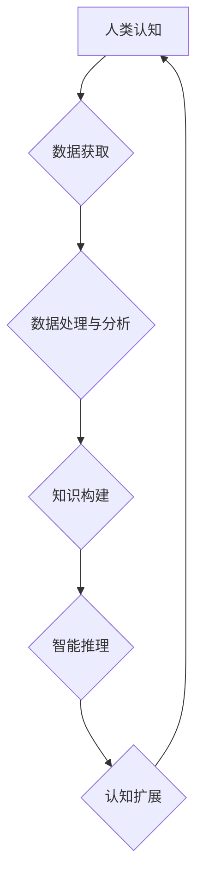

                 

## 探索未知：扩展人类认知

> 关键词：人工智能、认知扩展、深度学习、神经网络、自然语言处理、机器学习、知识图谱

### 1. 背景介绍

人类文明的进步离不开对未知的探索和认知的扩展。从远古人类仰望星空，试图理解宇宙奥秘，到现代科技的飞速发展，我们始终在不断突破认知边界。而人工智能（AI）的出现，为我们提供了全新的工具和途径，让我们能够更深入地探索未知，扩展人类认知。

近年来，人工智能领域取得了令人瞩目的进展，特别是深度学习技术的突破，使得机器能够像人类一样学习和思考。深度学习算法能够从海量数据中自动提取特征，并建立复杂的知识模型，从而实现图像识别、语音识别、自然语言处理等一系列复杂任务。这些技术不仅改变了我们的生活方式，也为我们探索未知提供了前所未有的机会。

### 2. 核心概念与联系

**2.1 认知扩展的本质**

认知扩展是指通过技术手段，增强人类的感知、记忆、推理、创造等认知能力，从而拓展人类对世界的理解和掌控。

**2.2 人工智能在认知扩展中的作用**

人工智能技术可以帮助我们实现认知扩展的目标，主要体现在以下几个方面：

* **数据处理和分析:** 人工智能算法能够处理海量数据，从中提取有价值的信息，帮助我们更深入地理解复杂现象。
* **知识表示和推理:** 人工智能可以构建知识图谱，将知识以结构化的形式表示，并进行逻辑推理，帮助我们发现隐藏的规律和关系。
* **智能辅助:** 人工智能可以作为人类的智能助手，提供个性化的建议和支持，帮助我们更高效地完成任务。

**2.3 核心概念架构**



### 3. 核心算法原理 & 具体操作步骤

**3.1 算法原理概述**

深度学习算法是人工智能领域的核心技术之一，它能够模拟人类大脑的神经网络结构，并通过训练学习复杂的模式和关系。深度学习算法主要包括卷积神经网络（CNN）、循环神经网络（RNN）和变分自编码器（VAE）等。

**3.2 算法步骤详解**

1. **数据预处理:** 将原始数据转换为深度学习算法可以理解的格式，例如图像数据需要转换为像素矩阵，文本数据需要转换为词向量。
2. **模型构建:** 根据具体任务选择合适的深度学习模型架构，并定义模型参数。
3. **模型训练:** 使用训练数据训练深度学习模型，通过调整模型参数，使模型能够准确地预测目标输出。
4. **模型评估:** 使用测试数据评估模型的性能，例如准确率、召回率、F1-score等。
5. **模型部署:** 将训练好的模型部署到实际应用场景中，例如图像识别系统、语音助手等。

**3.3 算法优缺点**

**优点:**

* 能够学习复杂的模式和关系。
* 性能优于传统机器学习算法。
* 自动特征提取，减少人工特征工程。

**缺点:**

* 需要海量数据进行训练。
* 训练过程耗时和耗能。
* 模型解释性较差。

**3.4 算法应用领域**

深度学习算法广泛应用于各个领域，例如：

* **计算机视觉:** 图像识别、物体检测、图像分割、人脸识别等。
* **自然语言处理:** 文本分类、情感分析、机器翻译、对话系统等。
* **语音识别:** 语音转文本、语音合成等。
* **医疗诊断:** 病理图像分析、疾病预测等。
* **金融分析:** 风险评估、欺诈检测等。

### 4. 数学模型和公式 & 详细讲解 & 举例说明

**4.1 数学模型构建**

深度学习模型本质上是一个复杂的数学模型，其核心是神经网络结构和激活函数。

* **神经网络结构:** 神经网络由多个层组成，每层包含多个神经元。神经元之间通过连接权重进行信息传递。

* **激活函数:** 激活函数作用于神经元的输入，将输入转换为输出，并引入非线性因素，使神经网络能够学习复杂的模式。常见的激活函数包括 sigmoid 函数、ReLU 函数、tanh 函数等。

**4.2 公式推导过程**

深度学习模型的训练过程基于梯度下降算法，其目标是找到最优的模型参数，使得模型的预测结果与真实值之间的误差最小。

* **损失函数:** 损失函数用于衡量模型预测结果与真实值的差异。常见的损失函数包括均方误差（MSE）、交叉熵损失（Cross-Entropy Loss）等。

* **梯度下降算法:** 梯度下降算法通过迭代更新模型参数，逐步降低损失函数的值。

**4.3 案例分析与讲解**

以图像识别为例，假设我们训练一个 CNN 模型识别猫和狗的图像。

* **输入数据:** 图像数据，经过预处理转换为像素矩阵。
* **模型结构:** CNN 模型包含多个卷积层、池化层和全连接层。
* **损失函数:** 均方误差（MSE）
* **梯度下降算法:** Adam 优化器

训练过程中，模型会不断学习图像特征，并调整模型参数，最终能够准确地识别猫和狗的图像。

### 5. 项目实践：代码实例和详细解释说明

**5.1 开发环境搭建**

* 操作系统: Ubuntu 20.04
* Python 版本: 3.8
* 深度学习框架: TensorFlow 2.0

**5.2 源代码详细实现**

```python
import tensorflow as tf

# 定义模型结构
model = tf.keras.models.Sequential([
    tf.keras.layers.Conv2D(32, (3, 3), activation='relu', input_shape=(28, 28, 1)),
    tf.keras.layers.MaxPooling2D((2, 2)),
    tf.keras.layers.Conv2D(64, (3, 3), activation='relu'),
    tf.keras.layers.MaxPooling2D((2, 2)),
    tf.keras.layers.Flatten(),
    tf.keras.layers.Dense(10, activation='softmax')
])

# 定义损失函数和优化器
model.compile(loss='sparse_categorical_crossentropy',
              optimizer='adam',
              metrics=['accuracy'])

# 加载 MNIST 数据集
(x_train, y_train), (x_test, y_test) = tf.keras.datasets.mnist.load_data()

# 数据预处理
x_train = x_train.astype('float32') / 255.0
x_test = x_test.astype('float32') / 255.0
x_train = x_train.reshape((x_train.shape[0], 28, 28, 1))
x_test = x_test.reshape((x_test.shape[0], 28, 28, 1))

# 模型训练
model.fit(x_train, y_train, epochs=5)

# 模型评估
loss, accuracy = model.evaluate(x_test, y_test)
print('Test loss:', loss)
print('Test accuracy:', accuracy)
```

**5.3 代码解读与分析**

这段代码实现了 MNIST 手写数字识别任务的深度学习模型训练。

* **模型结构:** 使用了 CNN 模型，包含卷积层、池化层和全连接层。
* **损失函数和优化器:** 使用了交叉熵损失函数和 Adam 优化器。
* **数据预处理:** 将图像数据转换为浮点数，并进行归一化处理。
* **模型训练:** 使用训练数据训练模型，并设置训练轮数。
* **模型评估:** 使用测试数据评估模型的性能。

**5.4 运行结果展示**

训练完成后，模型能够准确识别 MNIST 手写数字。

### 6. 实际应用场景

**6.1 智能助手**

人工智能可以构建智能助手，例如 Siri、Alexa 等，帮助用户完成各种任务，例如设置提醒、播放音乐、查询天气等。

**6.2 个性化推荐**

人工智能可以分析用户的行为数据，并提供个性化的商品、内容和服务推荐，例如电商平台的商品推荐、视频网站的影视推荐等。

**6.3 自动驾驶**

人工智能可以用于自动驾驶汽车，帮助车辆感知周围环境、做出决策并控制车辆行驶。

**6.4 医疗诊断**

人工智能可以辅助医生进行医疗诊断，例如分析病理图像、预测疾病风险等。

**6.5 金融风险管理**

人工智能可以用于金融风险管理，例如检测欺诈交易、评估信用风险等。

**6.6 未来应用展望**

随着人工智能技术的不断发展，其应用场景将更加广泛，例如：

* **增强现实和虚拟现实:** 人工智能可以增强现实和虚拟现实体验，例如提供个性化的虚拟助手、模拟真实场景等。
* **个性化教育:** 人工智能可以根据学生的学习情况提供个性化的学习方案和辅导。
* **科学研究:** 人工智能可以辅助科学家进行科学研究，例如分析实验数据、模拟复杂系统等。

### 7. 工具和资源推荐

**7.1 学习资源推荐**

* **在线课程:** Coursera、edX、Udacity 等平台提供丰富的深度学习课程。
* **书籍:** 《深度学习》、《动手学深度学习》等书籍是深度学习学习的经典教材。
* **博客和论坛:** TensorFlow、PyTorch 等深度学习框架的官方博客和论坛提供大量学习资源和技术支持。

**7.2 开发工具推荐**

* **深度学习框架:** TensorFlow、PyTorch、Keras 等深度学习框架提供了丰富的工具和库，方便开发者构建和训练深度学习模型。
* **数据处理工具:** Pandas、NumPy 等数据处理工具可以帮助开发者处理和分析数据。
* **可视化工具:** Matplotlib、Seaborn 等可视化工具可以帮助开发者可视化数据和模型结果。

**7.3 相关论文推荐**

* **AlexNet:** Krizhevsky, A., Sutskever, I., & Hinton, G. E. (2012). Imagenet classification with deep convolutional neural networks. In Advances in neural information processing systems (pp. 1097-1105).
* **ResNet:** He, K., Zhang, X., Ren, S., & Sun, J. (2016). Deep residual learning for image recognition. In Proceedings of the IEEE conference on computer vision and pattern recognition (pp. 770-778).
* **BERT:** Devlin, J., Chang, M. W., Lee, K., & Toutanova, K. (2018). Bert: Pre-training of deep bidirectional transformers for language understanding. arXiv preprint arXiv:1810.04805.

### 8. 总结：未来发展趋势与挑战

**8.1 研究成果总结**

近年来，人工智能领域取得了令人瞩目的进展，特别是深度学习技术的突破，使得机器能够像人类一样学习和思考。深度学习算法已广泛应用于各个领域，取得了显著的成果。

**8.2 未来发展趋势**

* **模型规模和能力的提升:** 未来深度学习模型将更加庞大，拥有更强的学习能力和推理能力。
* **模型解释性和可信度提升:** 研究人员将致力于提高深度学习模型的解释性和可信度，使其能够更好地被人类理解和信任。
* **跨模态学习:** 深度学习模型将能够学习多种模态数据，例如文本、图像、音频等，从而实现更全面的认知。
* **边缘计算和部署:** 深度学习模型将更加轻量化，能够部署到边缘设备，实现更实时和高效的应用。

**8.3 面临的挑战**

* **数据获取和隐私保护:** 深度学习算法需要海量数据进行训练，如何获取高质量数据并保护用户隐私是一个重要的挑战。
* **算法公平性和可解释性:** 深度学习算法可能存在偏见和不可解释性，如何确保算法公平性和可解释性是一个重要的研究方向。
* **安全性和鲁棒性:** 深度学习模型可能受到攻击和干扰，如何提高模型的安全性和鲁棒性是一个重要的挑战。

**8.4 研究展望**

未来，人工智能将继续朝着更智能、更安全、更可解释的方向发展。研究人员将继续探索新的算法、模型和应用场景，为人类社会带来更多福祉。

### 9. 附录：常见问题与解答

**9.1 如何选择合适的深度学习框架？**

选择深度学习框架需要根据具体任务和需求进行考虑。

* **TensorFlow:** 功能强大，支持多种硬件平台，适合大规模模型训练。
* **PyTorch:** 使用更加灵活，社区活跃度高，适合研究和快速原型开发。
* **Keras:** 简单易用，适合初学者学习和快速构建模型。

**9.2 如何处理数据不平衡问题？**

数据不平衡问题是指训练数据中某些类别样本数量远少于其他类别样本。

* **数据增强:** 对少数类别样本进行人工合成，增加样本数量。
* **权重调整:** 给予少数类别样本更高的权重，提高模型对少数类别的学习能力。
* **过采样和欠采样:** 对少数类别样本进行过采样，对多数类别样本进行欠采样，平衡样本数量。


作者：禅与计算机程序设计艺术 / Zen and the Art of Computer Programming 
<end_of_turn>

