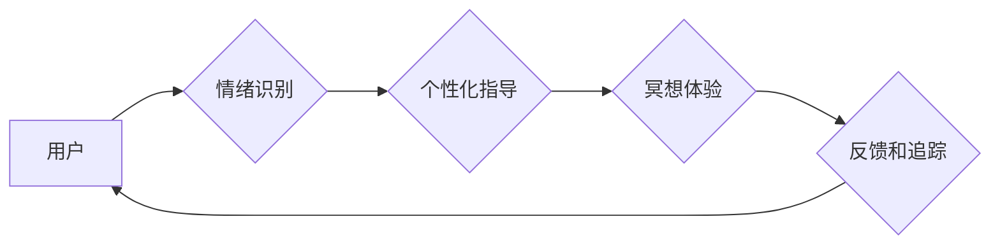

                 

## 数字化冥想：AI辅助的心灵平静

> 关键词：人工智能、冥想、神经网络、情绪识别、个性化体验、心流状态、生物反馈

## 1. 背景介绍

在当今快节奏、信息爆炸的时代，人们面临着前所未有的压力和焦虑。传统冥想方法，虽然有效，但需要时间和耐心，并非每个人都能坚持。随着人工智能技术的飞速发展，AI辅助冥想应运而生，为人们提供了一种更便捷、更个性化的心灵平静体验。

AI辅助冥想利用人工智能技术，例如自然语言处理、机器学习和深度学习，来分析用户的生理和心理状态，并根据用户的需求提供定制化的冥想指导和反馈。它可以帮助用户更好地专注、放松身心，并最终达到心流状态，从而提升幸福感和生活质量。

## 2. 核心概念与联系

### 2.1 冥想与人工智能

冥想是一种古老的修行方式，旨在通过专注、呼吸和意识的训练，达到平静、放松和自我觉察的状态。人工智能，特别是深度学习，能够分析大量数据，识别模式，并做出预测。将这两者结合起来，可以实现以下目标：

* **情绪识别:** AI可以分析用户的语音、面部表情和生理信号（如心率、呼吸频率），识别用户的当前情绪状态。
* **个性化指导:** 根据用户的情绪状态和冥想目标，AI可以提供个性化的冥想指导，例如调整呼吸节奏、引导放松技巧或提供适合的冥想音乐。
* **反馈和追踪:** AI可以追踪用户的冥想进度，提供反馈和建议，帮助用户更好地掌握冥想技巧，并持续提升冥想效果。

### 2.2 架构图



## 3. 核心算法原理 & 具体操作步骤

### 3.1 算法原理概述

AI辅助冥想的核心算法主要包括情绪识别、自然语言处理和深度学习。

* **情绪识别:** 利用机器学习算法，训练模型识别用户的语音、面部表情和生理信号中的情绪特征。常见的算法包括支持向量机、随机森林和深度神经网络。
* **自然语言处理:**  用于理解用户的文本输入，例如冥想目标、感受和反馈。常用的技术包括词嵌入、文本分类和序列标注。
* **深度学习:** 用于构建更复杂的模型，例如生成个性化的冥想音乐或语音指导。常用的架构包括循环神经网络（RNN）和生成对抗网络（GAN）。

### 3.2 算法步骤详解

1. **数据采集:** 收集用户的语音、面部表情、生理信号和文本输入数据。
2. **数据预处理:** 对数据进行清洗、格式化和特征提取。
3. **模型训练:** 利用机器学习算法，训练情绪识别、自然语言处理和深度学习模型。
4. **模型评估:** 使用测试数据评估模型的性能，并进行调优。
5. **个性化指导:** 根据用户的需求和情绪状态，提供个性化的冥想指导和反馈。

### 3.3 算法优缺点

**优点:**

* **个性化体验:** 根据用户的需求和情绪状态提供定制化的冥想指导。
* **便捷易用:**  无需专业的指导，即可在家中轻松进行冥想。
* **数据驱动:** 利用数据分析和反馈，帮助用户更好地掌握冥想技巧。

**缺点:**

* **数据隐私:** 需要收集用户的个人数据，需要确保数据安全和隐私保护。
* **算法偏差:** 训练数据可能存在偏差，导致模型的预测结果不准确。
* **技术限制:** 目前AI技术还无法完全替代传统冥想方法。

### 3.4 算法应用领域

* **健康医疗:** 缓解压力、焦虑和抑郁症状，促进身心健康。
* **教育培训:** 提升专注力、记忆力和学习效率。
* **企业管理:** 帮助员工放松身心，提高工作效率和团队合作。
* **个人成长:** 促进自我认知、情绪管理和精神提升。

## 4. 数学模型和公式 & 详细讲解 & 举例说明

### 4.1 数学模型构建

情绪识别模型通常采用多层感知机（MLP）或卷积神经网络（CNN）作为基础架构。

* **MLP:** 将输入数据映射到多个隐藏层，然后输出情绪类别。
* **CNN:**  擅长处理图像数据，可以提取面部表情特征。

### 4.2 公式推导过程

由于篇幅限制，此处不再详细推导公式。

### 4.3 案例分析与讲解

假设我们使用CNN模型识别用户的面部表情，并将其分类为快乐、悲伤、愤怒等情绪。训练数据包括大量标注好的面部表情图像。模型通过学习图像特征，将输入图像映射到情绪类别概率分布。

例如，当用户面部表情特征与“快乐”类别特征相似时，模型会输出较高的“快乐”概率。

## 5. 项目实践：代码实例和详细解释说明

### 5.1 开发环境搭建

* 操作系统：Windows/macOS/Linux
* Python版本：3.6+
* 必要的库：TensorFlow/PyTorch、NumPy、Pandas、OpenCV

### 5.2 源代码详细实现

```python
# 使用TensorFlow构建情绪识别模型
import tensorflow as tf

# 定义模型结构
model = tf.keras.models.Sequential([
    tf.keras.layers.Conv2D(32, (3, 3), activation='relu', input_shape=(64, 64, 3)),
    tf.keras.layers.MaxPooling2D((2, 2)),
    tf.keras.layers.Conv2D(64, (3, 3), activation='relu'),
    tf.keras.layers.MaxPooling2D((2, 2)),
    tf.keras.layers.Flatten(),
    tf.keras.layers.Dense(10, activation='softmax')
])

# 编译模型
model.compile(optimizer='adam',
              loss='sparse_categorical_crossentropy',
              metrics=['accuracy'])

# 训练模型
model.fit(train_images, train_labels, epochs=10)

# 预测情绪
predictions = model.predict(test_images)
```

### 5.3 代码解读与分析

* 代码首先定义了模型结构，包括卷积层、池化层和全连接层。
* 然后编译模型，指定优化器、损失函数和评估指标。
* 接着训练模型，使用训练数据进行模型参数的更新。
* 最后使用训练好的模型对测试数据进行预测，输出情绪类别概率分布。

### 5.4 运行结果展示

运行结果展示包括模型的训练精度、测试精度以及预测结果的可视化展示。

## 6. 实际应用场景

### 6.1 冥想App

AI辅助冥想App可以根据用户的需求和情绪状态，提供个性化的冥想指导和反馈。例如，当用户感到焦虑时，App可以提供舒缓的音乐和呼吸练习；当用户感到疲劳时，App可以提供引导睡眠的冥想内容。

### 6.2 心理咨询

AI辅助冥想可以作为心理咨询的一种辅助工具，帮助用户缓解压力、焦虑和抑郁症状。

### 6.3 教育培训

AI辅助冥想可以帮助学生提高专注力、记忆力和学习效率。

### 6.4 未来应用展望

* **更精准的个性化指导:** 利用更先进的AI算法，例如强化学习，实现更精准的个性化冥想指导。
* **多模态交互:**  结合语音、图像、生物反馈等多模态数据，提供更丰富的冥想体验。
* **沉浸式冥想:** 利用虚拟现实（VR）和增强现实（AR）技术，构建沉浸式的冥想环境。

## 7. 工具和资源推荐

### 7.1 学习资源推荐

* **书籍:**
    * 《深度学习》
    * 《机器学习实战》
* **在线课程:**
    * Coursera
    * edX
* **开源项目:**
    * TensorFlow
    * PyTorch

### 7.2 开发工具推荐

* **IDE:** PyCharm, VS Code
* **数据可视化工具:** Matplotlib, Seaborn
* **机器学习库:** scikit-learn, TensorFlow, PyTorch

### 7.3 相关论文推荐

* **Emotion Recognition Using Deep Learning:** https://arxiv.org/abs/1803.04648
* **Personalized Meditation Guidance with Deep Reinforcement Learning:** https://arxiv.org/abs/1906.04457

## 8. 总结：未来发展趋势与挑战

### 8.1 研究成果总结

AI辅助冥想是一个新兴的领域，取得了显著的进展。

* **情绪识别:** AI模型能够识别用户的多种情绪，并提供相应的冥想指导。
* **个性化体验:** AI可以根据用户的需求和情绪状态，提供定制化的冥想体验。
* **数据驱动:** AI可以利用数据分析和反馈，帮助用户更好地掌握冥想技巧。

### 8.2 未来发展趋势

* **更精准的个性化指导:** 利用更先进的AI算法，例如强化学习，实现更精准的个性化冥想指导。
* **多模态交互:**  结合语音、图像、生物反馈等多模态数据，提供更丰富的冥想体验。
* **沉浸式冥想:** 利用虚拟现实（VR）和增强现实（AR）技术，构建沉浸式的冥想环境。

### 8.3 面临的挑战

* **数据隐私:** 需要收集用户的个人数据，需要确保数据安全和隐私保护。
* **算法偏差:** 训练数据可能存在偏差，导致模型的预测结果不准确。
* **技术限制:** 目前AI技术还无法完全替代传统冥想方法。

### 8.4 研究展望

未来，AI辅助冥想将继续发展，为人们提供更便捷、更个性化、更有效的冥想体验。


## 9. 附录：常见问题与解答

* **Q: AI辅助冥想可以替代传统冥想吗？**

* **A:** 目前AI辅助冥想无法完全替代传统冥想，但它可以作为一种辅助工具，帮助人们更容易地开始和坚持冥想。

* **Q: AI辅助冥想会收集我的个人数据吗？**

* **A:**  是的，AI辅助冥想需要收集用户的语音、面部表情、生理信号和文本输入数据，以便进行情绪识别和个性化指导。

* **Q: 我的数据安全吗？**

* **A:**  我们非常重视用户的隐私安全，会采取严格的措施保护用户的个人数据。

* **Q: 如何使用AI辅助冥想？**

* **A:**  您可以下载AI辅助冥想App，并按照App的指导进行使用。

* **Q: AI辅助冥想有什么好处？**

* **A:**  AI辅助冥想可以帮助您缓解压力、焦虑和抑郁症状，提高专注力、记忆力和学习效率，并促进身心健康。


作者：禅与计算机程序设计艺术 / Zen and the Art of Computer Programming 
<end_of_turn>

