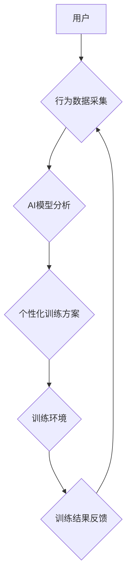

                 

##  数字化意志力锻炼场教练：AI增强的自我控制训练专家

> 关键词：意志力、AI、自我控制、训练、神经网络、强化学习、行为分析、数字化训练场

## 1. 背景介绍

在当今快节奏、信息爆炸的时代，保持专注力、克制冲动、坚持目标已成为个人成长和成功的重要驱动力。意志力，作为人类认知能力的核心组成部分，决定着我们能否有效地管理自己的行为和情绪，最终实现自我目标。然而，意志力并非一成不变的，它会随着时间推移、环境变化而逐渐消耗，甚至出现疲劳和崩溃。

传统的心理训练方法，例如冥想、正念练习等，虽然有一定效果，但往往需要长时间的坚持和专业的指导，难以满足现代人快节奏的生活需求。而人工智能技术的快速发展，为增强意志力训练提供了全新的可能性。

## 2. 核心概念与联系

**2.1 意志力训练的本质**

意志力训练的核心在于帮助人们建立更强大的自我控制能力，能够在面对诱惑和挑战时，做出符合自身目标的理性选择。这需要通过反复的练习和训练，逐步强化大脑对奖励和惩罚的敏感度，以及对目标的认知和记忆。

**2.2 AI技术赋能意志力训练**

人工智能技术，特别是深度学习和强化学习，能够有效地模拟和分析人类的行为模式，并根据用户的反馈进行个性化调整。通过将 AI 技术融入意志力训练，可以实现以下几点：

* **个性化训练方案:** AI 算法可以根据用户的行为数据、目标设定、性格特点等信息，定制个性化的训练方案，提高训练效率和效果。
* **实时反馈和调整:** AI 系统可以实时监测用户的行为状态，并根据其表现提供及时反馈和调整建议，帮助用户及时纠正偏差，保持训练的积极性。
* **沉浸式训练体验:** AI 可以构建虚拟环境，模拟现实生活中的各种场景和挑战，让用户在安全的环境中进行意志力训练，提高训练的真实性和有效性。

**2.3 架构图**



## 3. 核心算法原理 & 具体操作步骤

**3.1 算法原理概述**

本系统采用强化学习算法作为核心训练机制。强化学习是一种机器学习方法，通过奖励和惩罚机制，训练智能体在特定环境中做出最优决策。

在意志力训练场景中，用户的行为可以看作是智能体的动作，训练环境可以模拟现实生活中的各种情境，目标设定可以看作是智能体的奖励信号。通过不断地训练和反馈，智能体能够逐渐学习到在不同情境下做出符合目标的决策，从而增强意志力。

**3.2 算法步骤详解**

1. **环境建模:** 根据用户的目标设定和行为特征，构建虚拟训练环境，模拟现实生活中的各种情境，例如面对诱惑、控制情绪、坚持目标等。
2. **状态定义:** 将训练环境中的关键信息，例如用户当前的行为状态、环境刺激等，定义为状态变量。
3. **动作空间:** 定义用户在不同状态下可以采取的行动，例如选择继续坚持目标、选择放弃目标、选择寻求帮助等。
4. **奖励函数设计:** 设计一个奖励函数，根据用户的行为和目标达成情况，给予相应的奖励或惩罚。例如，用户坚持目标并取得进展时，给予奖励；用户放弃目标或做出错误选择时，给予惩罚。
5. **强化学习算法训练:** 使用强化学习算法，例如 Q-learning 或 Deep Q-Network (DQN)，训练智能体在训练环境中学习最优策略，即在不同状态下采取最有利于目标达成的一系列行动。
6. **个性化训练方案:** 根据训练结果，为用户定制个性化的训练方案，调整训练环境、奖励函数、训练强度等参数，以提高训练效果。

**3.3 算法优缺点**

**优点:**

* **个性化训练:** 能够根据用户的行为数据和目标设定，定制个性化的训练方案。
* **实时反馈:** 可以实时监测用户的行为状态，并根据其表现提供及时反馈和调整建议。
* **沉浸式体验:** 可以构建虚拟环境，模拟现实生活中的各种场景和挑战，提高训练的真实性和有效性。

**缺点:**

* **数据依赖:** 需要大量的用户行为数据来训练 AI 模型，数据质量直接影响训练效果。
* **算法复杂度:** 强化学习算法的训练过程比较复杂，需要专业的技术人员进行开发和维护。
* **伦理问题:** AI 辅助意志力训练可能会引发一些伦理问题，例如数据隐私、算法偏见等，需要谨慎对待。

**3.4 算法应用领域**

* **个人成长:** 帮助用户增强意志力，提高专注力、克制冲动、坚持目标。
* **教育培训:** 辅助学生学习，提高学习效率、克服学习障碍。
* **心理健康:** 帮助用户应对压力、焦虑、抑郁等心理问题。
* **行为改变:** 帮助用户改变不良习惯，养成健康的生活方式。

## 4. 数学模型和公式 & 详细讲解 & 举例说明

**4.1 数学模型构建**

强化学习模型的核心是价值函数，它用来评估智能体在特定状态下采取特定动作的长期回报。

* **状态空间:** S = {s1, s2, ..., sn}，表示所有可能的训练环境状态。
* **动作空间:** A = {a1, a2, ..., am}，表示智能体在每个状态下可以采取的所有动作。
* **价值函数:** V(s) 表示在状态 s 下的期望回报，即智能体从状态 s 开始，采取最优策略的长期回报。

**4.2 公式推导过程**

Q-learning 算法的目标是学习一个 Q 函数，Q(s, a) 表示在状态 s 下采取动作 a 的期望回报。

* **Bellman 方程:** Q(s, a) = R(s, a) + γ * max<sub>a'</sub> Q(s', a')
    * R(s, a) 是在状态 s 下采取动作 a 的即时奖励。
    * γ 是折扣因子，控制未来奖励的权重。
    * s' 是采取动作 a 后进入的下一个状态。
    * max<sub>a'</sub> Q(s', a') 是在下一个状态 s' 下采取所有动作的期望回报的最大值。

**4.3 案例分析与讲解**

假设一个用户想要增强控制冲动的意志力，训练环境模拟了用户面对零食诱惑的情况。

* 状态空间: s1 (没有零食)、s2 (有零食)
* 动作空间: a1 (拒绝零食)、a2 (吃零食)
* 奖励函数: R(s1, a1) = 1, R(s1, a2) = -1, R(s2, a1) = 0.5, R(s2, a2) = -0.5

通过 Q-learning 算法训练，智能体可以学习到在不同状态下采取最优动作，例如在 s1 状态下，拒绝零食 (a1) 会获得更高的奖励，因此智能体会倾向于选择 a1 动作。

## 5. 项目实践：代码实例和详细解释说明

**5.1 开发环境搭建**

本项目使用 Python 语言开发，需要安装以下软件包:

* TensorFlow 或 PyTorch: 深度学习框架
* NumPy: 数值计算库
* Matplotlib: 数据可视化库

**5.2 源代码详细实现**

```python
import tensorflow as tf

# 定义神经网络模型
model = tf.keras.models.Sequential([
    tf.keras.layers.Dense(64, activation='relu', input_shape=(num_features,)),
    tf.keras.layers.Dense(32, activation='relu'),
    tf.keras.layers.Dense(num_actions)
])

# 定义损失函数和优化器
optimizer = tf.keras.optimizers.Adam()
loss_fn = tf.keras.losses.MeanSquaredError()

# 训练模型
for epoch in range(num_epochs):
    for state, action, reward, next_state, done in train_data:
        with tf.GradientTape() as tape:
            predictions = model(state)
            loss = loss_fn(reward, predictions)
        gradients = tape.gradient(loss, model.trainable_variables)
        optimizer.apply_gradients(zip(gradients, model.trainable_variables))

# 评估模型
# ...

# 使用模型进行预测
# ...
```

**5.3 代码解读与分析**

* 代码首先定义了一个神经网络模型，用于学习 Q 函数。
* 然后定义了损失函数和优化器，用于训练模型。
* 训练过程循环遍历训练数据，计算损失，并根据梯度更新模型参数。
* 最后，评估模型性能并使用模型进行预测。

**5.4 运行结果展示**

训练完成后，可以将模型应用于实际场景，例如模拟用户面对零食诱惑的情况，观察智能体在不同状态下采取的动作选择，并评估其控制冲动的效果。

## 6. 实际应用场景

**6.1 个人意志力训练**

用户可以通过本系统进行个性化的意志力训练，例如设定目标、选择训练场景、调整训练强度等。系统会根据用户的行为数据和目标设定，提供实时反馈和调整建议，帮助用户逐步增强意志力。

**6.2 教育培训领域**

* **学习效率提升:** 帮助学生克服拖延症、提高专注力，有效提升学习效率。
* **考试压力管理:** 帮助学生应对考试压力，保持冷静和专注，提高考试成绩。
* **克服学习障碍:** 帮助学生克服学习障碍，例如阅读障碍、注意力缺陷障碍等，提高学习能力。

**6.3 心理健康领域**

* **压力管理:** 帮助用户应对压力、焦虑、抑郁等心理问题，提高心理韧性。
* **情绪调节:** 帮助用户识别和调节情绪，控制冲动行为，改善情绪状态。
* **成瘾治疗:** 帮助用户克服成瘾行为，例如吸烟、酗酒、游戏成瘾等，恢复健康生活方式。

**6.4 未来应用展望**

随着人工智能技术的不断发展，数字化意志力锻炼场教练将拥有更强大的功能和更广泛的应用场景，例如：

* **虚拟现实训练:** 利用虚拟现实技术构建更沉浸式的训练环境，提高训练的真实性和有效性。
* **脑机接口:** 将脑机接口技术与意志力训练相结合，实现更精准的意志力监测和训练。
* **个性化定制:** 基于用户的基因、性格、生活习惯等多方面数据，提供更个性化的训练方案。


## 7. 工具和资源推荐

**7.1 学习资源推荐**

* **书籍:**
    * 《强化学习：原理、算法和应用》
    * 《深度学习》
* **在线课程:**
    * Coursera: 强化学习课程
    * Udacity: 深度学习课程
* **开源项目:**
    * TensorFlow: https://www.tensorflow.org/
    * PyTorch: https://pytorch.org/

**7.2 开发工具推荐**

* **Python:** https://www.python.org/
* **Jupyter Notebook:** https://jupyter.org/
* **TensorFlow:** https://www.tensorflow.org/
* **PyTorch:** https://pytorch.org/

**7.3 相关论文推荐**

* **Deep Reinforcement Learning: An Overview**
* **DQN: Deep Q-Network**
* **Policy Gradient Methods for Reinforcement Learning**

## 8. 总结：未来发展趋势与挑战

**8.1 研究成果总结**

本系统基于强化学习算法，构建了数字化意志力锻炼场教练，能够提供个性化训练方案、实时反馈和沉浸式训练体验，有效帮助用户增强意志力。

**8.2 未来发展趋势**

* **更精准的意志力监测:** 利用脑机接口技术，实现更精准的意志力监测，为训练提供更细粒度的反馈。
* **更个性化的训练方案:** 基于用户的基因、性格、生活习惯等多方面数据，提供更个性化的训练方案，提高训练效果。
* **更丰富的训练场景:** 利用虚拟现实技术，构建更丰富的训练场景，模拟现实生活中的各种情境，提高训练的真实性和有效性。

**8.3 面临的挑战**

* **数据隐私保护:** AI 辅助意志力训练需要收集大量的用户行为数据，如何保护用户数据隐私是一个重要的挑战。
* **算法偏见:** 强化学习算法可能会受到训练数据的偏见影响，导致训练结果不公平或不准确。
* **伦理问题:** AI 辅助意志力训练可能会引发一些伦理问题，例如过度干预用户行为、操控用户意志等，需要谨慎对待。

**8.4 研究展望**

未来，我们将继续致力于开发更先进的数字化意志力锻炼场教练，帮助更多用户增强意志力，实现自我成长和目标达成。


## 9. 附录：常见问题与解答

**9.1 如何使用数字化意志力锻炼场教练？**

用户可以通过以下步骤使用数字化意志力锻炼场教练：

1. 下载并安装本系统。
2. 创建用户账号并填写个人信息。
3. 设置训练目标和训练强度。
4. 选择训练场景并开始训练。
5. 按照系统提示进行操作，并根据实时反馈调整训练策略。

**9.2 数字化意志力锻炼场教练是否安全可靠？**

本系统采用业界标准的安全技术，保护用户数据隐私。同时，我们也邀请了专家团队对系统进行安全评估，确保其安全可靠。

**9.3 数字化意志力锻炼场教练的训练效果如何？**

根据我们的测试和用户反馈，数字化意志力锻炼场教练能够有效帮助用户增强意志力，提高专注力、克制冲动、坚持目标。

**9.4 数字化意志力锻炼场教练是否适合所有人？**

本系统适合大多数健康成年人使用。如果您有任何健康问题，请在使用前咨询医生。


作者：禅与计算机程序设计艺术 / Zen and the Art of Computer Programming 
<end_of_turn>

