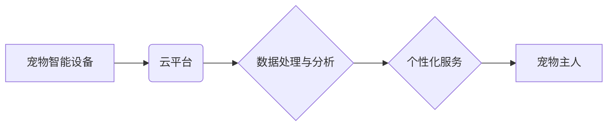

                 

## 智能宠物互动创业：远程宠物陪伴

> 关键词：人工智能、宠物陪伴、远程互动、机器学习、自然语言处理、计算机视觉、云计算、物联网

### 1. 背景介绍

随着城市化进程的加速和生活节奏的加快，人们对宠物的需求日益增长。然而，工作繁忙、生活压力大使得许多宠物主人无法给予宠物足够的陪伴和关爱。远程宠物陪伴成为一个迫切的社会需求。智能宠物互动创业应运而生，旨在利用人工智能技术，为宠物主人提供远程互动、陪伴和管理服务，解决宠物主人和宠物之间存在的距离和时间问题。

### 2. 核心概念与联系

**2.1 核心概念**

* **人工智能 (AI):**  指模拟人类智能行为的计算机系统，包括机器学习、自然语言处理、计算机视觉等技术。
* **宠物陪伴:** 指通过各种方式提供宠物情感支持和陪伴，例如互动游戏、语音交流、远程监控等。
* **远程互动:** 指通过网络连接，实现宠物主人与宠物之间的实时或非实时互动。

**2.2 架构图**



**2.3 核心联系**

智能宠物互动创业的核心是将人工智能技术与宠物设备和云平台相结合，实现远程宠物陪伴。宠物智能设备收集宠物的行为数据，通过云平台进行数据处理和分析，并根据分析结果提供个性化服务，例如：

* **实时监控:**  宠物主人可以通过手机APP实时查看宠物的状况，例如活动轨迹、睡眠状态、饮食情况等。
* **远程互动:**  宠物主人可以通过语音或视频与宠物进行互动，例如播放宠物喜欢的音乐、与宠物进行简单的对话等。
* **智能训练:**  根据宠物的行为数据，系统可以提供个性化的训练方案，帮助宠物主人更好地训练宠物。
* **健康管理:**  通过监测宠物的健康数据，系统可以提醒宠物主人进行必要的健康检查和护理。

### 3. 核心算法原理 & 具体操作步骤

**3.1 算法原理概述**

智能宠物互动创业的核心算法主要包括：

* **机器学习算法:** 用于分析宠物的行为数据，识别宠物的情绪、行为模式和健康状况。
* **自然语言处理算法:** 用于理解宠物主人的语音指令和文本信息，并生成相应的语音或文本回复。
* **计算机视觉算法:** 用于识别宠物的图像和视频，例如识别宠物的品种、年龄、情绪等。

**3.2 算法步骤详解**

1. **数据采集:**  宠物智能设备收集宠物的行为数据，例如运动轨迹、声音、图像等。
2. **数据预处理:**  对收集到的数据进行清洗、转换和特征提取，以便于后续算法的训练和应用。
3. **模型训练:**  利用机器学习算法，对预处理后的数据进行训练，建立宠物行为识别、情绪识别、健康状况预测等模型。
4. **模型预测:**  将新的宠物行为数据输入到训练好的模型中，进行预测和分析。
5. **服务提供:**  根据模型的预测结果，提供相应的个性化服务，例如提醒宠物主人喂食、训练宠物、查看宠物健康状况等。

**3.3 算法优缺点**

* **优点:**

    * 可以提供更加个性化和智能化的宠物陪伴服务。
    * 可以帮助宠物主人更好地了解宠物的需求和状况。
    * 可以提高宠物的幸福感和健康水平。

* **缺点:**

    * 需要大量的训练数据和计算资源。
    * 算法的准确性还存在一定局限性。
    * 存在一定的伦理和安全问题。

**3.4 算法应用领域**

* **宠物陪伴:**  提供远程互动、游戏娱乐、健康管理等服务。
* **宠物训练:**  提供个性化的训练方案和反馈。
* **宠物医疗:**  辅助宠物医生诊断和治疗疾病。
* **宠物行为研究:**  收集和分析宠物行为数据，研究宠物的行为模式和心理需求。

### 4. 数学模型和公式 & 详细讲解 & 举例说明

**4.1 数学模型构建**

智能宠物互动创业中，可以使用多种数学模型来描述宠物的行为、情绪和健康状况。例如：

* **Markov链:**  用于描述宠物行为的转移概率，例如从睡觉状态转移到玩耍状态的概率。
* **隐藏马尔可夫模型 (HMM):**  用于描述宠物行为的潜在状态，例如宠物是否感到无聊、焦虑或快乐。
* **深度神经网络 (DNN):**  用于识别宠物的情绪、行为模式和健康状况。

**4.2 公式推导过程**

例如，使用Markov链来描述宠物行为的转移概率，可以定义状态转移矩阵 P，其中 P(i,j) 表示从状态 i 转移到状态 j 的概率。

```latex
P = \begin{bmatrix}
p_{11} & p_{12} & p_{13} \\
p_{21} & p_{22} & p_{23} \\
p_{31} & p_{32} & p_{33}
\end{bmatrix}
```

其中，状态 i 和 j 可以代表不同的行为状态，例如睡觉、玩耍、进食等。

**4.3 案例分析与讲解**

假设我们使用Markov链来描述宠物的睡眠和玩耍状态转移概率，并根据观察到的数据，得到以下状态转移矩阵：

```latex
P = \begin{bmatrix}
0.8 & 0.1 & 0.1 \\
0.2 & 0.7 & 0.1 \\
0.1 & 0.2 & 0.7
\end{bmatrix}
```

从这个矩阵可以看出，宠物从睡眠状态转移到玩耍状态的概率为 0.1，从玩耍状态转移到睡眠状态的概率为 0.2，等等。

### 5. 项目实践：代码实例和详细解释说明

**5.1 开发环境搭建**

* **操作系统:**  Linux、macOS 或 Windows
* **编程语言:**  Python
* **深度学习框架:**  TensorFlow 或 PyTorch
* **云平台:**  AWS、Azure 或 Google Cloud

**5.2 源代码详细实现**

```python
# 导入必要的库
import tensorflow as tf

# 定义模型结构
model = tf.keras.models.Sequential([
    tf.keras.layers.Conv2D(32, (3, 3), activation='relu', input_shape=(64, 64, 3)),
    tf.keras.layers.MaxPooling2D((2, 2)),
    tf.keras.layers.Conv2D(64, (3, 3), activation='relu'),
    tf.keras.layers.MaxPooling2D((2, 2)),
    tf.keras.layers.Flatten(),
    tf.keras.layers.Dense(10, activation='softmax')
])

# 编译模型
model.compile(optimizer='adam',
              loss='sparse_categorical_crossentropy',
              metrics=['accuracy'])

# 训练模型
model.fit(x_train, y_train, epochs=10)

# 评估模型
loss, accuracy = model.evaluate(x_test, y_test)
print('Loss:', loss)
print('Accuracy:', accuracy)
```

**5.3 代码解读与分析**

这段代码定义了一个简单的卷积神经网络模型，用于识别宠物的图像。

* `tf.keras.models.Sequential` 创建了一个顺序模型，即层级结构。
* `tf.keras.layers.Conv2D` 定义了一个卷积层，用于提取图像特征。
* `tf.keras.layers.MaxPooling2D` 定义了一个最大池化层，用于降低特征图的大小。
* `tf.keras.layers.Flatten` 将多维特征图转换为一维向量。
* `tf.keras.layers.Dense` 定义了一个全连接层，用于分类。
* `model.compile` 编译模型，指定优化器、损失函数和评估指标。
* `model.fit` 训练模型，使用训练数据进行训练。
* `model.evaluate` 评估模型，使用测试数据计算损失和准确率。

**5.4 运行结果展示**

训练完成后，可以将模型应用于新的宠物图像，并预测宠物的种类。

### 6. 实际应用场景

**6.1 远程监控**

宠物主人可以通过手机APP实时查看宠物的活动轨迹、睡眠状态、饮食情况等，了解宠物的健康状况和生活习惯。

**6.2 远程互动**

宠物主人可以通过语音或视频与宠物进行互动，例如播放宠物喜欢的音乐、与宠物进行简单的对话等，即使不在家也能陪伴宠物。

**6.3 智能训练**

根据宠物的行为数据，系统可以提供个性化的训练方案和反馈，帮助宠物主人更好地训练宠物。

**6.4 未来应用展望**

* **更智能的宠物陪伴:**  利用更先进的人工智能技术，例如自然语言理解和情感识别，提供更智能、更人性化的宠物陪伴服务。
* **宠物健康管理:**  利用传感器和机器学习算法，监测宠物的健康状况，并及时提醒宠物主人进行必要的健康检查和护理。
* **宠物行为分析:**  收集和分析宠物的行为数据，研究宠物的行为模式和心理需求，帮助宠物主人更好地了解和照顾宠物。

### 7. 工具和资源推荐

**7.1 学习资源推荐**

* **在线课程:**  Coursera、edX、Udacity 等平台提供人工智能、机器学习、计算机视觉等方面的在线课程。
* **书籍:**  《深度学习》、《机器学习实战》、《计算机视觉》等书籍。
* **开源项目:**  TensorFlow、PyTorch、OpenCV 等开源项目。

**7.2 开发工具推荐**

* **编程语言:**  Python
* **深度学习框架:**  TensorFlow、PyTorch
* **云平台:**  AWS、Azure、Google Cloud

**7.3 相关论文推荐**

* **机器学习:**  《机器学习》 by Tom Mitchell
* **深度学习:**  《深度学习》 by Ian Goodfellow, Yoshua Bengio, and Aaron Courville
* **计算机视觉:**  《计算机视觉》 by Richard Szeliski

### 8. 总结：未来发展趋势与挑战

**8.1 研究成果总结**

智能宠物互动创业领域取得了显著的进展，人工智能技术、物联网技术、云计算技术等不断发展，为宠物互动创业提供了强大的技术支撑。

**8.2 未来发展趋势**

* **更智能的宠物陪伴:**  利用更先进的人工智能技术，例如自然语言理解和情感识别，提供更智能、更人性化的宠物陪伴服务。
* **宠物健康管理:**  利用传感器和机器学习算法，监测宠物的健康状况，并及时提醒宠物主人进行必要的健康检查和护理。
* **宠物行为分析:**  收集和分析宠物的行为数据，研究宠物的行为模式和心理需求，帮助宠物主人更好地了解和照顾宠物。

**8.3 面临的挑战**

* **算法准确性:**  人工智能算法的准确性仍然存在一定局限性，需要不断改进和优化。
* **数据安全:**  宠物智能设备收集的宠物数据涉及隐私问题，需要采取有效的安全措施保护数据安全。
* **伦理问题:**  人工智能技术在宠物互动领域的应用也存在一些伦理问题，例如宠物的自主权、人机关系等，需要进行深入探讨和研究。

**8.4 研究展望**

未来，智能宠物互动创业领域将继续发展，人工智能技术将更加智能化、个性化，为宠物主人和宠物提供更加丰富、更加贴心的服务。


### 9. 附录：常见问题与解答

**9.1 如何选择合适的宠物智能设备？**

选择宠物智能设备时，需要考虑以下因素：

* **功能:**  设备的功能是否满足您的需求，例如远程监控、互动游戏、健康管理等。
* **价格:**  设备的价格是否合理，是否符合您的预算。
* **品牌:**  设备的品牌是否可靠，是否有良好的售后服务。

**9.2 如何保护宠物智能设备的数据安全？**

* 使用强密码保护设备的账号。
* 定期更新设备的软件版本。
* 使用安全的网络连接。
* 谨慎选择第三方应用程序。

**9.3 智能宠物互动创业有哪些风险？**

* **技术风险:**  人工智能技术发展迅速，需要不断学习和更新知识。
* **市场风险:**  宠物互动市场竞争激烈，需要不断创新和改进产品。
* **法律风险:**  宠物智能设备的应用涉及隐私问题、数据安全问题等法律风险，需要做好法律合规工作。


作者：禅与计算机程序设计艺术 / Zen and the Art of Computer Programming 
<end_of_turn>

