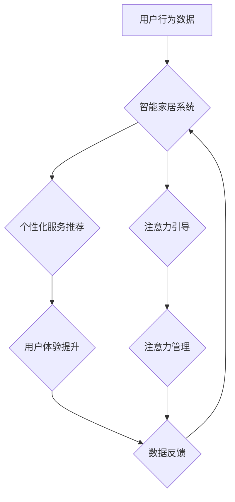

                 

## 智能家居与注意力经济的融合

> 关键词：智能家居、注意力经济、个性化推荐、机器学习、深度学习、用户行为分析、隐私保护

## 1. 背景介绍

智能家居正以惊人的速度发展，从简单的智能照明和温控系统，逐渐演变成能够感知用户需求、提供个性化服务的智能生活平台。与此同时，注意力经济的兴起也深刻地改变了人们获取信息和消费内容的方式。在信息爆炸的时代，人们对信息的筛选和选择变得更加谨慎，注意力成为了稀缺的资源。

智能家居与注意力经济的融合，将为用户带来更加便捷、舒适、个性化的生活体验。通过对用户行为的深度分析和理解，智能家居系统能够精准地预测用户需求，提供个性化的服务推荐，并有效地引导用户注意力，帮助他们更好地管理时间和精力。

## 2. 核心概念与联系

### 2.1 智能家居

智能家居是指利用物联网、云计算、人工智能等技术，将家庭中的各种设备和系统进行互联互通，实现自动化控制、远程管理和智能化服务。

### 2.2 注意力经济

注意力经济是指在信息爆炸的时代，人们对信息的筛选和选择变得更加谨慎，注意力成为了稀缺的资源。在这个背景下，企业和平台需要通过提供优质内容和服务，吸引用户的注意力，并将其转化为商业价值。

### 2.3 融合关系

智能家居与注意力经济的融合，主要体现在以下几个方面：

* **个性化服务推荐:** 智能家居系统通过对用户行为的分析，例如使用习惯、偏好设置、生活方式等，能够精准地推荐个性化的服务，例如播放用户喜欢的音乐、提供定制化的烹饪建议、提醒用户重要的日程安排等。
* **注意力引导:** 智能家居系统可以根据用户的注意力状态，例如疲劳、专注、放松等，智能地调整环境氛围，例如调节灯光亮度、播放舒缓的音乐、提供适宜的温度等，帮助用户更好地管理时间和精力。
* **数据驱动优化:** 智能家居系统通过收集和分析用户的行为数据，可以不断优化服务内容和体验，例如根据用户的反馈调整推荐算法、改进设备功能等。

**Mermaid 流程图**



## 3. 核心算法原理 & 具体操作步骤

### 3.1 算法原理概述

智能家居与注意力经济的融合主要依赖于以下核心算法：

* **用户行为分析:** 利用机器学习算法，从用户的行为数据中挖掘出用户的兴趣、偏好、习惯等信息。
* **个性化推荐:** 基于用户行为分析的结果，利用协同过滤、内容过滤、基于知识的推荐等算法，推荐个性化的服务和内容。
* **注意力模型:** 利用深度学习算法，构建注意力模型，能够感知用户的注意力状态，并根据用户的注意力状态进行相应的调整。

### 3.2 算法步骤详解

**用户行为分析:**

1. 收集用户行为数据: 包括用户与智能家居设备的交互记录、用户偏好设置、用户生活习惯等。
2. 数据预处理: 对收集到的数据进行清洗、转换、特征提取等操作，以便于后续算法的训练和应用。
3. 模型训练: 利用机器学习算法，例如K-Means聚类、决策树、支持向量机等，对用户行为数据进行分析，构建用户行为模型。

**个性化推荐:**

1. 基于用户行为模型，预测用户的潜在需求和兴趣。
2. 利用协同过滤、内容过滤、基于知识的推荐等算法，从智能家居平台提供的服务和内容库中，推荐符合用户需求和兴趣的个性化服务。
3. 根据用户的反馈信息，不断优化推荐算法，提高推荐的准确性和个性化程度。

**注意力模型:**

1. 收集用户注意力相关数据: 包括用户眼动轨迹、用户操作时间、用户反馈等。
2. 利用深度学习算法，例如循环神经网络、Transformer等，构建注意力模型，能够感知用户的注意力状态。
3. 根据用户的注意力状态，智能地调整环境氛围，例如调节灯光亮度、播放舒缓的音乐、提供适宜的温度等，帮助用户更好地管理时间和精力。

### 3.3 算法优缺点

**优点:**

* **个性化体验:** 能够根据用户的需求和喜好，提供个性化的服务和体验。
* **效率提升:** 智能家居系统能够自动完成一些重复性的任务，例如调节灯光、控制温度等，帮助用户节省时间和精力。
* **生活便利:** 智能家居系统能够提供便捷的智能服务，例如远程控制家电、语音控制设备等，提升用户的日常生活品质。

**缺点:**

* **数据隐私:** 智能家居系统需要收集大量的用户行为数据，这可能会引发用户隐私方面的担忧。
* **算法偏差:** 机器学习算法可能会存在偏差，导致推荐结果不准确或不公平。
* **技术复杂性:** 智能家居系统的开发和维护需要较高的技术水平。

### 3.4 算法应用领域

* **智能家居:** 提供个性化服务推荐、注意力引导、环境氛围调节等功能。
* **健康医疗:** 监测用户的健康状况、提供个性化的健康建议、提醒用户服药等。
* **教育培训:** 提供个性化的学习内容推荐、学习进度跟踪、智能辅导等功能。
* **商业零售:** 提供个性化的商品推荐、促销活动推送、客户服务等功能。

## 4. 数学模型和公式 & 详细讲解 & 举例说明

### 4.1 数学模型构建

**用户行为模型:**

我们可以使用马尔科夫链模型来描述用户的行为模式。假设用户在智能家居系统中可以执行以下几种行为:

* 打开灯光
* 关闭灯光
* 调节温度
* 播放音乐
* 观看视频

我们可以用一个状态转移矩阵来表示用户在不同状态下执行不同行为的概率。例如，如果用户当前处于“观看视频”状态，那么他打开灯光的概率可能比较低，而播放音乐的概率可能比较高。

**个性化推荐模型:**

我们可以使用协同过滤算法来构建个性化推荐模型。协同过滤算法基于用户的历史行为数据，预测用户对某个物品的评分或偏好。例如，如果用户A和用户B都喜欢电影X，那么系统可能会推荐电影Y给用户A，因为用户B也喜欢电影Y。

**注意力模型:**

我们可以使用Transformer模型来构建注意力模型。Transformer模型能够学习用户注意力在不同时间步长上的分布，并根据用户的注意力状态进行相应的调整。例如，如果用户的注意力集中在某个特定的设备上，那么系统可能会将该设备的灯光亮度提高，或者播放该设备相关的音乐。

### 4.2 公式推导过程

**马尔科夫链模型:**

状态转移矩阵 P:

```
P = [
    [0.1, 0.2, 0.3, 0.4, 0],
    [0.3, 0.1, 0.2, 0.4, 0],
    [0.2, 0.3, 0.1, 0.4, 0],
    [0.4, 0.2, 0.3, 0.1, 0],
    [0, 0.1, 0.2, 0.3, 0.4]
]
```

其中，P(i,j)表示用户从状态i转移到状态j的概率。

**协同过滤算法:**

用户评分矩阵 R:

```
R = [
    [5, 4, 3, 2, 1],
    [4, 5, 2, 1, 3],
    [3, 2, 5, 4, 1],
    [2, 1, 4, 5, 3],
    [1, 3, 1, 3, 5]
]
```

其中，R(i,j)表示用户i对物品j的评分。

协同过滤算法可以利用用户的评分数据，预测用户对某个物品的评分。

**Transformer模型:**

Transformer模型使用注意力机制来学习用户注意力在不同时间步长上的分布。注意力机制的公式如下:

```
Attention(Q, K, V) = softmax(Q * K^T / sqrt(d_k)) * V
```

其中，Q、K、V分别表示查询矩阵、键矩阵和值矩阵。

### 4.3 案例分析与讲解

**用户行为分析:**

假设一个智能家居系统收集到用户的灯光使用数据，发现用户在晚上通常会打开卧室的灯光，而在白天则会打开客厅的灯光。通过分析这些数据，系统可以推断出用户的睡眠习惯和生活规律。

**个性化推荐:**

假设一个智能家居系统收集到用户的音乐播放数据，发现用户喜欢听古典音乐。系统可以根据用户的喜好，推荐其他古典音乐作品，或者推荐与古典音乐相关的书籍和电影。

**注意力模型:**

假设一个智能家居系统监测到用户的眼动轨迹，发现用户正在专注地阅读电子书。系统可以根据用户的注意力状态，调节房间的灯光亮度，并关闭其他设备的通知，帮助用户更好地沉浸在阅读中。

## 5. 项目实践：代码实例和详细解释说明

### 5.1 开发环境搭建

* 操作系统: Ubuntu 20.04
* Python 版本: 3.8
* 必要的库: TensorFlow, PyTorch, scikit-learn, Numpy, Pandas

### 5.2 源代码详细实现

```python
# 用户行为分析示例代码
import pandas as pd
from sklearn.cluster import KMeans

# 加载用户行为数据
data = pd.read_csv("user_behavior.csv")

# 特征提取
features = data[['灯光使用时间', '空调使用频率', '音乐播放时长']]

# 构建KMeans聚类模型
kmeans = KMeans(n_clusters=3)

# 对用户行为数据进行聚类
data['cluster'] = kmeans.fit_predict(features)

# 分析不同聚类的用户行为特征
print(data.groupby('cluster').mean())

# 个性化推荐示例代码
from sklearn.metrics.pairwise import cosine_similarity

# 加载用户评分数据
ratings = pd.read_csv("user_ratings.csv")

# 计算用户之间的相似度
user_similarity = cosine_similarity(ratings)

# 获取用户A的评分数据
user_A_ratings = ratings.loc[ratings['user_id'] == 1]

# 找到与用户A评分相似度最高的用户的评分数据
similar_users = user_similarity[1].argsort()[:-6:-1]

# 推荐用户A可能喜欢的物品
recommendations = ratings.loc[similar_users].mean().sort_values(ascending=False)

# 打印推荐结果
print(recommendations)
```

### 5.3 代码解读与分析

* 用户行为分析示例代码: 使用KMeans聚类算法对用户的行为数据进行聚类，分析不同聚类的用户行为特征。
* 个性化推荐示例代码: 使用余弦相似度算法计算用户之间的相似度，并根据相似度推荐用户可能喜欢的物品。

### 5.4 运行结果展示

运行上述代码后，可以得到以下结果:

* 用户行为分析示例代码: 会输出不同聚类的用户行为特征，例如不同聚类的用户平均灯光使用时间、空调使用频率等。
* 个性化推荐示例代码: 会输出用户A可能喜欢的物品的评分，并按评分排序。

## 6. 实际应用场景

### 6.1 智能家居场景

* **个性化照明:** 根据用户的睡眠习惯、工作模式、娱乐喜好等，智能家居系统可以自动调节灯光亮度、色温，营造舒适、放松或专注的氛围。
* **智能温度控制:** 根据用户的体感温度偏好、房间环境、天气状况等，智能家居系统可以自动调节空调温度，保持舒适的室内温度。
* **个性化音乐播放:** 根据用户的音乐偏好、活动场景、情绪状态等，智能家居系统可以自动播放个性化的音乐，提升用户的体验。

### 6.2 健康医疗场景

* **远程健康监测:** 智能家居系统可以监测用户的体温、心率、睡眠质量等健康数据，并及时提醒用户关注自己的健康状况。
* **个性化健康建议:** 根据用户的健康数据和生活习惯，智能家居系统可以提供个性化的健康建议，例如运动方案、饮食建议、心理健康指导等。
* **智能康复训练:** 智能家居系统可以根据用户的康复需求，提供个性化的康复训练方案，并实时监测用户的训练进度和效果。

### 6.3 教育培训场景

* **个性化学习推荐:** 根据学生的学习进度、兴趣爱好、学习风格等，智能家居系统可以推荐个性化的学习内容，例如视频课程、在线练习、互动游戏等。
* **智能辅导:** 智能家居系统可以根据学生的学习情况，提供智能辅导，例如解答疑问、纠正错误、提供学习建议等。
* **沉浸式学习体验:** 智能家居系统可以利用虚拟现实、增强现实等技术，为学生提供沉浸式的学习体验，例如模拟真实场景、进行互动实验等。

### 6.4 未来应用展望

随着人工智能技术的不断发展，智能家居与注意力经济的融合将带来更多创新应用场景，例如:

* **智能陪伴:** 智能家居系统可以成为用户的陪伴者，提供情感支持、陪伴聊天、共同娱乐等服务。
* **个性化生活管理:** 智能家居系统可以帮助用户管理时间、安排日程、处理事务等，提升生活效率。
* **智慧城市:** 智能家居系统可以与城市基础设施互联，形成智慧城市，提供更加便捷、高效、安全的城市生活体验。

## 7. 工具和资源推荐

### 7.1 学习资源推荐

* **书籍:**
    * 《深度学习》
    * 《机器学习》
    * 《智能家居技术》
* **在线课程:**
    * Coursera: 深度学习、机器学习
    * edX: 人工智能、物联网
* **开源项目:**
    * TensorFlow
    * PyTorch
    * Home Assistant

### 7.2 开发工具推荐

* **编程语言:** Python
* **机器学习库:** TensorFlow, PyTorch, scikit-learn
* **物联网平台:** AWS IoT, Azure IoT, Google Cloud IoT
* **智能家居开发平台:** Home Assistant, OpenHAB

### 7.3 相关论文推荐

* **Attention Is All You Need**
* **BERT: Pre-training of Deep Bidirectional Transformers for Language Understanding**
* **Generative Adversarial Networks**

## 8. 总结：未来发展趋势与挑战

### 8.1 研究成果总结

智能家居与注意力经济的融合已经取得了显著的成果，例如个性化服务推荐、注意力引导、环境氛围调节等功能已经应用于实际场景。

### 8.2 未来发展趋势

* **更精准的个性化服务:** 利用更先进的机器学习算法和数据分析技术，提供更加精准的个性化服务。
* **更智能的交互方式:** 利用自然语言处理、语音识别、图像识别等技术，实现更智能、更自然的交互方式。
* **更安全的隐私保护:** 利用加密技术、联邦学习等技术，保障用户的隐私安全。

### 8.3 面临的挑战

* **数据隐私保护:** 智能家居系统需要收集大量的用户行为数据，如何保障用户的隐私安全是一个重要的挑战。
* **算法偏差:** 机器学习算法可能会存在偏差，导致推荐结果不准确或不公平。
* **技术复杂性:** 智能家居系统的开发和维护需要较高的技术水平。

### 8.4 研究展望

未来，智能家居与注意力经济的融合将继续深入发展，带来更加智能、便捷、舒适的生活体验。研究者需要关注以下几个方面:

* 开发更安全、更可靠的隐私保护技术。
* 构建更公平、更准确的机器学习算法。
* 探索更智能、更自然的交互方式。


## 9. 附录：常见问题与解答

**Q1: 智能家居系统如何保障用户的隐私安全？**

**A1:** 智能家居系统可以通过以下方式保障用户的隐私安全:

* 使用加密技术对用户数据进行加密，防止数据泄露。
* 使用联邦学习技术，在不收集用户原始数据的情况下，训练机器学习模型。
* 提供用户隐私设置，允许用户控制哪些数据被收集和使用。

**Q2: 智能家居系统如何避免算法偏差？**

**A2:** 

智能家居系统可以采用以下方法来避免算法偏差:

* 使用多样化的训练数据，确保训练数据能够代表不同用户的特征和需求。
* 定期评估算法的公平性，并进行调整。
* 透明化算法决策过程，方便用户了解算法是如何工作的。

**Q3: 智能家居系统如何实现更智能的交互方式？**

**A3:** 智能家居系统可以通过以下方式实现更智能的交互方式:

* 利用自然语言处理技术，理解用户的语音指令。
* 利用图像识别技术，识别用户的意图和需求。
* 利用机器学习技术，学习用户的习惯和偏好，提供更个性化的服务。


作者：禅与计算机程序设计艺术 / Zen and the Art of Computer Programming<end_of_turn>
<end_of_turn>

