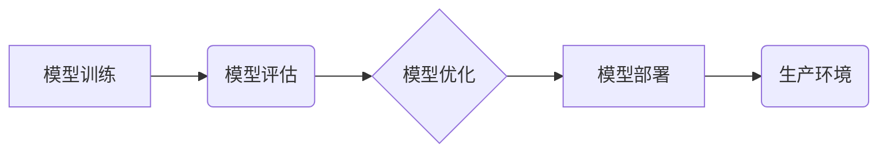

                 

## 机器学习模型部署：从开发到生产环境

> 关键词：机器学习、模型部署、生产环境、容器化、微服务、监控、优化

### 1. 背景介绍

机器学习（Machine Learning，ML）近年来发展迅速，在各个领域取得了令人瞩目的成就。从图像识别到自然语言处理，从推荐系统到医疗诊断，机器学习模型正在改变着我们的生活。然而，仅仅开发出优秀的机器学习模型还不够，将这些模型部署到生产环境中，使其能够真正发挥价值，才是最终目标。

模型部署是一个复杂的过程，涉及到多个环节，包括模型选择、数据准备、环境搭建、模型优化、监控和维护等。 

本文将深入探讨机器学习模型部署的各个环节，从开发到生产环境，提供详细的指导和建议，帮助读者更好地理解和实践模型部署。

### 2. 核心概念与联系

模型部署的核心在于将训练好的机器学习模型转化为可供实际应用的系统。 

**2.1 核心概念**

* **模型训练:** 利用训练数据，通过算法调整模型参数，使其能够准确预测或分类。
* **模型评估:** 使用测试数据评估模型的性能，包括准确率、召回率、F1-score等指标。
* **模型优化:** 通过调整模型结构、超参数或训练方法，提高模型的性能。
* **模型部署:** 将训练好的模型打包并部署到运行环境中，使其能够接受新的数据输入并进行预测或分类。
* **生产环境:** 指的是用于实际应用的运行环境，通常具有高可用性、高可靠性和高性能的要求。

**2.2 架构关系**



### 3. 核心算法原理 & 具体操作步骤

**3.1 算法原理概述**

模型部署算法主要涉及以下几个方面：

* **模型序列化:** 将训练好的模型参数存储为可读写文件，以便于传输和部署。常用的序列化格式包括pickle、JSON和protobuf等。
* **模型加载:** 在部署环境中加载序列化后的模型参数，恢复模型的结构和状态。
* **预测接口:** 提供一个接口，允许外部应用程序调用模型进行预测或分类。

**3.2 算法步骤详解**

1. **选择合适的部署方式:** 常见的部署方式包括：
    * **批处理部署:** 将模型部署到服务器上，并使用批处理方式处理数据，适用于离线数据处理场景。
    * **实时部署:** 将模型部署到云平台或边缘设备上，并实时处理数据流，适用于在线数据处理场景。
2. **准备部署环境:** 根据选择的部署方式，搭建相应的运行环境，包括操作系统、软件库、数据库等。
3. **序列化模型:** 使用合适的序列化格式将训练好的模型参数存储为文件。
4. **打包部署文件:** 将模型文件、依赖库和配置文件打包成一个可部署的镜像或应用程序。
5. **部署到目标环境:** 将打包后的文件部署到服务器、云平台或边缘设备上。
6. **测试和监控:** 在部署环境中测试模型的性能，并设置监控机制，实时监控模型的运行状态和性能指标。

**3.3 算法优缺点**

* **优点:** 模型部署算法简单易用，能够将训练好的模型快速部署到生产环境中。
* **缺点:** 模型部署算法通常缺乏灵活性，难以适应复杂的业务场景和数据变化。

**3.4 算法应用领域**

模型部署算法广泛应用于各个领域，例如：

* **图像识别:** 将图像识别模型部署到智能手机、无人机或监控系统中，实现实时图像识别和分析。
* **自然语言处理:** 将自然语言处理模型部署到聊天机器人、语音助手或文本分析系统中，实现人机交互和文本理解。
* **推荐系统:** 将推荐系统模型部署到电商平台、社交媒体或视频网站中，实现个性化推荐和用户体验提升。

### 4. 数学模型和公式 & 详细讲解 & 举例说明

**4.1 数学模型构建**

模型部署过程可以抽象为一个数学模型，其中模型参数作为输入，数据作为输入，预测结果作为输出。

**4.2 公式推导过程**

假设模型的预测函数为 f(x)，其中 x 为输入数据，y 为预测结果。模型部署的目标是找到最优的模型参数 θ，使得 f(x; θ) 与真实值 y 的误差最小。

可以使用损失函数 L(y, f(x; θ)) 来衡量模型预测的误差，并使用梯度下降算法来优化模型参数 θ。

**4.3 案例分析与讲解**

例如，在图像分类任务中，模型的预测函数可以是一个多层感知机（MLP），其参数包括权重和偏置。损失函数可以使用交叉熵损失函数，梯度下降算法可以使用随机梯度下降（SGD）算法。

通过训练和优化，模型可以学习到图像特征，并能够准确地预测图像的类别。

### 5. 项目实践：代码实例和详细解释说明

**5.1 开发环境搭建**

* 操作系统: Ubuntu 20.04
* Python 版本: 3.8
* 必要的库: TensorFlow, Flask, Numpy, Pandas

**5.2 源代码详细实现**

```python
from flask import Flask, request, jsonify
import numpy as np
from tensorflow.keras.models import load_model

app = Flask(__name__)

# 加载模型
model = load_model('model.h5')

@app.route('/predict', methods=['POST'])
def predict():
    # 获取输入数据
    data = request.get_json()
    input_data = np.array(data['data'])

    # 进行预测
    prediction = model.predict(input_data)

    # 返回预测结果
    return jsonify({'prediction': prediction.tolist()})

if __name__ == '__main__':
    app.run(debug=True)
```

**5.3 代码解读与分析**

* 该代码使用 Flask 框架构建了一个简单的预测接口。
* `load_model()` 函数加载训练好的模型文件。
* `predict()` 函数接收用户提交的数据，进行预测并返回结果。

**5.4 运行结果展示**

* 启动 Flask 应用后，可以通过浏览器或 API 调用访问预测接口。
* 提交数据后，接口会返回模型的预测结果。

### 6. 实际应用场景

**6.1 图像分类**

将图像分类模型部署到云平台或边缘设备上，实现实时图像识别和分析。例如，可以用于自动驾驶汽车、医疗影像诊断、安防监控等场景。

**6.2 自然语言处理**

将自然语言处理模型部署到聊天机器人、语音助手或文本分析系统中，实现人机交互和文本理解。例如，可以用于客服机器人、智能问答系统、社交媒体分析等场景。

**6.3 推荐系统**

将推荐系统模型部署到电商平台、社交媒体或视频网站中，实现个性化推荐和用户体验提升。例如，可以用于商品推荐、内容推荐、用户匹配等场景。

**6.4 未来应用展望**

随着机器学习技术的不断发展，模型部署将在更多领域得到应用，例如：

* **工业自动化:** 将机器学习模型部署到工业设备上，实现智能化生产和故障预测。
* **金融科技:** 将机器学习模型部署到金融系统中，实现风险管理、欺诈检测和个性化金融服务。
* **医疗保健:** 将机器学习模型部署到医疗设备和系统中，实现疾病诊断、药物研发和个性化医疗。

### 7. 工具和资源推荐

**7.1 学习资源推荐**

* **书籍:**
    * 《机器学习实战》
    * 《深度学习》
* **在线课程:**
    * Coursera: Machine Learning
    * Udacity: Deep Learning Nanodegree
* **博客和网站:**
    * Towards Data Science
    * Machine Learning Mastery

**7.2 开发工具推荐**

* **框架:** TensorFlow, PyTorch, Keras
* **容器化工具:** Docker, Kubernetes
* **云平台:** AWS, Azure, GCP

**7.3 相关论文推荐**

* **模型部署:**
    * Model Deployment: A Survey
    * Towards Efficient and Scalable Model Deployment
* **机器学习算法:**
    * A Comprehensive Survey of Deep Learning Algorithms
    * Machine Learning: A Probabilistic Perspective

### 8. 总结：未来发展趋势与挑战

**8.1 研究成果总结**

模型部署技术近年来取得了显著进展，出现了许多新的工具和方法，例如容器化部署、微服务架构、自动模型优化等。这些技术使得模型部署更加高效、灵活和可靠。

**8.2 未来发展趋势**

* **模型可解释性:** 提高模型的透明度和可解释性，帮助用户理解模型的决策过程。
* **模型安全性:** 加强模型的安全性，防止模型被攻击或利用。
* **边缘计算:** 将模型部署到边缘设备上，实现更低延迟和更高效率的计算。

**8.3 面临的挑战**

* **模型复杂性:** 随着模型规模和复杂度的增加，模型部署变得更加困难。
* **数据隐私:** 模型部署需要处理大量用户数据，如何保护用户隐私是一个重要的挑战。
* **模型维护:** 模型需要定期更新和维护，以适应数据变化和业务需求。

**8.4 研究展望**

未来，模型部署技术将继续朝着更自动化、更智能、更安全的方向发展。研究者将致力于开发新的工具和方法，以解决模型部署面临的挑战，并推动机器学习技术的广泛应用。

### 9. 附录：常见问题与解答

**9.1 模型部署需要哪些技术技能？**

* 机器学习基础知识
* Python编程语言
* 数据处理和分析
* 云计算平台
* 容器化技术

**9.2 如何选择合适的模型部署方式？**

* 考虑业务场景和数据特点
* 评估部署成本和性能要求
* 选择合适的工具和平台

**9.3 如何监控模型的运行状态？**

* 设置监控指标，例如预测准确率、延迟时间等
* 使用监控工具，例如Prometheus、Grafana等
* 定期检查模型日志和错误信息


作者：禅与计算机程序设计艺术 / Zen and the Art of Computer Programming 
<end_of_turn>

