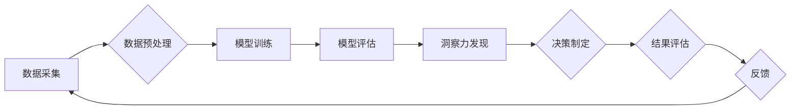

                 

## 理解洞察力的局限：承认不确定性

> 关键词：洞察力、不确定性、人工智能、机器学习、数据分析、模型偏差、可解释性、风险管理

### 1. 背景介绍

在数据爆炸的时代，洞察力被视为至关重要的竞争优势。企业和个人都渴望从海量数据中挖掘宝贵信息，以做出更明智的决策、预测未来趋势和识别新的机遇。人工智能（AI）和机器学习（ML）技术的快速发展为洞察力的获取提供了强大的工具，但同时也揭示了洞察力的局限性，以及我们必须面对的不确定性。

传统上，我们倾向于相信数据能提供绝对的答案，并以此为基础做出决策。然而，现实世界充满了复杂性和随机性，数据本身也存在着局限性。数据采集、处理和分析过程中都会引入偏差，模型本身也可能存在缺陷，导致洞察力存在误差或不准确。

### 2. 核心概念与联系

**2.1 洞察力**

洞察力是指从数据中识别出隐藏的模式、趋势和关系的能力，并将其转化为有价值的知识和行动建议。它需要结合数据分析、业务知识和批判性思维，才能真正发挥作用。

**2.2 不确定性**

不确定性是指在面对复杂系统和随机事件时，无法完全预测未来结果的可能性。在数据分析和决策过程中，不确定性是不可避免的，因为它反映了现实世界本身的复杂性和不可预测性。

**2.3 AI 和 ML 的局限性**

AI 和 ML 虽然能够处理海量数据并识别复杂的模式，但它们仍然存在一些局限性：

* **数据偏差:** AI 和 ML 模型的性能取决于训练数据的质量。如果训练数据存在偏差，模型也会产生偏差的结果。
* **模型偏差:** 即使使用高质量的数据，模型本身也可能存在偏差，导致其无法准确地反映现实世界。
* **可解释性:** 许多 AI 和 ML 模型是“黑盒”模型，这意味着我们无法完全理解其内部工作机制，难以解释其产生的结果。

**2.4  流程图**



### 3. 核心算法原理 & 具体操作步骤

**3.1 算法原理概述**

在洞察力分析中，常用的算法包括：

* **聚类算法:** 将数据点根据相似性分组，用于发现数据中的潜在结构和模式。
* **分类算法:** 根据已标记的数据训练模型，用于预测新数据的类别。
* **回归算法:** 根据已标记的数据训练模型，用于预测连续数值。

**3.2 算法步骤详解**

以聚类算法为例，其具体步骤如下：

1. **数据预处理:** 清洗、转换和规范化数据，使其适合聚类算法的处理。
2. **选择聚类算法:** 根据数据特点和分析目标选择合适的聚类算法，例如K-means、层次聚类等。
3. **设置聚类参数:** 确定聚类算法的参数，例如K值（K-means算法中的聚类数）。
4. **执行聚类:** 使用选定的算法对数据进行聚类，将数据点分配到不同的簇中。
5. **评估聚类结果:** 使用聚类评估指标，例如Silhouette score、Dunn index等，评估聚类结果的质量。
6. **可视化聚类结果:** 使用图表或其他可视化工具，展示聚类结果，以便更好地理解数据结构。

**3.3 算法优缺点**

聚类算法的优点包括：

* **无监督学习:** 不需要预先标记的数据，可以从未标记的数据中发现模式。
* **发现潜在结构:** 可以揭示数据中的潜在结构和关系，帮助我们更好地理解数据。

聚类算法的缺点包括：

* **参数敏感:** 聚类结果对参数设置非常敏感，需要谨慎选择参数。
* **难以解释:** 某些聚类算法的内部工作机制难以解释，难以理解其产生的结果。

**3.4 算法应用领域**

聚类算法广泛应用于各个领域，例如：

* **市场营销:** 将客户群体进行细分，以便针对不同群体的需求进行营销。
* **金融:** 识别欺诈交易和风险客户。
* **生物信息学:** 将基因数据进行聚类，发现基因功能和疾病关联。

### 4. 数学模型和公式 & 详细讲解 & 举例说明

**4.1 数学模型构建**

聚类算法通常基于距离度量和相似性计算。常见的距离度量包括欧氏距离、曼哈顿距离和余弦相似度。

**4.2 公式推导过程**

以K-means算法为例，其目标是将数据点分配到K个簇中，使得每个簇内的点尽可能接近，而不同簇之间的点尽可能远离。

K-means算法的迭代过程如下：

1. **随机初始化K个聚类中心:** 每个聚类中心代表一个簇的中心点。
2. **计算每个数据点到每个聚类中心的距离:** 使用选择的距离度量计算每个数据点到每个聚类中心的距离。
3. **将每个数据点分配到距离最近的聚类中心:** 将每个数据点分配到距离其最近的聚类中心所属的簇。
4. **重新计算每个簇的中心点:** 计算每个簇内所有数据点的平均值作为新的聚类中心。
5. **重复步骤2-4:** 直到聚类中心不再发生变化，或者达到预设的迭代次数。

**4.3 案例分析与讲解**

假设我们有一组数据点，需要将其聚类成3个簇。我们可以使用K-means算法，并选择欧氏距离作为距离度量。

1. 随机初始化3个聚类中心。
2. 计算每个数据点到每个聚类中心的距离。
3. 将每个数据点分配到距离其最近的聚类中心所属的簇。
4. 计算每个簇内所有数据点的平均值作为新的聚类中心。
5. 重复步骤2-4，直到聚类中心不再发生变化。

最终，我们将得到3个簇，每个簇包含一组相似的点。

### 5. 项目实践：代码实例和详细解释说明

**5.1 开发环境搭建**

可以使用Python语言和scikit-learn库进行K-means聚类算法的实现。

**5.2 源代码详细实现**

```python
from sklearn.cluster import KMeans
import numpy as np

# 生成示例数据
X = np.array([[1, 2], [1.5, 1.8], [5, 8], [8, 8], [1, 0.6], [9, 11]])

# 创建KMeans模型，设置聚类数为3
kmeans = KMeans(n_clusters=3, random_state=0)

# 训练模型
kmeans.fit(X)

# 获取聚类标签
labels = kmeans.labels_

# 获取聚类中心
centroids = kmeans.cluster_centers_

# 打印结果
print("聚类标签:", labels)
print("聚类中心:", centroids)
```

**5.3 代码解读与分析**

* `from sklearn.cluster import KMeans`: 导入KMeans聚类算法类。
* `import numpy as np`: 导入NumPy库，用于数据处理。
* `X = np.array([[1, 2], [1.5, 1.8], [5, 8], [8, 8], [1, 0.6], [9, 11]])`: 生成示例数据，是一个二维数据点集。
* `kmeans = KMeans(n_clusters=3, random_state=0)`: 创建KMeans模型，设置聚类数为3，`random_state`用于确保每次运行结果一致。
* `kmeans.fit(X)`: 训练模型，将数据点分配到不同的簇中。
* `labels = kmeans.labels_`: 获取每个数据点的聚类标签。
* `centroids = kmeans.cluster_centers_`: 获取每个簇的中心点。

**5.4 运行结果展示**

运行代码后，将输出每个数据点的聚类标签和每个簇的中心点。

### 6. 实际应用场景

**6.1 客户细分**

在市场营销领域，可以使用聚类算法将客户群体进行细分，根据他们的购买行为、兴趣爱好等特征，将客户分为不同的群组。

**6.2 异常检测**

在金融领域，可以使用聚类算法识别异常交易，例如欺诈交易或可疑活动。

**6.3 图像识别**

在计算机视觉领域，可以使用聚类算法将图像中的像素点进行分组，识别图像中的物体或场景。

**6.4 未来应用展望**

随着人工智能和机器学习技术的不断发展，洞察力分析将在更多领域得到应用，例如：

* **个性化推荐:** 根据用户的行为和偏好，提供个性化的产品或服务推荐。
* **医疗诊断:** 分析患者的医疗数据，辅助医生进行诊断和治疗。
* **城市规划:** 分析城市人口流动和交通数据，优化城市规划和管理。

### 7. 工具和资源推荐

**7.1 学习资源推荐**

* **书籍:**
    * 《Python数据科学手册》
    * 《机器学习实战》
* **在线课程:**
    * Coursera上的机器学习课程
    * edX上的数据科学课程

**7.2 开发工具推荐**

* **Python:** 广泛用于数据分析和机器学习开发。
* **scikit-learn:** Python机器学习库，提供各种聚类算法和工具。
* **TensorFlow:** 开源深度学习框架，可以用于构建更复杂的洞察力分析模型。

**7.3 相关论文推荐**

* K-means Clustering Algorithm
* Hierarchical Clustering Algorithms

### 8. 总结：未来发展趋势与挑战

**8.1 研究成果总结**

近年来，洞察力分析取得了显著进展，人工智能和机器学习技术为其提供了强大的工具。

**8.2 未来发展趋势**

未来，洞察力分析将朝着以下方向发展：

* **更强大的算法:** 开发更强大的聚类算法和机器学习模型，能够处理更复杂的数据和识别更精细的模式。
* **更强的可解释性:** 研究更可解释的机器学习模型，以便更好地理解其产生的结果。
* **更广泛的应用:** 洞察力分析将应用于更多领域，例如医疗、教育、金融等。

**8.3 面临的挑战**

洞察力分析也面临一些挑战：

* **数据质量:** 数据质量是洞察力分析的基础，需要确保数据的准确性、完整性和一致性。
* **模型偏差:** 模型本身也可能存在偏差，需要不断改进模型算法和训练数据，以减少偏差的影响。
* **伦理问题:** 洞察力分析可能会涉及到个人隐私和数据安全问题，需要谨慎处理，并制定相应的伦理规范。

**8.4 研究展望**

未来，我们需要继续研究更强大的洞察力分析算法，提高其准确性和可解释性，并解决数据质量、模型偏差和伦理问题等挑战。


### 9. 附录：常见问题与解答

**9.1 如何选择合适的聚类算法？**

选择合适的聚类算法取决于数据的特点和分析目标。

* **K-means算法:** 适合于数据分布较为均匀的情况，并且需要事先确定聚类数。
* **层次聚类算法:** 不需要事先确定聚类数，可以根据数据的层次结构进行聚类。
* **DBSCAN算法:** 适合于数据分布不均匀的情况，可以发现任意形状的簇。

**9.2 如何评估聚类结果的质量？**

可以使用Silhouette score、Dunn index等聚类评估指标来评估聚类结果的质量。

**9.3 如何处理数据中的异常值？**

异常值可能会影响聚类结果的准确性，可以采用以下方法处理：

* 删除异常值。
* 将异常值进行降维处理。
* 使用鲁棒的聚类算法，例如DBSCAN算法。


作者：禅与计算机程序设计艺术 / Zen and the Art of Computer Programming 
<end_of_turn>

