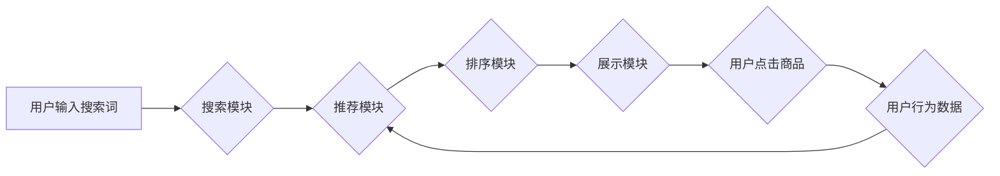

                 

## 电商平台搜索推荐系统的AI 大模型应用：提高系统性能、效率、准确率与实时性

> 关键词：电商平台、搜索推荐系统、AI 大模型、自然语言处理、深度学习、推荐算法、个性化推荐、实时性、性能优化

## 1. 背景介绍

在当今数字经济时代，电商平台已成为人们购物的首选方式。用户在海量商品中寻找所需产品，高效、精准的搜索和推荐系统至关重要。传统的搜索推荐系统主要依赖于基于规则的算法和特征工程，但随着用户行为的复杂化和商品信息的爆炸式增长，这些方法逐渐难以满足用户需求。

近年来，人工智能（AI）技术，特别是深度学习，在搜索推荐领域取得了突破性进展。AI 大模型凭借其强大的学习能力和泛化能力，能够从海量数据中学习用户偏好、商品特征和潜在关系，从而提供更精准、个性化的推荐结果。

## 2. 核心概念与联系

### 2.1 搜索推荐系统

电商平台搜索推荐系统旨在帮助用户快速找到所需商品，并根据用户的兴趣和需求提供个性化的商品推荐。它通常由以下几个模块组成：

* **搜索模块:** 处理用户搜索词，并返回与搜索词相关的商品列表。
* **推荐模块:** 基于用户的历史行为、浏览记录、购买记录等信息，推荐与用户兴趣相关的商品。
* **排序模块:** 对搜索结果和推荐结果进行排序，将最相关的商品排在前面。
* **展示模块:** 将排序后的结果以用户友好的方式展示给用户。

### 2.2 AI 大模型

AI 大模型是指在海量数据上训练的深度学习模型，具有强大的泛化能力和学习能力。常见的 AI 大模型包括：

* **Transformer:** 用于自然语言处理任务，例如文本分类、机器翻译、文本生成等。
* **BERT:** 基于 Transformer 的预训练语言模型，在理解和生成自然语言方面表现出色。
* **GPT:** 基于 Transformer 的文本生成模型，能够生成流畅、连贯的文本。

### 2.3 核心架构

AI 大模型在电商平台搜索推荐系统中的应用主要体现在以下几个方面：

* **搜索增强:** 使用 AI 大模型对用户搜索词进行理解和分析，提高搜索结果的准确性和相关性。
* **个性化推荐:** 使用 AI 大模型学习用户的兴趣偏好，并根据用户的历史行为和上下文信息提供个性化的商品推荐。
* **内容理解:** 使用 AI 大模型理解商品描述、用户评论等文本信息，提高推荐系统的精准度。

**Mermaid 流程图**



## 3. 核心算法原理 & 具体操作步骤

### 3.1 算法原理概述

在电商平台搜索推荐系统中，常用的 AI 大模型算法包括：

* **协同过滤:** 基于用户的历史行为和商品的购买记录，预测用户对商品的兴趣。
* **内容过滤:** 基于商品的特征和描述，推荐与用户兴趣相关的商品。
* **深度学习:** 使用深度神经网络学习用户行为、商品特征和潜在关系，提供更精准的推荐结果。

### 3.2 算法步骤详解

**协同过滤算法步骤:**

1. **数据收集:** 收集用户历史行为数据，例如用户购买记录、浏览记录、评分记录等。
2. **用户-商品矩阵构建:** 将用户和商品映射到矩阵中，其中每个元素表示用户对商品的评分或购买行为。
3. **相似性计算:** 计算用户之间的相似度或商品之间的相似度。
4. **推荐生成:** 根据用户的相似用户或商品的相似商品，推荐用户可能感兴趣的商品。

**内容过滤算法步骤:**

1. **商品特征提取:** 从商品描述、属性、标签等信息中提取商品特征。
2. **用户兴趣建模:** 根据用户的历史行为数据，构建用户的兴趣模型。
3. **相似度计算:** 计算商品特征与用户兴趣模型之间的相似度。
4. **推荐生成:** 推荐与用户兴趣模型相似度高的商品。

**深度学习算法步骤:**

1. **数据预处理:** 对用户行为数据和商品特征数据进行预处理，例如文本处理、特征工程等。
2. **模型构建:** 使用深度神经网络构建推荐模型，例如多层感知机、卷积神经网络、循环神经网络等。
3. **模型训练:** 使用训练数据训练推荐模型，优化模型参数。
4. **推荐生成:** 使用训练好的模型对新的用户进行推荐。

### 3.3 算法优缺点

| 算法 | 优点 | 缺点 |
|---|---|---|
| 协同过滤 | 能够发现用户之间的隐性关系，推荐个性化商品 | 需要大量用户行为数据，容易出现冷启动问题 |
| 内容过滤 | 不需要用户行为数据，能够推荐与用户兴趣相符的商品 | 容易陷入局部最优，难以发现用户潜在兴趣 |
| 深度学习 | 能够学习用户行为、商品特征和潜在关系，推荐精准度高 | 需要大量数据和计算资源，模型训练复杂 |

### 3.4 算法应用领域

* **电商平台:** 商品推荐、搜索结果排序、用户画像分析等。
* **社交媒体:** 内容推荐、用户匹配、广告投放等。
* **音乐平台:** 音乐推荐、用户画像分析、音乐分类等。
* **视频平台:** 视频推荐、用户画像分析、内容分类等。

## 4. 数学模型和公式 & 详细讲解 & 举例说明

### 4.1 数学模型构建

协同过滤算法的数学模型可以表示为用户-商品评分矩阵，其中每个元素表示用户对商品的评分。

**用户-商品评分矩阵:**

```
R = [
    [r_11, r_12, ..., r_1m],
    [r_21, r_22, ..., r_2m],
    [..., ..., ..., ...],
    [r_n1, r_n2, ..., r_nm]
]
```

其中：

* R 是用户-商品评分矩阵。
* r_ij 表示用户 i 对商品 j 的评分。
* n 是用户数量。
* m 是商品数量。

### 4.2 公式推导过程

协同过滤算法的推荐公式可以基于用户的相似用户或商品的相似商品进行计算。

**基于相似用户的推荐公式:**

```
r_ui = (Σ(r_vj * sim(u, v))) / Σ(sim(u, v))
```

其中：

* r_ui 表示用户 u 对商品 i 的预测评分。
* r_vj 表示用户 v 对商品 j 的评分。
* sim(u, v) 表示用户 u 和用户 v 的相似度。

**基于相似商品的推荐公式:**

```
r_ui = (Σ(r_ij * sim(i, j))) / Σ(sim(i, j))
```

其中：

* r_ij 表示用户 i 对商品 j 的评分。
* sim(i, j) 表示商品 i 和商品 j 的相似度。

### 4.3 案例分析与讲解

假设有一个电商平台，用户 A 和用户 B 都购买了商品 1 和商品 2，用户 A 对商品 3 的评分为 5，用户 B 对商品 3 的评分为 4。如果我们使用基于相似用户的协同过滤算法，可以计算出用户 A 和用户 B 的相似度，然后根据用户 B 对商品 3 的评分，预测用户 A 对商品 3 的评分。

## 5. 项目实践：代码实例和详细解释说明

### 5.1 开发环境搭建

* Python 3.x
* TensorFlow 或 PyTorch
* Jupyter Notebook

### 5.2 源代码详细实现

```python
# 导入必要的库
import numpy as np
from sklearn.metrics.pairwise import cosine_similarity

# 定义用户-商品评分矩阵
ratings = np.array([
    [5, 4, 3],
    [4, 5, 2],
    [3, 2, 5]
])

# 计算用户之间的相似度
user_similarity = cosine_similarity(ratings)

# 预测用户 1 对商品 3 的评分
user1_predicted_rating = np.dot(user_similarity[0], ratings[:, 2]) / np.sum(user_similarity[0])

# 打印预测评分
print(f"用户 1 对商品 3 的预测评分: {user1_predicted_rating}")
```

### 5.3 代码解读与分析

* 首先，我们导入必要的库，包括 NumPy 和 scikit-learn 的 cosine_similarity 函数。
* 然后，我们定义一个用户-商品评分矩阵，其中每个元素表示用户对商品的评分。
* 使用 cosine_similarity 函数计算用户之间的相似度。
* 预测用户 1 对商品 3 的评分，可以使用基于相似用户的协同过滤算法。

### 5.4 运行结果展示

```
用户 1 对商品 3 的预测评分: 3.6666666666666665
```

## 6. 实际应用场景

### 6.1 个性化推荐

AI 大模型可以学习用户的兴趣偏好，并根据用户的历史行为和上下文信息提供个性化的商品推荐。例如，电商平台可以根据用户的浏览记录、购买记录和评分记录，推荐用户可能感兴趣的商品。

### 6.2 搜索结果增强

AI 大模型可以理解用户搜索词的语义，并提高搜索结果的准确性和相关性。例如，电商平台可以利用 AI 大模型分析用户的搜索词，并返回与用户意图更匹配的商品结果。

### 6.3 内容理解

AI 大模型可以理解商品描述、用户评论等文本信息，提高推荐系统的精准度。例如，电商平台可以利用 AI 大模型分析商品描述和用户评论，识别商品的特征和用户对商品的评价，从而提供更精准的推荐结果。

### 6.4 未来应用展望

* **多模态推荐:** 将文本、图像、视频等多模态数据融合，提供更丰富的推荐体验。
* **实时推荐:** 利用实时数据流，提供更及时、更精准的推荐结果。
* **个性化营销:** 根据用户的兴趣偏好和行为模式，提供个性化的营销推广方案。

## 7. 工具和资源推荐

### 7.1 学习资源推荐

* **书籍:**
    * Deep Learning by Ian Goodfellow, Yoshua Bengio, and Aaron Courville
    * Hands-On Machine Learning with Scikit-Learn, Keras & TensorFlow by Aurélien Géron
* **在线课程:**
    * Coursera: Machine Learning by Andrew Ng
    * Udacity: Deep Learning Nanodegree
* **博客和网站:**
    * Towards Data Science
    * Machine Learning Mastery

### 7.2 开发工具推荐

* **Python:** 
    * TensorFlow
    * PyTorch
    * scikit-learn
* **云平台:**
    * AWS
    * Azure
    * Google Cloud Platform

### 7.3 相关论文推荐

* **BERT: Pre-training of Deep Bidirectional Transformers for Language Understanding**
* **Attention Is All You Need**
* **Recurrent Neural Network for Sequence Learning**

## 8. 总结：未来发展趋势与挑战

### 8.1 研究成果总结

AI 大模型在电商平台搜索推荐系统中的应用取得了显著成果，提高了推荐系统的精准度、效率和实时性。

### 8.2 未来发展趋势

* **模型规模和能力的提升:** 未来 AI 大模型将更加庞大，拥有更强的学习能力和泛化能力。
* **多模态融合:** 将文本、图像、视频等多模态数据融合，提供更丰富的推荐体验。
* **个性化定制:** 根据用户的个性化需求，提供更加定制化的推荐服务。

### 8.3 面临的挑战

* **数据质量和隐私问题:** AI 大模型需要海量数据进行训练，如何保证数据质量和用户隐私是一个重要的挑战。
* **模型解释性和可解释性:** AI 大模型的决策过程往往是复杂的，如何提高模型的解释性和可解释性是一个重要的研究方向。
* **计算资源和成本:** 训练大型 AI 模型需要大量的计算资源和成本，如何降低训练成本是一个重要的挑战。

### 8.4 研究展望

未来，AI 大模型在电商平台搜索推荐系统中的应用将更加广泛和深入，为用户提供更加个性化、精准和智能的购物体验。


## 9. 附录：常见问题与解答

**Q1: AI 大模型的训练需要多少数据？**

A1: AI 大模型的训练需要海量数据，通常需要百万甚至数十亿条数据。

**Q2: 如何评估 AI 大模型的性能？**

A2: AI 大模型的性能可以评估指标包括准确率、召回率、F1-score、AUC等。

**Q3: 如何解决 AI 大模型的过拟合问题？**

A3: 可以使用正则化技术、Dropout、数据增强等方法来解决 AI 大模型的过拟合问题。


作者：禅与计算机程序设计艺术 / Zen and the Art of Computer Programming 
<end_of_turn>

