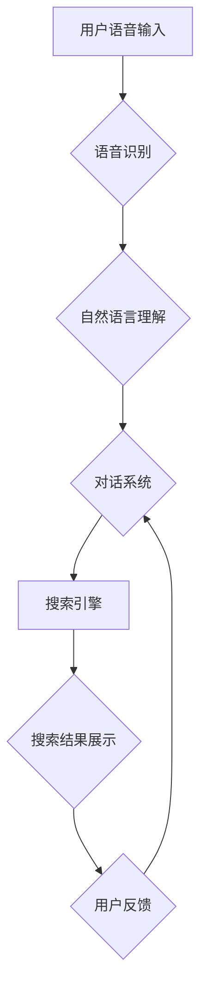

                 

## 电商搜索中的语音交互技术与应用

> 关键词：语音搜索、自然语言理解、电商搜索、语音识别、对话系统、人工智能、用户体验

## 1. 背景介绍

近年来，随着智能语音助手、智能音箱等语音交互设备的普及，语音搜索技术逐渐成为人们获取信息和完成任务的重要方式。电商行业作为消费领域的重要组成部分，也积极探索语音交互技术在电商搜索中的应用，以提升用户体验、拓展销售渠道、促进商业创新。

传统电商搜索主要依赖文本输入，用户需要手动输入关键词进行搜索，这往往存在以下问题：

* **搜索体验差：** 手动输入关键词需要时间和精力，尤其是在移动设备上，操作不便。
* **搜索结果不精准：** 用户的关键词输入可能不完整或不准确，导致搜索结果不符合预期。
* **用户群体限制：** 部分用户，例如老年人或残障人士，可能难以使用文本输入进行搜索。

语音搜索技术可以有效解决上述问题，为电商搜索带来新的机遇。

## 2. 核心概念与联系

语音交互技术在电商搜索中的应用主要涉及以下几个核心概念：

* **语音识别 (Speech Recognition)：** 将语音信号转换为文本，是语音搜索的基础。
* **自然语言理解 (Natural Language Understanding，NLU)：** 理解用户语音输入的语义和意图，例如用户想要搜索什么商品、什么属性的商品等。
* **对话系统 (Dialogue System)：** 与用户进行自然流畅的对话，引导用户进行更精准的搜索，并提供个性化的商品推荐等服务。
* **搜索引擎 (Search Engine)：** 基于用户语音输入的语义和意图，从商品数据库中检索出最相关的商品结果。

这些核心概念相互关联，共同构成了语音交互电商搜索的完整流程。

**Mermaid 流程图**



## 3. 核心算法原理 & 具体操作步骤

### 3.1  算法原理概述

语音搜索的核心算法主要包括语音识别算法和自然语言理解算法。

* **语音识别算法：** 主要利用机器学习技术，训练模型识别语音信号中的音素和词语。常用的语音识别算法包括隐马尔可夫模型 (HMM)、条件随机场 (CRF) 和深度学习模型 (DNN)。

* **自然语言理解算法：** 主要利用自然语言处理 (NLP) 技术，分析用户语音输入的语义和意图。常用的自然语言理解算法包括词性标注、依存句法分析、语义角色标注和意图分类等。

### 3.2  算法步骤详解

**语音识别算法步骤：**

1. **语音信号预处理：** 对语音信号进行降噪、增益调整、分帧等处理，提高语音识别准确率。
2. **特征提取：** 从语音信号中提取特征，例如梅尔频率倒谱系数 (MFCC) 等，用于训练语音识别模型。
3. **模型训练：** 利用训练数据，训练语音识别模型，例如 HMM、CRF 或 DNN 模型。
4. **语音识别：** 将用户语音信号输入到训练好的模型中，识别出语音信号中的音素和词语。

**自然语言理解算法步骤：**

1. **文本预处理：** 对识别出的文本进行分词、去停用词、词性标注等处理，提取关键信息。
2. **语义分析：** 利用词义消歧、依存句法分析等技术，分析文本的语义结构和关系。
3. **意图分类：** 根据文本语义，识别出用户的搜索意图，例如查询商品信息、比较商品价格、添加购物车等。
4. **实体识别：** 从文本中识别出关键实体，例如商品名称、品牌、价格等。

### 3.3  算法优缺点

**语音识别算法：**

* **优点：** 提高用户搜索体验，方便快捷，支持多种语言。
* **缺点：** 识别准确率受环境噪声、用户发音习惯等因素影响，识别速度可能较慢。

**自然语言理解算法：**

* **优点：** 能够理解用户的复杂语义需求，提供更精准的搜索结果。
* **缺点：** 算法复杂度高，需要大量训练数据，对用户语言表达有较高要求。

### 3.4  算法应用领域

语音识别和自然语言理解算法广泛应用于电商搜索、智能客服、语音助手、语音翻译等领域。

## 4. 数学模型和公式 & 详细讲解 & 举例说明

### 4.1  数学模型构建

语音识别和自然语言理解算法通常基于概率模型，例如隐马尔可夫模型 (HMM) 和条件随机场 (CRF)。

**隐马尔可夫模型 (HMM)：**

HMM 是一种用于序列标注问题的概率模型，假设每个状态只依赖于前一个状态，不依赖于更早的状态。HMM 的核心参数包括状态转移概率矩阵和观测概率矩阵。

**条件随机场 (CRF)：**

CRF 是一种用于序列标注问题的概率模型，假设每个状态依赖于其前后状态，可以更好地捕捉序列中的上下文信息。CRF 的核心参数包括状态转移概率和观测概率。

### 4.2  公式推导过程

HMM 和 CRF 的公式推导过程比较复杂，这里不再详细展开。

### 4.3  案例分析与讲解

**举例说明：**

假设用户语音输入为 "我想买一个红色的苹果"，语音识别算法识别出文本为 "我想买一个红色的苹果"。自然语言理解算法可以分析出用户的意图是 "购买商品"，实体包括 "商品名称：苹果"， "颜色：红色"。

## 5. 项目实践：代码实例和详细解释说明

### 5.1  开发环境搭建

* **操作系统：** Linux 或 Windows
* **编程语言：** Python
* **深度学习框架：** TensorFlow 或 PyTorch
* **语音识别库：** Kaldi 或 CMU Sphinx
* **自然语言理解库：** spaCy 或 NLTK

### 5.2  源代码详细实现

由于篇幅限制，这里只提供部分代码示例，具体实现细节请参考相关开源项目或文档。

**语音识别代码示例 (使用 Kaldi)：**

```python
# 使用 Kaldi 进行语音识别
import kaldi_io

# 读取语音文件
wav_file = "audio.wav"
wav_data = kaldi_io.read_wave(wav_file)

# 使用训练好的模型进行识别
model_path = "model.ark"
decoder_path = "decoder.fst"
recognized_text = kaldi_decoder.decode(wav_data, model_path, decoder_path)

# 打印识别结果
print(recognized_text)
```

**自然语言理解代码示例 (使用 spaCy)：**

```python
# 使用 spaCy 进行自然语言理解
import spacy

# 加载预训练模型
nlp = spacy.load("en_core_web_sm")

# 对文本进行分析
text = "我想买一个红色的苹果"
doc = nlp(text)

# 获取意图
intent = doc.ents[0].label_

# 获取实体
entities = [(ent.text, ent.label_) for ent in doc.ents]

# 打印结果
print(f"意图：{intent}")
print(f"实体：{entities}")
```

### 5.3  代码解读与分析

上述代码示例展示了语音识别和自然语言理解的基本流程。

* **语音识别代码：** 使用 Kaldi 库读取语音文件，并利用训练好的模型进行识别，输出识别结果。
* **自然语言理解代码：** 使用 spaCy 库对文本进行分析，识别出用户的意图和实体。

### 5.4  运行结果展示

运行上述代码后，可以得到语音识别结果和自然语言理解结果。例如，对于用户语音输入 "我想买一个红色的苹果"，语音识别结果为 "我想买一个红色的苹果"，自然语言理解结果为：

* 意图：购买商品
* 实体：
    * 商品名称：苹果
    * 颜色：红色

## 6. 实际应用场景

语音交互电商搜索已在一些电商平台上得到应用，例如：

* **智能音箱购物：** 用户可以通过智能音箱语音搜索商品，并进行购买。
* **语音客服：** 用户可以通过语音与电商客服进行对话，咨询商品信息、订单状态等。
* **个性化推荐：** 根据用户的语音搜索历史和购买记录，提供个性化的商品推荐。

### 6.4  未来应用展望

未来，语音交互电商搜索将更加智能化、个性化和场景化。例如：

* **多模态交互：** 将语音搜索与图像识别、视频识别等多模态技术结合，提供更丰富的搜索体验。
* **上下文理解：** 利用深度学习技术，提升算法对用户对话语境的理解能力，提供更精准的搜索结果。
* **虚拟试衣间：** 利用语音交互和虚拟现实技术，实现虚拟试衣间功能，帮助用户在线试穿商品。

## 7. 工具和资源推荐

### 7.1  学习资源推荐

* **语音识别：** Kaldi, CMU Sphinx, DeepSpeech
* **自然语言理解：** spaCy, NLTK, Stanford CoreNLP
* **深度学习框架：** TensorFlow, PyTorch

### 7.2  开发工具推荐

* **语音识别平台：** Google Cloud Speech-to-Text, Amazon Transcribe, Microsoft Azure Speech Services
* **自然语言理解平台：** Google Cloud Natural Language API, Amazon Comprehend, Microsoft Azure Cognitive Services

### 7.3  相关论文推荐

* **语音识别：**
    * "DeepSpeech: Scaling up end-to-end speech recognition"
    * "Connectionist Temporal Classification: Labelling Sequence Data with Recurrent Neural Networks"
* **自然语言理解：**
    * "BERT: Pre-training of Deep Bidirectional Transformers for Language Understanding"
    * "Attention Is All You Need"

## 8. 总结：未来发展趋势与挑战

### 8.1  研究成果总结

语音交互电商搜索技术取得了显著进展，语音识别和自然语言理解算法不断提升，用户体验得到显著改善。

### 8.2  未来发展趋势

未来，语音交互电商搜索将朝着以下方向发展：

* **更精准的搜索结果：** 利用深度学习技术，提升算法对用户语义需求的理解能力，提供更精准的搜索结果。
* **更智能的交互体验：** 将语音搜索与多模态技术、虚拟现实技术等结合，提供更智能、更丰富的交互体验。
* **更个性化的服务：** 利用用户语音搜索历史和购买记录，提供更个性化的商品推荐和服务。

### 8.3  面临的挑战

语音交互电商搜索技术还面临一些挑战：

* **语音识别准确率：** 不同用户的语音发音习惯、环境噪声等因素会影响语音识别准确率。
* **自然语言理解复杂度：** 用户的语言表达往往复杂多样，需要更 sophisticated 的自然语言理解算法。
* **数据安全和隐私保护：** 语音数据包含用户敏感信息，需要采取有效措施保障数据安全和隐私。

### 8.4  研究展望

未来，需要继续加强语音识别、自然语言理解算法的研究，提升算法的准确率和鲁棒性。同时，需要关注数据安全和隐私保护问题，构建安全可靠的语音交互电商搜索系统。

## 9. 附录：常见问题与解答

**常见问题：**

* **语音识别准确率如何？**

语音识别准确率受多种因素影响，例如语音质量、环境噪声、用户发音习惯等。目前，主流语音识别算法的准确率已经达到很高的水平，但仍存在一定的误差。

* **如何保障用户数据安全？**

语音交互电商搜索系统需要采取有效措施保障用户数据安全，例如加密传输、数据脱敏等。

* **语音交互电商搜索的未来发展趋势？**

未来，语音交互电商搜索将朝着更精准、更智能、更个性化的方向发展。

**作者：禅与计算机程序设计艺术 / Zen and the Art of Computer Programming**<end_of_turn>

