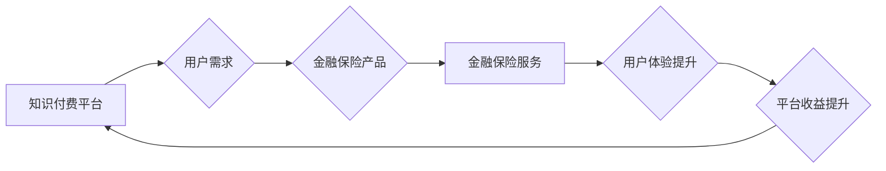

                 

## 关键词：知识付费、跨界营销、金融保险、跨界合作、数据驱动、用户体验、人工智能

## 1. 背景介绍
 
  知识付费作为一种新型的商业模式，近年来发展迅速，其核心在于将知识和技能作为商品进行交易。随着互联网技术的不断发展和用户对知识的需求不断增长，知识付费市场呈现出巨大的发展潜力。金融保险行业作为传统行业，近年来也积极探索新的发展模式，寻求与互联网、科技等领域的融合发展。

  跨界营销是指企业将自身产品或服务与其他行业或领域的品牌进行合作，共同推广，以扩大市场影响力和提升品牌知名度。跨界合作可以打破行业壁垒，创造新的价值，为用户提供更丰富、更全面的服务体验。

  在知识付费和金融保险领域，跨界营销和跨界合作具有巨大的发展机遇。金融保险行业可以通过与知识付费平台的合作，提供更精准、更个性化的金融保险服务，满足用户多样化的需求。而知识付费平台则可以通过与金融保险行业的合作，拓展用户群体，提升用户粘性，实现新的商业模式创新。

## 2. 核心概念与联系

**2.1 知识付费平台**

知识付费平台是指提供知识和技能付费服务的在线平台，其主要功能包括：

* 内容发布：知识付费创作者可以发布各种类型的知识付费内容，例如课程、直播、文档、咨询等。
* 用户付费：用户可以通过平台购买知识付费内容，并获得相应的学习和服务体验。
* 内容管理：平台提供内容管理工具，帮助创作者管理和更新知识付费内容。
* 用户互动：平台提供用户互动功能，例如评论、讨论、问答等，促进用户之间的交流和学习。

**2.2 金融保险行业**

金融保险行业是指提供金融和保险服务的行业，其主要业务包括：

* 银行业务：存款、贷款、支付结算等。
* 保险业务：人寿保险、财产保险、健康保险等。
* 投资业务：股票、债券、基金等。

**2.3 跨界营销与跨界合作**

跨界营销是指企业将自身产品或服务与其他行业或领域的品牌进行合作，共同推广，以扩大市场影响力和提升品牌知名度。跨界合作可以打破行业壁垒，创造新的价值，为用户提供更丰富、更全面的服务体验。

**2.4 核心概念联系**

知识付费平台、金融保险行业和跨界营销之间存在着密切的联系。知识付费平台可以为金融保险行业提供精准的用户群体和个性化的服务内容，而金融保险行业则可以为知识付费平台提供资金支持和技术保障。通过跨界合作，双方可以实现资源共享、优势互补，共同打造新的商业模式。

**Mermaid 流程图**



## 3. 核心算法原理 & 具体操作步骤

**3.1 算法原理概述**

知识付费与金融保险跨界营销的核心算法原理在于数据驱动和用户画像。通过对用户行为、偏好和需求进行分析，构建精准的用户画像，并根据用户画像推荐个性化的金融保险产品和服务。

**3.2 算法步骤详解**

1. **数据收集:** 收集用户在知识付费平台上的行为数据，例如学习记录、评论内容、咨询记录等，以及用户在金融保险平台上的行为数据，例如产品浏览记录、购买记录、理赔记录等。
2. **数据清洗:** 对收集到的数据进行清洗和预处理，去除无效数据、缺失数据和重复数据，确保数据质量。
3. **特征提取:** 从用户行为数据中提取特征，例如用户学习兴趣、风险偏好、收入水平、年龄段等，构建用户画像。
4. **模型训练:** 利用机器学习算法，例如决策树、支持向量机、神经网络等，对用户画像进行分析，建立预测模型，预测用户对不同金融保险产品的需求。
5. **个性化推荐:** 根据用户画像和预测模型，为用户推荐个性化的金融保险产品和服务。
6. **效果评估:** 对推荐效果进行评估，不断优化算法模型和推荐策略。

**3.3 算法优缺点**

**优点:**

* 数据驱动，精准推荐，提高用户体验。
* 跨界合作，资源共享，实现商业模式创新。
* 个性化服务，满足用户多样化需求。

**缺点:**

* 数据安全和隐私保护问题。
* 模型训练需要大量数据，数据获取成本较高。
* 算法模型需要不断优化，才能保持推荐效果。

**3.4 算法应用领域**

* 金融保险产品推荐
* 知识付费内容推荐
* 用户画像分析
* 个性化营销

## 4. 数学模型和公式 & 详细讲解 & 举例说明

**4.1 数学模型构建**

知识付费与金融保险跨界营销的数学模型可以基于用户画像和产品特征进行构建。

用户画像可以表示为一个向量，例如：

```
user_profile = [age, income, education, risk_tolerance, interest_categories]
```

产品特征可以表示为另一个向量，例如：

```
product_feature = [product_type, coverage, premium, risk_level]
```

**4.2 公式推导过程**

可以使用余弦相似度来衡量用户画像和产品特征之间的相似度：

```
similarity = cos(user_profile, product_feature) = (user_profile • product_feature) / (||user_profile|| * ||product_feature||)
```

其中：

* `•` 表示向量点积
* `||user_profile||` 和 `||product_feature||` 表示向量的模长

**4.3 案例分析与讲解**

假设有一个用户画像：

```
user_profile = [30, 50000, bachelor, moderate, finance, technology]
```

以及一个金融保险产品特征：

```
product_feature = [30, 50000, moderate, life_insurance, comprehensive, high]
```

根据公式，可以计算出用户画像和产品特征之间的相似度：

```
similarity = (30 * 30 + 50000 * 50000 + bachelor * moderate + moderate * moderate + finance * high + technology * high) / (sqrt(30^2 + 50000^2 + bachelor^2 + moderate^2 + finance^2 + technology^2) * sqrt(30^2 + 50000^2 + moderate^2 + life_insurance^2 + comprehensive^2 + high^2))
```

通过计算，可以得到用户画像和产品特征之间的相似度值，从而判断用户对该金融保险产品的兴趣程度。

## 5. 项目实践：代码实例和详细解释说明

**5.1 开发环境搭建**

* Python 3.x
* Jupyter Notebook
* scikit-learn
* pandas
* numpy

**5.2 源代码详细实现**

```python
import pandas as pd
from sklearn.metrics.pairwise import cosine_similarity

# 加载用户画像数据
user_data = pd.read_csv('user_profile.csv')

# 加载产品特征数据
product_data = pd.read_csv('product_feature.csv')

# 提取用户特征和产品特征
user_features = user_data[['age', 'income', 'education', 'risk_tolerance', 'interest_categories']]
product_features = product_data[['product_type', 'coverage', 'premium', 'risk_level']]

# 计算用户画像和产品特征之间的余弦相似度
similarity_matrix = cosine_similarity(user_features, product_features)

# 打印相似度矩阵
print(similarity_matrix)
```

**5.3 代码解读与分析**

* 使用 pandas 库加载用户画像和产品特征数据。
* 使用 scikit-learn 库的 cosine_similarity 函数计算用户画像和产品特征之间的余弦相似度。
* 打印相似度矩阵，可以看出每个用户与每个产品之间的相似度值。

**5.4 运行结果展示**

运行代码后，会输出一个相似度矩阵，其中每个元素代表用户画像和产品特征之间的相似度值。

## 6. 实际应用场景

**6.1 金融保险产品推荐**

知识付费平台可以根据用户学习记录和兴趣爱好，推荐相关的金融保险产品。例如，用户学习了投资理财课程，平台可以推荐投资理财相关的保险产品，例如意外险、医疗险等。

**6.2 个性化营销方案**

金融保险公司可以利用用户画像，制定个性化的营销方案。例如，针对高收入用户，可以推荐高端保险产品，针对风险偏好低的用户，可以推荐保障范围更广的保险产品。

**6.3 跨界合作案例**

* 某知识付费平台与某保险公司合作，推出“学习保险”套餐，用户购买平台的学习课程，即可获得相应的保险优惠。
* 某金融机构与某教育平台合作，为用户提供理财知识付费课程，并根据用户学习情况，推荐个性化的理财产品。

**6.4 未来应用展望**

随着人工智能技术的不断发展，知识付费与金融保险跨界营销将更加智能化、个性化。未来，我们可以看到：

* 更精准的用户画像分析，更个性化的产品推荐。
* 更智能化的营销策略，更高效的营销效果。
* 更丰富的跨界合作模式，创造更大的价值。

## 7. 工具和资源推荐

**7.1 学习资源推荐**

* **书籍:**
    * 《数据挖掘：概念与技术》
    * 《机器学习》
    * 《深度学习》
* **在线课程:**
    * Coursera
    * edX
    * Udemy

**7.2 开发工具推荐**

* **Python:**
    * scikit-learn
    * pandas
    * numpy
* **数据可视化工具:**
    * Tableau
    * Power BI
    * matplotlib

**7.3 相关论文推荐**

* **基于用户画像的金融保险产品推荐研究**
* **人工智能在金融保险领域的应用**
* **跨界营销的理论与实践**

## 8. 总结：未来发展趋势与挑战

**8.1 研究成果总结**

知识付费与金融保险跨界营销是一个新兴的领域，具有巨大的发展潜力。通过数据驱动和用户画像分析，可以实现精准的产品推荐和个性化的营销服务，为用户提供更丰富、更全面的服务体验。

**8.2 未来发展趋势**

未来，知识付费与金融保险跨界营销将更加智能化、个性化和场景化。人工智能技术将进一步推动该领域的创新发展，例如：

* 更精准的用户画像分析，利用深度学习等算法，构建更精细的用户画像。
* 更智能化的营销策略，利用机器学习算法，制定更精准、更有效的营销策略。
* 更丰富的跨界合作模式，探索更多跨界合作模式，创造更大的价值。

**8.3 面临的挑战**

知识付费与金融保险跨界营销也面临一些挑战，例如：

* 数据安全和隐私保护问题，需要加强数据安全管理，保护用户隐私。
* 模型训练数据不足，需要不断收集和积累数据，提高模型训练效果。
* 跨界合作模式创新，需要探索更有效的跨界合作模式，实现资源共享和优势互补。

**8.4 研究展望**

未来，我们将继续关注知识付费与金融保险跨界营销领域的最新发展，并进行深入研究，探索更智能、更个性化、更场景化的服务模式，为用户提供更优质的体验。

## 9. 附录：常见问题与解答

**9.1 如何构建用户画像？**

用户画像可以根据用户的行为数据、人口统计数据、兴趣爱好等信息进行构建。可以使用机器学习算法，例如聚类算法，将用户进行分组，并为每个用户群体构建相应的画像。

**9.2 如何选择合适的推荐算法？**

推荐算法的选择需要根据具体的业务场景和数据特点进行选择。常用的推荐算法包括协同过滤、内容过滤、基于知识的推荐等。

**9.3 如何评估推荐效果？**

推荐效果可以根据点击率、转化率、用户满意度等指标进行评估。可以使用 A/B 测试等方法，比较不同推荐算法的效果。


作者：禅与计算机程序设计艺术 / Zen and the Art of Computer Programming 
<end_of_turn>

