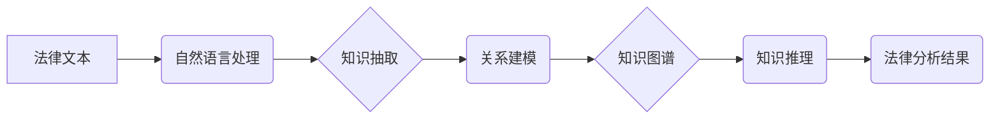

                 

## 知识发现引擎：推动法律行业的智能化变革

> 关键词：知识发现引擎、法律科技、人工智能、自然语言处理、机器学习、法律分析、智能合同、法律预测

## 1. 背景介绍

法律行业作为传统行业之一，长期以来面临着信息量庞大、处理效率低、工作重复性高等问题。随着人工智能技术的快速发展，法律科技（LegalTech）应运而生，旨在利用人工智能等技术手段，提升法律服务的效率、精准度和可及性。其中，知识发现引擎作为法律科技的重要组成部分，在法律研究、案件分析、合同审查等领域展现出巨大的潜力。

传统的法律研究主要依赖于人工阅读和分析海量法律文件，效率低下且容易出现遗漏。知识发现引擎通过对法律文本进行智能分析，能够自动识别法律概念、关系和模式，并将其转化为可理解的知识图谱，为法律研究提供更快捷、更精准的解决方案。

## 2. 核心概念与联系

知识发现引擎的核心概念是将法律文本中的知识结构化，并通过算法进行分析和挖掘。其主要包含以下几个关键环节：

* **自然语言处理（NLP）：** 用于对法律文本进行理解和分析，包括分词、词性标注、依存句法分析等。
* **知识抽取：** 从法律文本中提取关键信息，如法律条款、当事人信息、时间地点等，并将其存储在知识库中。
* **关系建模：** 建立法律概念之间的关系，例如“法律条款”与“当事人”之间的关系，构建法律知识图谱。
* **知识推理：** 基于已有的法律知识，进行逻辑推理和推导，例如根据法律条款和事实情况，预测案件结果。

**核心概念与联系流程图：**



## 3. 核心算法原理 & 具体操作步骤

### 3.1  算法原理概述

知识发现引擎的核心算法主要包括：

* **机器学习算法：** 用于训练模型，识别法律概念和关系。常见的算法包括支持向量机（SVM）、深度神经网络（DNN）等。
* **规则引擎：** 基于预先定义的法律规则，进行知识推理和推导。

### 3.2  算法步骤详解

1. **数据预处理：** 对法律文本进行清洗、格式化和标注，以便于后续算法训练和应用。
2. **特征提取：** 从法律文本中提取关键特征，例如词语、短语、语法结构等，作为算法训练的输入数据。
3. **模型训练：** 使用机器学习算法对训练数据进行训练，学习法律概念和关系的模式。
4. **知识图谱构建：** 将训练好的模型应用于新的法律文本，进行知识抽取和关系建模，构建法律知识图谱。
5. **知识推理：** 基于法律知识图谱，进行逻辑推理和推导，例如预测案件结果、识别法律风险等。

### 3.3  算法优缺点

**优点：**

* **自动化：** 可以自动化完成法律文本的分析和挖掘，提高效率。
* **精准度：** 基于机器学习算法，能够识别法律概念和关系的细微差别，提高分析的精准度。
* **可扩展性：** 可以扩展到处理不同类型的法律文本，例如合同、判决书、法律法规等。

**缺点：**

* **数据依赖：** 算法的性能取决于训练数据的质量和数量。
* **解释性：** 机器学习算法的决策过程往往难以解释，这可能导致法律专业人员难以接受。
* **法律法规的动态性：** 法律法规的更新迭代需要不断更新算法模型，维护成本较高。

### 3.4  算法应用领域

* **法律研究：** 帮助法律学者快速了解法律领域的最新发展趋势，并进行深入研究。
* **案件分析：** 分析案件相关法律文件，识别关键证据和法律风险，为案件辩护提供支持。
* **合同审查：** 自动识别合同条款，并进行风险评估，帮助企业规避法律风险。
* **法律预测：** 基于历史案件数据，预测案件结果，为当事人提供参考。

## 4. 数学模型和公式 & 详细讲解 & 举例说明

### 4.1  数学模型构建

知识发现引擎的核心数学模型是基于图论的知识图谱。知识图谱将法律概念和关系表示为节点和边，其中节点代表法律概念，边代表概念之间的关系。例如，在知识图谱中，“合同”节点可以与“当事人”、“条款”、“生效日期”等节点相连，表示它们之间的关系。

### 4.2  公式推导过程

知识图谱的构建和推理过程涉及多种数学公式，例如：

* **相似度计算：** 用于衡量两个节点之间的相似度，例如余弦相似度、Jaccard相似度等。
* **路径查找：** 用于在知识图谱中查找特定路径，例如从“合同”节点到“违约”节点的路径。
* **规则匹配：** 用于在知识图谱中匹配预先定义的法律规则，例如“如果合同中包含‘违约金’条款，则该合同存在违约风险”。

### 4.3  案例分析与讲解

假设我们构建了一个关于合同的知识图谱，其中包含了“合同”、“当事人”、“条款”、“违约金”等节点。

* **相似度计算：** 如果我们想要查找与“违约金”节点相似的节点，可以使用余弦相似度计算，例如“赔偿金”、“违约责任”等节点可能与“违约金”节点具有较高的相似度。
* **路径查找：** 如果我们想要查找所有包含“违约金”条款的合同，可以使用路径查找算法，例如查找从“合同”节点到“违约金”节点的所有路径。
* **规则匹配：** 如果我们预先定义了一个规则：“如果合同中包含‘违约金’条款，则该合同存在违约风险”，可以使用规则匹配算法，在知识图谱中查找所有满足该规则的合同。

## 5. 项目实践：代码实例和详细解释说明

### 5.1  开发环境搭建

* **操作系统：** Ubuntu 20.04 LTS
* **编程语言：** Python 3.8
* **深度学习框架：** TensorFlow 2.0
* **自然语言处理库：** spaCy、NLTK
* **知识图谱库：** RDFlib

### 5.2  源代码详细实现

```python
# 导入必要的库
import spacy
from rdflib import Graph, Literal, URIRef

# 加载预训练的自然语言处理模型
nlp = spacy.load("en_core_web_sm")

# 定义知识抽取函数
def extract_knowledge(text):
    doc = nlp(text)
    # 提取关键信息，例如实体、关系等
    entities = [(ent.text, ent.label_) for ent in doc.ents]
    relations = [(token.text, token.dep_) for token in doc if token.dep_ != "ROOT"]
    # 将提取的信息存储在知识图谱中
    g = Graph()
    # ...
    return g

# 定义知识推理函数
def infer_knowledge(g):
    # 基于知识图谱进行逻辑推理
    # ...
    return inferred_knowledge

# 示例代码
text = "John Doe signed a contract with Jane Doe on 2023-01-01."
g = extract_knowledge(text)
inferred_knowledge = infer_knowledge(g)
print(inferred_knowledge)
```

### 5.3  代码解读与分析

* **自然语言处理：** 使用spaCy库对法律文本进行分词、词性标注、依存句法分析等处理，提取关键信息。
* **知识抽取：** 定义函数`extract_knowledge`，从处理后的文本中提取实体、关系等信息，并将其存储在知识图谱中。
* **知识推理：** 定义函数`infer_knowledge`，利用预先定义的法律规则或机器学习模型，对知识图谱进行推理，得出新的知识或结论。

### 5.4  运行结果展示

运行上述代码后，将输出一个包含法律知识的知识图谱，例如：

```
# 知识图谱示例
John Doe - signed - Contract
Contract - with - Jane Doe
Contract - on - 2023-01-01
```

## 6. 实际应用场景

### 6.1  法律研究

知识发现引擎可以帮助法律学者快速浏览和分析海量法律文献，识别法律概念和趋势，加速法律研究进程。例如，可以分析所有关于合同法的判决书，识别常见的合同条款和争议点，为法律研究提供新的视角。

### 6.2  案件分析

知识发现引擎可以帮助律师分析案件相关法律文件，识别关键证据和法律风险，为案件辩护提供支持。例如，可以分析案件相关的合同、法律法规、判决书等文件，识别案件的关键事实、法律依据和潜在风险，为律师制定辩护策略提供参考。

### 6.3  合同审查

知识发现引擎可以自动识别合同条款，并进行风险评估，帮助企业规避法律风险。例如，可以分析合同条款，识别潜在的违约风险、责任划分问题等，提醒企业及时修改合同条款，避免法律纠纷。

### 6.4  未来应用展望

随着人工智能技术的不断发展，知识发现引擎在法律行业的应用场景将更加广泛。例如，可以用于法律预测、法律咨询、智能合同时，为法律服务提供更加智能化、高效化的解决方案。

## 7. 工具和资源推荐

### 7.1  学习资源推荐

* **斯坦福大学自然语言处理课程：** https://web.stanford.edu/class/cs224n/
* **机器学习公开课：** https://www.coursera.org/learn/machine-learning
* **法律科技博客：** https://www.lawtech.com/

### 7.2  开发工具推荐

* **spaCy：** https://spacy.io/
* **NLTK：** https://www.nltk.org/
* **TensorFlow：** https://www.tensorflow.org/
* **RDFlib：** https://rdflib.readthedocs.io/en/stable/

### 7.3  相关论文推荐

* **Knowledge Discovery in Legal Documents: A Survey**
* **Legal Text Mining: A Review**
* **Deep Learning for Legal Text Analysis**

## 8. 总结：未来发展趋势与挑战

### 8.1  研究成果总结

知识发现引擎在法律行业展现出巨大的潜力，能够有效提升法律服务的效率、精准度和可及性。通过对法律文本进行智能分析，可以帮助法律专业人员更快地了解法律知识、分析案件、审查合同等。

### 8.2  未来发展趋势

* **更强大的自然语言处理能力：** 随着深度学习技术的不断发展，自然语言处理模型将更加强大，能够更好地理解法律文本的复杂性和语义。
* **更精准的知识推理能力：** 基于机器学习和规则引擎，知识发现引擎将能够进行更精准的知识推理，为法律专业人员提供更可靠的分析结果。
* **更广泛的应用场景：** 知识发现引擎将应用于更多法律领域，例如法律预测、法律咨询、智能合同时，为法律服务提供更加智能化、高效化的解决方案。

### 8.3  面临的挑战

* **数据质量和数量：** 知识发现引擎的性能取决于训练数据的质量和数量，而法律数据往往难以获取和标注。
* **法律法规的动态性：** 法律法规的更新迭代需要不断更新算法模型，维护成本较高。
* **解释性问题：** 机器学习算法的决策过程往往难以解释，这可能导致法律专业人员难以接受。

### 8.4  研究展望

未来，知识发现引擎将继续朝着更智能化、更精准化、更易于使用的方向发展。研究者将致力于解决数据质量、法律法规动态性、解释性等问题，推动知识发现引擎在法律行业得到更广泛的应用。

## 9. 附录：常见问题与解答

**Q1：知识发现引擎是否可以完全替代法律专业人员？**

A1：知识发现引擎可以辅助法律专业人员进行工作，但不能完全替代他们。法律工作需要复杂的逻辑推理、法律判断和人际沟通，这些方面目前人工智能技术还无法完全替代人类。

**Q2：知识发现引擎的安全性如何保证？**

A2：知识发现引擎处理的法律数据往往是敏感信息，因此安全性至关重要。开发知识发现引擎时需要采取相应的安全措施，例如数据加密、权限控制等，确保数据安全。

**Q3：如何评估知识发现引擎的性能？**

A3：知识发现引擎的性能可以从准确率、召回率、F1-score等指标进行评估。此外，还可以通过实际应用场景的测试，评估其在法律工作中的实际效果。


作者：禅与计算机程序设计艺术 / Zen and the Art of Computer Programming 
<end_of_turn>

