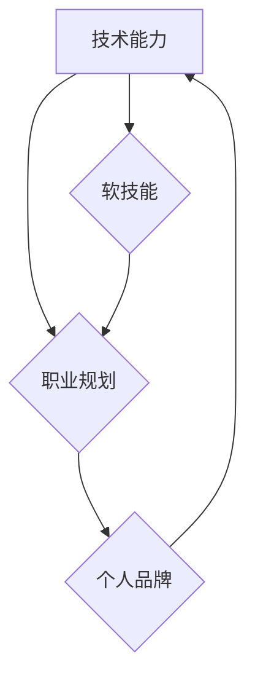

                 

## 程序员如何建立长期的职业竞争力

> 关键词：程序员职业发展、技术能力、持续学习、软技能、行业趋势、职业规划、个人品牌

### 1. 背景介绍

在当今瞬息万变的科技时代，程序员的职业竞争力日益重要。随着人工智能、云计算、大数据等新兴技术的快速发展，编程领域不断涌现新的技术和挑战。对于程序员来说，仅仅掌握一门编程语言或一套技术栈已经不足以保证长期的职业成功。

为了在激烈的竞争环境中脱颖而出，程序员需要不断提升自身的技术能力、拓展知识面、培养软技能，并紧跟行业发展趋势。本文将探讨程序员如何建立长期的职业竞争力，帮助他们在技术领域获得持续的成功。

### 2. 核心概念与联系

程序员职业竞争力的建立是一个多维度的过程，涉及技术能力、软技能、职业规划、个人品牌等多个方面。这些方面相互关联，共同构成了程序员的职业生态系统。

**Mermaid 流程图：**



**技术能力**是程序员的基石，包括编程语言、数据结构、算法、软件设计模式等方面的知识和技能。

**软技能**是指与人沟通、协作、解决问题、领导团队等方面的能力，对于程序员来说同样至关重要。

**职业规划**是指程序员对自身职业发展方向的思考和规划，包括学习目标、职业目标、职业发展路径等。

**个人品牌**是指程序员在行业内的声誉和影响力，可以通过参与开源项目、撰写技术博客、演讲分享等方式建立。

### 3. 核心算法原理 & 具体操作步骤

**3.1 算法原理概述**

算法是解决特定问题的一系列步骤或规则，是程序员的核心技能之一。掌握算法的原理和设计思想，可以帮助程序员编写更高效、更优化的代码。

**3.2 算法步骤详解**

以下是一个常见的排序算法——快速排序的步骤详解：

1. 选择一个基准元素。
2. 将小于基准元素的元素放在其左边，大于基准元素的元素放在其右边。
3. 对基准元素左边和右边的子数组重复步骤1和2，直到子数组大小为1。

**3.3 算法优缺点**

**优点：**

* 平均时间复杂度为O(n log n)，效率较高。
* 原地排序，空间复杂度为O(log n)。

**缺点：**

* 最坏时间复杂度为O(n^2)，当输入数据已经排序时效率较低。
* 不稳定排序，相同元素的相对顺序可能改变。

**3.4 算法应用领域**

快速排序广泛应用于各种排序问题，例如：

* 数据结构的排序
* 搜索引擎的关键词排序
* 图像处理中的像素排序

### 4. 数学模型和公式 & 详细讲解 & 举例说明

**4.1 数学模型构建**

快速排序算法可以抽象为一个递归的数学模型：

```latex
T(n) = 2T(n/2) + O(n)
```

其中：

* T(n) 表示排序n个元素的时间复杂度。
* 2T(n/2) 表示对左右子数组进行排序的时间复杂度。
* O(n) 表示将基准元素与其他元素比较的时间复杂度。

**4.2 公式推导过程**

通过主定理，可以推导出快速排序算法的平均时间复杂度为O(n log n)。

**4.3 案例分析与讲解**

假设要排序一个包含5个元素的数组：[3, 7, 8, 5, 2]。

1. 选择第一个元素3作为基准元素。
2. 将小于3的元素2放在其左边，大于3的元素7, 8, 5放在其右边。
3. 对子数组[2]和[7, 8, 5]重复步骤1和2，直到子数组大小为1。

最终得到排序后的数组：[2, 3, 5, 7, 8]。

### 5. 项目实践：代码实例和详细解释说明

**5.1 开发环境搭建**

可以使用任何支持Python语言的开发环境，例如：

* PyCharm
* VS Code
* Jupyter Notebook

**5.2 源代码详细实现**

```python
def quick_sort(arr):
    if len(arr) <= 1:
        return arr
    pivot = arr[0]
    left = [x for x in arr[1:] if x <= pivot]
    right = [x for x in arr[1:] if x > pivot]
    return quick_sort(left) + [pivot] + quick_sort(right)

# 测试代码
arr = [3, 7, 8, 5, 2]
sorted_arr = quick_sort(arr)
print(sorted_arr)
```

**5.3 代码解读与分析**

* `quick_sort(arr)` 函数实现快速排序算法。
* `if len(arr) <= 1:` 判断数组长度是否小于等于1，如果小于等于1，则返回原数组，因为已经排序。
* `pivot = arr[0]` 选择第一个元素作为基准元素。
* `left = [x for x in arr[1:] if x <= pivot]` 创建一个包含小于基准元素的子数组。
* `right = [x for x in arr[1:] if x > pivot]` 创建一个包含大于基准元素的子数组。
* `return quick_sort(left) + [pivot] + quick_sort(right)` 递归调用`quick_sort`函数对左右子数组进行排序，并将排序后的子数组和基准元素拼接在一起。

**5.4 运行结果展示**

```
[2, 3, 5, 7, 8]
```

### 6. 实际应用场景

快速排序算法广泛应用于各种实际场景，例如：

* **搜索引擎：** 快速排序可以用于对搜索结果进行排序，提高用户体验。
* **数据库：** 数据库中经常使用快速排序算法对数据进行索引和查询。
* **图像处理：** 快速排序可以用于对图像像素进行排序，实现图像处理效果。

**6.4 未来应用展望**

随着人工智能和机器学习的发展，快速排序算法可能会被应用于更广泛的领域，例如：

* **推荐系统：** 快速排序可以用于对用户兴趣进行排序，提供个性化推荐。
* **生物信息学：** 快速排序可以用于对基因序列进行排序，辅助生物研究。

### 7. 工具和资源推荐

**7.1 学习资源推荐**

* **书籍：**
    * 《算法导论》
    * 《编程珠玑》
* **在线课程：**
    * Coursera: Algorithms Specialization
    * edX: Introduction to Computer Science and Programming Using Python

**7.2 开发工具推荐**

* **IDE：** PyCharm, VS Code
* **版本控制：** Git

**7.3 相关论文推荐**

* **The Quick Sort Algorithm**
* **Analysis of Quicksort**

### 8. 总结：未来发展趋势与挑战

**8.1 研究成果总结**

本文探讨了程序员如何建立长期的职业竞争力，包括技术能力、软技能、职业规划、个人品牌等方面。

**8.2 未来发展趋势**

未来，程序员职业竞争力将更加注重以下方面：

* **人工智能和机器学习：** 掌握人工智能和机器学习相关的技术将成为未来程序员的必备技能。
* **云计算和大数据：** 云计算和大数据技术的发展将带来新的编程需求和挑战。
* **区块链技术：** 区块链技术正在快速发展，对程序员提出了新的技术挑战和机遇。

**8.3 面临的挑战**

程序员面临的挑战包括：

* **技术迭代速度快：** 需要不断学习新技术，保持知识更新。
* **竞争激烈：** 需要不断提升自身竞争力，才能脱颖而出。
* **职业规划不清晰：** 需要明确职业目标，制定合理的职业发展路径。

**8.4 研究展望**

未来研究方向包括：

* **人工智能辅助编程：** 研究如何利用人工智能技术辅助程序员进行编程。
* **程序员职业发展模型：** 建立更完善的程序员职业发展模型，帮助程序员规划职业发展路径。
* **程序员软技能培养：** 研究如何有效培养程序员的软技能，提升其职业竞争力。

### 9. 附录：常见问题与解答

**常见问题：**

* 如何提高编程效率？
* 如何学习新的编程语言？
* 如何建立个人品牌？

**解答：**

* 提高编程效率可以通过学习算法、数据结构、设计模式等方面的知识，以及使用合适的开发工具和编程技巧。
* 学习新的编程语言可以通过在线课程、书籍、实践项目等方式。
* 建立个人品牌可以通过参与开源项目、撰写技术博客、演讲分享等方式。


作者：禅与计算机程序设计艺术 / Zen and the Art of Computer Programming 
<end_of_turn>

