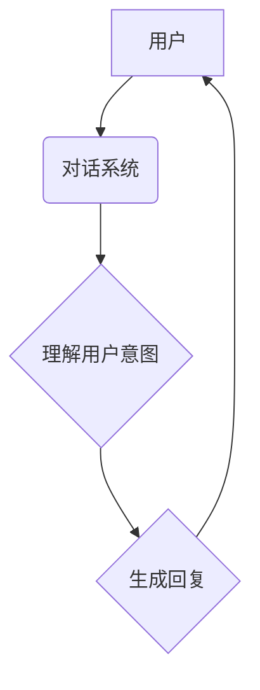

                 

## 聊天机器人开发：对话AI 入门

> 关键词：聊天机器人、对话AI、自然语言处理、深度学习、Transformer、BERT、GPT、对话系统、文本生成

### 1. 背景介绍

近年来，人工智能（AI）技术飞速发展，其中对话AI作为其重要分支，已逐渐渗透到人们生活的方方面面。从智能客服到虚拟助手，从游戏角色到教育工具，聊天机器人以其便捷、高效、个性化的特点，为用户提供了全新的交互体验。

聊天机器人本质上是一种能够与人类进行自然语言交互的计算机程序。它通过理解用户的输入，并生成相应的输出，从而模拟人与人之间的对话。随着深度学习技术的进步，聊天机器人的性能得到了显著提升，能够处理更复杂的任务，并提供更自然、更人性化的对话体验。

### 2. 核心概念与联系

**2.1 核心概念**

* **自然语言处理（NLP）：** 聊天机器人开发的核心技术之一，旨在使计算机能够理解、处理和生成人类语言。NLP 包括许多子领域，例如文本分类、情感分析、机器翻译等。
* **深度学习（Deep Learning）：** 一种机器学习的子领域，利用多层神经网络来学习数据中的复杂模式。深度学习在自然语言处理领域取得了突破性进展，例如语言模型、文本生成等。
* **对话系统（Dialogue System）：** 聊天机器人的核心架构，负责管理对话流程，理解用户意图，并生成相应的回复。

**2.2 架构关系**



**2.3 联系分析**

聊天机器人开发需要结合 NLP 和深度学习技术，构建一个完整的对话系统。

* **NLP 技术** 用于理解用户的输入，例如识别实体、解析语法结构、提取关键词等。
* **深度学习技术** 用于训练语言模型，例如生成自然流畅的回复，并学习用户的对话风格。

对话系统将 NLP 和深度学习技术有机结合，实现人机自然流畅的对话交互。

### 3. 核心算法原理 & 具体操作步骤

**3.1 算法原理概述**

聊天机器人的核心算法主要包括：

* **词嵌入（Word Embedding）：** 将单词映射到向量空间，使得语义相近的单词拥有相似的向量表示。
* **循环神经网络（RNN）：** 用于处理序列数据，例如文本，能够捕捉文本中的上下文信息。
* **Transformer：** 一种新型的深度学习架构，能够更有效地处理长文本序列，并具有更好的性能。

**3.2 算法步骤详解**

1. **数据预处理：** 收集和清洗对话数据，进行分词、标注等预处理操作。
2. **词嵌入训练：** 使用预训练的词嵌入模型，或训练自己的词嵌入模型。
3. **模型训练：** 使用 RNN 或 Transformer 等模型，训练聊天机器人模型。
4. **模型评估：** 使用测试数据评估模型的性能，例如准确率、流畅度等。
5. **模型部署：** 将训练好的模型部署到服务器或移动设备上，供用户使用。

**3.3 算法优缺点**

* **RNN：** 能够捕捉文本中的上下文信息，但训练过程容易出现梯度消失问题。
* **Transformer：** 性能优于 RNN，能够处理更长的文本序列，但计算量更大。

**3.4 算法应用领域**

* **智能客服：** 自动回答用户常见问题，提供24小时服务。
* **虚拟助手：** 帮助用户完成日常任务，例如设置提醒、查询天气等。
* **游戏角色：** 为玩家提供更沉浸式的游戏体验。
* **教育工具：** 帮助学生学习新知识，进行个性化辅导。

### 4. 数学模型和公式 & 详细讲解 & 举例说明

**4.1 数学模型构建**

聊天机器人的核心数学模型是语言模型，它试图预测下一个词出现的概率，从而生成自然流畅的文本。

**4.2 公式推导过程**

假设我们有一个训练语料库，包含一系列的文本序列。语言模型的目标是学习一个概率分布 P(w1, w2, ..., wn)，其中 wi 表示第 i 个词。

可以使用最大似然估计来训练语言模型：

```latex
P(w1, w2, ..., wn) = \prod_{i=1}^{n} P(wi | w1, w2, ..., wi-1)
```

其中，P(wi | w1, w2, ..., wi-1) 表示给定前 i-1 个词，第 i 个词出现的概率。

**4.3 案例分析与讲解**

例如，训练一个简单的语言模型来预测下一个词。假设我们的训练语料库包含以下句子：

"The cat sat on the mat."

我们可以使用最大似然估计来训练语言模型，并预测下一个词为 "the"。

**4.4 公式应用**

语言模型的训练过程通常使用深度学习算法，例如反向传播算法。

### 5. 项目实践：代码实例和详细解释说明

**5.1 开发环境搭建**

* Python 3.x
* TensorFlow 或 PyTorch
* NLTK 或 spaCy

**5.2 源代码详细实现**

```python
import tensorflow as tf

# 定义模型结构
model = tf.keras.Sequential([
    tf.keras.layers.Embedding(input_dim=vocab_size, output_dim=embedding_dim),
    tf.keras.layers.LSTM(units=128),
    tf.keras.layers.Dense(units=vocab_size, activation='softmax')
])

# 编译模型
model.compile(optimizer='adam', loss='sparse_categorical_crossentropy', metrics=['accuracy'])

# 训练模型
model.fit(x_train, y_train, epochs=10)

# 生成文本
text = "The cat sat on"
for i in range(10):
    prediction = model.predict(tf.expand_dims(text, axis=0))
    predicted_word = tf.math.argmax(prediction, axis=-1).numpy()[0]
    text += " " + words[predicted_word]
```

**5.3 代码解读与分析**

* **Embedding 层:** 将单词映射到向量空间。
* **LSTM 层:** 用于处理文本序列，捕捉上下文信息。
* **Dense 层:** 输出每个单词出现的概率。
* **训练过程:** 使用训练数据训练模型，优化模型参数。
* **文本生成:** 使用训练好的模型，根据输入文本预测下一个词，并生成新的文本。

**5.4 运行结果展示**

运行代码后，可以生成类似于以下的文本：

```
The cat sat on the mat and the cat jumped on the mat.
```

### 6. 实际应用场景

**6.1 智能客服**

聊天机器人可以用于自动回答用户常见问题，例如订单查询、退换货流程等，提高客服效率，降低人工成本。

**6.2 虚拟助手**

聊天机器人可以帮助用户完成日常任务，例如设置提醒、查询天气、预订酒店等，提高用户生活便利性。

**6.3 游戏角色**

聊天机器人可以作为游戏角色，与玩家进行互动，提供更沉浸式的游戏体验。

**6.4 未来应用展望**

随着人工智能技术的不断发展，聊天机器人的应用场景将更加广泛，例如：

* **个性化教育:** 提供个性化的学习辅导，根据学生的学习进度和需求调整教学内容。
* **医疗诊断:** 辅助医生进行疾病诊断，提供患者个性化的治疗方案。
* **情感陪伴:** 为孤独的人提供情感陪伴，缓解心理压力。

### 7. 工具和资源推荐

**7.1 学习资源推荐**

* **书籍:**
    * 《深度学习》
    * 《自然语言处理入门》
* **在线课程:**
    * Coursera: 自然语言处理
    * Udacity: 深度学习

**7.2 开发工具推荐**

* **TensorFlow:** 开源深度学习框架
* **PyTorch:** 开源深度学习框架
* **NLTK:** 自然语言处理工具包
* **spaCy:** 自然语言处理工具包

**7.3 相关论文推荐**

* **Attention Is All You Need:** https://arxiv.org/abs/1706.03762
* **BERT: Pre-training of Deep Bidirectional Transformers for Language Understanding:** https://arxiv.org/abs/1810.04805

### 8. 总结：未来发展趋势与挑战

**8.1 研究成果总结**

近年来，对话AI技术取得了显著进展，例如 Transformer 架构的提出，BERT 和 GPT 等预训练语言模型的开发，使得聊天机器人的性能得到了大幅提升。

**8.2 未来发展趋势**

* **更自然、更人性化的对话体验:** 聊天机器人将更加能够理解用户的意图，并生成更自然、更流畅的回复。
* **更广泛的应用场景:** 聊天机器人将应用于更多领域，例如教育、医疗、金融等。
* **更强的个性化能力:** 聊天机器人将能够根据用户的喜好和需求，提供个性化的服务。

**8.3 面临的挑战**

* **理解复杂对话:** 聊天机器人仍然难以理解复杂的对话，例如包含多层嵌套、隐含含义的对话。
* **生成高质量文本:** 聊天机器人的文本生成能力仍然存在不足，例如生成的文本可能缺乏逻辑性、流畅性。
* **数据安全和隐私保护:** 聊天机器人需要处理大量用户数据，因此数据安全和隐私保护是一个重要的挑战。

**8.4 研究展望**

未来，对话AI研究将继续朝着更自然、更智能、更安全的方向发展。


### 9. 附录：常见问题与解答

**9.1 如何选择合适的聊天机器人平台？**

选择聊天机器人平台需要考虑以下因素：

* **功能需求:** 不同的平台提供不同的功能，例如文本生成、语音识别、图像识别等。
* **开发成本:** 不同的平台有不同的开发成本，例如平台费用、开发人员成本等。
* **技术支持:** 不同的平台提供不同的技术支持，例如文档、论坛、在线客服等。

**9.2 如何训练一个高质量的聊天机器人模型？**

训练高质量的聊天机器人模型需要以下步骤：

* **收集高质量的对话数据:** 数据质量直接影响模型性能。
* **进行数据预处理:** 将数据清洗、分词、标注等。
* **选择合适的模型架构:** 不同的模型架构适用于不同的任务。
* **使用合适的训练方法:** 训练方法包括梯度下降、反向传播等。
* **进行模型评估和调优:** 使用测试数据评估模型性能，并根据评估结果进行模型调优。


作者：禅与计算机程序设计艺术 / Zen and the Art of Computer Programming 
<end_of_turn>

