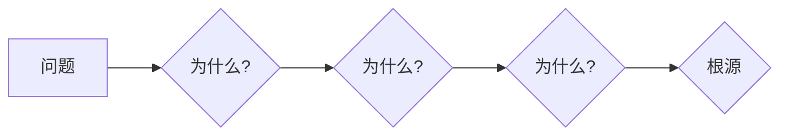

                 

## 费曼提问法在管理问题诊断中的应用

> 关键词：费曼提问法、管理问题诊断、问题分解、根源分析、系统思维

## 1. 背景介绍

在当今快速变化的商业环境中，管理者们面临着越来越多的复杂问题。这些问题往往涉及多个部门、多个层级，并且具有多重关联性。传统的管理方法往往难以有效地解决这些问题，因为它们往往停留在表面的现象层面上，而无法深入到问题的根源。

费曼提问法是一种由物理学家理查德·费曼提出的问题解决方法，它强调通过不断地提问，逐步深入到问题的本质，最终找到问题的根源。这种方法在科学研究领域得到了广泛应用，近年来也逐渐被应用于管理领域。

## 2. 核心概念与联系

费曼提问法的核心在于“反向思维”，即从问题的最终结果出发，不断地追问“为什么”直到找到问题的根源。这种方法可以帮助管理者们跳出思维定式，从不同的角度看待问题，并最终找到解决问题的关键。

**费曼提问法的流程图:**



**费曼提问法与管理问题诊断的联系:**

费曼提问法可以作为一种有效的管理问题诊断工具，帮助管理者们：

* **深入理解问题:** 通过不断地提问，深入到问题的本质，了解问题的根源。
* **分解复杂问题:** 将复杂的问题分解成一个个简单的问题，更容易找到解决方法。
* **识别关键因素:** 找出影响问题的关键因素，并针对这些因素采取措施。
* **避免重复犯错:** 通过对问题的根源进行分析，避免在解决问题时重复犯同样的错误。

## 3. 核心算法原理 & 具体操作步骤

费曼提问法本身不是一种算法，而是一种思维方法。但是，我们可以将其应用于管理问题诊断的流程中，将其转化为一种操作步骤。

### 3.1  算法原理概述

费曼提问法的核心原理是通过不断地提问，逐步深入到问题的本质，找到问题的根源。

### 3.2  算法步骤详解

1. **明确问题:** 首先要明确需要解决的问题是什么。
2. **提出第一层问题:** 从问题的最终结果出发，提出一个“为什么”的问题。
3. **深入追问:** 对第一层问题的答案进行分析，提出第二层问题，并继续深入追问。
4. **寻找根源:** 持续提问，直到找到问题的根源。
5. **制定解决方案:** 根据问题的根源，制定相应的解决方案。

### 3.3  算法优缺点

**优点:**

* **深入分析:** 可以帮助管理者们深入到问题的本质，找到问题的根源。
* **系统思维:** 鼓励管理者们从多个角度看待问题，培养系统思维能力。
* **避免盲目行动:** 通过对问题的根源进行分析，避免在解决问题时盲目行动。

**缺点:**

* **时间成本:** 费曼提问法需要花费一定的时间进行问题分析。
* **需要经验:** 需要管理者有一定的经验和洞察力，才能有效地运用费曼提问法。

### 3.4  算法应用领域

费曼提问法可以应用于各种管理问题诊断场景，例如：

* **项目管理:** 分析项目进度延迟的原因，找到问题的根源，并制定相应的解决方案。
* **团队管理:** 分析团队成员之间的冲突原因，找到问题的根源，并采取措施化解冲突。
* **产品开发:** 分析产品缺陷的原因，找到问题的根源，并改进产品设计。

## 4. 数学模型和公式 & 详细讲解 & 举例说明

费曼提问法本身并不依赖于特定的数学模型或公式。但是，我们可以利用数学模型和公式来量化问题分析的结果，并进行更深入的分析。

### 4.1  数学模型构建

我们可以构建一个简单的数学模型来表示问题诊断的过程。

假设问题诊断过程可以看作是一个树形结构，其中每个节点代表一个问题，每个分支代表一个可能的答案。

* **节点:** 代表一个问题。
* **分支:** 代表一个可能的答案。
* **根节点:** 代表最初的问题。
* **叶子节点:** 代表问题的根源。

### 4.2  公式推导过程

我们可以使用树形结构的深度和宽度来衡量问题诊断的复杂度。

* **深度:** 从根节点到叶子节点的路径长度。
* **宽度:** 在同一层级上的节点数量。

问题诊断的复杂度可以表示为：

```latex
复杂度 = 深度 * 宽度
```

### 4.3  案例分析与讲解

例如，一个项目进度延迟的问题，我们可以构建一个树形结构来进行问题诊断。

* **根节点:** 项目进度延迟。
* **分支1:** 原因是技术问题？
* **分支2:** 原因是人员问题？
* **分支3:** 原因是资源问题？

通过不断地提问和分析，我们可以找到问题的根源，例如：

* **叶子节点1:** 技术方案设计不合理。
* **叶子节点2:** 人员缺乏经验。
* **叶子节点3:** 资源分配不均衡。

## 5. 项目实践：代码实例和详细解释说明

虽然费曼提问法本身不是一种编程语言，但是我们可以将其应用于软件开发过程中，帮助我们更好地理解和解决问题。

### 5.1  开发环境搭建

为了演示费曼提问法在软件开发中的应用，我们可以使用一个简单的代码示例。

假设我们要开发一个简单的计算器程序，需要实现加、减、乘、除四种运算。

### 5.2  源代码详细实现

```python
def add(x, y):
  return x + y

def subtract(x, y):
  return x - y

def multiply(x, y):
  return x * y

def divide(x, y):
  if y == 0:
    return "除数不能为零"
  else:
    return x / y

# 获取用户输入
num1 = float(input("请输入第一个数字: "))
num2 = float(input("请输入第二个数字: "))

# 获取用户选择的操作
operation = input("请选择操作 (+, -, *, /): ")

# 执行计算
if operation == "+":
  result = add(num1, num2)
elif operation == "-":
  result = subtract(num1, num2)
elif operation == "*":
  result = multiply(num1, num2)
elif operation == "/":
  result = divide(num1, num2)
else:
  result = "无效的操作符"

# 显示结果
print("结果:", result)
```

### 5.3  代码解读与分析

这段代码实现了简单的四则运算功能。

* **函数定义:** 代码定义了四个函数，分别对应加、减、乘、除四种运算。
* **用户输入:** 代码获取用户输入的两个数字和操作符。
* **条件判断:** 根据用户选择的操作符，执行相应的函数计算。
* **结果输出:** 代码输出计算结果。

### 5.4  运行结果展示

当用户输入两个数字和操作符后，程序会执行相应的计算，并输出结果。

## 6. 实际应用场景

费曼提问法在实际管理场景中的应用非常广泛，以下是一些例子：

### 6.1  项目管理

* **项目进度延迟:** 通过费曼提问法，可以分析项目进度延迟的原因，例如：技术问题、人员问题、资源问题等，并针对这些问题制定相应的解决方案。
* **项目预算超支:** 通过费曼提问法，可以分析项目预算超支的原因，例如：成本控制不当、需求变更等，并采取措施控制成本。

### 6.2  团队管理

* **团队成员冲突:** 通过费曼提问法，可以分析团队成员之间的冲突原因，例如：沟通不畅、角色冲突等，并采取措施化解冲突。
* **团队效率低下:** 通过费曼提问法，可以分析团队效率低下的原因，例如：工作流程不合理、缺乏协作等，并改进工作流程，提高团队效率。

### 6.3  产品开发

* **产品缺陷率高:** 通过费曼提问法，可以分析产品缺陷率高的原因，例如：设计缺陷、测试不充分等，并采取措施改进产品设计和测试流程。
* **产品市场反馈差:** 通过费曼提问法，可以分析产品市场反馈差的原因，例如：产品功能不完善、用户体验差等，并根据用户反馈改进产品功能和用户体验。

### 6.4  未来应用展望

随着人工智能技术的不断发展，费曼提问法在管理问题诊断中的应用将会更加广泛。

* **智能化诊断:** 可以利用人工智能技术，自动分析问题数据，并生成费曼提问法的诊断流程。
* **个性化诊断:** 可以根据用户的具体情况，定制个性化的费曼提问法诊断流程。
* **跨部门协作:** 可以利用人工智能技术，将费曼提问法应用于跨部门的协作问题诊断，提高协作效率。

## 7. 工具和资源推荐

### 7.1  学习资源推荐

* **《费曼物理学讲义》:** 理查德·费曼的经典著作，介绍了费曼提问法的核心思想。
* **《思考，快与慢》:** 丹尼尔·卡尼曼的著作，探讨了人类思维的局限性，以及如何克服这些局限性。
* **《高效能人士的七个习惯》:** 斯蒂芬·柯维的著作，介绍了七个高效能人士的习惯，其中包括“开始以终为始”的习惯，与费曼提问法有一定的关联。

### 7.2  开发工具推荐

* **思维导图工具:** 例如 XMind、MindManager 等，可以帮助管理者们构建问题诊断的思维导图。
* **问题管理工具:** 例如 Jira、Trello 等，可以帮助管理者们记录和跟踪问题，并进行协作解决。

### 7.3  相关论文推荐

* **“费曼提问法在软件工程中的应用研究”**
* **“费曼提问法在项目管理中的应用”**
* **“费曼提问法在团队管理中的应用”**

## 8. 总结：未来发展趋势与挑战

费曼提问法是一种简单而有效的管理问题诊断方法，它可以帮助管理者们深入理解问题，找到问题的根源，并制定相应的解决方案。随着人工智能技术的不断发展，费曼提问法在管理问题诊断中的应用将会更加广泛，并呈现出以下发展趋势：

### 8.1  研究成果总结

* 费曼提问法在不同管理场景中的应用研究不断深入。
* 结合人工智能技术的费曼提问法诊断工具不断开发和完善。
* 费曼提问法与其他管理方法的结合研究取得进展。

### 8.2  未来发展趋势

* **智能化诊断:** 利用人工智能技术，自动分析问题数据，并生成费曼提问法的诊断流程。
* **个性化诊断:** 根据用户的具体情况，定制个性化的费曼提问法诊断流程。
* **跨部门协作:** 将费曼提问法应用于跨部门的协作问题诊断，提高协作效率。

### 8.3  面临的挑战

* 如何将费曼提问法应用于更复杂、更抽象的问题。
* 如何提高费曼提问法的诊断准确率和效率。
* 如何将费曼提问法与其他管理方法更好地结合。

### 8.4  研究展望

未来，我们将继续研究费曼提问法在管理问题诊断中的应用，探索其在不同场景下的应用方法，并结合人工智能技术，开发更智能、更便捷的费曼提问法诊断工具，为管理者们提供更有效的管理问题诊断解决方案。

## 9. 附录：常见问题与解答

### 9.1  费曼提问法需要多长时间才能完成？

费曼提问法的完成时间取决于问题的复杂程度。简单的问题可能只需要几分钟，而复杂的问题可能需要几天甚至几周。

### 9.2  费曼提问法适用于哪些类型的管理问题？

费曼提问法适用于各种类型的管理问题，例如：项目管理、团队管理、产品开发等。

### 9.3  如何才能更好地运用费曼提问法？

* **保持好奇心:** 始终保持对问题的疑问，不断地提问。
* **深入思考:** 不要满足于表面现象，深入思考问题的根源。
* **跳出思维定式:** 尝试从不同的角度看待问题，避免思维定式。
* **记录问题和答案:** 记录问题和答案，以便后续分析和回顾。

作者：禅与计算机程序设计艺术 / Zen and the Art of Computer Programming


<end_of_turn>

