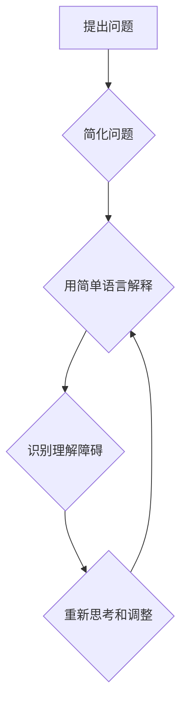

                 

## 费曼提问法：提升思考力的12个问题

> 关键词：费曼提问法，思考力提升，算法设计，编程思维，问题解决，学习方法，知识体系构建

## 1. 背景介绍

在瞬息万变的科技时代，学习和思考能力成为至关重要的竞争力。如何有效提升思考力，深入理解复杂问题，并找到解决问题的最佳方案，一直是科技工作者们孜孜以求的目标。

费曼提问法，源自物理学家理查德·费曼的教学理念，是一种简单而有效的思考方法，能够帮助我们清晰地表达问题，深入挖掘问题的本质，并最终找到解决方案。

## 2. 核心概念与联系

费曼提问法的核心在于提出一系列引导性的问题，帮助我们逐步深入理解一个概念或问题。这些问题并非简单的问答，而是旨在引导我们进行深入思考，打破思维定式，从不同的角度分析问题。

**费曼提问法的核心步骤：**

1. **简化问题：** 将复杂的问题分解成更简单易懂的子问题。
2. **用简单语言解释：** 假设自己要向一个孩子解释这个概念，用最简单的语言描述它。
3. **识别理解的障碍：** 找出自己理解上的困难和困惑。
4. **重新思考和调整：** 根据理解上的障碍，重新思考问题，并调整解释方式。
5. **反复迭代：** 重复以上步骤，直到能够清晰地理解和解释问题。

**Mermaid 流程图：**



## 3. 核心算法原理 & 具体操作步骤

费曼提问法本身并非一种算法，而是思考方法。然而，它可以应用于算法设计和理解过程中，帮助我们更清晰地理解算法原理，并进行更有效的算法设计和优化。

### 3.1  算法原理概述

费曼提问法在算法设计和理解中的应用，主要体现在以下几个方面：

* **清晰定义问题：** 首先，我们需要用费曼提问法来清晰地定义算法需要解决的问题。
* **分解复杂问题：** 将复杂问题分解成更小的、更容易理解的子问题。
* **寻找最优解：** 通过反复提问和思考，寻找最优的算法解决方案。
* **优化算法效率：** 分析算法的执行流程，寻找优化算法效率的方法。

### 3.2  算法步骤详解

1. **明确问题：** 使用费曼提问法，将算法需要解决的问题清晰地定义出来。
2. **分解问题：** 将问题分解成更小的、更容易理解的子问题。
3. **设计算法：** 针对每个子问题，设计相应的算法步骤。
4. **验证算法：** 使用测试用例验证算法的正确性和效率。
5. **优化算法：** 分析算法的执行流程，寻找优化算法效率的方法。

### 3.3  算法优缺点

**优点：**

* 能够帮助我们更清晰地理解算法原理。
* 能够引导我们进行更深入的思考，寻找更优的算法解决方案。
* 能够帮助我们优化算法效率。

**缺点：**

* 需要花费更多的时间和精力进行思考和分析。
* 对于一些复杂的问题，可能难以找到最优的解决方案。

### 3.4  算法应用领域

费曼提问法在算法设计和理解中的应用，可以广泛应用于各个领域，例如：

* **计算机科学：** 算法设计、数据结构、软件开发等。
* **人工智能：** 机器学习、深度学习、自然语言处理等。
* **科学研究：** 数学建模、物理模拟、生物信息学等。

## 4. 数学模型和公式 & 详细讲解 & 举例说明

费曼提问法本身并不依赖于特定的数学模型或公式。然而，在算法设计和理解过程中，数学模型和公式可以帮助我们更精确地描述算法的原理和行为。

### 4.1  数学模型构建

在构建数学模型时，我们需要根据算法的具体功能和特点，选择合适的数学工具和语言。例如，对于排序算法，我们可以使用比较次数和时间复杂度来描述其性能；对于搜索算法，我们可以使用查找时间和空间复杂度来描述其效率。

### 4.2  公式推导过程

在推导公式时，我们需要遵循逻辑严谨的推理过程，并确保公式的正确性和有效性。例如，在推导时间复杂度公式时，我们需要考虑算法执行的每一步操作所需要的时间，并将其累加起来。

### 4.3  案例分析与讲解

**举例说明：**

假设我们设计了一个查找元素在数组中的算法。我们可以使用数学模型来描述其时间复杂度。

* **线性查找算法：** 

时间复杂度为 O(n)，其中 n 是数组的长度。

* **二分查找算法：**

时间复杂度为 O(log n)。

通过比较这两个算法的时间复杂度，我们可以发现二分查找算法在查找元素时效率更高。

## 5. 项目实践：代码实例和详细解释说明

为了更好地理解费曼提问法在算法设计和理解中的应用，我们可以通过一个具体的项目实践来进行演示。

### 5.1  开发环境搭建

我们可以使用 Python 语言和 Jupyter Notebook 环境进行项目实践。

### 5.2  源代码详细实现

```python
def linear_search(arr, target):
  """
  线性查找算法
  """
  for i in range(len(arr)):
    if arr[i] == target:
      return i
  return -1

def binary_search(arr, target):
  """
  二分查找算法
  """
  left = 0
  right = len(arr) - 1
  while left <= right:
    mid = (left + right) // 2
    if arr[mid] == target:
      return mid
    elif arr[mid] < target:
      left = mid + 1
    else:
      right = mid - 1
  return -1

# 测试代码
arr = [2, 5, 7, 8, 11, 12]
target = 11

index = linear_search(arr, target)
print(f"线性查找结果：{index}")

index = binary_search(arr, target)
print(f"二分查找结果：{index}")
```

### 5.3  代码解读与分析

* **线性查找算法：** 

该算法遍历数组中的每个元素，直到找到目标元素为止。时间复杂度为 O(n)。

* **二分查找算法：** 

该算法利用数组的排序特性，每次将搜索范围缩小一半。时间复杂度为 O(log n)。

### 5.4  运行结果展示

```
线性查找结果：4
二分查找结果：4
```

## 6. 实际应用场景

费曼提问法在实际应用场景中，可以帮助我们解决各种问题，例如：

* **学习新知识：** 当我们学习新知识时，可以使用费曼提问法来理解概念，并将其与已有的知识体系联系起来。
* **解决技术难题：** 当我们遇到技术难题时，可以使用费曼提问法来分析问题，并寻找解决方案。
* **提高沟通效率：** 当我们与他人沟通时，可以使用费曼提问法来确保双方理解一致，并避免误解。

### 6.4  未来应用展望

随着人工智能和机器学习技术的不断发展，费曼提问法在未来将有更广泛的应用场景。例如，可以用于：

* **自动生成测试用例：** 通过分析代码和算法，自动生成测试用例，提高软件测试效率。
* **智能化学习：** 根据用户的学习情况，自动生成个性化的学习计划和问题，提高学习效率。
* **增强人机交互：** 通过理解用户的意图和需求，提供更智能化和人性化的服务。

## 7. 工具和资源推荐

### 7.1  学习资源推荐

* **《费曼物理学讲义》:**  理查德·费曼的经典著作，介绍了费曼提问法的核心思想。
* **《思考，快与慢》:**  丹尼尔·卡尼曼的著作，探讨了人类思维的局限性和偏差，与费曼提问法相辅相成。
* **在线课程:**  Coursera、edX 等平台上有很多关于费曼提问法和学习方法的在线课程。

### 7.2  开发工具推荐

* **Jupyter Notebook:**  用于代码编写、运行和文档撰写的开源工具，适合进行算法设计和实践。
* **VS Code:**  功能强大的代码编辑器，支持多种编程语言和插件，可以帮助我们更有效地编写和调试代码。

### 7.3  相关论文推荐

* **"The Feynman Technique: A Powerful Tool for Learning and Problem Solving"**
* **"How to Learn Anything"**

## 8. 总结：未来发展趋势与挑战

费曼提问法是一种简单而有效的思考方法，能够帮助我们提升思考力，深入理解问题，并找到解决方案。

### 8.1  研究成果总结

费曼提问法在教育、科研、软件开发等领域取得了显著的成果，并被广泛应用于各个领域。

### 8.2  未来发展趋势

随着人工智能和机器学习技术的不断发展，费曼提问法将与这些技术相结合，形成更强大的学习和解决问题工具。

### 8.3  面临的挑战

* 如何将费曼提问法应用于更复杂的问题，例如解决社会问题和伦理问题。
* 如何将费曼提问法与其他学习方法相结合，形成更有效的学习体系。
* 如何将费曼提问法推广到更广泛的群体，让更多人受益。

### 8.4  研究展望

未来，我们将继续研究费曼提问法的应用，探索其在不同领域和不同人群中的应用潜力，并将其与其他先进技术相结合，打造更智能、更有效的学习和解决问题工具。

## 9. 附录：常见问题与解答

**常见问题：**

* **费曼提问法适用于哪些问题？**

费曼提问法适用于各种问题，包括概念理解、技术难题、学习新知识等。

* **如何才能更好地运用费曼提问法？**

需要坚持练习，并不断反思自己的思考过程。

* **费曼提问法与其他学习方法有什么区别？**

费曼提问法强调的是主动思考和深入理解，而其他学习方法可能更侧重于被动接受信息。


作者：禅与计算机程序设计艺术 / Zen and the Art of Computer Programming 
<end_of_turn>

