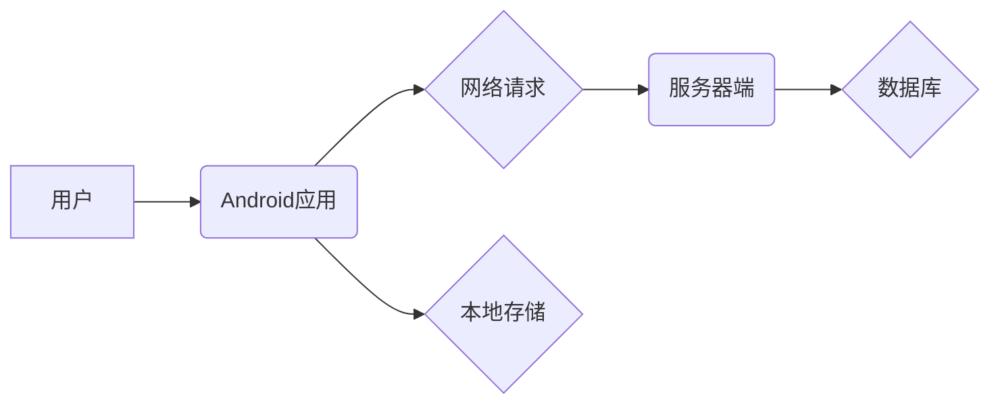

                 

## Android全栈开发指南

> 关键词：Android, 全栈开发, Java, Kotlin, Jetpack Compose, Architecture Components, 网络请求, 数据存储, UI设计, 性能优化

## 1. 背景介绍

在当今移动互联网时代，Android作为全球最受欢迎的移动操作系统之一，拥有庞大的用户群体和丰富的应用生态。掌握Android全栈开发技能，能够让你从需求分析到产品发布，全面参与到移动应用的开发过程中，并拥有更深入的理解和掌控力。

全栈开发是指具备前端、后端、数据库等多个领域的知识和技能，能够独立完成整个软件开发流程。对于Android开发而言，全栈开发意味着需要掌握Java或Kotlin语言、Android SDK、UI设计、网络请求、数据存储、数据库管理、服务器端开发等多个方面。

## 2. 核心概念与联系

Android全栈开发涉及多个核心概念和技术，它们相互关联，共同构成一个完整的开发体系。

**核心概念:**

* **Android SDK:** Android软件开发工具包，包含了开发Android应用所需的各种工具、库和文档。
* **Java/Kotlin:** Android应用开发的主要编程语言，Java是传统主流语言，Kotlin是近年来逐渐流行的新兴语言，拥有更简洁的语法和更强大的功能。
* **UI设计:** Android应用的用户界面设计，包括布局、组件、动画、交互等方面。
* **网络请求:** Android应用与服务器进行数据交互，需要使用网络请求框架，例如Retrofit、OkHttp等。
* **数据存储:** Android应用需要存储数据，可以使用本地存储方式，例如SharedPreferences、数据库、文件存储等，也可以使用云端存储方式。
* **服务器端开发:** Android应用通常与服务器端进行数据交互，需要了解服务器端开发技术，例如Java、Python、Node.js等。

**架构关系:**

## 3. 核心算法原理 & 具体操作步骤

### 3.1  算法原理概述

Android全栈开发涉及到许多算法，例如数据排序、搜索算法、网络请求优化算法等。这些算法的原理和实现方式对应用的性能和用户体验有重要影响。

### 3.2  算法步骤详解

具体算法步骤需要根据实际应用场景进行选择和实现。例如，数据排序可以使用冒泡排序、插入排序、快速排序等算法，选择合适的算法需要考虑数据量、排序规则等因素。

### 3.3  算法优缺点

不同的算法具有不同的优缺点，需要根据实际应用场景进行选择。例如，冒泡排序简单易实现，但效率较低；快速排序效率较高，但时间复杂度不稳定。

### 3.4  算法应用领域

算法在Android全栈开发中应用广泛，例如：

* **数据排序:** 用于对数据进行有序排列，例如联系人列表、搜索结果等。
* **搜索算法:** 用于快速查找特定数据，例如搜索引擎、应用内搜索等。
* **网络请求优化算法:** 用于提高网络请求效率，例如缓存机制、数据压缩等。

## 4. 数学模型和公式 & 详细讲解 & 举例说明

### 4.1  数学模型构建

Android全栈开发中，数学模型可以用于描述算法的复杂度、数据结构的特性、网络传输的效率等。例如，可以使用Big O符号来描述算法的时间复杂度，例如O(n)表示时间复杂度与数据量线性相关。

### 4.2  公式推导过程

数学公式可以用于推导算法的性能指标、数据结构的容量等。例如，可以使用公式计算二叉树的高度、链表的长度等。

### 4.3  案例分析与讲解

通过数学模型和公式，可以对算法和数据结构进行分析和优化。例如，可以使用数学模型分析不同排序算法的效率，选择最优的排序算法。

## 5. 项目实践：代码实例和详细解释说明

### 5.1  开发环境搭建

Android开发环境搭建包括安装Android Studio、设置SDK、配置虚拟设备等步骤。

### 5.2  源代码详细实现

具体代码实现需要根据实际应用场景进行编写，例如实现一个简单的网络请求、数据存储、UI界面等。

### 5.3  代码解读与分析

需要对代码进行详细解读和分析，理解代码的逻辑、功能、性能等方面。

### 5.4  运行结果展示

运行代码并展示运行结果，验证代码的正确性和功能实现。

## 6. 实际应用场景

Android全栈开发技术广泛应用于各种移动应用场景，例如：

* **社交应用:** 微信、QQ、微博等社交应用需要实现用户注册、登录、消息推送、好友管理等功能。
* **电商应用:** 淘宝、京东、拼多多等电商应用需要实现商品展示、购物车、支付、物流跟踪等功能。
* **游戏应用:** 王者荣耀、和平精英、原神等游戏应用需要实现游戏逻辑、用户交互、网络匹配等功能。

### 6.4  未来应用展望

随着移动互联网的发展，Android全栈开发技术将继续发挥重要作用，例如：

* **人工智能应用:** 将人工智能技术应用于移动应用，例如语音识别、图像识别、个性化推荐等。
* **物联网应用:** 将Android应用与物联网设备进行连接，实现智能家居、智能穿戴等应用。
* **虚拟现实/增强现实应用:** 将Android应用与虚拟现实/增强现实技术结合，实现沉浸式体验。

## 7. 工具和资源推荐

### 7.1  学习资源推荐

* **Android官方文档:** https://developer.android.com/docs
* **Android Developers博客:** https://android-developers.googleblog.com/
* **Udacity Android开发课程:** https://www.udacity.com/course/android-developer-nanodegree--nd801

### 7.2  开发工具推荐

* **Android Studio:** https://developer.android.com/studio
* **Git:** https://git-scm.com/
* **Postman:** https://www.postman.com/

### 7.3  相关论文推荐

* **Android Architecture Components:** https://developer.android.com/topic/libraries/architecture
* **Jetpack Compose:** https://developer.android.com/jetpack/compose

## 8. 总结：未来发展趋势与挑战

### 8.1  研究成果总结

Android全栈开发技术已经取得了长足的进步，例如：

* **Kotlin语言的普及:** Kotlin语言的简洁语法和强大的功能，逐渐取代Java成为Android开发主流语言。
* **Jetpack Compose的出现:** Jetpack Compose是一个新的UI框架，可以简化UI开发，提高开发效率。
* **人工智能技术的应用:** 人工智能技术正在被应用于移动应用，例如语音识别、图像识别、个性化推荐等。

### 8.2  未来发展趋势

未来Android全栈开发技术将继续朝着以下方向发展：

* **更强大的开发工具:** 开发工具将更加智能化、自动化，提高开发效率。
* **更丰富的应用场景:** Android应用将应用于更多领域，例如物联网、虚拟现实/增强现实等。
* **更安全的开发环境:** 开发环境将更加安全可靠，保护用户隐私和数据安全。

### 8.3  面临的挑战

Android全栈开发技术也面临一些挑战，例如：

* **技术更新迭代:** Android平台不断更新迭代，需要开发者不断学习新技术。
* **跨平台开发:** 如何实现跨平台开发，让应用能够在不同平台上运行流畅，是一个重要的挑战。
* **性能优化:** 如何提高应用性能，降低资源消耗，是一个持续的挑战。

### 8.4  研究展望

未来，Android全栈开发技术将继续发展和完善，为移动互联网的发展做出更大的贡献。

## 9. 附录：常见问题与解答

**常见问题:**

* 如何选择合适的Android开发语言？
* 如何搭建Android开发环境？
* 如何实现Android应用的网络请求？
* 如何优化Android应用的性能？

**解答:**

* 选择合适的Android开发语言取决于个人喜好和项目需求。Java是传统主流语言，Kotlin是近年来逐渐流行的新兴语言，拥有更简洁的语法和更强大的功能。
* Android开发环境搭建包括安装Android Studio、设置SDK、配置虚拟设备等步骤。
* 实现Android应用的网络请求可以使用Retrofit、OkHttp等网络请求框架。
* 优化Android应用的性能可以通过代码优化、资源压缩、缓存机制等方式实现。

作者：禅与计算机程序设计艺术 / Zen and the Art of Computer Programming 
<end_of_turn>

