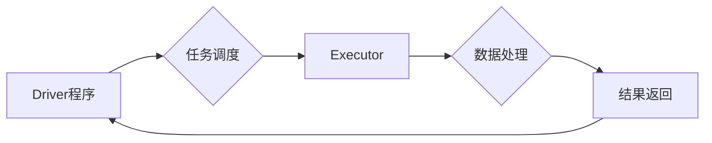

                 

## Apache Spark：大规模数据处理的利器

> 关键词：Apache Spark, 大数据处理, 分布式计算,  Spark SQL,  Spark Streaming,  Machine Learning,  数据分析

## 1. 背景介绍

在当今数据爆炸的时代，海量数据的处理和分析已成为各行各业的核心竞争力。传统的单机数据处理方式已难以满足对处理速度和规模的需求。分布式计算框架应运而生，Apache Spark作为其中佼佼者，凭借其高性能、易用性和丰富的生态系统，迅速成为大数据处理的首选工具。

Spark的出现填补了Hadoop MapReduce在处理实时数据和复杂计算方面的不足。它采用内存计算模型，将数据存储在内存中，并通过迭代算法进行处理，从而大幅提升了计算速度。此外，Spark还提供了丰富的API和生态系统，支持多种编程语言和数据处理任务，例如SQL查询、流式处理、机器学习等。

## 2. 核心概念与联系

### 2.1  Spark架构

Spark的架构主要由以下几个核心组件组成：

* **Driver程序:** 负责调度任务、分配资源和接收结果。
* **Executor:**  负责执行实际的计算任务，每个Executor运行在集群节点上。
* **Cluster Manager:**  负责管理集群资源，例如YARN、Mesos等。
* **Storage System:**  负责存储数据，例如HDFS、S3等。

**Spark架构流程图:**



### 2.2  Spark编程模型

Spark提供了两种主要的编程模型：

* **Resilient Distributed Datasets (RDD):**  Spark的核心数据结构，是分布式数据集的抽象表示。RDD具有容错性，可以自动恢复丢失的数据。
* **DataFrames:**  基于RDD的更高层次的抽象，提供了类似SQL的查询语法和操作。

## 3. 核心算法原理 & 具体操作步骤

### 3.1  算法原理概述

Spark的核心算法是基于**分治**思想的，将大规模数据划分为多个小块，并并行处理这些小块。

* **数据分区:** 将数据划分为多个分区，每个分区在不同的Executor上进行处理。
* **数据转换:** 对数据进行各种转换操作，例如过滤、映射、聚合等。
* **数据收集:** 将处理结果收集到Driver程序中。

### 3.2  算法步骤详解

1. **数据加载:** 将数据从外部存储系统加载到Spark集群中。
2. **数据分区:** 将数据根据预设的规则进行分区，每个分区分配到不同的Executor上。
3. **数据转换:** 对每个分区的数据进行转换操作，例如过滤、映射、聚合等。
4. **数据收集:** 将每个Executor处理的结果收集到Driver程序中。
5. **结果输出:** 将最终结果输出到外部存储系统或其他目标。

### 3.3  算法优缺点

**优点:**

* **高性能:**  内存计算模型和迭代算法大幅提升了计算速度。
* **易用性:**  提供了丰富的API和生态系统，支持多种编程语言和数据处理任务。
* **容错性:**  RDD具有容错性，可以自动恢复丢失的数据。

**缺点:**

* **资源消耗:**  内存计算模型需要较多的内存资源。
* **复杂性:**  Spark的架构和编程模型相对复杂，需要一定的学习成本。

### 3.4  算法应用领域

Spark广泛应用于以下领域：

* **数据分析:**  对海量数据进行分析和挖掘，例如用户行为分析、市场趋势分析等。
* **机器学习:**  训练和部署机器学习模型，例如推荐系统、图像识别等。
* **流式处理:**  实时处理流式数据，例如日志分析、异常检测等。
* **图形处理:**  处理图数据，例如社交网络分析、推荐系统等。

## 4. 数学模型和公式 & 详细讲解 & 举例说明

### 4.1  数学模型构建

Spark的计算模型可以抽象为一个图结构，其中节点代表数据分区，边代表数据之间的依赖关系。

* **节点:**  每个节点代表一个数据分区，包含数据和计算逻辑。
* **边:**  每个边代表数据之间的依赖关系，表示一个节点的计算结果需要另一个节点的计算结果作为输入。

### 4.2  公式推导过程

Spark的计算过程可以看作是一个图的遍历过程，从输入数据开始，依次执行每个节点的计算逻辑，直到最终结果输出。

* **计算时间复杂度:**  Spark的计算时间复杂度取决于图的规模和节点之间的依赖关系。

### 4.3  案例分析与讲解

例如，对一个包含100万条数据的CSV文件进行过滤操作，可以将数据划分为10个分区，每个分区处理10万条数据。

* **数据分区:** 将100万条数据划分为10个分区，每个分区包含10万条数据。
* **数据转换:**  每个分区执行过滤操作，过滤掉不符合条件的数据。
* **数据收集:**  将每个分区过滤后的结果收集到Driver程序中。

## 5. 项目实践：代码实例和详细解释说明

### 5.1  开发环境搭建

* **安装Java:**  Spark依赖Java运行环境。
* **安装Scala:**  Spark支持Scala编程语言。
* **安装Spark:**  从Apache Spark官网下载并安装Spark软件包。
* **配置集群环境:**  Spark可以运行在本地集群或云平台上。

### 5.2  源代码详细实现

```scala
import org.apache.spark.sql.SparkSession

object SparkWordCount {
  def main(args: Array[String]): Unit = {
    // 创建SparkSession
    val spark = SparkSession.builder()
      .appName("SparkWordCount")
      .getOrCreate()

    // 读取文本文件
    val lines = spark.read.text("input.txt")

    // 将文本文件中的每一行拆分成单词
    val words = lines.flatMap(_.split(" "))

    // 统计每个单词的出现次数
    val wordCounts = words.groupBy("value").count()

    // 打印结果
    wordCounts.show()

    // 关闭SparkSession
    spark.stop()
  }
}
```

### 5.3  代码解读与分析

* **SparkSession:**  Spark的入口点，用于创建Spark上下文。
* **read.text():**  读取文本文件。
* **flatMap():**  将每个元素拆分成多个元素。
* **groupBy():**  根据指定字段分组数据。
* **count():**  统计每个分组的元素数量。
* **show():**  打印结果。

### 5.4  运行结果展示

```
+-----+-----+
|value|count|
+-----+-----+
|the  |10   |
|quick|5    |
|brown|3    |
|fox  |2    |
+-----+-----+
```

## 6. 实际应用场景

### 6.1  电商平台用户行为分析

Spark可以用于分析用户浏览历史、购买记录、评价信息等数据，挖掘用户行为模式，例如推荐商品、个性化营销等。

### 6.2  金融风险控制

Spark可以用于分析交易数据、客户信息、市场数据等，识别异常交易、预测风险，例如欺诈检测、信用评估等。

### 6.3  医疗健康数据分析

Spark可以用于分析患者病历、基因信息、医疗影像等数据，辅助诊断、预测疾病风险，例如精准医疗、药物研发等。

### 6.4  未来应用展望

随着大数据的不断增长和计算能力的提升，Spark将在更多领域得到应用，例如人工智能、物联网、边缘计算等。

## 7. 工具和资源推荐

### 7.1  学习资源推荐

* **Apache Spark官网:** https://spark.apache.org/
* **Spark官方文档:** https://spark.apache.org/docs/latest/
* **Spark学习教程:** https://spark.apache.org/docs/latest/tutorials.html

### 7.2  开发工具推荐

* **IntelliJ IDEA:**  一款功能强大的Java IDE，支持Spark开发。
* **Eclipse:**  一款开源的Java IDE，支持Spark开发。
* **PyCharm:**  一款Python IDE，支持Spark开发。

### 7.3  相关论文推荐

* **Spark: Cluster Computing with Working Sets**
* **Resilient Distributed Datasets: A Fault-Tolerant Abstraction for In-Memory Cluster Computing**

## 8. 总结：未来发展趋势与挑战

### 8.1  研究成果总结

Spark已经成为大数据处理领域最受欢迎的框架之一，其高性能、易用性和丰富的生态系统使其在各种应用场景中取得了成功。

### 8.2  未来发展趋势

* **更强大的机器学习功能:**  Spark将继续加强机器学习功能，支持更复杂的模型和算法。
* **更完善的流式处理能力:**  Spark将继续提升流式处理能力，支持更实时的数据处理。
* **更易于使用的界面:**  Spark将继续开发更易于使用的界面，降低用户学习门槛。

### 8.3  面临的挑战

* **资源管理:**  随着数据规模的不断增长，Spark需要更有效的资源管理机制。
* **性能优化:**  Spark需要不断优化性能，以满足对处理速度和规模的需求。
* **生态系统建设:**  Spark需要继续完善生态系统，提供更多工具和资源。

### 8.4  研究展望

未来，Spark将继续朝着更强大、更易用、更安全的方向发展，为大数据处理提供更有效的解决方案。

## 9. 附录：常见问题与解答

* **Spark和Hadoop的区别是什么？**

Spark和Hadoop都是大数据处理框架，但Spark更侧重于内存计算，而Hadoop更侧重于磁盘存储。Spark的计算速度比Hadoop快得多，但需要更多的内存资源。

* **Spark支持哪些编程语言？**

Spark支持Scala、Java、Python和R等多种编程语言。

* **Spark的部署方式有哪些？**

Spark可以部署在本地集群、云平台或混合环境中。


作者：禅与计算机程序设计艺术 / Zen and the Art of Computer Programming 
<end_of_turn>

