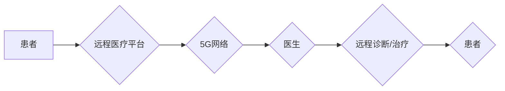

                 

## 5G技术在远程医疗中的应用：突破地理限制

> 关键词：5G,远程医疗,物联网,云计算,人工智能,虚拟现实,增强现实,医疗数据传输

## 1. 背景介绍

随着科技的飞速发展，医疗行业也迎来了数字化转型浪潮。远程医疗作为一种新兴的医疗服务模式，凭借其便捷、高效、经济等优势，逐渐成为医疗服务的重要组成部分。然而，传统的远程医疗技术受限于网络带宽和传输延迟等问题，难以满足高精度的医疗诊断和治疗需求。

5G技术的出现为远程医疗的发展带来了新的机遇。5G网络具有超高速率、低时延、大连接数等特点，能够有效解决传统远程医疗技术面临的瓶颈，为远程医疗的应用提供了强有力的技术支撑。

## 2. 核心概念与联系

### 2.1 远程医疗概述

远程医疗是指利用信息技术，跨越地理距离，提供医疗咨询、诊断、治疗等服务的医疗模式。它包括多种形式，例如：

* **远程咨询:** 患者通过电话、视频等方式与医生进行咨询。
* **远程诊断:** 医生利用患者提供的医疗影像、病历等信息，进行远程诊断。
* **远程治疗:** 医生通过远程控制设备，为患者提供远程治疗服务。

### 2.2 5G技术概述

5G是第五代移动通信技术，相比于4G，5G具有以下显著优势：

* **超高速率:** 5G网络理论峰值速度可达10Gbps，远超4G网络。
* **低时延:** 5G网络的时延可低至1毫秒，接近光速传输速度。
* **大连接数:** 5G网络可以支持海量设备连接，满足物联网应用需求。

### 2.3 5G与远程医疗的结合

5G技术为远程医疗提供了以下关键优势：

* **高速数据传输:** 5G网络的高速率能够支持高分辨率医疗影像、视频等大数据量的传输，满足远程诊断和治疗的需求。
* **低时延:** 5G网络的低时延能够确保远程医疗服务的实时性，例如远程手术、远程心电监测等。
* **大连接数:** 5G网络可以支持海量设备连接，例如远程医疗设备、智能医疗器械等，为远程医疗的应用场景拓展提供了无限可能。

**Mermaid 流程图**



## 3. 核心算法原理 & 具体操作步骤

### 3.1  算法原理概述

远程医疗的核心算法主要包括：

* **数据压缩算法:** 用于压缩医疗影像、视频等大数据，降低传输带宽需求。
* **数据加密算法:** 用于保护患者隐私，确保医疗数据的安全传输。
* **数据传输优化算法:** 用于优化数据传输路径，降低传输延迟。
* **人工智能算法:** 用于辅助医生进行诊断、治疗决策。

### 3.2  算法步骤详解

**数据压缩算法:**

1. 选择合适的压缩算法，例如JPEG、MPEG等。
2. 对医疗数据进行编码，减少数据冗余。
3. 将压缩后的数据传输到远程医疗平台。

**数据加密算法:**

1. 使用公钥加密算法对医疗数据进行加密。
2. 将加密后的数据传输到远程医疗平台。
3. 医生使用私钥解密数据。

**数据传输优化算法:**

1. 利用网络拓扑信息，选择最佳数据传输路径。
2. 使用流量控制机制，避免网络拥塞。
3. 使用多路径传输技术，提高数据传输可靠性。

**人工智能算法:**

1. 训练机器学习模型，例如深度学习模型，用于识别医疗影像、分析患者数据。
2. 将训练好的模型部署到远程医疗平台。
3. 医生利用模型辅助进行诊断、治疗决策。

### 3.3  算法优缺点

**数据压缩算法:**

* **优点:** 降低数据传输带宽需求，提高传输效率。
* **缺点:** 压缩可能会导致数据质量下降。

**数据加密算法:**

* **优点:** 保护患者隐私，确保医疗数据的安全传输。
* **缺点:** 加密和解密过程需要消耗计算资源。

**数据传输优化算法:**

* **优点:** 提高数据传输速度和可靠性。
* **缺点:** 需要复杂的网络管理和配置。

**人工智能算法:**

* **优点:** 提高诊断和治疗决策的准确性，辅助医生工作。
* **缺点:** 需要大量的训练数据，模型训练成本高。

### 3.4  算法应用领域

* **远程诊断:** 医生利用远程医疗平台，远程诊断患者的病情。
* **远程治疗:** 医生利用远程医疗设备，为患者提供远程治疗服务。
* **远程手术:** 医生利用远程手术机器人，远程进行手术操作。
* **远程健康监测:** 患者利用智能医疗设备，远程监测自己的健康状况。

## 4. 数学模型和公式 & 详细讲解 & 举例说明

### 4.1  数学模型构建

远程医疗系统中的数据传输过程可以建模为一个网络流问题。

* **源节点:** 患者或医疗设备。
* **汇节点:** 医生或远程医疗平台。
* **边:** 网络连接，代表数据传输路径。
* **流量:** 数据传输量。

目标是找到一条从源节点到汇节点的数据传输路径，使得流量最大化，同时满足网络带宽和时延限制。

### 4.2  公式推导过程

网络流问题的经典算法是Ford-Fulkerson算法。该算法通过迭代寻找增广路径，逐步增加流量，直到达到网络流的最大值。

**增广路径:** 从源节点到汇节点的一条路径，其中所有边的流量都小于其容量。

**流量增量:** 增广路径上所有边的最小剩余容量。

**Ford-Fulkerson算法步骤:**

1. 初始化流量为0。
2. 寻找一条增广路径。
3. 计算流量增量。
4. 更新流量，沿着增广路径增加流量增量。
5. 重复步骤2-4，直到找不到增广路径。

### 4.3  案例分析与讲解

假设一个远程医疗系统中，患者需要将高清视频数据传输到医生处进行远程诊断。视频数据大小为1GB，网络带宽为10Mbps。

使用Ford-Fulkerson算法可以计算出最大传输流量，并找到最优的传输路径。

## 5. 项目实践：代码实例和详细解释说明

### 5.1  开发环境搭建

* 操作系统: Ubuntu 20.04
* 编程语言: Python
* 框架: Flask
* 数据库: MongoDB

### 5.2  源代码详细实现

```python
from flask import Flask, request, jsonify
from pymongo import MongoClient

app = Flask(__name__)

# 连接MongoDB数据库
client = MongoClient('mongodb://localhost:27017/')
db = client['remote_healthcare']
patients = db['patients']

@app.route('/register', methods=['POST'])
def register_patient():
    data = request.get_json()
    patient_id = data['patient_id']
    # ... 其他注册逻辑 ...
    return jsonify({'message': 'Patient registered successfully'}), 201

@app.route('/upload_data', methods=['POST'])
def upload_data():
    data = request.get_json()
    patient_id = data['patient_id']
    data_type = data['data_type']
    data_content = data['data_content']
    # ... 数据存储逻辑 ...
    return jsonify({'message': 'Data uploaded successfully'}), 200

if __name__ == '__main__':
    app.run(debug=True)
```

### 5.3  代码解读与分析

* **注册患者:** `/register`接口用于注册患者，接收患者信息并存储到MongoDB数据库中。
* **上传数据:** `/upload_data`接口用于上传患者数据，接收患者ID、数据类型和数据内容，并存储到MongoDB数据库中。

### 5.4  运行结果展示

运行上述代码，可以启动一个简单的远程医疗平台，实现患者注册和数据上传功能。

## 6. 实际应用场景

### 6.1  远程诊断

医生可以通过远程医疗平台，查看患者的医疗影像、病历等信息，进行远程诊断。例如，在偏远地区，患者可以利用远程医疗设备，将影像数据传输到城市医院，由专家进行诊断。

### 6.2  远程治疗

医生可以通过远程医疗设备，为患者提供远程治疗服务。例如，远程心电监测、远程血糖监测等。

### 6.3  远程手术

医生可以通过远程手术机器人，远程进行手术操作。例如，在灾难发生时，远程手术机器人可以帮助医生进行紧急手术。

### 6.4  未来应用展望

随着5G技术的不断发展，远程医疗的应用场景将更加广泛。例如：

* **虚拟现实远程医疗:** 利用虚拟现实技术，医生可以身临其境地进行远程手术指导。
* **增强现实远程医疗:** 利用增强现实技术，医生可以将患者的医疗影像叠加到现实世界中，进行更直观的诊断和治疗。
* **人工智能辅助远程医疗:** 利用人工智能技术，医生可以获得更精准的诊断建议和治疗方案。

## 7. 工具和资源推荐

### 7.1  学习资源推荐

* **书籍:**
    * 《5G网络技术》
    * 《远程医疗技术》
* **在线课程:**
    * Coursera: 5G Network Technology
    * edX: Telemedicine

### 7.2  开发工具推荐

* **编程语言:** Python, Java
* **框架:** Flask, Django
* **数据库:** MongoDB, MySQL
* **云平台:** AWS, Azure, GCP

### 7.3  相关论文推荐

* **5G for Telemedicine: A Comprehensive Survey**
* **The Role of 5G in Transforming Telemedicine**

## 8. 总结：未来发展趋势与挑战

### 8.1  研究成果总结

5G技术为远程医疗的发展带来了新的机遇，能够有效解决传统远程医疗技术面临的瓶颈，为远程医疗的应用提供了强有力的技术支撑。

### 8.2  未来发展趋势

远程医疗将朝着以下方向发展：

* **更广泛的应用场景:** 远程医疗将应用于更多医疗领域，例如远程手术、远程康复等。
* **更智能化的服务:** 人工智能技术将被更广泛地应用于远程医疗，例如智能诊断、智能治疗决策等。
* **更便捷的用户体验:** 远程医疗平台将更加用户友好，提供更便捷的交互体验。

### 8.3  面临的挑战

远程医疗的发展还面临一些挑战：

* **数据安全和隐私保护:** 远程医疗涉及大量敏感医疗数据，需要确保数据的安全性和隐私性。
* **医疗伦理问题:** 远程医疗的应用可能会带来一些伦理问题，例如医生责任、患者权益等。
* **技术标准和规范:** 远程医疗的应用需要制定相应的技术标准和规范，确保其安全性和可靠性。

### 8.4  研究展望

未来，我们需要继续研究和探索远程医疗的应用场景，开发更先进的技术和解决方案，以更好地解决医疗资源短缺、医疗服务不均等问题，为人类健康福祉做出贡献。

## 9. 附录：常见问题与解答

* **远程医疗是否安全可靠？**

远程医疗平台采用先进的加密技术，确保患者数据的安全传输和存储。

* **远程医疗是否可以替代面对面诊疗？**

远程医疗可以用于一些简单的诊断和治疗，但对于复杂疾病，仍然需要进行面对面诊疗。

* **如何选择合适的远程医疗平台？**

选择远程医疗平台时，需要考虑其安全性、可靠性、功能性和用户体验等因素。

作者：禅与计算机程序设计艺术 / Zen and the Art of Computer Programming


<end_of_turn>

